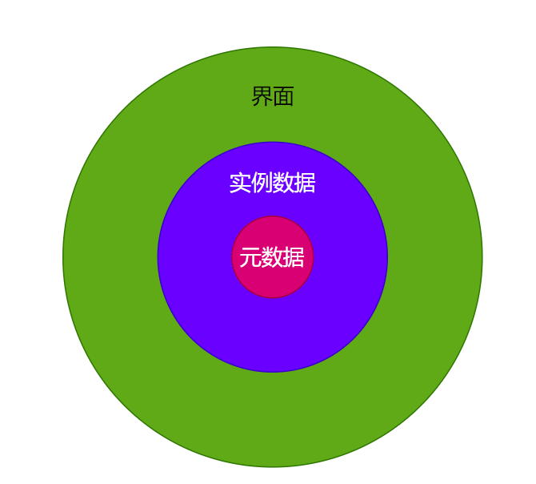

# Day 1 课程


## 课前须知

### **作业：**

- 以小组为单位（2周1个）
- 内容：参与Skedo开发
- *惩罚：收到来自小师叔的仇恨指数*


### **提问&答疑：**


答疑&其他辅导

- *不能加微信和其他联系方式（合同约束）*
  - skedo的contributor除外

- 原则上问题需要skedo-01-class-questions中建立一个缺陷
  - 记得微信群@我，附上问题链接。 
  - *直接@类问题我**也**会回答，我的助教也可以帮我回答，但是没看到就可能被刷屏。
  - 希望我认真回答的问题（比如说职业困惑等等），一定提issue


**简历辅导、内推等**

- 发送简历到邮箱645313632@qq.com

- 我通常会在直播课后点评简历（加餐）

- 内推会被小师叔要求修改简历，也可能会被告知原因和方向后拒绝

  

### **源代码**

- 除skedo部分的其他源代码没有权限限制

- skedo部分的源代码尚未开源
  - 预计会在2022年开源或者投入商业使用
  - 课程中包含的源代码可以用于非教学类的任意目的；不可以在网上传播、开源skedo课程部分的代码。
  - 课程结束后，继续获取skedo的源代码权限需要是skedo的contributor
  
- 版本

  - 获取代码使用主分支
  - 提交代码fork或者建立feature-{feature-name}分支
  - 除了第一版：发布给大家用会有release note
  - **小师叔！怎么还是分开给？**

  

  

### **Contributor悬赏任务**

- 读小师叔认真整理的需求文档，然后告知小师叔领任务
- 写技术文档交流实现方案
- 完成后小师叔验收（代码Review，测试等等），合格后合并程序
- 称为Contributor条件：完成1个悬赏任务


## 结合Skedo提升自己

###  如何提升自己？

1. 完成所有的赠品学习（P<5 -> P6）
   - Typescript
   - React 17
   - Vue 3
   - Node.js
   - 工具箱
2. 完成直播课的学习
   - 在直播课中提问、互动
   - 尝试复述师叔说的内容（过技术面）
3. 每天的开胃菜自己回去实现一次（过Coding面试）
   - 有没有更好的方法
   - 计时
4. 每日课上的程序，自己完成一遍
   - 计时练习
   - 寻找更好的方法
5. 按时完成作业
   - 讨论设计方案
   - 独立完成Coding
6. 完成contributor悬赏任务
   - 锻炼Coding能力
   - 锻炼综合解决问题的能力
   - 参与规范化的项目

### 写简历

**技能介绍**

技能介绍可以增加一些特别的项目：

- immutable
- 函数式
- react17/vue3/rollup
- node.js开发脚手架
- ……


**打造人设、亮点**

- 有前端组件库、脚手架、搭建平台、Serverless……等方向的工程实践 （**给面试官讲Skedo的架构**）
  - 课程知识的掌握
  - 作业/悬赏任务的参与
  - 实际工作的尝试（结合项目经历）
- Coding能力强（**让面试官考Coding**)
- 热爱技术、喜欢阅读源代码（读过react/vue/redux/---router/immutable……）
  - 认真复习【悦读】
  - 在【悦读】基础上自己扩展
  - 重在**收敛**，不要**发散**
- 可以独立完成前端项目开发（基础上）
  - 搭建CI体系
  - 编写脚本和开发工具
  - Node.js服务
- 有完整前端监控体系的实战经验
  - 必须：在自己公司尝试课程的内容
- 有基于ts+vue3/react hooks的完整工程实践
  - 必须：在自己公司尝试课程的内容

###  晋升/长期发展

- 1-2年内在工作中使用若干Skedo课程涉及的新技术

- 申请向团队做若干次技术分享（包括skedo中涉及的某个具体技术、框架、架构、设计模式等）

  

  

## Skedo 架构设计讲解

### 补课：做好用例分析

为什么学用例：

- 看需求文档（分析用例）
- 做技术Leader（分析用例）
- 做技术项目（分析用例）
- 更好的做业务（分析用例）
- 将来当老板（分析用例）
- ……

**划重点：用例是找用户需求的过程，但是系统设计已经开始了。**

#### 什么是用例？


- 完整性：拿起手机打王者（拿起手机不作为一个用例）

- 独立性：完成某个明确的目标


例如：我是张三，我是程序员，我要开发系统。 

我是**{什么角色}**，我可以{做什么}，所以我会**{获得什么收益、完成什么工作}**。

#### 用例的组成

##### 参与者

谁与系统交互，用小人表示。


注意：参与者也可能是系统。*比如B系统收到A系统的报警后，启动应急方案，自动切换流量。*

##### 用例

表示完成什么目标，通常是动词短语，比如“做XX”，“登录”等等。用椭圆表示。


##### 边界

代表系统。比如用户在支付系统下单，在账户系统登录，这是两个不同的边界（boundary)。

**边界对系统设计意义非凡。**例如：系统的耦合发生在经过长期迭代系统间的边界模糊（解决方案：防腐层、重构……）。再比如：系统的设计偏离了最初的定位——边界不明确。

好的产品界限分明，好的系统架构界限分明，好的类型设计界限分明——记住这个词：**boundary**。

*扩展下：在Boundary间，系统对象的共同的认知是Context。比如React多个组件(Boundary)共享数据的一种方式是用Context。另：用户在支付系统、营销系统、门店和商品系统中获得优惠券，背后需要一个跨系统的Context。*

##### 关系

描述用例用例之间、参与者用例之间的关系。

**关联关系**

关联关系描述一种驱动做事的关系。

- 比如用户登录，从用户指向登录。
- 比如系统报警，从监控系统（参与者）指向报警（用例）
- 比如消息推送， 从消息推送（用例）指向用户（参与者）


**包含关系**

一个用例包含了其他用例。父用例完成，子用例必须完成。


举例：

- 用户注册  includes 手机号验证

**扩展关系**


代表一个用例完成过程中可能会完成的用例。父用例完成，子用例不一定完成。

举例：

- 用户登录 extend 用户注册
- 购买产品 extend 退款

**泛化关系**(Generalization)

泛化(Generalization)是一种一般到特殊的抽象技巧。


编程领域有泛型，比如Iterator\<T\> 代表可以迭代的事物。如果A是Iterator\<T\>，那么A可以被：

```tsx
for(let x of A) {
	//...
}

```


读作：Iterator\<T\>是Iterator\<number\>的泛化；动物是哺乳类、鸟类等的泛化（统称）。


泛化关系的表示：


泛化关系由特殊指向泛化。

**用例到用例的泛化**

举例：

用户支付是“用支付宝支付”，“用微信支付”， “用银行卡支付”的泛化。


**参与者到参与者的泛化**

在开课吧：用户是讲师、学生、运营人员的泛化。 

#### **@skedo/cli的例子**


#### 用例的收集和整理


- 向用户提问
- 调查问卷


注意事项：

- 核心命题：用户不知道自己想要什么
- 不要诱导：注意隐藏意图
- 不要提问时承诺

#### 用例的思考

- 复述一遍几种关系？
- 思考：include\extend\generalization和编程中的概念是对应的吗？

扩展学习：

- 找产品索要系统的用例图，看看有没有画错
- 自己尝试画一下产品用例图，看看能不能从中发现系的设计问题（比如边界不清晰、定位不明确……)


#### Skedo的用例图


## Skedo的设计和架构

Skedo = Sketch and just do it. 

一个前端系统的可视化开发工具。

### Skedo解决什么痛点？


设计一个产品，先要找到用户的痛点。

有哪些用户？ 

- 前端
- 大前端（服务端）
- 产品/设计师

对于产品设计师，市场上已有的可视化原型、设计系统，比如：

- Sketch
- 墨刀
- Axure
- ……

最大的一个痛点是设计的产出还需要前端工程师转化成**最终的产品**。

思考Gap在哪里？

- 标准不同（比如Sketch的组件并不是W3C标准）
- 布局方式不同（不支持Flex，或者说没有可视化的语言描述Flex）

对前端工程师而言，可视化页面+低代码制作有什么痛点呢？

- 容器类组件支持差（比如Tab页、卡片列表等）
- 元编程能力差（通俗讲，多数平台本质还是制作静态页面）
- 组件的组合、列表、通信等能力差

*思考一张千人千面的页面，如何搭建+低代码实现呢？——一部分组件不是搭建渲染的，而是通过轻代码操作元数据渲染的。*


对大前端工程师有什么痛点呢？ ——哪怕一个很小的功能都需要上线一个服务。


### 产品的定位

什么是产品定位？——产品在用户心目中的形象和地位。


完整的流程并不体现产品的定位，定位是一种映像。

想打造什么形象和地位呢？

对UI设计师：**设计完可以直接拿给前端去用的一个可视化设计平台。**

对前端工程师：**没有束缚，能力和用代码开发网页区别不大，但是更方便。**


### 解决方案


#### 遵循标准

可视化支持DOM结构、盒子模型和Flex，统一设计师和前端工程师的思考方式。

具体能力演示（直播课演示）：

- 对父子结构的识别
- 遵循盒子模型
- 对Flex布局有特殊的体验

####  提供CLI帮助用户提交组件到平台

自带Rollup打包工具，随时随地提交，不依赖用户原本的脚手架。

```shell
skedo init custom1.swiper src/components/Swiper.tsx
skedo init custom1.tabs src/components/Tabs.Vue

skedo publish custom1.swiper
skedo publish custom1.tabs
```


#### 提供SDK支持容器类组件开发

```tsx
import birdge from '@skedo/bridge'

const node = bridge.createNode({
    type : 'div'    
})
    
// on some html ref
bridge.renderExternal(node, elem)

```


#### 提供SDK支持数据/元数据变更


低代码支持数据、元数据变更。

```tsx
// 数据变更
bridge.select("list")
  .setData(products)

// 元数据变更
bridge.select("panel").replace(...)                   
```


#### 支持组的保存（作业）

1. 支持调整某个组件的样式后，保存成一个新的组件。
2. 多选组件合并为一个分组，然后保存作为一个组件。


### 技术架构


总的来说，是元数据驱动渲染。




#### 分层架构


#### 组件的渲染模型


#### UI制作


- 组件树的节点是（Node）
- 针对不同的UI框架提供不同的Render
- 打包环境需要解析依赖
  - Node #1 依赖 react + qs 
  - Node #2 依赖 vue + immutable 
  - 最后依赖：react, react-dom, qs, vue, vue/sfc-compiler, immutable……

#### 轻代码


#### FaaS


#### 界面


界面部分采用微前端架构


#### 微服务


用K8S编排微服务。


## @skedo 的源码环境和启动


项目依赖：

- node >= 12
- ts-node 全局安装
- yarn 全局安装
- pm2 全局安装


Step 1：安装基础依赖

cd到项目目录

```shell
yarn install
```


Step2:  安装依赖

```shell
npm run reinstall
npm start
```


执行结束后，系统会启动3个pm2项目，可以用下面指令查看启动的项目。

```shell
pm2 list
```


Step3：访问网站

在浏览器时输入:localhost:3000可以看到网站。


