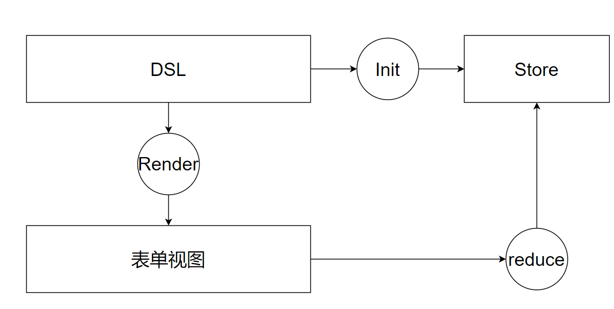
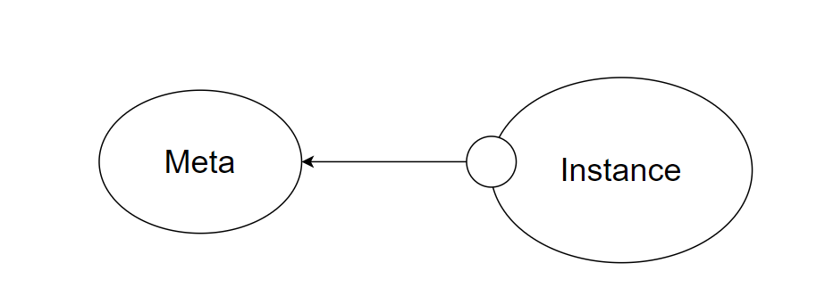
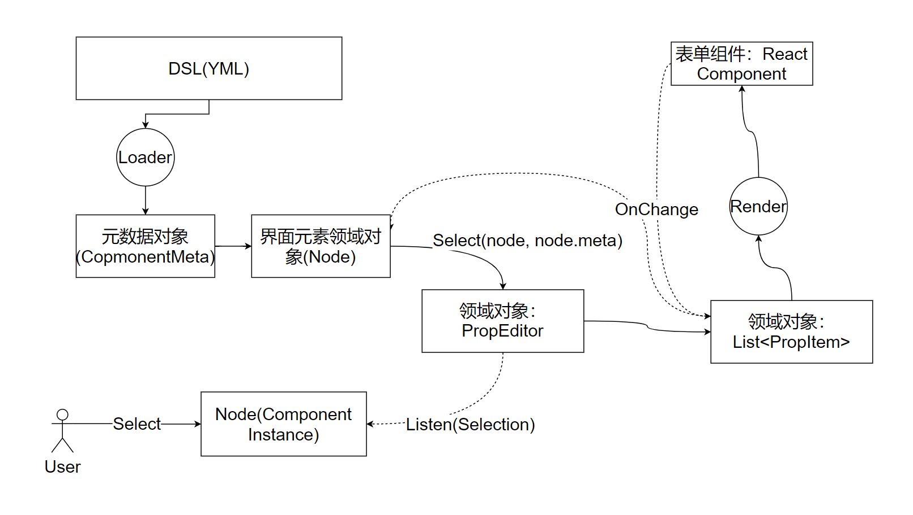

# DSL：表单设计


表单的作用是收集用户的输入，在前端领域非常常见，值得作为一次课程单独讨论。特别是用DSL的方式设计表单，这是一个非常通用的技巧。


## 什么是DSL？


DSL（领域专有语言）。DSL的表单设计， 就是用**专门设计表单的语言**，来设计表单。 

 思考：Javascript是专门设计表单的语言吗？ HTML是专门设计表单的语言吗？

思考：什么是专门设计表单的语言？


## 表单的通用设计

作为标准的表单设计，可以考虑下面的模型：




- DSL(Domain Specific Language)，领域专有语言负责
  - 1. 描述表单
    2. 初始化表单数据的存储
- Render负责根据DSL渲染表单
- Store负责存储表单数据
- 用户在表单视图发生输入时触发reducer，触发表单数据的变化


## 表单组件


#### 表单组件的分类设计


表单组件按照功能可以分成几类：

- 基础组件：负责具体的输入工作，比如图片上传、地区选择、姓名输入等。
- 布局组件：负责布局，比如Row/Column/Group/Tabs等等
- 组合组件：支持在基础组件上的随意组合，例如Group, List等

在每个表单组件的DLS中都需要有两个最基本的属性：

- 类型
- 数据路径（对应store中的哪个数据进行操作？）

还可以设计一些自定义属性，比如说：

- 样式
- 选项（仅Select)


注意区分实例数据和元数据：



类型、数据路径、样式是所有表单组件公共的属性，是元数据（描述表单元素的数据）。而表单组件的状态（例如选中的值）等，是实例数据。

在设计数据结构的时候，不能将元数据和实例数据混合，举个**反例**：

```tsx
{
    type : 'input',
    path : ['user', 'name'],
    value : null,
    dirty : false
}


```

推荐的实现：

```tsx
{
    meta : Metas.InputMeta,
    value : null,
    dirty : false
}
```

Why？ 还记得SSOT原则吗？ 

元数据变更意味着所有Input组件变更，`value` `dirty` 是Input元素单独的内容。

参考：Skedo的设计。


### 受控组件和非受控组件设计


设计具体表单组件的时候，要考虑组件中数据是否受控。 

如果不了解受控非受控请参考9.2中关于受控非受控的讨论。 


设计思想如下：

- 尽量优先考虑非受控组件
  - 最小知识原则（组件状态 !== 表单数据）
  - 最小交互原则（减少数据流）
  - 单一职责原则（让组件自己承担完自己应该承担的部分）
  - 性能考虑


## Skedo表单的工作原理





