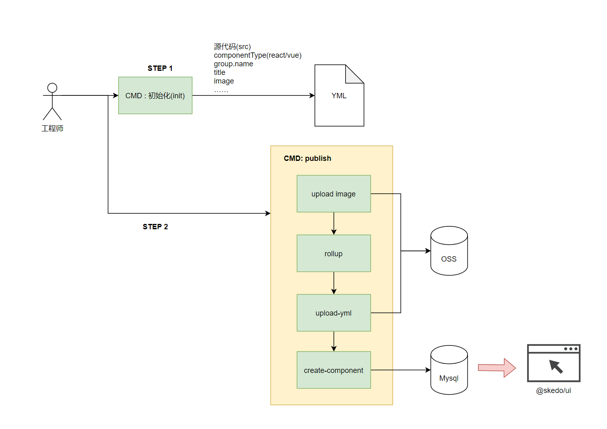
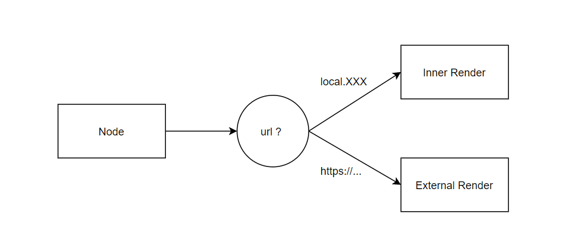
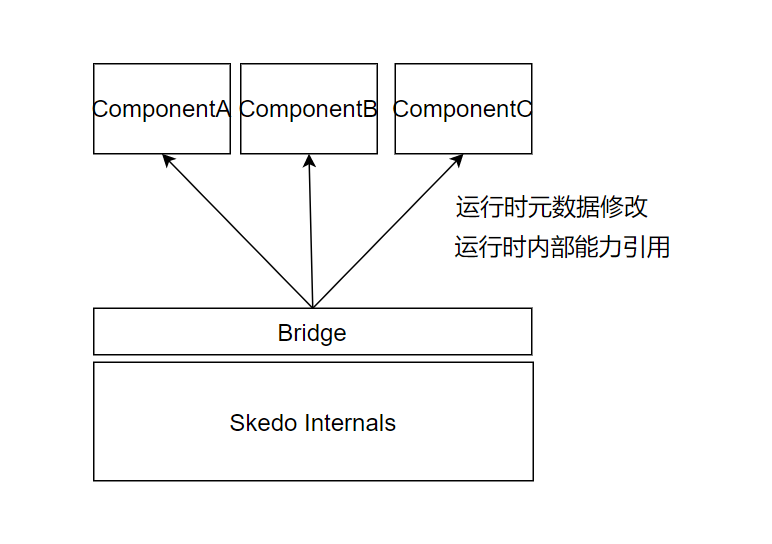

# ·Skedo 的外部组件


## 外部组件的工作流程



Step1 : 初始化阶段

- 用户输入`skedo publish --source some.tsx`
- 用户选择参数
  - react/vue
  - name
  - group
  - title
- 生成YML

Step2: 用户上传阶段

- 用户补充image
- 用户输入`skedo publish ---yml  ...yml`
- 系统打包上传
  - 上传image
  - 上传yml
  - 打包组件(rollup)
- 完成


## 外部组件开发协议


### 基础元数据


```tsx
export interface ComponentMetaConfig {

  // 组件名称 
  name : string,

  // 分组
  group : string,

  // logo图片
  image : string,

  // 标题
  title : string,

  // 容器行为
  containerType : 'flexRow' | 'absolute' | 'flexColumn',

  // 盒子模型
  box : BoxDescriptorInput,

  // 属性编辑器属性
  editor : PropsEditorConfigure,

  description : string,

  // 是否为内部组件
  intrinsic? :  boolean,

  // 初始样式
  style? : any,

  author : string,

  // 初始属性
  defaultProps : any,

  /* External components' */
  componentType? : 'react' | 'vue', 
  src : string, // source file location
  file : string, // js file location
  url? : string,
  yml : string, 
  imageUrl : string,
  version : string
}

```


### 盒子模型

```tsx

export type BoxDescriptorInput = {
	movable? : boolean,
	resizable? : boolean,
	container ? : boolean
	position? : CSSPosition,
	display? : CSSDisplay,
	flexDirection? : FlexDirection,
	selectable ? : boolean
  left?: number | string | SizeUnitInput
  top?: number | string | SizeUnitInput
  width: number | string | SizeUnitInput
  height: number | string | SizeUnitInput
  marginLeft?: number | string | SizeUnitInput
  marginTop?: number | string | SizeUnitInput
  marginRight?: number | string | SizeUnitInput
  marginBottom?: number | string | SizeUnitInput
}


export type SizeMode =  "fill" | "value" | "fixed" | 'auto'

export type SizeUnitInput = {
	value : number,
	unit : string,
	mode :  SizeMode 
}

export type CSSPosition = "absolute" | "relative" 
export type CSSDisplay = "block" | "flex" 
export type FlexDirection = "row" | "column"| ""


```


## 外部组件渲染


### 建立专门的组件进行外部组件的渲染：ExternalRender.tsx



### Bridge: 为外部组件提供元的能力



