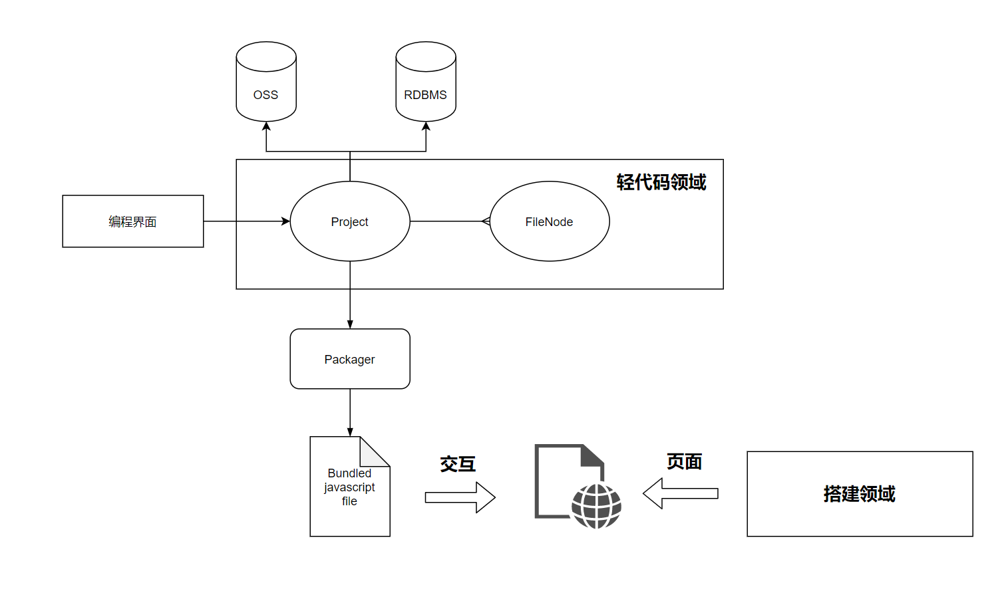
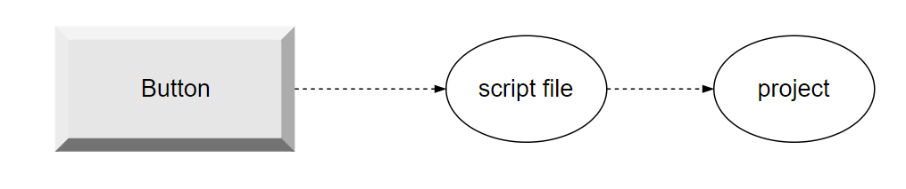

# Day 13


今日要点：

- 继续深入理解**领域**和模型的设计


内容：

- 师叔说：Codeless的架构
- 手把手教学：轻代码部分

如果哪个架构思想必须被掌握，那必然是领域化的能力。

如果只有一种架构思想必须被掌握，那必然是领域化的能力。




## 架构之初的思考


如果我想点击搭建的一个`Button`， 应该如何做设计？



比如代码如下：

```tsx
ctx.select("btn-ok").on("click", () => {
    // ... 
})
```

但用户可能会:

```tsx
import qs from 'qs'
import Qrcode from './Qrcode'
node.select("btn-ok").on("click", () => {
    // ... 
    const params = qs.parse( window.location.search.replace('?', '') )
    const qrcode = new Qrcode(...)
})
```

领域模型找到了：我们需要一个项目，项目包含文件；项目作为整体打包。

## 分模块设计


- @skedo/code 提供codeless部分的领域能力

- @skedo/packager 提供打包能力

- @skedo/code-ui 提供codeless部分的UI（作为一个微前端项目）

- @skedo/runtime 提供codeless和搭建服务协同工作

  - 数据层

  - 选择器

  - 事件

    

- @skedo/faas 提供路由以及对页面的托管服务


