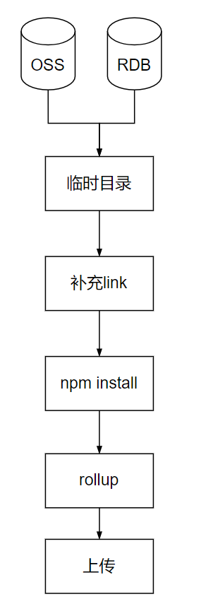

# Day 14


目标：

- 重复练习前端的架构技巧
- 理解轻代码的核心实现


内容：

- 师叔说：Codeless和搭建结合部分的架构
- 手把手教学
  - 为搭建页面增加点击事件
  - 为一个列表页添加数据


## 上下文设计(Context)


程序如果想要正常工作，除了输入、输出、计算过程还需要——**上下文（Context)。**

在Javascript中`this` 就是上下文。

```ts
const obj = {
    a : 1,
    foo : () => {
        console.log(this.a)
    }
}


```

思考：什么是上下文？

上下文可以是任何东西，也可以什么都不是（undefined, null)。 举一些例子：

- window
- document
- 用户状态对象
- 主题颜色


软件架构中设计的上下文，通常是对程序而言的。上下文是程序处理一件事情的公共知识。 例如对用户支付程序，它的上下文可能包括：

- 用户
- 商品
- 营销算价规则
- ……

思考下面程序的区别？

```tsx
// 纯计算
function add(x, y) {
    return x + y
}

// 依赖上下文的计算
class Vector {
    x : number
    y : number
    
    add() {       
       return this.x + this.y 
    }
    
    add(vec) {
        this.x = vec.x
        this.y = vec.y
    }
}
```

具体的来说，程序往往都是依赖上下文的。比如大家平时用的：

```tsx
window.location.href = ""
```

它是我们程序的上下文，具体的表现形态是全局对象`window` 。React和Vue中有其他的表达，比如`useContext` 和`inject` 。

无论如何表达，没有上下文的是纯粹的计算，或者说数学函数。业务逻辑不可能是纯粹的数学逻辑，比如我们会用`window` 对象，我们可能随时唤起摄像头。

通常，当我们要为领域建模的时候， 就需要设计上下文。

### 上下文实战


现在我们要为轻代码+搭建领域建模，那么我们设计怎样的上下文呢？

1. 写轻代码的用户可以拿到上下文对象：

```tsx
async function run(ctx : SkedoContext) {    
}
```


2. 写轻代码的用户可以通过上下文获取组件，并绑定事件

```tsx
async function run(ctx : SkedoContext) {  
    // 获取按钮
    const node = ctx.select("btn-hello")
    
    node.on("click", {
      alert("1")  
    })
        
}
```


3. 写轻代码的用户可以向组件填充数据

   ```tsx
   async function run(ctx : SkedoContext) {
       const node = ctx.select("my-list-view")
       
       const data = await fetch('...')
       node.memory(data)
   }
   ```

   4. 用户可以通过上下文对象获得全局事件

      ```tsx
      async function run(ctx : SkedoContext) {
          ctx.on("page-load", () => {
              
          }) 
         
      }
      ```

      

## 打包模块的设计



## 数据映射的设计


1. 定位数据源

节点递归的向上（父级）寻找数据源。

listview -> [card]

2. 路径

节点的数据是数据路径(data-path)在数据源中的位置。


