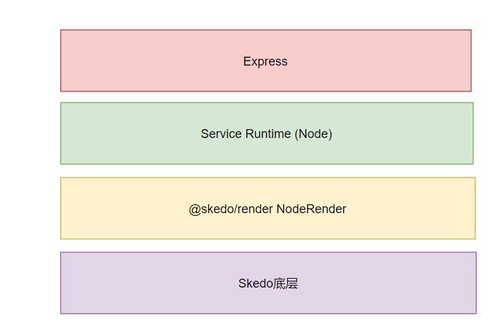

# Day 16

内容：

- 将页面作为CSR渲染
- 将页面作为SSR渲染
- Skedo运行时环境的架构

## CSR vs SSR

CSR

- Server返回部分HTML
- 请求JS
- JS执行生成 HTML以及绑定事件

SSR 

1. Server返回HTML(Server端)
2. hydrate(Client端)

## Skedo运行时

思考：和Preview环境的区别？