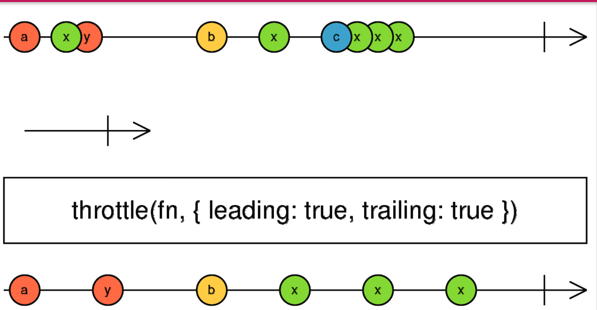

# Day2

## 主要内容

开胃菜：节流、防抖函数

师叔说：Skedo的设计和架构

手把手：A. Skedo环境搭建和运行 B. 拖拽能力的实现

阅读：React-Draggable的核心+扩展设计

总结/作业

提问

加餐

## 开胃菜：节流和防抖

常用的操作有两个：

debounce

请说说下面的场景应该用哪个？

- 按钮防止用户多次点击
- 输入框防止onChange事件调用频率太高
- 拖拽防止onDragMove事件调用频率太高

请实现这两个函数，并写出一个合理的测试用例？