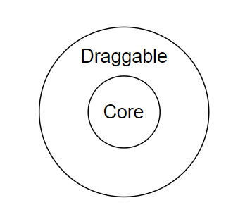

# React-Draggable实战和源码解读


目标：利用React-Draggable实现拖拽功能。


## 源码解读


Step 1： 尝试使用（实现拖拽能力）

Step 2： 完整掌握文档内容

Step 3： 确认核心文件




DraggableCore提供拖拽能力。Draggable在DraggableCore的基础上提供数据的抽象和封装。

DraggableCore支持的Props：

```json
{
  allowAnyClick: boolean,
  cancel: string,
  disabled: boolean,
  enableUserSelectHack: boolean,
  offsetParent: HTMLElement,
  grid: [number, number],
  handle: string,
  onStart: DraggableEventHandler,
  onDrag: DraggableEventHandler,
  onStop: DraggableEventHandler,
  onMouseDown: (e: MouseEvent) => void,
  scale: number
}
```


Step 4：如果有类型先阅读类型

Step 5 : 绘制调用关系

在阅读源码过程中可以用dot绘制调用关系，从而得到更多的理解。


Step 6：确认每个文件的作用（思考架构的合理性）

Step 7：<提取养分>Controlled vs UnControlled

Step 8:   <提取养分>为什么要分离DraggableCore和Draggable？


