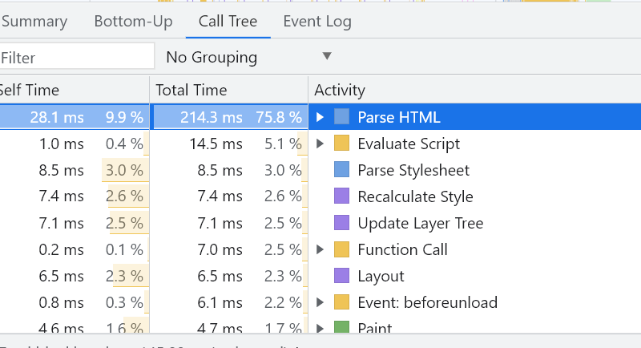

# 前端性能优化


## 基础面


### 存储分级策略


说出下面的存储器完成一次访问的时间单位，可以是纳秒、微秒、毫秒、秒：

- L1-L2 Cache 
- L3 Cache 
- 内存
- SSD
- HDD


存储器速度越快，离CPU越近，发热就会越高、造价也越高，当然体积也会越小。我们将使用频率最高的数据，用最快的存储缓存起来；随着数据使用频率降低，可以使用更廉价的存储。

缓存的大小和速度示例：

- Cache  
  - L1 ~ KB  例如：700GB/s
  - L2 ~  MB
  - L3 ~  MB
- 内存  GB  例如： 10GB/s
- SSD：例如 2000MB / S

举例：

- DNS Cache
- Webpage Cache
- CPU Cache

和前端优化的关联是什么？

- 思考一个循环100W次的for循环的开销？
- 思考100MB数据的拷贝？


**划重点：计算机的性能比你想像的更好。** 

### 阿姆达定律


分析：所有的任务会分成**可以并行**和**不可以并行**的部分。可以并行的部分可以无限优化，趋向于0； 不可以并行的部分则会稳定占用计算资源。 


阿姆达定律对前端优化的意义是什么？—— 它回答了我们对程序优化的理论极限。

### 视觉上的~

- 视觉残留约为0.05~0.2秒
- 显示器的刷新频率目前主要是60Hz 70Hz 90Hz和120Hz


这两个数据对于前端的意义是什么？ 

-  前端有足够的时间执行程序，但是每次程序执行不能太长。

  


### 延迟、吞吐量和丢包率


延迟是数据在介质中传输用的时间，吞吐量是单位时间内完成的数据传输量，丢包率是传输过程中发生错误封包的概率。

请问：

- 延迟高和低吞吐量有关联吗？


对一次RTT（Round Trip  Time)为1ms的HTTP请求，如果要传输1M的数据，使用的缓冲区（每次传输数据）为1kb，需要多久？

### 用户的心理


当用户使用某个APP不是刚需的时候

- 响应性（用户一次行为的响应时间）
- 美观程度
- 流畅程度
  ……

会影响用户的活跃和留存。


## Google 的4 个维度


- Fast（快速响应用户）
  - 关键渲染路径
  - 渲染效率
- Integrated（体验的集成）
  - 快速找到应用
  - 集成熟悉的体验（微信支付）
- Reliable（应用可靠）
  - 断网不消失
  - 可用性
- Engaging（有趣）


### 关键渲染路径


#### HTML的解析过程




#### CSS的解析

```css
body { font-size: 16px }
p { font-weight: bold }
span { color: red }
p span { display: none }
img { float: right }
```


#### 渲染树


1. parseHTML -> DOM Tree
2. parse CSS -> CSSOM
3. combine -> render Tree
4. layout : 计算每个节点的盒子模型
5. 绘制（一个像素一个像素的绘制）
   1. 渲染数据(像素数据) -> FrameBuffer（内存）-> 显卡渲染的下一帧


#### CSS的渲染阻塞


下面3条中哪一条会阻塞渲染？

```html
<link href="style.css" rel="stylesheet">
<link href="print.css" rel="stylesheet" media="print">
<link href="other.css" rel="stylesheet" media="(min-width: 40em)">
```


#### JS的执行时机


**内联的JS**

阻塞到________________？

```html
<html>
    
<script>
    // 内联的JS
</script>
</html>
```


外部**引用的JS**

不阻塞渲染过程，但会重新触发渲染过程。


#### 衡量网站的性能

- Lighthouse
- Navigation Timing API


#### 观察网络


使用Chrome


#### 优化关键渲染路径


- 关键资源数量
- 关键路径长度
- 关键路径大小（bytes)
- 渲染速度
- inline-js 执行时间


#### Webpack的 Dynamic Import


思考下面用Webpack 动态加载React-DOM有没有价值？ 

```tsx
import('react-dom')
  .then(ReactDOM => {
      ReactDOM.render(...)
  })
```

思考 Loadable的设计有没有价值？

```jsx
import loadable from '@loadable/component'

const OtherComponent = loadable(() => import('./OtherComponent'))

function MyComponent() {
  return (
    <div>
      <OtherComponent />
    </div>
  )
}
```

#### JS的拆分和压缩

- SplitChunkPlugin（拆分公共依赖）
- TerserWebpackPlugin（JS压缩）

#### Webpack的预加载技术


渲染路径 ： HomePage -> LoginButton -> LoginModal


// LoginButton.js

```tsx
import(/* webpackPrefetch: true */ './path/to/LoginModal.js')
```


#### Bundle Analysis


- webpack-chart
- webpack-visualizer
- webpack-bundler-analyzer
- webpack bundle optimie helper
- bundle-stats

## 网络的优化(HTTP2.0 )

### 二进制层


### 连接模型的优化（多路复用）


为什么不用多线程发送：

- 连接的成本，参考HTTPS握手
- 头部压缩
- 队头阻塞的问题

### 优先级控制


### Server PUSH


### 头部压缩


### 对监控指标的思考


#### 监控Timing


- Navigation Timing
- Resource Timing

```tsx
// Get Navigation Timing entries:
performance.getEntriesByType("navigation");

// Get Resource Timing entries:
performance.getEntriesByType("resource");
```

#### 定义指标


- First Content Paint

  

  ```tsx
  import {getFCP} from 'web-vitals';
  
  // Measure and log FCP as soon as it's available.
  getFCP(console.log);
  ```

  

- Largest contentful paint 

  

  ```tsx
  new PerformanceObserver((entryList) => {
    for (const entry of entryList.getEntries()) {
      console.log('LCP candidate:', entry.startTime, entry);
    }
  }).observe({type: 'largest-contentful-paint', buffered: true});
  ```

  

- First input delay

  

  

- Time to interactive

  

- Cumulative layout shift

```tsx
new PerformanceObserver((entryList) => {
  for (const entry of entryList.getEntries()) {
    // Only count layout shifts without recent user input.
    if (!entry.hadRecentInput) {
      const firstSessionEntry = sessionEntries[0];
      const lastSessionEntry = sessionEntries[sessionEntries.length - 1];

      // If the entry occurred less than 1 second after the previous entry and
      // less than 5 seconds after the first entry in the session, include the
      // entry in the current session. Otherwise, start a new session.
      if (sessionValue &&
          entry.startTime - lastSessionEntry.startTime < 1000 &&
          entry.startTime - firstSessionEntry.startTime < 5000) {
        sessionValue += entry.value;
        sessionEntries.push(entry);
      } else {
        sessionValue = entry.value;
        sessionEntries = [entry];
      }

      // If the current session value is larger than the current CLS value,
      // update CLS and the entries contributing to it.
      if (sessionValue > clsValue) {
        clsValue = sessionValue;
        clsEntries = sessionEntries;

        // Log the updated value (and its entries) to the console.
        console.log('CLS:', clsValue, clsEntries)
      }
    }
  }
}).observe({type: 'layout-shift', buffered: true})
```


## 模拟实战环境


## 其他优化手法总结


### Server PUSH


**离线包技术：**将静态资源打包，利用APP不忙的时候为用户下载。

- APP加载离线包
- 解压到本地
- webview打开 URL 
- 触发离线包加载
- 从内存中读取 
  - fallback到线上地址


**HTTP2.0 Server PUSH**


### 用Service worker异步加载资源


https://developer.mozilla.org/zh-CN/docs/Web/API/Service_Worker_API/Using_Service_Workers


###  请求的合并和剪裁


- 客户端
  - 将多个请求合并发送到Node服务（或其他）
- Node中间层
  - 组装多个请求并剪裁返回

上述能力属于 API网关的一部分。 


