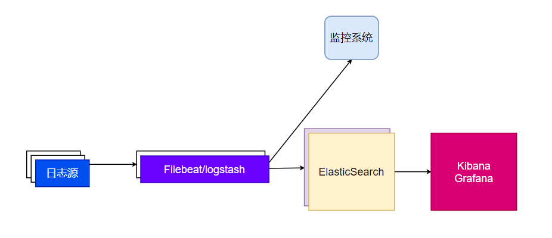

# 数据指标和监控


- 前端日志
  - 用户行为日志
  - 前端性能日志
  - Web访问日志(错误日志)
  - 前端错误日志
    - 异常（Sentry）
- 服务端日志


## 前端用户行为日志

代表：GA(Google Analyze)

分析用户行为日志

- 收集端（SDK) ： 负责从浏览器收集数据
- 分析端（大数据服务）：负责分析用户行为

-> 其他内容见演示


## nginx 日志


日志示例：

https://voice-static.oss-cn-shanghai.aliyuncs.com/access.log.txt

思考：如何统计一个网站的PV和UV？ 

思考：可不可以通过Shell分析UV 和PV？


## 日志的收集、存储、分析和可视化原理


思考：像GA这样的系统怎么实现？

192.12.3.3 GET/a ----- {ip :192......}

192.17.3.3 GET/b ----- {}



演示：Docker Compose  + ElasticSearch + Filebeat + Kibana 


## 异常日志收集和报警

可以利用Sentry等工具监听全局错误。 当然， 可以手工通过window.onerror和unhandledrejection监听全局错误。 

示例：Sentry

## 前端用户行为分析


### 统计PV

nginx 的 access_log


### 统计UV

- IP地址（粗糙， 可能存在问题）
- 大随机数
  - 像localStorage中写入一个大随机数代表UV
  - 收集日志时带上这个大随机数
- 设备指纹


### 投放效果

可以在投放链接后面增加一个渠道标识，然后结合`referer` 统计。 

来自`a` `b` 的渠道链接：

`example.html?channel=a,b`

到达页面带上渠道标识：

`buy.html?channel=a,b` 


统计: buy.html?channel=a,b / example.html?channel=a,b 可以知道投放效果。 


如果想要更细粒度呢？ 参考SPM模型

### SPM模型

https://www.aliyun.com/sswd/5393911-2.html

例如：

```
some.html ? spm=a.b.c.d
```

- 来源站点:a
- 页面: b
- 页面区块:c
- 区块内点位：d

思考：这背后的JS如何写？

```tsx 
// site a git-project
// page b b.tsx
<div data-spm-section='c'>
    <button>aaa</button>
    <button>bbb</button>
</div>
```

无埋点系统根据页面上的埋点提示信息，悄悄监听了所有的`onClick` 事件，并利用sdk向服务端发送事件。

## 性能监控 webvitals

https://web.dev/vitals/

```tsx
import {getCLS, getFID, getLCP} from 'web-vitals';


function sendToAnalytics(metric) {
  const body = JSON.stringify(metric);
  // Use `navigator.sendBeacon()` if available, falling back to `fetch()`.
  (navigator.sendBeacon && navigator.sendBeacon('/analytics', body)) ||
      fetch('/analytics', {body, method: 'POST', keepalive: true});
}

getCLS(sendToAnalytics);
getFID(sendToAnalytics);
getLCP(sendToAnalytics);
```


### 可视化工具


- Echarts https://echarts.apache.org/en/index.html
- D3 https://d3js.org/

