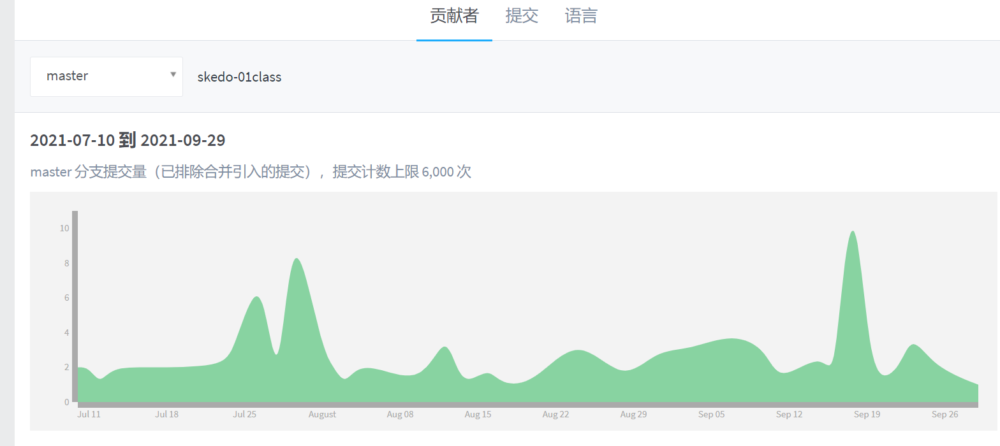
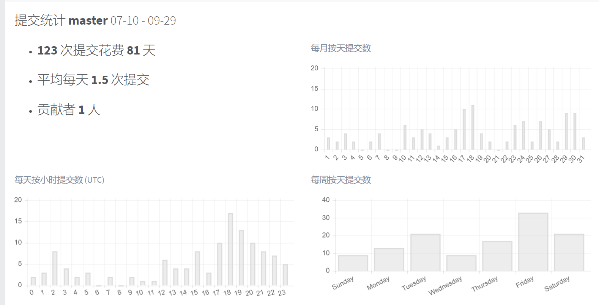
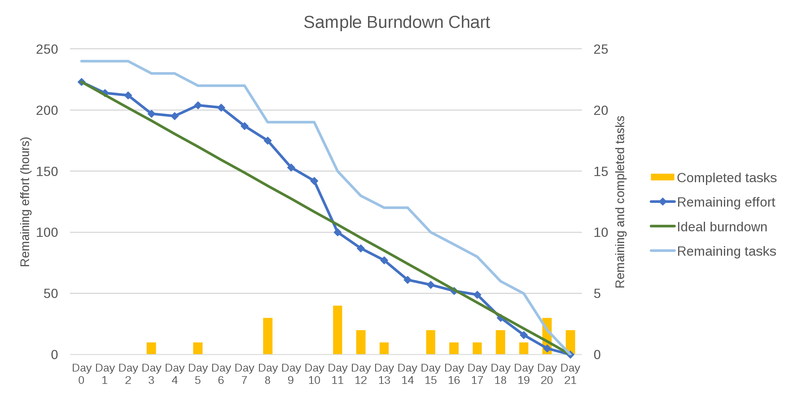

# 用数据说话


**你发现工程师小张最近消极怠工， 你该怎么做？**

A. 从考勤系统拉取他上下班打卡时间，和其他人比较

B. 从gitlab中观察小张近期提交代码情况





C. 从Jira（工程效率平台）中拉取小张的平均问题解决时间

D. 在Code Review中针对小张


## Why Data？


- 分析数据是为了更好的决策（商业智能）
- 分析数据是为了提高研发团队的效率（项目管理）
- 分析数据是为了证明价值（研发团队）
- ……


我们需要数据：

- 说服别人
- 证明自己
- 帮助自己决策
- ……

数据不是万能的，但是**没有数据，就没有话语权！**


## 证明研发效率的提升


- Task拆分成1人日
- 对比几个月的燃尽图，观察蓝色线段的变化趋势。 




其他衡量团队作战效率的指标

- 发布频次/频率
- 发布用时（回滚用时）
- 需求响应
  - 记录每个需求产出/评审/进入开发的用时
  - 记录每个需求从进入开发到结束（上线）的用时
  - 记录每周完成的Task数目
- 记录缺陷
- 故障响应
  - 次数
  - 响应速度


## 证明自己的专业技能


- 技术提议（提议次数/上线次数）

  - 重构
  - 重写
  - 引入新工具/新框架/库
  - 发现漏洞/解决漏洞
  - 工程效率提升
  - 内部库
  - 内部组件

- 技术共建

- 技术分享

- 技术文档沉淀

- 测试

  - 测试覆盖率
  - 补充测试用例（数量）

  

## 专注于提升业务价值


- 梳理体验问题（梳理次数/解决次数）

- 客户访问（次数）

- 业务梳理（次）

  - 充当讲师
  - 根据产品季度（年度）规划梳理技术架构
  - 用例梳理
  - 系统边界梳理

  

## 论证前端体验的进步


- 技术类指标

  - 打开速度
  - 资源体积缩小
  - CPU占用下降

- 体验指标

  - 响应性
  - 跳出率
  - 白屏率

- 用户反馈类数据

  - 召开用户体验会议
  - 提供对外的体验反馈系统

  


## 专注研发内容的价值


评审阶段

- 确定关键数据指标(完成公司怎样的指标)

开发阶段

- Coding埋点关键数据指标

上线后：

- 复盘关键指标的实现


思考：

- 需要是否符合预期？ 
  - 迭代价值：符合/全部 (过低可以找老板反馈)
  - 反思有没有自己的问题？
- 有没有更好的设计方案
- 对产品设计的信任程度
  - 信任关系：提升对需求的支持
  - 待观察： 降低需求的支持，多AB测试


**核心：完成公司业绩指标**


## 绑定商业目标/价值


- 技术优化的A/B 转化率 （A和B对比）

  - 订单
  - 关键页面跳转
  - 阅读完成率
  - ……

- 业务技术迭代分离&分别观察

- 简化用户的操作路径

  - 关键决策用时（例如下单）
  - 收集、分析用户的操作路径

  


## 补充：切流量和灰度


- 百分比AB

  - A 90%

  - B 10%

  - 情况

    - 随机分配

      ```tsx
      function A(){
          return <div>...</div>
      }
      
      function B() {
          return <div>...</div>
      }
      
      function Wrapper() {
          const r = Math.random()
          if(r > 0.9) {
              return <B />
          }
          return <A />
      }
      ```

      

    - 按照用户维度

      基于随机数

      ```tsx
      localStorage['flag'] = Math.random()
      ```

      基于用户ID

      ```tsx
      const flag = userID % 10 // 0 ~ 9
      if(userID >= 7) {
          return <B />
      }
      
      ```

      

A.ts ---> React组件

import A from A.ts

A.90.ts 

A.10.ts 

import A from A.ts?

```tsx
import A from "A"

<A />
// 经过Babel
import A10 from "A.10"
import A90 from "A.90"

if ( Math.random() > .9 ) {
    <A10 />
}
else {
    <A90 />
}
```

```tsx
import A10 from "A.10"
import A90 from "A.90"

<ABTest tests={[
  [A10, .1]
  [A90, .9]
]} />
```


基于页面：

```tsx
ABTest Proxy
```

