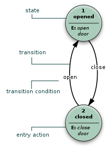
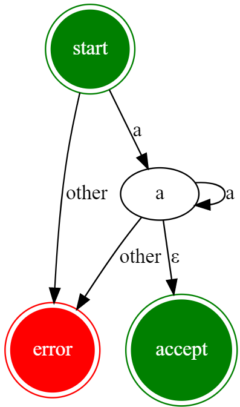
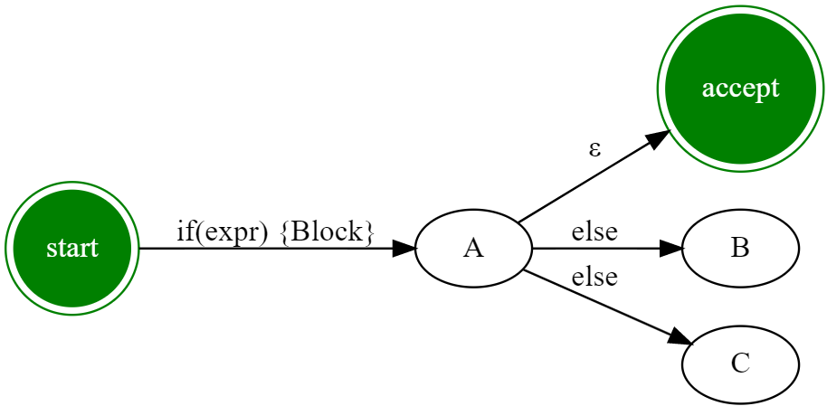
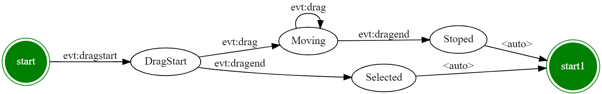

# 复杂交互制作和状态机模式 


复杂的交互制作该怎么办？ —— 状态机。 

状态机设计是一个**中间状态**。啥意思？等形成足够好的领域模型，又可能会下掉状态机。 

举个例子：

- 一开始React的生命周期管理是基于状态的
  - Mounting
  - Updating
  - Unmounting
- 当然现在内部依然又这些状态，不过：
- 用户不再关心了，用户关心`useState` `useEffect` ……


## 状态机

状态机(State Machine)，故名思意，一种带有状态的机器。可以用来抽象世界中带有状态的现象。（抽象产品的方式）



组成

- state 集合 {opened, closed}
-  action 集合 {open ,close}
- 状态转移函数集合：{open_door(), close_door()}
  - 函数参数：状态转移条件
  - 函数返回值：新的状态


如何理解正则表达式`/^a+$/`



- 状态: {a, aa, aaa, aaaa, ……}语言 -> {a, start, error, accept}
- action ：{a, other,ε}
- 状态转移函数：{match}

开门和关门的行为状态有限，是有限状态机；上图中正则表达式， 是也是有限状态机。(我们通常讨论的状态机指的是有限状态机)


再比如这个例子：

```ts
// Formal Language
IFStmt -> 
    if(expr) { Block } | 
    // if(expr) { Block } else {Block} |
    if(expr) { Block } else IFStmt |
    Block | e

```



上面这样的情况，对相同的输入`else` ，可以到B，也可以到C。这样的状态机不太利于我们组织计算，这种情况叫做非定（Non-Deterministic) 有限状态自动机。遇到这种情况我们需要转换。具体的计算不在本次课程讲解了。

总之：做UI体验的时候，我们需要**确定**有限自动状态机。


## 状态机和前端


前端的用户交互是天然的状态机结构：

- 打开页面状态机处于Start状态
- 用户的操作是状态转换函数


**状态机让我们不会为交互逻辑的耦合烦恼**



图中通过状态机可以迅速发现有一个Selected行为是没有发生Moving的时候应该触发的（对应着onClick事件）。


**状态机可以帮助我们轻松完成从交互逻辑图到代码的转换**

```tsx
    // start -> DragStart
    this.register(States.Start, States.DragStart, Actions.EvtDragStart, () => {

    })

    // DragStart -> Moving
    this.register(States.DragStart, States.Moving, Actions.EvtDrag, () => {

    })

    // Moving -> Moving
    this.register(States.Moving, States.Moving, Actions.EvtDrag, () => {

    })

    // Moving -> Stoped 
    this.register(States.Moving, States.Stoped, Actions.EvtDragEnd, () => {

    })

    // Stoped -> Start
    this.register(States.Stoped, States.Start, Actions.AUTO, () => {

    })

    // DragStart -> Selected 
    this.register(States.DragStart, States.Selected, Actions.EvtDragEnd, () => {

    })
```

