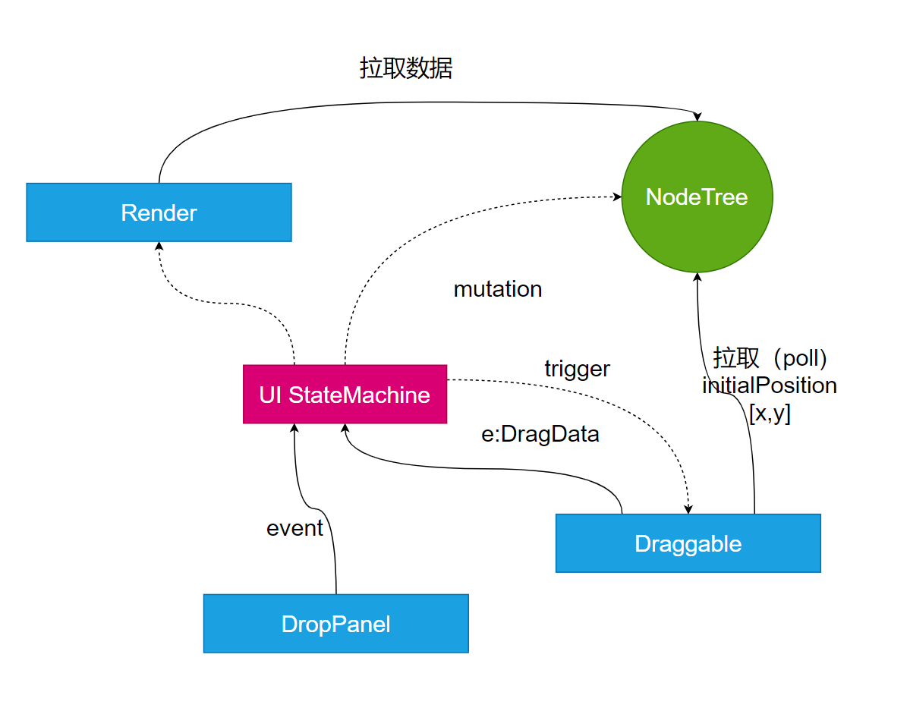
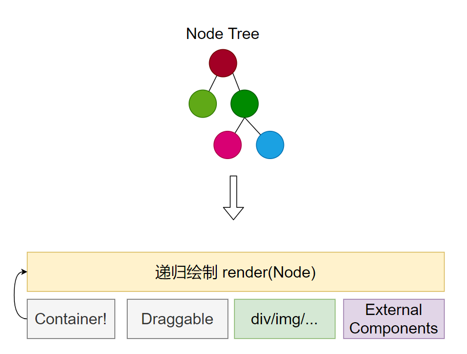

# 实现搭建平台

## 架构

## 核心Node

一个Node就是一个虚拟的DOM节点。（搭建系统抽象）

Node继承于Emiter, 可以发送消息。

 Node内部的数据采用Immutable方便实现操作回滚。

node是一个递归结构，node.children中记录childNode。

### 交互的核心UIStateMachine

用状态机组成交互的核心。

- 通知机制采用拉取模式（poll)

  - 减少组件间依赖
  - 灵活控制渲染

- 状态机控制全部的用户体验（让交互行为可预测）

  

### 渲染器

渲染器递归绘制，遇到容器类型时会发生递归。

## 元数据

什么是“元(Meta)”？

元数据是描述程序的数据（俗称代码）。元编程就是让程序程序，是元（代码）在编程。 

在一个搭建平台中：元数据，就是可以深刻反应、并且可以运行时控制系统行为的数据。那么这些数据有哪些呢？

- 对组件的描述
- 对组件父子结构的描述
- 对组件属性的描述
- ……

举个例子，运行时加载了一个外部组件，然后将外部组件加入系统的元数据，那么——系统获得了创建外部组件的能力。

###  题外：JS中有哪些元编程的技巧？

- eval
- Reflect
- 直接修改一个函数 obj[foo] = function...
- Prxoy
- Decorator
- babel plugin 

思考：小明写了一段支付程序，function pay(){...} 这段支付程序本身是元数据吗？ 

