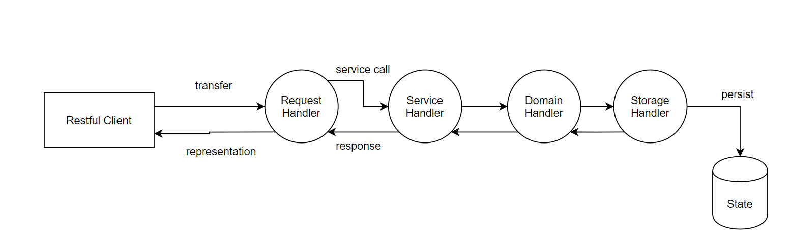
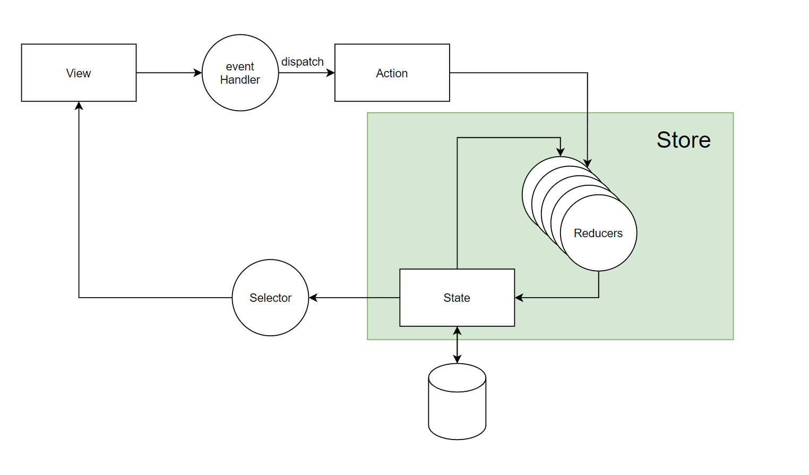
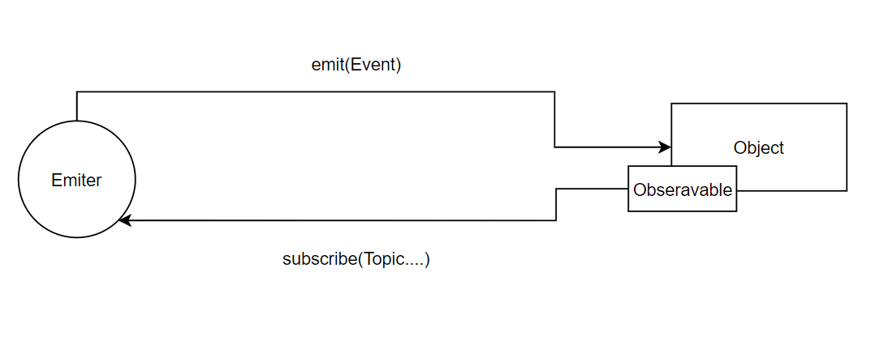

# 前端和数据流设计


数据流（Data Flow)是系统的**数据传递角度**的思考切面。

- 实体(Entity， Input/Output)
- 函数(Function/Process)
- 存储(Store/Database/File……)
- 数据流(Flow)

实体是数据的源头和目的地（Input/Output)；函数对数据进行处理；存储帮助在中间环节和最终环节存储数据；数据流是数据在实体、函数、仓库之间的传递过程。


## Data Flow举例


### restful



- requestHandler : app.get('/', requestHandler)

- serviceHandler: OrderService.pay()

  

### redux




## redux + 异步数据流


思考，如何实现下面的程序：

```tsx
function reducer(state : UserState = {logined: "not login"}, action : UserAction){

  switch(action.type) {
    case "CHECK_LOGIN_STATUS":
      return {
        ...state,
        logined : [isUserLoggedIn, getUserAvatar()]
      }
    case "CHECK_USER_ORDERS" : 
      return {
        ...state,
        orders : getUserOrders
      }
  }
  return state
}

function *getUserOrders() {
  yield {price : 100}
  yield {price : 200}
  yield {price : 300}
  yield {price : 400}
  yield {price : 500}
}

function isUserLoggedIn(){
  return new Promise(function (resolve) {
    setTimeout(() => {
      resolve("user is loggedin")
    }, 1000)
  })
  
}


```

## Skedo的Emiter


