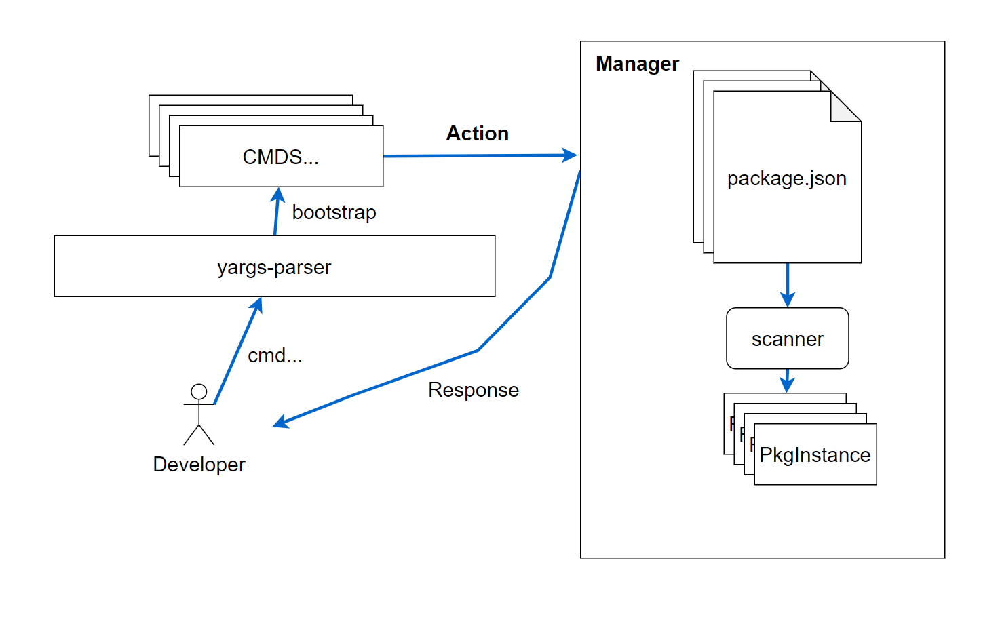

# Node实现包管理器需要的技能


## 降级的需求


写Shell来完成基础的工作。有时候提升团队战斗力是一念之间，并不需要引入复杂的工具。

```tsx
DIR=$(cd `dirname $0`; pwd) 
                            
cd "$DIR/../packages/skedo-r
yarn link                   
cd "$DIR/../packages/skedo-c
yarn link                   
cd "$DIR/../packages/skedo-r
yarn link @skedo/request    
yarn link @skedo/core       
cd "$DIR/../packages/skedo-u
yarn link @skedo/core       
yarn link @skedo/request    
yarn link @skedo/skedo-rende
                            
cd "$DIR/../packages/skedo-s
yarn link                   
cd "$DIR/../packages/skedo-s
yarn link @skedo/svc-config 
```


提问：

- shell执行起来是一个？


## 脚手架类技能

### 文件操作


- fs
  - 读/写
  - 遍历/查找
- path
  - resolve
  - 工作路径

###  命令行交互工具

- 读取命令行参数
- yargs-parser
- inquirer
- chalk


## 网络工具

- node-fetch

## 执行脚本的工具

- child_process

  


## 包管理器设计


作用：

- 一键安装依赖
- 管理项目





