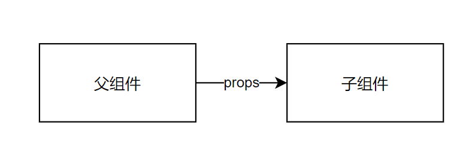
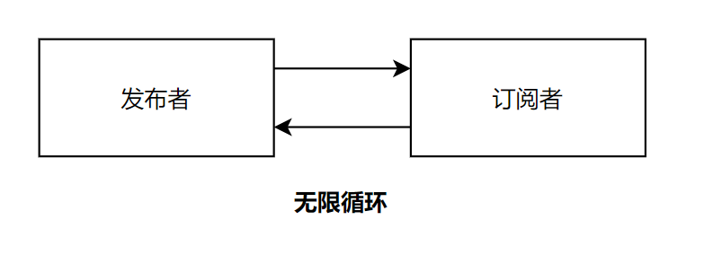

# 前端设计模式


**什么是设计模式？**

设计模式是解决方案， 是对软件设计方案中普遍存在的问题提出的解决方案。 


**算法**是不是设计模式？ ——算法解决的是计算问题，不是解决设计上的问题。设计模式通常讨论的是对象间的关系、程序的组织形式等等设计问题。

**面向对象**是不是设计模式？——面向对象是设计模式。

**函数式编程**是不是设计模式？ ——函数式编程是设计模式。


但面向对象和函数式概念包括的范围太大，不太适合做太具体的设计模式探讨。或者说，OOP和FP是两类设计模式的集合，是编程范式。


**什么是前端设计模式？** 

对前端普遍问题的解法。 


前端中会用到传统的设计模式：

- 工厂(Factory)
- 单例(Singleton)
- 观察者(Observer)
- 构造器(Builder)
- 代理模式(Proxy)
- 外观模式(Facade)
- 适配器（Adapter）
- 装饰器（Decorator)
- 迭代器（Generator）


还有一些更偏前端的：

- 组件化（Component） 

- Restful

- 单向数据流

- Immutable

- 插件

- DSL（元数据）

  


## 常见设计模式之前端


### 单例(singleton)

确保一个类只有一个实例。


举例1： 

skedo : ComponentsLoader 


举例2：

隐含单例的逻辑。

```tsx
const editor = useContext(RenderContext)
```


设计模式关注的是**设计目标**，并不是对设计实现的**强制约束**。 闭包也可以实现单例，例如：

```tsx
const signleton = () => {
    const obj = new ...
    return () => {
        ...
    }
}

```


划重点：理解设计模式，灵活使用设计模式。


单例总结：

- 可以用于配置类、组件上下文中共用的类等
- 用于对繁重资源的管理（例如数据库连接池）

```tsx
class IDGen {

  private constructor(){}

  static inst = new IDGen()   

  static get(){  return inst }

}
```


### 工厂(Factory)


 将类型的构造函数隐藏在创建类型的方法之下。


举例1：

`React.createElement` 


举例2： skedo : Project.ts


举例3： Sequilize对于不同dialect的实现（mysql，sqlite……）


适用场景：

- 隐藏被创建的类型
- 构造函数较复杂
- 构造函数较多


###  观察者（Observer)


对象状态改变时通知其他对象。


举例1：

观察者( skedo : Emitter )


举例2：redux/vuex


```tsx
Vue.use(Vuex)

const store = new Vuex.Store({
  state: {
    count: 0
  },
  mutations: {
    increment (state) {
      state.count++
    }
  }
})

// 隐含subscribe
new Vue({
  el: '#app',
  store
})

// vue组件汇总
methods: {
  increment() {
    this.$store.commit('increment')
    console.log(this.$store.state.count)
  }
}


```


场景：

- 实现发布、订阅之间1对多的消息通知
- 实现Reactive Programming


主动的、响应的： **Proactive vs Reactive**

- 命令式的程序有什么缺点吗？


划重点：每个组件自己知道自己应该做什么。

### 构造器(Builder)


将类型的创建构成抽象成各个部分。


举例1： 造车

```tsx
造车() {
  造发动机()
  造轮子()*4
  造内饰()
  ……
}
```


举例2： JSX

```tsx
<Page>
    <TitleBar />
    <Tabs>
      <Tab title='首页' icon=...>...</Tab>
      <Tab title='发现' icon=...>...</Tab>
      <Tab title='个人中心' icon=...>...</Tab>
    </Tabs>
    <FooterBar />
</Page>
```


### 代理模式（Proxy）


将代理类作为原类的接口。通常代理类会在原类型的基础上做一些特别的事情。


举例1：

 vue reactivity 实现

什么时候用代理？—— **你想在原有的类型上增加一些功能和变通处理，但是又不希望用户意识到时。**


### 适配器模式(Adapter)


通过一层包装，让接口不同的类型拥有相同的用法。因此也称为包装模式(wrapper)。

**重点：抹平差异**

举例1：

ant-design中的：

- onChange
- defaultValue


举例2：

React SyntheticEvent

https://reactjs.org/docs/events.html#gatsby-focus-wrapper


举例3：

skedo中的bridge


###  外观模式(Facade)


将多个复杂的功能隐藏在统一的调用接口中。


举例1：

vite dev | vite build


举例2：

skedo:  Project.ts


举例3：

skedo: packages.ts


总结：

- 整合资源
- 减低使用复杂度（开箱即用）


### 状态机（StateMachine)


将行为绑定在对象内部状态变化之上。


举例1：

 skedo  : UIModel


举例2：

redux


场景：

- 组织/管理交互设计
- 在DOM之上抽象用户交互


### 装饰器(Decorator)


在不改变对象、函数结构的情况下为它添加功能或说明。


举例1： @deprecated

```tsx
interface UIInfo {
    
    /** @deprecated use box instead **/
    width : number;
    /** @deprecated use box instead **/
    height : number;
    
    box : BoxDescriptor;
}
```


举例2：**过去的**React代码

```tsx
@fetchProductList()
class List extends React.Component {
    
    render(){
        const productList = this.props.productList
        return <...></...>
    }
}

function fetchProductList(Target){
    return () => {
        class ProxyClass extends React.Component{
            fetch(){
                ...fetch logic 
            }
            
            render(){
                const list = this.state.list
                return <Target productList={list} />
            }
        }
        return ProxyClass
    }

}
```

现在用什么？

```tsx
const List = () => {
    const  productList = useFetchProductList()
    return <...></...>
}
```


前端还用装饰器吗？ —— 作为**高阶组件**的装饰器暂时不用了，但是还有其他用途，比如typescript官网的一个例子。

```tsx
class Point {
  private _x: number;
  private _y: number;
  constructor(x: number, y: number) {
    this._x = x;
    this._y = y;
  }
    
 
  @configurable(false)
  get x() {
    return this._x;
  }
 
  @configurable(false)
  get y() {
    return this._y;
  }
}


function configurable(value: boolean) {
  return function (target: any, propertyKey: string, descriptor: PropertyDescriptor) {
    descriptor.configurable = value;
  };
}
```


主要作用：

- 替换原有实现
- 修改元数据


### 迭代器(Iterator/Generator)


用Iterator来遍历容器内的元素（隐藏容器内部数据结构）。

举例1：

javascript的容器: Set, Array, HashMap


举例2：Generator

用来简化Iterator的构造。

例如: skedo Node.bfs()


## 前端常见设计模式


### 组件化


用组件来**搭建**界面，组件是最小的界面元素。

按照最新的前端对组件理解，在组件化当中，一个组件包括：

- 视图(View)
- 数据(Data) props, state
- 视图到数据的映射（view = f (data) )
- 组件的作用(effect)：根据数据渲染视图(view = f (data ) ) 之外的程序。


组件可以被：

- 映射、变换 
  - view = f(data)
  - view = f·g(data)
  - view = data => data.map(...).map(...).filter(...)……
- 组合（Composition）
- 记忆（Memorization)
  - 记忆是一种作用
  - 参考useMemo
- 列表（List）

组件有这些性质：

- 密封性（sealed)

  - 组件专注、完整
  - 举例：skedo draggable

- 可预测性

  - view = f(data) with effects(...)

- 连续性（continuations)

  - 参考 a + b + c + d = a + ( b + c + d)

    如果：组件的渲染的先后顺序不影响组件渲染的结果。

    ——组件和并发渲染

    ——组件可以和控制流(if/while/for等)无缝结合

  - 每个组件是一个函数调用，是一个任务，它们没有**特殊性**。参考React Fiber

    

  - 每个组件的渲染是一次函数的执行，可以和if/else/while/do/for等等无缝结合


#### **组件的粒度**

组件应该具有最小粒度。

在上一个作业：实现布局列表当中，实际上应该实现两个组件：

- 业务无关：TreeView
- 业务相关：UILayerView

UILayerView = TreeView + useUILayerView()


按照最新的组件化理解通常我们会将组件分成：

- 基础组件（用于实现交互）
  - Draggable
  - Selectable
  - Button
  - ……
- 组合组件（在基础组件上组合实现更复杂的交互）
- 业务组件 = (基础组件 | 组合组件) + useXXX 


#### **组件间通信**模型


**选项A： EventBus模型**


组件可以：

- 单播
- 广播


常见案例：

- Iframe中多个APP间通信
- Iframe中多个APP和Frame通信
- Native和HybridApp间postMessage通信


**选项B： 单向数据流+状态机模型**


场景举例：

- UI交互制作
- 全局事件通知（例如加购物车、用户消息等）


### 选项C：领域模型+Emiter


举例：

- 组件仅仅负责渲染等简单工作，背后的业务逻辑由复杂的领域模型完成
- 例如：
  - Skedo： Assistline
  - Skedo:    Selectable
  - Skedo:    Node


### Restful


Restful是一套前端+后端协作标准。

- 前端无状态，前端有(Representation)
- 服务端有状态
- 用户通过transfer改变服务端状态
- 用名词性+HTTP Method描述transfer


举例1：

sekdo :  request


### 单向数据流


传递数据的通道总是单向的，为每个方向的数据传递建立一个单向的通道。


例如（父组件到子组件的传参）



如果子组件要想回传数据到父组件：


不会出现这样的设计：


为什么不将父组件的`setState`给子组件用呢？ 

- 耦合：子组件依赖父组件（不可单独使用）


另外：思考一个无限循环的场景：

```tsx
class A {
  b : B
  this.b.on("X", () => {
      this.emit("Y")
  })
}

class B {
    a : A
    this.a.on("Y", () => {
        this.emit("X")
    })
}
```





#### 单向数据流的场景：受控组件和非受控组件


典型的受控组件

```tsx
function Foo(props){    
    return <Input onChange={props.onChange} value={props.value} 		/>
}
```


典型的非受控组件：

```tsx
{
    props : {
      initialState : ...  
    },
    setup(props) {
        const val = ref(props.initialState)
        
				
        watchEffects(() => {
            if(val.value !== porps.initialState){
                 props.onChange(val.value)
            }
           
        })
        return () => {
             return <Input onChange={e => val.value = e.target.value} defaultValue={val.value} />
        }
     
    }
}

    


function Foo(props){    
    // per instance + per loc
    const [val, setVal] = useState(props.initialValue)

		useEffect(() => {
       props.item.on("force-set", (value) => {
        	setVal(val)   
       })
    }, [])
    
    
    useEffect(() => {      
      (debounce(() => {
        if(val !== props.initialValue)
          props.onChange(val)  
      }))()
    }, [val])
    return <Input onChange={setVal} defaultValue={val} />
}
```


可以不可以这样设计组件？ 

```tsx
function Foo(props) {
    
    const [list, setList] = useState(props.list)
    
   	 updateList(item){
         setState(list => [...list.push(item)] )     
     }
    
    useEffect(() => {
        if(list !== props.list) {
            props.onListChange(list)
        }
       
    }, list)

    return <div>...foreach render list ... </div>
}
```


表单项的解耦

```tsx
<Form>
    <Subform1>
        <SubForm3></SubForm3>
    </Subform1>
    <Subform2></Subform2>
</Form>

const FormItem = ({store, onChange, path}) => {
    const value = store.getByPath(path)
    
    store.subscribe(path, () => {
        // 更新
    })
    
    return <Input onChange={(e) => onChange(path, e.target.value)} />
}
```


###  Immutable


不可变数据集合：数据不可以被改变，若改变就创建新的集合。

思考这样一个例子(非受控组件）：

```tsx
function SomeForm(props) {
    
    const formData = reactive(props.initialFormData)
    

    watchEffect(() => {
        store.update(formData) // store无法判断formData是否完成了更新，因为formData作为一个对象没有发生变化
    })
    
    //... render function
}
```

思考这样的实现：

```tsx
function SomeForm() {
    
    const formData = ref(props.immutableFormData)
    
    watchEffect(() => {
        store.update(formData.value) // store每次可以拿到一个不同的对象
    })
    
    //... render function
}
```


####  Immutable初体验


带你用一用Immutable


#### 示例：Immutable实现编辑历史


举例：immutable.js immer.js 


总结：

Immutable的优势？ 

- 可以帮助保留变更历史（且体积小）
- 速度快（性能好）
- pure没有副作用

### 插件模式


将扩展能力抽象为可以无序执行、各自处理不同问题的一个个插件。


**开闭原则：对修改关闭，对扩展开放。**


举例1： babel插件

参考：skedo : vue-lexical-cache


举例2：

skedo: 热键

举例3：

rollup插件

```tsx
export default function myExample () {
  return {
    name: 'my-example', // this name will show up in warnings and errors
    resolveId ( source ) {
      if (source === 'virtual-module') {
        return source; // this signals that rollup should not ask other plugins or check the file system to find this id
      }
      return null; // other ids should be handled as usually
    },
    load ( id ) {
      if (id === 'virtual-module') {
        return 'export default "This is virtual!"'; // the source code for "virtual-module"
      }
      return null; // other ids should be handled as usually
    }
  };
}


// rollup.config.js
import myExample from './rollup-plugin-my-example.js';
export default ({
  input: 'virtual-module', // resolved by our plugin
  plugins: [myExample()],
  output: [{
    file: 'bundle.js',
    format: 'es'
  }]
});
```


举例4：

webpack loader

```tsx
import { getOptions } from 'loader-utils';
import { validate } from 'schema-utils';

const schema = {
  type: 'object',
  properties: {
    test: {
      type: 'string',
    },
  },
};

export default function (source) {
  const options = getOptions(this);

  validate(schema, options, {
    name: 'Example Loader',
    baseDataPath: 'options',
  });

  // Apply some transformations to the source...
	
  return `export default ${JSON.parse(source)}`;
}
Loader Dependencie
```


### 领域专有语言：DSL 


基于元数据对页面、系统进行描述，让系统基于描述工作。

- HTML+CSS 是对页面的 DSL
- skedo中的Node是对组件树的DSL；组件的yml是对组件行为的DSL


#### 举例1： 虚拟DOM


**举例2：**活动配置到表单实例


