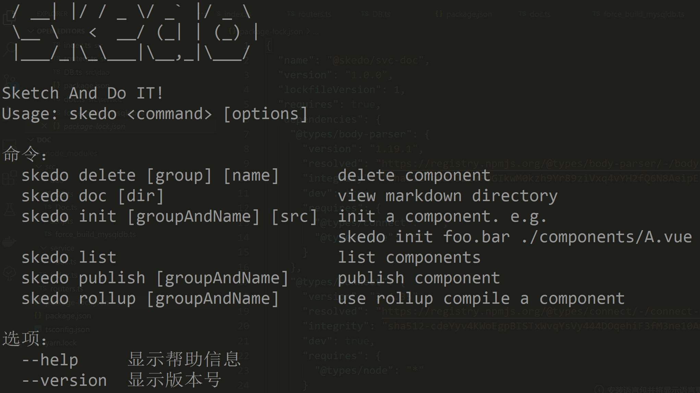

# 手把手： Skedo环境 


## 项目和目录结构对应（后续会持续变化，另附文档）

- /skedo-ui @skedo/ui

  - UI部分、目前还没有拆分成微前端结构
  - 目前只有搭建平台

- /skedo-core @skedo/core

  - 目前还没有解耦
  - 这部分应该包括 
    - @skedo/meta 元数据
    - @skedo/util 函数库
    - @skedo/bridge SDK

- /skedo-cli @skedo/cli

  - 脚手架项目

- /skedo-request @skedo/request

  - 请求库，负责发送请求

- /skedo-svc/config @skedo/config

  - 配置库，负责同步配置

- /skedo-svc/upload @skedo/svc-upload 上传文件服务(ali-oss)

- /skedo-svc/doc @skedo/svc-doc 上传文档服务（组件、页面……）

- /externals

  - react-component 外部组件库
  - vue-component 外部组件库

  

## 环境

1. node >= 12 （官网下载）
2. ts-node `npm install ts-node -g` 
3. 可选(yarn) `npm install yarn -g` 
4. docker [DockerIO下载](https://www.docker.io)
   - windows下需要vt-x
     - BIOS中打开Inter VT-X技术支持（AMD对应的是SVM）
     - Windows下打开hyper-v [win10打开方法](https://docs.microsoft.com/zh-tw/virtualization/hyper-v-on-windows/quick-start/enable-hyper-v)
  
  > 新版本docker直接使用WSL2 不再需要开启hyper-v了

5. mysql
   - 用Docker安装，参考这里 (安装方法)[https://hub.docker.com/_/mysql]


## 数据库配置


【配置】

DB的配置在@skedo/config中，找到`config.dev.ts` ，可以看到DB的配置。

默认配置：(如果有需要可以修改)

```
	dbHost : "192.168.199.128",
	dbType : 'mysql',
	dbName : "skedo",
	uname : 'root',
	passwd : '123456'
```


【配置依赖】

```shell
# skedo-svc/config
yarn link

# skedo-svc/doc
yarn install
yarn link @skedo/svc-config

# skedo-svc/upload
yarn install

# skedo-core
yarn link

# skedo-cli
yarn install
yarn link @skedo/request
npm link # 必须用npm ，这里将@skedo/cli link到global

# skedo-ui
yarn install
yarn link @skedo/request
yarn link @skedo/core

```


【建表】

先用`npm install` 或者`yarn install` 安装好@skedo/svc-doc下的依赖，具体参考这段脚本


用ts-node执行@skedo/svc-doc下的`src/scripts/force_build_mysqldb.ts`

【上传和DOC服务】

进入对应目录`npm run dev` or `npm start` 。 见package.json


【CLI配置】

在配置依赖部分已经完成了。这个时候命令行下输入`skedo` 如果返回这样的界面就配置成功了。




## UI配置

`npm start` 启动即可。


## 看文档

```shell
skedo doc [文档目录]
```

