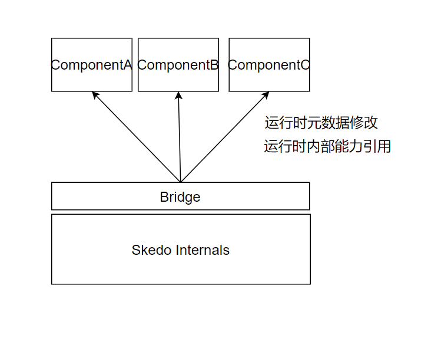
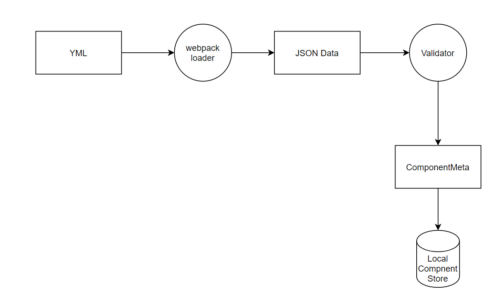
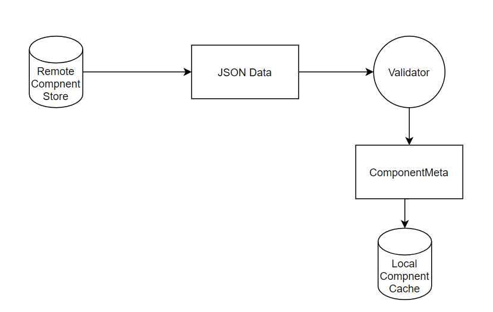
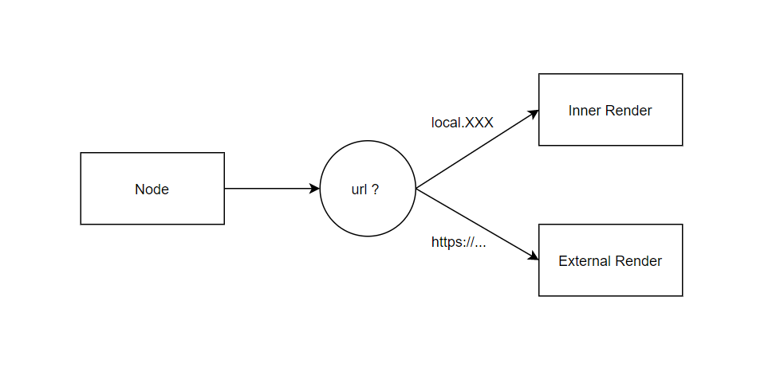

# 拥抱<元>的架构思想

通俗的讲：元编程就是用程序生存程序

## 什么是元？


元(meta) 就是对自己的引用。 

元编程：程序修改自己。

元数据：描述其他数据的数据。


举例：

- 数据：苹果是红色的。 <span style="color:red">红色</span>，是数据；苹果是物件。

- 元数据：苹果这类型的对象，可以编辑颜色，**编辑颜色的时候用ColorPicker这个组件**！

具体到编辑器场景，颜色是描述组件的事实，描述事实如何被描述的数据，就是元数据。

举例：

- Node包含位置信息(x, y, w, h)， 这些是___ ? 
- Node的(x, y, w, h)在属性编辑器中用`LengthInput` 这个组件表达， 这是_____? 


## 元数据的威力


核心目标：将系统的能力语义化，然后通过元数据让用户(程序员、运营、产品）使用。

**举例1：** 

JSX+Virtual DOM将渲染能力提供给程序员。 

```tsx
<Button>OK!</Button>
```

请问：Button可以在哪些平台渲染？

- Web
- React Native
- 小程序
- Canvas
- SVG
- ……


因为JSX完美的解决了渲染领域的问题，也被称作：DSL（Domain Specific Language)。DSL可以看做是元数据的一种。


举例2：

请问，描述程序的数据叫什么________________?

第二个问题，让程序动态的修改自己有哪些手段？


举例3：

Skedo的组件通过【属性编辑器元数据】描述组件拥有a)哪些属性，这些数据又关联b)哪些数据。


## 元编程

让程序可以动态的修改元数据就是元编程。程序的元数据是什么？——代码。


举例：

- 小明写了一个组件是Programming
- 小明写了一个开发组件的组件是Meta Programming


举个例子：

- 小张在设计一套后台系统，让用户可以这样完成一个筛选列表的设计。

```tsx
<FilterTable scripts="service.Order">
    <Filter>
      <FilterOption lalel="金额" name="amount">
          <Input />
      </FilterOption>
      <FilterOption lalel="时间" name="time">
          <DateTimeRange />
      </FilterOption>
    </Filter>
    <Table></Table>
</FilterTable>

```

然后让service.order的实现者只需要：

```tsx
class Order extends Service {
    constructor(){
        this.restful("/order") // GET POST PUT OPTION
        this.numericFilter("amount")
        	.toYuan()
        this.timeRangeFilter("time")
        	.alias("create_time")
          .asTimeStamp()
       	this.dataMapper((json) => {
            return {
                list : json.data.list,
                pageNo : json.data.page_no
            }
        })
        
        this.requestMapping(({create_time, amount}) => {
            return {req : { create_time, amount} }
        })
    }
}
```

请问这是元编程吗？ 

- 是！ 首先抽象出了元数据在描述系统的行为
- 程序会根据描述动态的执行（也就是根据描述动态的修改自己）


## Skedo实现细节探讨

## Skedo的meta能力（组件获取Skedo渲染机制）

- 组件可以通过Bridge获得渲染器和元数据
- 组件决定如何使用元数据渲染自己



#### 运行时元数据修改

节点（Node）是对渲染的描述，运行时修改了节点，也就相当于修改了代码。

- 运行时添加节点
- 运行时删除/切换/设置节点

#### 运行时内部能力引用

- 递归绘制子节点（DIV、ROOT、Row、Tab等组件的实现）


### YML 的解析到实例加载




### 区分远程组件和本地组件

- 核心元数据： url



通过url不同区分不同组件的加载方式：




## 元数据的使用


例子1：为Skedo的属性编辑器增加一个Checkbox属性类型

例子2：为Skedo属性编辑器增加list\<T\>类型的属性类型

例子3： 利用Skedo的元数据体系实现预览能力


## Skedo 的设计理念

- 系统元化（元数据化）
- 系统是描述出来的
- 让系统外部拥有一定的元能力
- 让元成为**标准**


## 关于标准化的一些思考

标准化是对领域的深入思考，提炼总结出的规律。


首先，并不是用了标准化的东西就是标准化，先举几个反例：

- 小明是一个前端Leader，他用eslint让新来团队的成员需要2周才能提交代码，非常有成就感。
  - 标准化应该带来更好的开发体验
  - 标准是大家平时学的东西
  - 如何修正？
    - 用vscode插件自动帮助团队成员修复引号、缩进问题
    - 用babel插件自动删除没有引用的变量
    - 用typescript规范团队的成员代码的书写


举个正例：

小师叔用yml书写组件的描述。

- yml是标准，书写方便，且有不错的生态
- yml有是很多程序员会的，不用单独培训能使用方法
- yml书写起来比JSON方便


