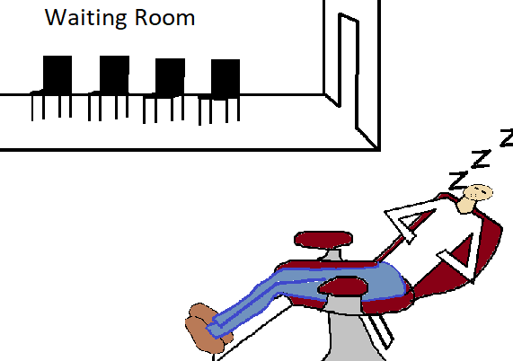

## NodeJS 一些原理提问整理


系统的，更详细的内容参考随堂赠品Node.js课程。 

## 第1个问题： 执行一个node.js文件是一个进程还是一个线程？


进程是：     应用程序的执行副本。 （OS分配资源的最小单位）

线程是：     轻量级的进程。（OS执行程序的最小单位。）


线程里有什么？线程模拟CPU

- PC
- Stack
- 寄存器

思考：打开一个进程是秒级的还是毫秒级的？ 创建一个线程是秒级的还是毫秒级？

## **第2个问题：浏览器中的JS，Node下的JS是单线程吗？** 


并发（concurrent) - 看上去在同时发生

并行（parallel） - 绝对的同时发生


```tsx
async function foo(){
    await fetch(...)
    await readFile(...)
}


```


下面这几个操作都会产生异步吗？

- setTimeout
- yield
- new Promise(...)
- async/await
- fs.readFile


创建异步任务都需要请求Event Loop吗？ —— YES！　

异步调用都应该转成同步调用吗？——　YES！


总结下，NodeJS有哪些线程？ 

- 主线程（用户程序+EventLoop)
- 线程池（执行异步任务的）


## 第3个问题： 单线程处理大量的I/O，叫做什么？


EventLoop  响应大量的文件、网络请求叫做：I/O多路复用技术——多个信号复用一个信道。


## 第4个问题：什么是I/O？


I : Input

O : Output 

* 所以I/O是将数据从一个地方拷贝到另一个地方。 

- 文件I/O
- 网络I/O
- 数据库I/O

多问个问题：

- HTTP 请求是不是I/O？


## 第５个问题：I/O关心什么？

最重要的3个指标：

- 吞吐量 - 数据传递速度
- 延迟 - ping值
- 可靠性 - 丢包率


考个常识：客户端和服务端之间通常一次发送多少数据？读取磁盘通常每次读取多大数据？

- A: 1bit
- B: 1 byte
- C: 1GB
- D: 2-4MB
- E : 2kb~8kb √


再问个常识：发送1Gb数据会一次将数据读入内存再发送吗？


### 流和缓冲区

 * 流（stream）——抽象随着时间产生的数据。

举个例子：将需要发送1Gb数据抽象成流，控制流的产生速度（从磁盘读取的速度），控制流的消费速度（发送速度）。


**划重点：流的本质是生产者消费者模型。** 




流是一种抽象模型，流不限制具体的实现。

缓冲区的作用是在生产、消费环节存储数据。

举例：发送1G的数据，每次发送4kb，那么发送端需要一个4kb的缓冲区，接收端也需要一个4kb的缓冲区。

- 那为啥发送端不读1G进内存，接收端不把所有数据读完再处理？


# 总结

> 应用程序本质是在硬盘中的文件，启动后在内存中的创建一个副本叫做进程，一个应用程序可以启动多个进程

# 进程是：应用程序的执行副本。（OS分配资源的最小单位）
# 线程是：轻量级的进程。(执行程序的最小单元)
### 进程的创建是秒级，线程是毫秒级
> 进程是没有执行权限的，执行权在操作系统为进程分配的主线程中 - so: 执行一个node文件的是主线程
> eventLoop会把程序给过来的异步程序（定时器，网络请求、raf等），拿去操作系统提供的线程池中注册一个对应的回调函数
> 线程模拟CPU 其中有指针，有栈，有寄存器，node是单核的，就是因为node跑在一个核心中，所以node快
> node作为一个进程，一定是多线程的，只不过用户程序+eventloop是跑在一个线程中，单线程，就是单核，就是操作密集型任务更快

# 假如有8核的服务器，最多只能启动七个进程，要留一个给操作系统、如果是单核服务器，就要检视服务器负载（cpu payload）指标

# nodejs
### 创建异步任务都需要请求eventloop
### 异步调用都应该转成同步调用，就是异步编程 async\await
### nodejs 下有一个主线程用来执行用户程序+eventloop,还有一个线程池用来执行异步任务，so:node启动后有多少线程？是不知道的。
### nodejs 的这个设计就导致它适用于处理IO，处理操作密集型任务，而非计算密集型任务

### 并发(concurrent)-看上去程序在同时执行
### 并行(parallel)-绝对严格的同时执行

### buffer使用的先决条件之一是内存不够的情况下