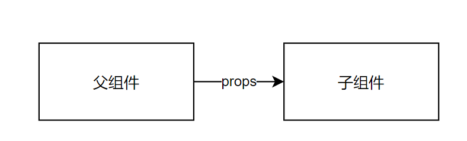
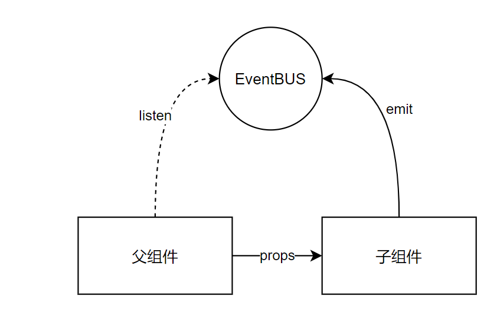
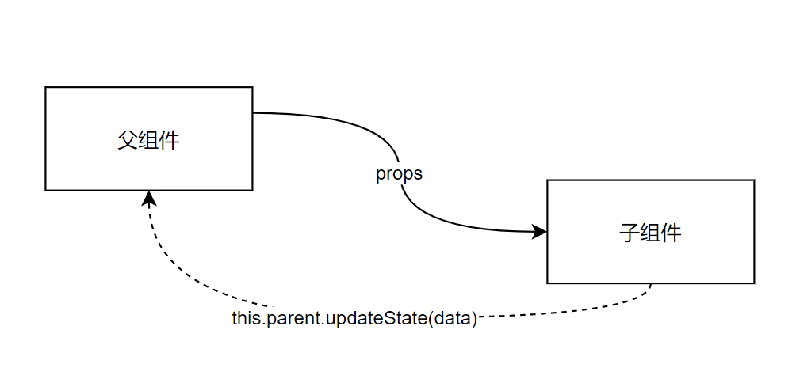
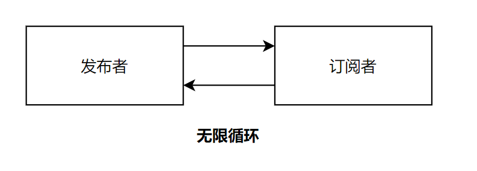
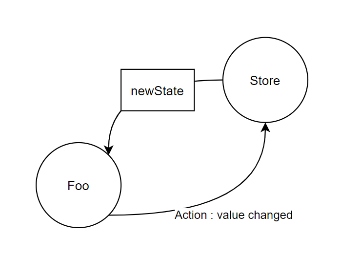
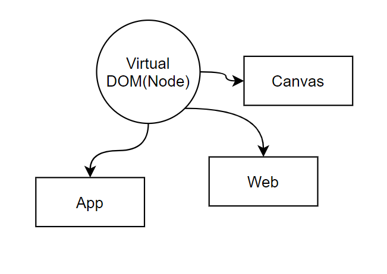
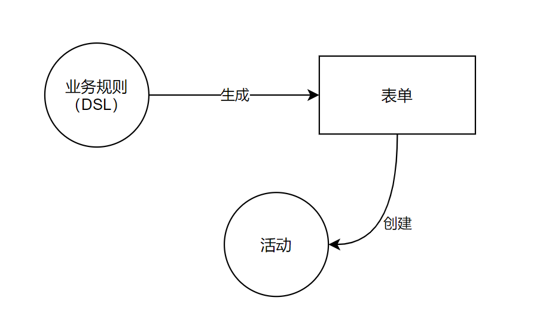

### 单向数据流


传递数据的通道总是单向的，为每个方向的数据传递建立一个单向的通道。
>单向数据流的本质其实就是遵循**单向依赖原则**，在程序设计中，我们应当避免**双向依赖**的设计

> emiter - 使用事件可以创建公共依赖，更加进一步解耦单向数据流，从组件间单向数据流，解耦成组件间公共依赖


* 没有双向数据流这个说法！ 双向数据绑定也是由单项数据流实现的


例如（父组件到子组件的传参）



如果子组件要想回传数据到父组件：



不会出现这样的设计：



为什么不将父组件的`setState`给子组件用呢？ 

- 耦合：子组件依赖父组件（不可单独使用）


另外：思考一个无限循环的场景：

```tsx
class A {
  
  this.b.on("X", () => {
      this.emit("Y")
  })
}

class B {
    this.a.on("Y", () => {
        this.emit("X")
    })
}
```





#### 单向数据流的场景：受控组件和非受控组件


> 受控、非受控，指的是 是否受react渲染重绘控制 
> - 受控组件：组件的状态都是外部传入，本身是没有状态的，用户修改时必须由事件传给外部，然后由外部刷新数据触发重绘
> - 非受控组件：就是自己有自己的状态，由组件自己控制刷新

> 下面的受控组件传入了value,那么用户修改value是不会在react数据中生效的，react渲染重绘时，value还是props中的，而不是用户输入的。而非受控组件，就是以用户输入的value为主

典型的受控组件

```tsx
function Foo(props){    
    return <Input onChange={props.onChange} value={props.value} />
}
```



典型的非受控组件：

```tsx
function Foo(props){    
    const [val, setVal] = useState(props.initialValue)
    
    useEffect(() => {      
      (debounce(() => {
        if(val !== props.initialValue)
          props.onChange(val)  
      }))()
    }, [val])
    return <Input onChange={setVal} value={val} />
}
```

表单项的解耦

```tsx
<Form>
    <Subform1>
        <SubForm3></SubForm3>
    </Subform1>
    <Subform2></Subform2>
</Form>

const FormItem = ({store, onChange, path}) => {
    const value = store.getByPath(path)
    
    store.subscribe(path, () => {
        // 更新
    })
    
    return <Input onChange={(e) => onChange(path, e.target.value)} />
}
```


###  Immutable
immutable.js


不可变数据集合：数据不可以被改变，若改变就创建新的集合。

Immutable是一个高性能的操作，尤其是大数据量的情况下。
原因是Immutable的数据其实存在一个store中，只会变更需要变更的数据
假设百万数据在一个对象中，Immutable的操作是常量，而普通数据操作则是N

immutable 的优势：
* 可以保留历史变更，且体积小，不会占据大量内存
* 速度快（性能好）
* pure没有副作用

思考这样一个例子(非受控组件）：

```tsx
function SomeForm(props) {
    
    const formData = reactive(props.initialFormData)
    
    watchEffect(() => {
        store.update(formData) // store无法判断formData是否完成了更新，因为formData作为一个对象没有发生变化
    })
    
    //... render function
}
```

思考这样的实现：

```tsx
function SomeForm() {
    
    const formData = ref(props.immutableFormData)
    
    watchEffect(() => {
        store.update(formData.value) // store每次可以拿到一个不同的对象
    })
    
    //... render function
}
```


### 插件模式


将扩展能力抽象为可以无序执行、各自处理不同问题的一个个插件。


### **开闭原则：对修改关闭，对扩展开放。**


举例1： babel插件

参考：skedo : vue-lexical-cache

举例2：

skedo: 热键

举例3：

rollup插件

```tsx
export default function myExample () {
  return {
    name: 'my-example', // this name will show up in warnings and errors
    resolveId ( source ) {
      if (source === 'virtual-module') {
        return source; // this signals that rollup should not ask other plugins or check the file system to find this id
      }
      return null; // other ids should be handled as usually
    },
    load ( id ) {
      if (id === 'virtual-module') {
        return 'export default "This is virtual!"'; // the source code for "virtual-module"
      }
      return null; // other ids should be handled as usually
    }
  };
}

// rollup.config.js
import myExample from './rollup-plugin-my-example.js';
export default ({
  input: 'virtual-module', // resolved by our plugin
  plugins: [myExample()],
  output: [{
    file: 'bundle.js',
    format: 'es'
  }]
});
```


举例4：

webpack loader

```tsx
import { getOptions } from 'loader-utils';
import { validate } from 'schema-utils';

const schema = {
  type: 'object',
  properties: {
    test: {
      type: 'string',
    },
  },
};

export default function (source) {
  const options = getOptions(this);

  validate(schema, options, {
    name: 'Example Loader',
    baseDataPath: 'options',
  });

  // Apply some transformations to the source...

  return `export default ${JSON.parse(source)}`;
}
Loader Dependencie
```


### 领域专有语言：DSL 


基于元数据对页面、系统进行描述，让系统基于描述工作。

- HTML+CSS 是对页面的 DSL
- skedo中的Node是对组件树的DSL；组件的yml是对组件行为的DSL


**举例1：** 虚拟DOM



**举例2：** 活动配置到表单实例




## 设计领域的【无招】


设计模式非常多，每解决一个问题都会形成设计模式。 随着系统的迭代，系统的设计模式也在迭代。


实际项目中，无法在第一时间将所有东西都用到位，更不能为了用模式而用模式——那么该怎么思考呢？


接下来我们讨论几个思考软件设计时的通用原则。


### 密封性和单一职责

为什么Antd中的 Select和Option是分开的？Tab和Panel是分开的？

```tsx
const Options = Select.Option

const TabPanel = Tab.Panel
```


为什么作业1中的UILayerView应该先实现TreeView ? 两个职责，不同的职责拆分


延伸下：关注点分离原则


总结下：

- 每件事情应该有独立的模块处理
- 每个独立的模块要把事情做好、做完整


### 单向依赖原则


在单向数据流中讨论非常详细了。 组件不要发生双向依赖，如果发生双向依赖可以这样解耦：

- 消息（EventBus, Redux……）
- 重新设计(skedo早先版本对比)


### SSOT原则

Single Source of Truth

数据的来源只有1个，真理只有一个。 


关联的原则：最小知识原则。


```tsx
const ProductList = (props) => {// {a,b,c,d}
    const [passProps, setProps] = useState(props)
    
    return <X {...passProps}>
    </X>
}
```


举例1：Restful

举例2：减少组件间参数传递

  反模式的设计：商品表单 -> 品牌子表单 -> 品牌列表


反思： 组件从数据层面也是密封的(sealed)。例如一个订单列表组件应该自己可以完成所有数据的获取，即便为了提升性能数据作为一个整体被服务端返回。


### 最小交互（知识）原则


减少类型间的交互，减少类型之间的耦合。 


Rule1：减少继承、多用组合。 

- 工厂模式、Facade模式、Builder模式……


Rule2：减少类型的成员多：

- 发消息通知
- 管道（组合）
- continuations


### 开闭原则

提升程序的扩展性（比如插件、元数据、DSL等），减少对程序的修改。 


### 领域设计原则


Rule1： 创建属于自己的领域方言，让每个对象拥有贴近场景的具体含义，做到专对象专用。 

例如：HTML、JSX、@skedo/meta/Node，@skedo/creator/Project,


Rule2： 用DSL描述你的系统

DSL(json ,yml, builder)  -> ActivityPage 


Rule3：为不同的目标设计Context

参见:Skedo的RenderContext


Rule4 : 让元数据可以被扩展能力（插件、组件等）使用

参见@skedo的外部组件设计

