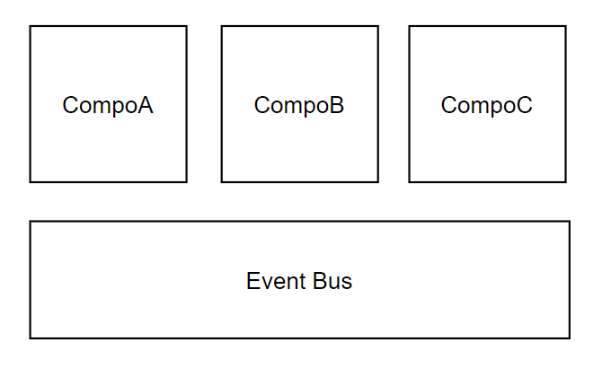
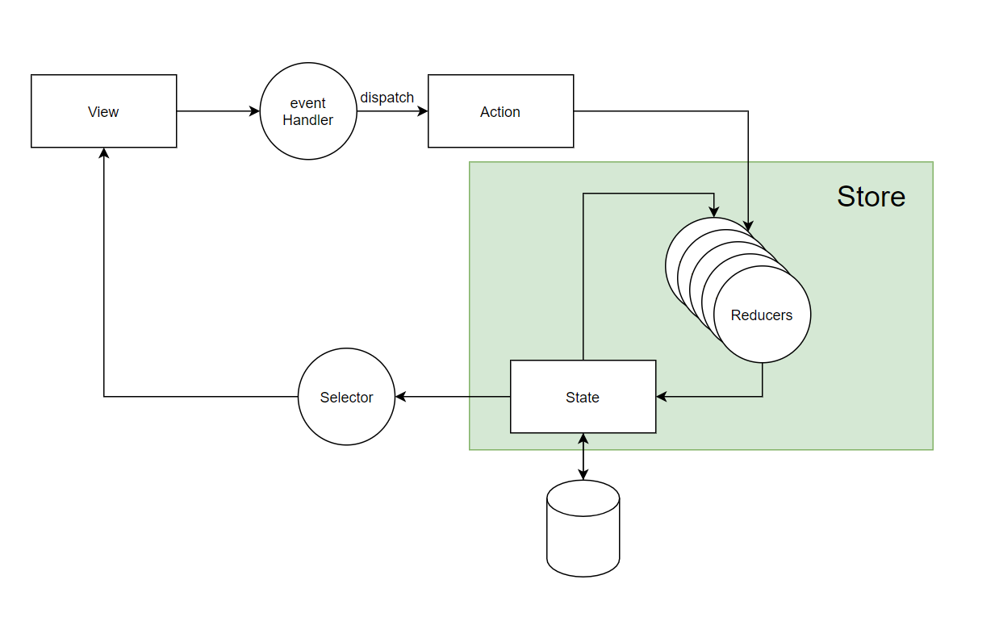
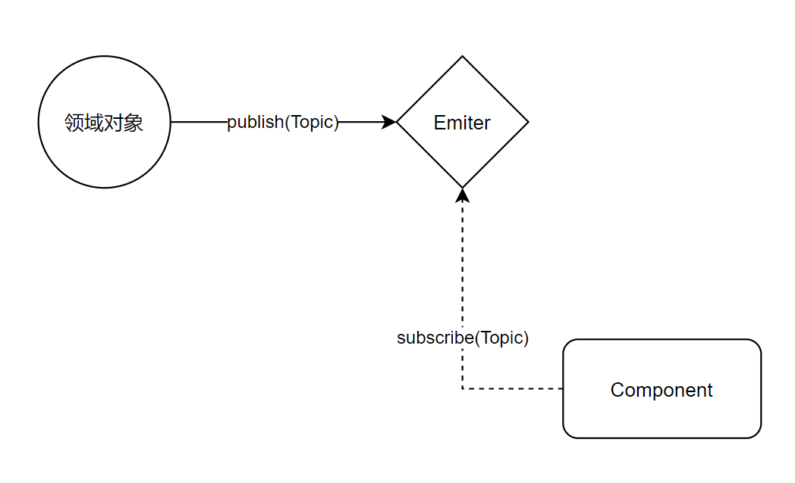

## 组件间通信模型

**选项A： EventBus模型**

组件可以：

- 单播
- 广播

常见案例：

- Iframe中多个APP间通信
- Iframe中多个APP和Frame通信
- Native和HybridApp间postMessage通信

**选项B： 单向数据流+状态机模型**

场景举例：

- UI交互制作
- 全局事件通知（例如加购物车、用户消息等）

### 选项C：领域模型+Emiter

举例：**按照功能划分领域**

- 组件仅仅负责渲染等简单工作，背后的业务逻辑由复杂的领域模型完成
- 例如：
  - Skedo： Assistline
  - Skedo:    Selectable
  - Skedo:    Node

### 领域化模型可以解耦领域对象与渲染层，领域层的可扩展性与抽象能力是非常强大的