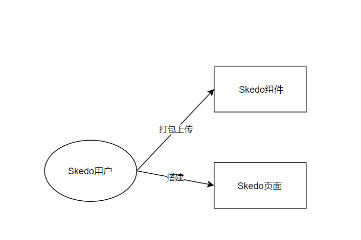
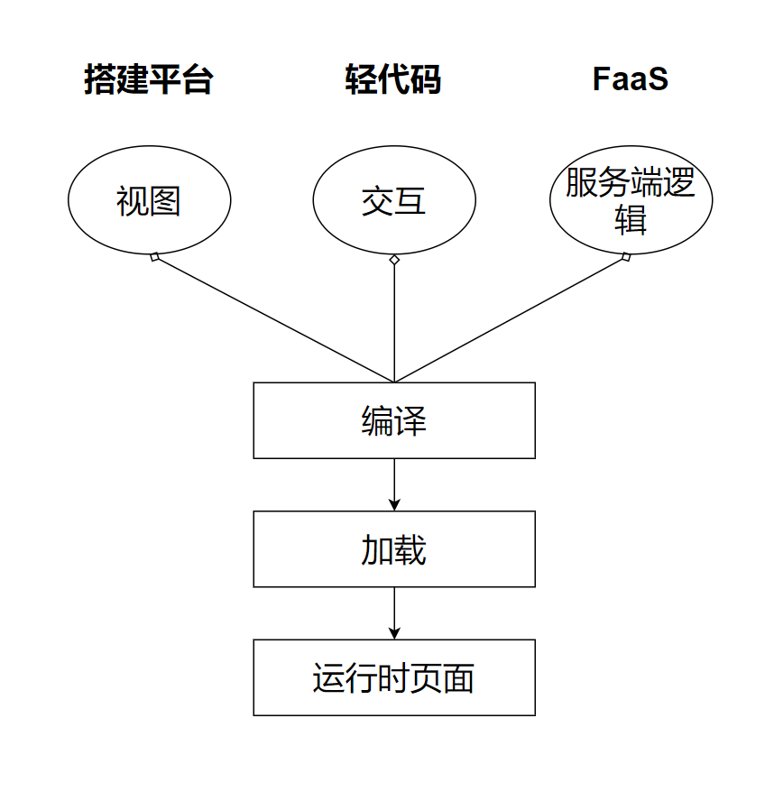
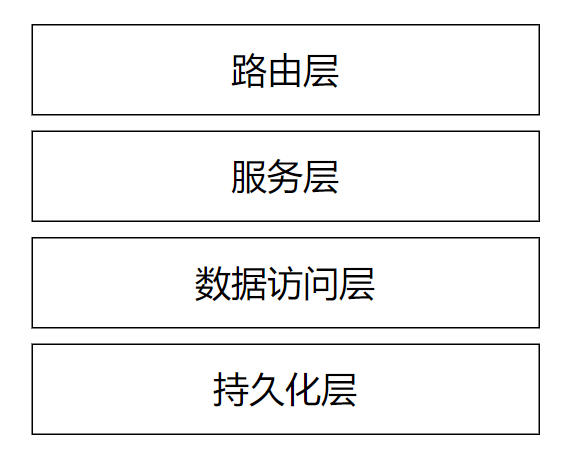
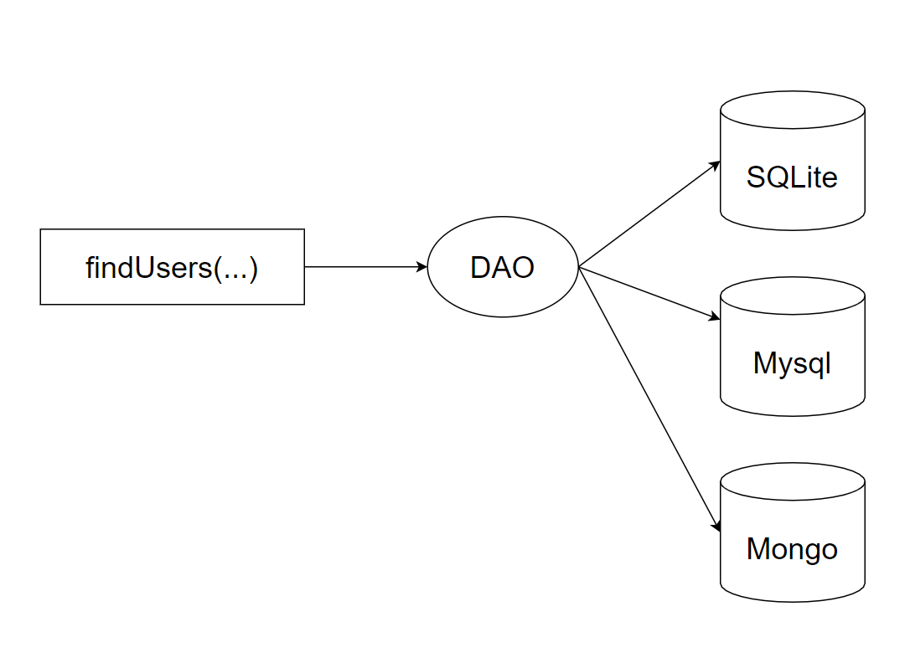
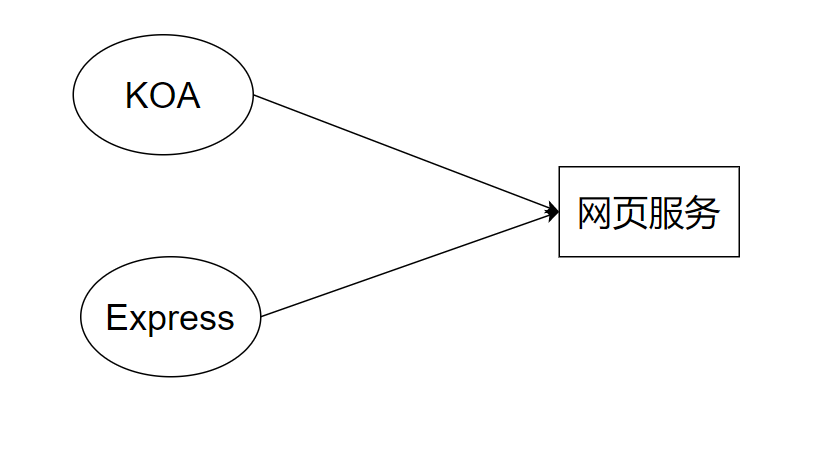
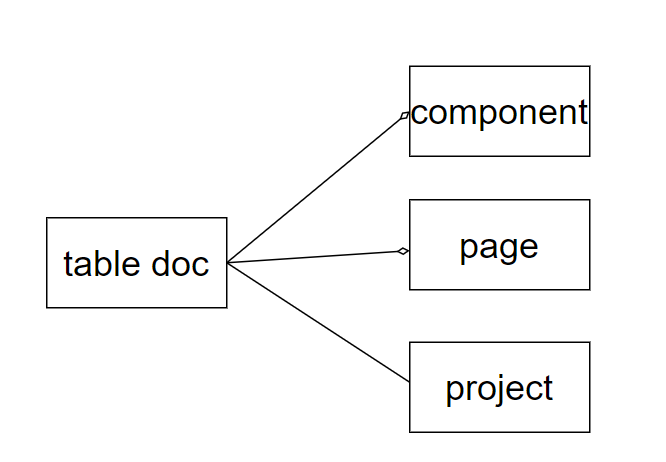

#  Node.js服务端开发入门


## 模型设计


模型设计是进行服务端开发的第一步。 虽然很多服务端工程师上来就思考数据库表，但是优秀的工程师会从模型开始思考。 就好比优秀的前端工程师，拿到需求首先在思考用前端的语言为需求建模，不仅仅考虑当下，而是考虑未来长期的发展。同理，服务端开发也是如此。

结论就是：无论前端还是后端，模型是系统开发的第一步。 

模型解决两个问题：

- 我们要做什么？
- 把要做的事情描述清楚

```tsx
switch(msg.type) {
    case "红包":
        return <RedPacket />
    case "语音":
        return <Audio />
    case ...
}
```


### 模型 !== 对象设计




并不代表

对象有`打包` `搭建` 等方法，也不代表需要设计一个`SkedoUser` 对象。 模型是对业务逻辑的思考。

从上面的模型中我们看到，系统设计需要有：

- 用户
- 页面
- 组件
- 打包上传功能
- 搭建功能

但是这不会影响我们实际如何实现这个系统。


下面是一个更加具体的模型，这个模型探讨了完成一张前端页面过程中各个部分的结构关系。



模型反馈的是系统的本质，描述下同要做什么事情，以及将要做的事情描述清楚。 模型不需要深入细节探讨，比如：

- 数据库表如何设计
- 系统如何分层
- 模块之间的关系
- 对象有哪些方法
- ……

模型也没有具体的绘图标准，以将系统的边界描述清楚为准。

**划重点：**设计模型通常就是对系统能力、需求的全方位表达，通常不会区分前端还是后端。

### 前后端表达的差异


以电商系统为例：用户购买商品时会形成订单——这是需求。模型会进一步将事情描述清楚：

- 用户浏览商品（商品的搜索？）
- 用户编辑购物车（购物车）
- 用户下单形成订单（订单状态机）

从前后端有不同的表达，比如购物车前端是一个组件，后端是一个系统状态。 

什么是状态？ 状态就是数据+改变数据的行为。 按照Restful约定，前端拿到的是购物车状态的表示 （Representation）。

表达虽然有差异，但是都是来源于模型。


## 分层


对设计一个服务端系统，在明确了模型的设计后，会开始考虑分层实现这个系统。分层的目标是将不同类型的问题集中处理。

例如：TCP/IP协议群(又称互联网协议群)

- 应用层
- 传输层（host to host)
- 网络层（router by router)
- 数据链路层
- 物理层

下面是服务端程序的常见分层设计：



## 路由(router)


路由， 就是根据地址找到目的地。 具体的，比如根据URL找到具体的API；根据IP找到具体的网络。

路由层要负责具体的数据收发。注意这是两个工作：

- 接收数据是Request
- 发送数据是Response

路由层在`express` 和`koa` 中都有明确的表达。 

**具体参考课程示例。**


### 持久化


持久化就是将数据永久保存。 当然，没有真正永久的介质，是相对的永久。 

我们将数据写入磁盘，写入数据库等行为都是持久化。 

持久化层负责数据的最终写入，通常由Node.js标准库和第三方库提供支持。

对大前端工程师们来说，常见的持久化引擎有：

- 文件系统
- mysql
- mongodb
- oss


#### 文档存储和表格存储

数据按照表存储形成一行一行的记录（行存储），或者一列一列的数据集合（列存储）——这样是表格存储。表是数据存储的基本逻辑单元。在存储数据前，先要设计表。 

例如mysql, oracle就是表格存储。 

另一种是数据存储成文件，文件可以是各种格式，比如说纯文本、HTML、javascript、JSON等等。这样的存储形式，我们称作文档存储或对象存储。

例如Ali-oss、MongoDB就是对象存储（也叫文档型数据库）。

对于表格类的存储，数据结构式固化的。 例如：

```tsx
ID    姓名      学号       排名
-----------------------------
1     张三      S0         10
2     李四      OK         11
```

创建上面的表，需要提供每个字段的名称和具体的数据类型。

```sql
CREATE TABLE student (
    id int NOT NULL AUTO_INCREMENT,
    name varchar(20),
    sn varchar(10),
    rank int,
    PRIMARY KEY(id)
) 
```


对于文档存储不需要事先定义明确的存储格式，存储是格式是自由的，可以随时变更的。 

**例如Mongo（具体看演示）**


结构化的数据可以用结构化数据查询语言 （SQL）处理，文档存储是非结构化的数据，因此也被称为 No-Sql。


### DAO

 数据访问层(Data Access Layer)向上层提供数据，并隐藏数据持久化细节。 




### 服务


服务层提供服务。


服务独立于路由层，有利于架构的迁移和改进。



####  Remote Procedure Call

服务从某种程度来说，非常像调用一个函数。

例如：

```tsx
import {h} from 'vue'
h("div"...)
```

`h` 是一个渲染函数，同时它也是`vue` 提供的服务。服务的调用者只关心`h` 的使用，而不需要思考`h` 背后的细节。

那么如果`h` 是一个远程方法呢？ 

```tsx
import {createOrder} from '@.../order'

createOrder({
    price : 3.00,
    product : '汽水'    
})
```

像上面这样封装了远程调用的`createOrder` 函数，我们称为`rpc` 方法。 RPC是服务调用的常见形式之一。


####  服务和协议的关系


服务和协议是解耦的，理论上服务可以被多种协议调用：

- HTTP2
- RPC
- WebSocket
- ……

```tsx
fetch("http://.../createOrder", ...)
createOrder({...})
socket.send({...})            
```

上面3中调用方式不同，但是可能对应的是相同的服务。


服务通常可以支持多种调用方式。 

设计要点：

- 路由层将解析后的参数传递给服务层，服务层调用服务程序，并将结果返回路由层。
- 服务层和路由层之间是隔离的，设计时不要共享context。反例：参考@skedo/svc-upload


### 领域模型


领域模型通常在服务端和前端的领域模型设计思路想通。

@skedo中目前没有服务端领域驱动设计的例子，作为前端工程师先以掌握前端领域技巧为**首要目标**。


## 分层架构设计要点


1. 层与层之间是**单向依赖**
2. 并不是每一层都必须存在
   1. 例如：当不需要抽象服务的时候就不使用服务层，对于上传文件、展示html内容功能可以没有服务层
3. 注重每层的独立性
   1. 可以替代其中的一层实现而不影响其他
   2. 每层可以有独立的设计
   3. 注意Context不要在层之间共享


## 数据库表的设计的思考


明确`表` 是为了存储数据用的，不用再`表`上反映数据的关系。



你想怎么存储数据，怎么存储数据方便、操作简单、性能良好就如何设计。数据的状态变化，驱动状态变化的方法通常在**领域对象**中完成。