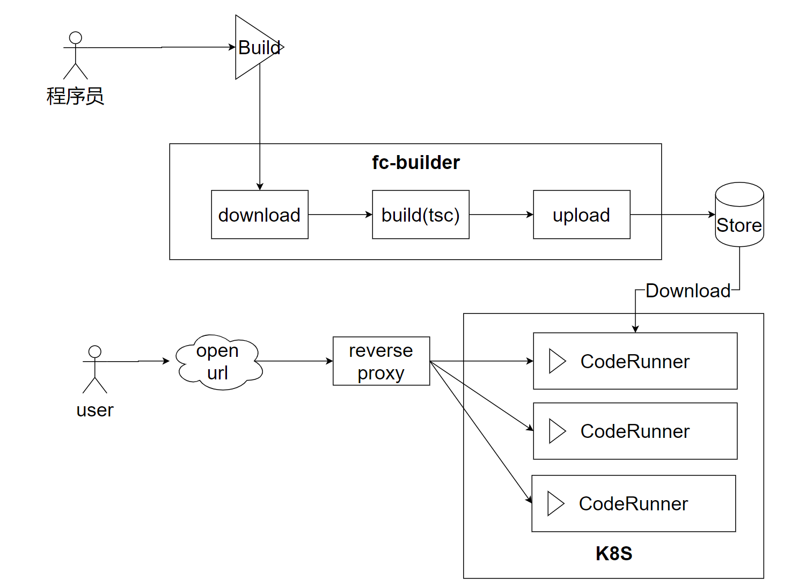

# Skedo FaaS架构分析

## 什么是Serverless? 

无服务器不是没有服务器，而是开发人员不用接触配置服务器。 配置服务器的不是运维工程师，而是自动化的机器。

无服务器时代的特点：

- 谁开发谁运维
- 容器化部署
- 服务编排
- 微服务架构（微前端）
- 函数计算

### 谁开发谁运维

开发工程师负责简化版的运维工作，例如：

- 配置nginx路由
- 配置容器(例如写DockerFile)
- 配置监控
- 通过在线平台上线、部署服务

**划重点：以上是前端Leader应该掌握的内容。**

### 容器化部署

对前端工程师而言，主要是写DockerFile打包容器。

### 配置监控

通过配置指标(metrics) ，例如CPU负载、内存使用、磁盘网络IO等等，也包括一些前端的数据指标：

- 白屏率
- TTI
- ……

形成对系统的监控，发生问题是，比如某个指标剧烈波动，会触发报警（邮件通知、发短信、打电话）。

### 微服务架构（微前端）

让服务（系统）不可再分，前端系统可以做到单独上线。

### 函数计算

用户不再关心容器、CPU资源等等概念，可以直接上线一个函数。这样用户只需要将精力集中在需求的开发，而不需要在关心运维。

相当于用户完全不需要运维知识，就可以上线应用。

## @skedo函数计算的架构

### FC Builder

@skedo的每个上线的函数，是本质上是一个服务，因此也叫做函数即服务(Function as a service, FaaS)。 每个服务是一个项目，项目部署成功后，对应一个路由。 

从文件系统看，每个项目是一个单独的目录，经过打包后，整个项目会被保存到云端。`FC-Buidler` 模块负责编译、打包、上传。

### Code Runner

Code Runner 负责执行程序，提供运行时环境。

### ReverseProxy

反向代理模块负责提供反向代理，以及负载均衡等能力。

