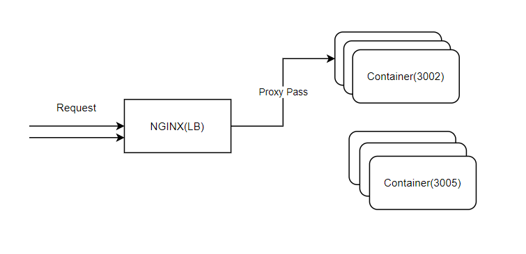
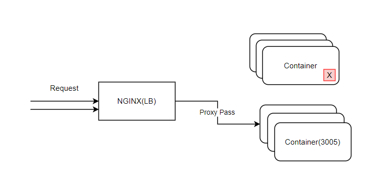

# Skedo项目的发布(上)


## ES部署


1. 安装Docker 

   1. Linux下安装Docker

2. push docker image

   1. 上传镜像
   2. 利用aliyun-ci工具链从git pull镜像
   3. git的webhooks

3. pull docker image

   1. 手动更新镜像
   2. 脚本更新镜像
   3. 自动更新镜像

4. SSL证书

5. CDN

   1. 回源
   2. OSS

6. 多应用部署：区分不同的tag

   1. 区分Tag
   2. docker-compose

7. mysql的配置（阿里云）

   


## 关于YML配置

定义yml

```yaml
app-name : skedo-ui
app-type : node
entry : es/index.js
```

- app-type Docker镜像类型
- entry 启动文件

## 关于服务的热替代


当前状态



先构启动新的容器，不删除（停止)旧的容器。新容器启动好之后，再去切换nginx的配置。


最后清除旧容器：

