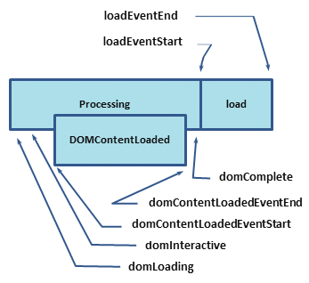

## 关键渲染路径


项目轻量的时候问题不大，但是当项目变大，变复杂的时候，一个页面加载变慢的时候，就可以采取手动去控制组件渲染顺序的方式来保证一部分关键渲染路径是优先渲染的


## HTML的解析过程


网络进程接收到响应头之后，会根据响应头中的 content-type 字段来判断文件的类型，比如 content-type 的值是“text/html”，那么浏览器就会判断这是一个 HTML 类型的文件，然后为该请求选择或者创建一个渲染进程，渲染进程准备好之后，网络进程和渲染进程之间会建立一个共享数据的管道，网络进程接收到数据后就往这个管道里面放，而渲染进程则从管道的另外一端不断地读取数据，并同时将读取的数据“喂”给 HTML 解析器。你可以把这个管道想象成一个“水管”，网络进程接收到的字节流像水一样倒进这个“水管”，而“水管”的另外一端是渲染进程的 HTML 解析器，它会动态接收字节流，并将其解析为 DOM。如下图

> 简单说：解析html和解析css同步进行，生成dom树和css树之后，合并成render树，再进行布局计算，绘制，显示


页面渲染的大致过程为，先下载解析HTML并建立DOM树，再解析css绘制渲染树。前者搭建页面结构，后者增添页面样式。而在建立DOM树的过程就会遇到诸如img、外联css和script标签，此时就要加载外部资源了。**加载资源是由单独的下载线程进行异步加载的，浏览器会并行加载**，不过具体并行最大数量是有一定限制的，不同浏览器可能不一样。也就是下文中说的**chrome做了预解析操作**


### dom的解析


解析 HTML ，需要通过分词器先将字节流转换为一个个 Token，分为 Tag Token 和文本 Toke

通过分词器产生的新 Token 就这样不停地压栈和出栈，整个解析过程就这样一直持续下去，直到分词器将所有字节流分词完成。

### CSS的解析

```css
body { font-size: 16px }
p { font-weight: bold }
span { color: red }
p span { display: none }
img { float: right }
```


### 渲染树


#### 渲染步骤
1. 扫描html生成html树，parseHTML -> DOM Tree
2. 扫描css省成css树，parse CSS -> CSSOM - 如果css文件很大，这里可能造成阻塞
  > 上面第一步和第二步，在没有js的理想情况下，是并行解析的
3. 合并html树和css树，combine -> render Tree
  > render tree 是根据dom和css生成的用来计算渲染的树，他跟dom树不是一一对应的，应当说他跟屏幕显示UI是对应的
4. layout : 布局，计算每个节点的盒子模型
  > 开始计算布局，计算盒子模型的大小
5. 绘制（一个像素一个像素的绘制）
  > 渲染数据(像素数据)放进FrameBuffer（内存）做来作为显卡渲染的下一帧


以上步骤是一个渐进的过程，为了提高用户体验，渲染引擎试图尽可能快的把结果显示给最终用户。它不会等到所有HTML都被解析完才创建并布局渲染树，它会在从网络层获取文档内容的同时把已经接收到的局部内容先展示出来。

###  回流与重绘
回流(reflow)：当浏览器发现某个部分发生了点变化影响了布局，需要倒回去重新渲染。reflow 会从 `<html>`这个 root frame 开始递归往下，依次计算所有的结点几何尺寸和位置。reflow 几乎是无法避免的。现在界面上流行的一些效果，比如树状目录的折叠、展开（实质上是元素的显示与隐藏）等，都将引起浏览器的 reflow。鼠标滑过、点击……只要这些行为引起了页面上某些元素的占位面积、定位方式、边距等属性的变化，都会引起它内部、周围甚至整个页面的重新渲染。通常我们都无法预估浏览器到底会 reflow 哪一部分的代码，它们都彼此相互影响着。

重绘(repaint)：改变某个元素的背景色、文字颜色、边框颜色等等不影响它周围或内部布局的属性时，屏幕的一部分要重画，但是元素的几何尺寸没有变。

每次Reflow，Repaint后浏览器还需要合并渲染层并输出到屏幕上。所有的这些都会是动画卡顿的原因。Reflow 的成本比 Repaint 的成本高得多的多。一个结点的 Reflow 很有可能导致子结点，甚至父点以及同级结点的 Reflow 。在一些高性能的电脑上也许还没什么，但是如果 Reflow 发生在手机上，那么这个过程是延慢加载和耗电的。可以在csstrigger上查找某个css属性会触发什么事件。

### reflow与repaint的时机：

display:none 会触发 reflow，而 visibility:hidden 只会触发 repaint，因为没有发生位置变化。
有些情况下，比如修改了元素的样式，浏览器并不会立刻 reflow 或 repaint 一次，而是会把这样的操作积攒一批，然后做一次 reflow，这又叫异步 reflow 或增量异步 reflow。
有些情况下，比如 resize 窗口，改变了页面默认的字体等。对于这些操作，浏览器会马上进行 reflow。

### CSS的渲染阻塞

```html
<!-- 普通link是会阻塞渲染的 -->
<link href="style.css" rel="stylesheet">
<!-- media会指定样式的触发时机，不会阻塞渲染 -->
<link href="print.css" rel="stylesheet" media="print">
<link href="other.css" rel="stylesheet" media="(min-width: 40em)">
```

### 关键路径渲染和阻塞渲染

在浏览器拿到HTML、CSS、JS等外部资源到渲染出页面的过程，有一个重要的概念关键渲染路径（Critical Rendering Path）。例如为了保障首屏内容的最快速显示，通常会提到一个**渐进式页面渲染**，但是为了渐进式页面渲染，就需要做资源的拆分，那么以什么粒度拆分、要不要拆分，不同页面、不同场景策略不同。具体方案的确定既要考虑体验问题，也要考虑工程问题。了解原理可以让我们更好的优化关键渲染路径，从而获得更好的用户体验。

现代浏览器总是并行加载资源，例如，当 HTML 解析器（HTML Parser）被脚本阻塞时，解析器虽然会停止构建 DOM，但仍会识别该脚本后面的资源，并进行预加载。

同时，由于下面两点：

* CSS 被视为渲染 阻塞资源 (包括JS) ，这意味着浏览器将不会渲染任何已处理的内容，直至 CSSOM 构建完毕，才会进行下一阶段。
* JavaScript 被认为是解释器阻塞资源，HTML解析会被JS阻塞，它不仅可以读取和修改 DOM 属性，还可以读取和修改 CSSOM 属性。

存在阻塞的 CSS 资源时，浏览器会延迟 JavaScript 的执行和 DOM 构建。另外：

* 当浏览器遇到一个 script 标记时，DOM 构建将暂停，直至脚本完成执行。
* JavaScript 可以查询和修改 DOM 与 CSSOM。
* CSSOM 构建时，JavaScript 执行将暂停，直至 CSSOM 就绪。

所以，script 标签的位置很重要。实际使用时，可以遵循下面两个原则：

* CSS 优先：引入顺序上，CSS 资源先于 JavaScript 资源。
* JavaScript 应尽量少影响 DOM 的构建。


### css具体如何阻塞资源的

```html
  <style> p { color: red; }</style>
  <link rel="stylesheet" href="index.css">
```
这样的 link 标签（无论是否 inline）会被视为阻塞渲染的资源，浏览器会优先处理这些 CSS 资源，直至 CSSOM 构建完毕。

渲染树（Render-Tree）的关键渲染路径中，要求同时具有 DOM 和 CSSOM，之后才会构建渲染树。即，HTML 和 CSS 都是阻塞渲染的资源。HTML 显然是必需的，因为包括我们希望显示的文本在内的内容，都在 DOM 中存放，那么可以从 CSS 上想办法。

最容易想到的当然是精简 CSS 并尽快提供它。除此之外，还可以用媒体类型（media type）和媒体查询（media query）来解除对渲染的阻塞。

```html
<link href="index.css" rel="stylesheet">
<link href="print.css" rel="stylesheet" media="print">
<link href="other.css" rel="stylesheet" media="(min-width: 30em) and (orientation: landscape)">
```

第一个资源会加载并阻塞。第二个资源设置了媒体类型，会加载但不会阻塞，print 声明只在打印网页时使用。第三个资源提供了媒体查询，会在符合条件时阻塞渲染。

关于CSS加载的阻塞情况：

* css加载不会阻塞DOM树的解析
* css加载会阻塞DOM树的渲染
* css加载会阻塞后面js语句的执行

没有js的理想情况下，html与css会并行解析，分别生成DOM与CSSOM，然后合并成Render Tree，进入Rendering Pipeline；但如果有js，css加载会阻塞后面js语句的执行，而（同步）js脚本执行会阻塞其后的DOM解析（所以通常会把css放在头部，js放在body尾）

### JavaScript具体如何阻塞资源的

JavaScript 的情况比 CSS 要更复杂一些。如果没有 defer 或 async，浏览器会立即加载并执行指定的脚本，“立即”指的是在渲染该 script 标签之下的HTML元素之前，也就是说不等待后续载入的HTML元素，读到就加载并执行。观察下面的代码：

```html
<p>Do not go gentle into that good night,</p>
<script>console.log("inline1")</script>

<p>Old age should burn and rave at close of day;</p>
<script src="app.js"></script>

<p>Rage, rage against the dying of the light.</p>
<script src="app.js"></script>

<p>Old age should burn and rave at close of day;</p>
<script>console.log("inline2")</script>

<p>Rage, rage against the dying of the light.</p>
```

这段代码的解析过程是，script标签之前，HTML 解析器依次解析html，但是解析到script标签时，渲染引擎判断这是一段脚本，此时 HTML 解析器就会暂停 DOM 的解析，因为接下来的 JavaScript 可能要修改当前已经生成的 DOM 结构，这时候 HTML 解析器暂停工作，JavaScript 引擎介入，并执行 script 标签中的这段脚本


解析过程中无论遇到的JavaScript是内联还是外联，只要浏览器遇到 script 标记，唤醒 JavaScript解析器，就会进行暂停 (blocked)浏览器解析HTML，并**等到 CSSOM 构建完毕**，才去执行js脚本。因为脚本中可能会操作DOM元素，而如果在加载执行脚本的时候DOM元素并没有被解析，脚本就会因为DOM元素没有生成取不到响应元素，所以实际工程中，我们常常将资源放到文档底部。

> 对于外联js，chrome做了预解析操作，当渲染引擎收到字节流之后，会开启一个预解析线程，用来分析 HTML 文件中包含的 JavaScript、CSS 等相关文件，解析到相关文件之后，预解析线程会提前下载这些文件。

### 改变脚本加载次序defer与async

**async**
* 异步加载，加载完成后尽快执行，会改变script脚本的执行顺序
* 加载时不阻塞html解析，但执行时依然会**阻塞html解析**
* 一定会在**window.onload事件前**执行，也就是说，他还会阻塞onload事件

**defer** 
* 异步加载，加载完成后会在**html解析完成之后**、**DOMContentLoaded事件触发之前**执行
* defer 不会改变 script脚本的执行顺序

> **async 与 defer 属性对于 inline-script 都是无效的**

> document.createElement创建的脚本，默认是异步（async）的

HTML页面的生命周期有以下以下几个重要事件：

* DOMContentLoaded ：浏览器已经完全加载了 HTML，DOM 树已经构建完毕，但是像是和样式表等外部资源可能并没有下载完毕。
* load：浏览器已经加载了所有的资源（图像，样式表等）。
* beforeunload/unload ：当用户离开页面的时候触发。
* readyState ：描述document的loading状态，其实是对页面加载事件的细化，比如loading表示DOMContentLoaded还没有触发，我们在这个时候注册DOMContentLoaded事件是有效的。interactive后会触发DOMContentLoaded，comoplete之后会触发load事件。readyState的改变会触发readystatechange事件。
  * loading 加载：document仍在加载。
  * interactive 互动 ： 文档已经完成加载，文档已被解析，但是诸如图像，样式表和框架之类的子资源仍在加载。
  * complete ：文档和所有子资源已完成加载。状态表示 load 事件即将被触发。

## 优化的思路

  * 动画实现使用requestAnimationFrame

  * 长耗时的JS代码放到Web Workers中执行

  * 拆分操作DOM元素的任务，分别在多个frame完成
    * 经典操作：用setTimeout来分隔创建一万个dom任务，此处还利用到了宏任务的知识

  * 减少dom开销，尤其是减少引起DOM结构改变的操作
    * 现在都是框架了，但是也要注意减少直接操作dom,尽量交给框架操作

  * css减少样式复杂度，
    * react中使用module.scss,就是一种优化方式，打完完成后的样式选择比全局的样式选择器简单很多

  * 用flex布局，flex兼容到ie10, flex布局的性能比浮动性能好5倍左右

  * 使用框架尽量把组件重绘控制在局部组件内，具体就是避免子组件不必要的渲染

  * css3动画是可以开启GPU加速的

  * 对部分事件的防抖节流用起来

  * css放在head中，js放到body底部

  * 关键资源数量 - 加载关键资源，不需要加载的组件资源不进行加载
    * react的lazy懒加载，webpack的Dynamic Import(动态导入)都是
    * 图片的懒加载

  * 关键路径长度 - 优化组件加载顺序，优先显示权重高的组件，（页面复杂加载慢的情况下使用）
  
  * 关键路径大小（bytes) - 各种资源的压缩，主要资源优先加载
  
  * 渲染速度 - css大小，js执行时间优化

  * 预加载技术
    * webpack的预加载
    * 图片的预加载

  * Service worker


## 排查优化点、衡量网站的性能的方法

  ChromeDevTools的JavaScript Profile 分析js性能

  ChromeDevTools的Paint 分析每帧渲染

  ChromeDevTools的performance 分析整站性能

  react的profile 分析react性能 - 这个一般可以考虑过滤10ms以下的渲染，留6ms给其他任务

  LightHouse 报告

  web-vitals npm包，性能监控

  Bundle Analysis bundle分析工具
  - webpack-chart
  - webpack-visualizer
  - webpack-bundler-analyzer
  - webpack bundle optimie helper
  - bundle-stats

  `window.performance.timing` API，如下图
  

  * `performance.getEntriesByType("navigation")`;获取分析timing时间

  * `performance.getEntriesByType("resource")`;获取分析资源加载时间

  **微优化可以考虑少做，没有必要，要知道：最优解不一定是性价比最高的解**

## 补充&概念

  * 第一脚本：页面第一个外联脚本

  * js执行引擎和页面渲染是由不同的线程来执行，但这两者是互斥的，也就是说js执行过程是无法构建DOM和渲染页面的。

  * Chrome会渲染局部CSSOM和DOM。整个特别重要，理解这个概念，才能理解为什么不需要DOMContentLoaded，就可以进行首屏渲染了，不然总是会误解，首屏渲染必须在DOMContentLoaded之后

  * First Paint和DOMContentLoaded、load事件的触发没有绝对的关系，FP可能在他们之前，也可能在他们之后，这取决于影响他们触发的因素的各自时间（FP：第一脚本前CSSOM和DOM的构建速度；DOMContentLoaded：HTML文档自身以及HTML文档中所有JS、CSS的加载速度；load：图片、音频、视频、字体的加载速度）

  * 第一脚本前的CSS如果还会去加载字体文件，那么即使CSSOM和DOM构建完成触发FP，页面内容也会是空白，只有等到字体文件下载完成才会出现内容（这也是我们在打开一个加载了谷歌字体的网站会白屏很长时间的原因）。

  * 默认情况下，CSS外链之间是谁先加载完成谁先解析，但是JS外链之间即使先加载完成，也得按顺序执行

  * RRDL：
    * R：send Request，发送资源请求
    * R：receive Response，接收到服务端响应
    * D：receive Data，开始接受服务端数据(一个资源可能执行多次)
    * L：finish Loading，完成资源下载
    * 浏览器在RRDL的时候，在D（Receive data）这个步骤可能执行多次。

  * TTFB:Time To First Byte，第一个字节返回的时间，这个是对应send Request到receive Response这段时间
  
  * FP: first print 首次渲染
  
  * FCP: First Content Paint 第一帧绘制时间，第一次用户看到东西的时间，谷歌标准是1.8秒为good,3秒以上不能接受-**每晚一秒响应，损失7%用户**
  

  * LCP：Largest contentful paint 最大的文件加载时间，google标准是2.5秒为good
  

  * FID:First input delay ，用户使用输入框的响应时间，100ms是能接受的范围
     

  * CLS：Cumulative layout shift 累积布局偏移，页面上的某些内容突然发生改变，文本在毫无预警的情况下移位，页面内容的意外移动通常是由于异步加载资源，或者动态添加 DOM 元素到页面现有内容的上方。网站应该努力将 CLS 分数控制在0.1 或以下

  * TTI：Time to interactive 交互时间，TTI 衡量一个页面需要多长时间才能完全交互。在以下情况下，页面被认为是完全交互的：
    * 页面显示有用的内容，这是由First Contentful Paint衡量的，
    * 为大多数可见的页面元素注册了事件处理程序，并且
    * 该页面在 50 毫秒内响应用户交互。

  * TBT:Total Blocking Time TBT 衡量页面被阻止响应用户输入（例如鼠标点击、屏幕点击或键盘按下）的总时间,总和是通过在First Contentful Paint和Time to Interactive之间添加所有长任务的阻塞部分来计算的。任何执行时间超过 50 毫秒的任务都是长任务。50 毫秒后的时间量是阻塞部分。例如，如果 Lighthouse 检测到一个 70 毫秒长的任务，则阻塞部分将为 20 毫秒。200ms以下是good

  * 浏览器会给HTML中的资源文件进行等级分类（Hightest/High/Meduim/Low/Lowest）,一般HTML文档自身、head中的CSS都是Hightest，head中JS一般是High，而图片一般是Low，而设置了async/defer的脚本一般是Low，gif图片一般是Lowest。

## 整体大纲
分析关键渲染路径进行优化
  * html的解析过程
  * css的解析过程
  * 渲染树
  * css的渲染阻塞
  * js的执行时机
  * 衡量网站性能
  * 优化关键渲染路径
  * 动态加载组件
  * js的拆分和压缩
  * 预加载
  * bundle 分析器