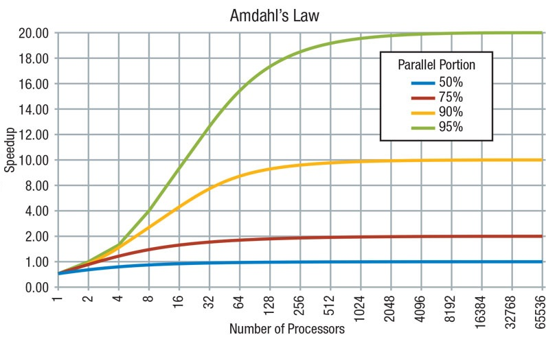
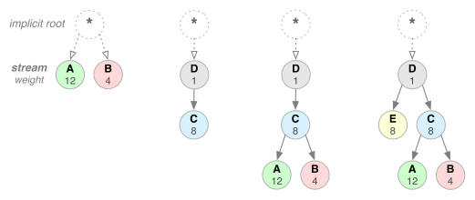
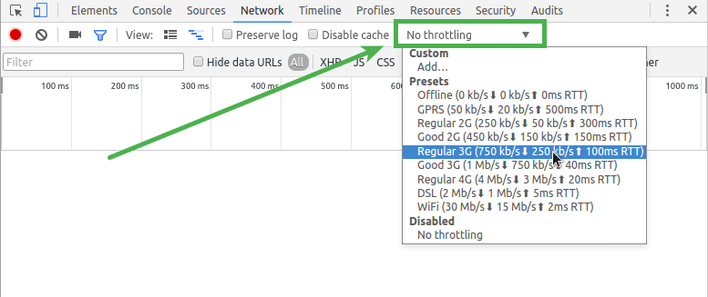

# 前端性能优化

## 存储分级策略

GHz 就是 千兆赫兹 、十亿赫兹 就是 CPU的工作频率.主频也叫时钟频率，通俗点讲就是处理速度

cpu的实际频率就是主频乘以核的数值,再乘以0.8左右.如4核1.5ghz的cpu的实际能力就是4x1.5x0.8=4.8(ghz)

cpu通常每2-4个周期完成一次加减计算，4-8个周期完成一次乘除计算

- L1-L2 Cache - 不到一纳秒 
- L3 Cache  - 纳秒 、比L1-L2慢一个量级 
- 内存 - 纳秒 、比L3慢一个量级
- SSD - 微秒、部分新款因为离CPU近，所以也可以达到纳秒级
- HDD - 毫秒 

**cpu执行一条指令的过程**
  * 取指令 - 将一条指令从内存中取到指令寄存器的过程。
  * 指令译码 - 指令译码器按照预定的指令格式，对取回的指令进行拆分和解释，识别区分出不同的指令类别以及各种获取操作数的方法
  * 执行指令 - 完成指令所规定的各种操作，具体实现指令的功能。为此，CPU的不同部分被连接起来，以执行所需的操作
  * 访存取数 - 根据指令地址码，得到操作数在主存中的地址，并从主存中读取该操作数用于运算。
  * 结果写回 - 把执行指令阶段的运行结果数据写回到某种存储形式

### 存储器分级

存储器速度越快，离CPU越近，发热就会越高、造价也越高，当然体积也会越小。
我们将使用频率最高的数据，用最快的存储缓存起来；随着数据使用频率降低，可以使用更廉价的存储。

缓存的大小和速度示例：

- Cache大小（不同型号，有部分差异）
  - L1 缓存`kb-1MB`大小的数据，速度可达`700GB/s`
  - L2 缓存`个位MB`大小
  - L3 缓存`十位MB`大小的数据，部分可达60MB
- 内存 缓存`GB`大小的数据，速度可达`10GB/s`
- SSD：速度可达`2GB / S`


**举例**

* 100MB数据的拷贝在磁盘中相对较慢，但是在内存中是很快的

* 亿级的循环计算，在缓存中是秒级的运算 - 
  > 1kb=10^3 byte  
  > 1M=10^6 byte  
  > 1G=10^9 byte  
  > 1G=10亿，所以，CPU主频达到3GHz, 就是每秒三十个亿个周期，每几个（通常是4、8、12）周期完成一次计算，1亿的运算就是秒级


**划重点：计算机的性能比你想像的更好。** 

光电信号传输是光速：3*10^8米/秒，3亿米每秒...丫每秒还不到一G。1G是10^9

### 阿姆达尔定律



分析：所有的任务会分成**可以并行**和**不可以并行**的部分。
可以并行的部分可以无限优化，趋向于0； 
不可以并行的部分则会稳定占用计算资源。 

> 从图上可以看出，某些不适合并发的任务，使用很多cpu去执行，也并不会对任务执行有好的优化

阿姆达定律对前端优化的意义是什么？—— 它回答了我们对程序优化的理论极限。

### 视觉上的~

- 视觉残留约为0.05~0.2秒
- 显示器的刷新频率目前主要是60Hz 70Hz 90Hz和120Hz

 - 24帧就可以看到流畅的动画，电影就是用的24帧
 - 显示器主要是以60帧（16.6ms）的频率刷新，以为大于60帧的刷新，人眼已经不需要那么细致了，60帧是多数人眼分辨的最大值
 - 电影24帧刷新是图片一张张切换 - 残影就是一张切换下一张的过程
 - 显示器60帧刷新是页面一帧帧渲染 - 没有残影，因为一帧一帧直接渲染的

### 延迟、吞吐量和丢包率

**延迟**是数据在介质中传输用的时间，
**吞吐量**是单位时间内完成的数据传输量，
**丢包率**是传输过程中发生错误封包的概率。

延迟不影响吞吐量，但是延迟影响数据传输时间，例如游戏如果延迟高了，用户跟网络其他用户数据不能及时同步，就没法正常玩了


对一次RTT（Round Trip Time，一个来回)为1ms的HTTP请求，如果要传输1M的数据，使用的缓冲区（每次传输数据）为1kb，需要发送一千次，
如果缓冲区更大，发送次数就可以更小，但是缓存区在底层有限制。tcp协议还有拥塞控制，可以根据当时情况动态修改缓冲区大小，

web服务器可以设置缓冲区大小，通常使用默认值即可

丢包率始终存在，是一个必然行为

> 不可能三角，相同成本下，做到延迟很低 吞吐量很大 丢包率很低


### 用户的心理

当用户使用某个APP不是刚需的时候

  - 响应性（用户一次行为的响应时间）
  - 美观程度
  - 流畅程度
  ……

响应速度每慢一秒用户流失度+7%

用户心理会影响用户的活跃和留存。

## Google 产品的4个维度

- Fast（快速响应用户）
  - 关键渲染路径
  - 渲染效率
- Integrated（体验的集成）
  - 快速找到应用
  - 集成熟悉的体验（微信支付）
- Reliable（应用可靠）
  - 断网不消失
  - 可用性
- Engaging（有趣）


#### Webpack的 Dynamic Import

Webpack 动态加载 - webpack提供了一个import函数，这个函数打包时候单独把组件打包成一个js文件，然后在运行时动态加载
```tsx
import('react-dom')
  .then(ReactDOM => {
      ReactDOM.render(...)
  })
```

Loadable - **异步加载的插件，这里就可以用来把非关键渲染路径的组件异步渲染**，react.lazy 干的也是这件事，动态import

```jsx
import loadable from '@loadable/component'

const OtherComponent = loadable(() => import('./OtherComponent'))

function MyComponent() {
  return (
    <div>
      <OtherComponent />
    </div>
  )
}
```

#### JS的拆分和压缩

公共依赖拆分能够实现一部分代码的预加载
- SplitChunkPlugin（拆分公共依赖）
  
- TerserWebpackPlugin（JS压缩）

#### 预加载技术

渲染路径 ： HomePage -> LoginButton -> LoginModal

使用webpack的预加载技术，提前加载LoginModal.js
```tsx
import(/* webpackPrefetch: true */ './path/to/LoginModal.js')
```
图片的预加载，可以使用fetch或者隐藏图片的src去提前加载一部分数据

**写一个babel插件，去生成预加载代码！把优化做到工程化**

#### Bundle Analysis

- webpack-chart
- webpack-visualizer
- webpack-bundler-analyzer
- webpack bundle optimie helper
- bundle-stats


## 网络的优化(HTTP2.0 )

http2.0 的出现，导致很多原本http1的优化技巧变的无用，例如雪碧图就变成了无用的优化

2.0重新封装了headers,做了一个头部压缩算法，不在传首部字段，而是用词典替代。比如原本的 method:get 优化成 11(假如，不是真的),这样可以节约网络传输的资源

2.0的发送请求变成了并行的请求，不再像1.1一样串行依次发送

2.0比1快
### 二进制层


### 连接模型的优化（多路复用）


为什么不用多线程发送：

- 连接的成本，参考HTTPS握手 - https建立连接的成本很高
- 头部压缩 - 2.0每次发送都是压缩算法的头部
- 队头阻塞的问题 - 2.0是并行发送的，不会出现阻塞问题

### 优先级控制



### Server PUSH


### 头部压缩


### 对监控指标的思考


#### 监控Timing

- Navigation Timing
- Resource Timing

```tsx
// Get Navigation Timing entries:
performance.getEntriesByType("navigation");

// Get Resource Timing entries:
performance.getEntriesByType("resource");
```

#### 定义指标

- First Content Paint

  

  ```tsx
  import {getFCP} from 'web-vitals';
  
  // Measure and log FCP as soon as it's available.
  getFCP(console.log);
  ```

  

- Largest contentful paint 

  

  ```tsx
  new PerformanceObserver((entryList) => {
    for (const entry of entryList.getEntries()) {
      console.log('LCP candidate:', entry.startTime, entry);
    }
  }).observe({type: 'largest-contentful-paint', buffered: true});
  ```

  

- First input delay

  

  

- Time to interactive

  

- Cumulative layout shift

```tsx
new PerformanceObserver((entryList) => {
  for (const entry of entryList.getEntries()) {
    // Only count layout shifts without recent user input.
    if (!entry.hadRecentInput) {
      const firstSessionEntry = sessionEntries[0];
      const lastSessionEntry = sessionEntries[sessionEntries.length - 1];

      // If the entry occurred less than 1 second after the previous entry and
      // less than 5 seconds after the first entry in the session, include the
      // entry in the current session. Otherwise, start a new session.
      if (sessionValue &&
          entry.startTime - lastSessionEntry.startTime < 1000 &&
          entry.startTime - firstSessionEntry.startTime < 5000) {
        sessionValue += entry.value;
        sessionEntries.push(entry);
      } else {
        sessionValue = entry.value;
        sessionEntries = [entry];
      }

      // If the current session value is larger than the current CLS value,
      // update CLS and the entries contributing to it.
      if (sessionValue > clsValue) {
        clsValue = sessionValue;
        clsEntries = sessionEntries;

        // Log the updated value (and its entries) to the console.
        console.log('CLS:', clsValue, clsEntries)
      }
    }
  }
}).observe({type: 'layout-shift', buffered: true})
```


## 模拟实战环境





## 其他优化手法总结


### Server PUSH


**离线包技术：**将静态资源打包，利用APP不忙的时候为用户下载。

- APP加载离线包
- 解压到本地
- webview打开 URL 
- 触发离线包加载
- 从内存中读取 
  - fallback到线上地址


**HTTP2.0 Server PUSH**


### 用Service worker异步加载资源


https://developer.mozilla.org/zh-CN/docs/Web/API/Service_Worker_API/Using_Service_Workers


###  请求的合并和剪裁


- 客户端
  - 将多个请求合并发送到Node服务（或其他）
- Node中间层
  - 组装多个请求并剪裁返回

上述能力属于 API网关的一部分。 


