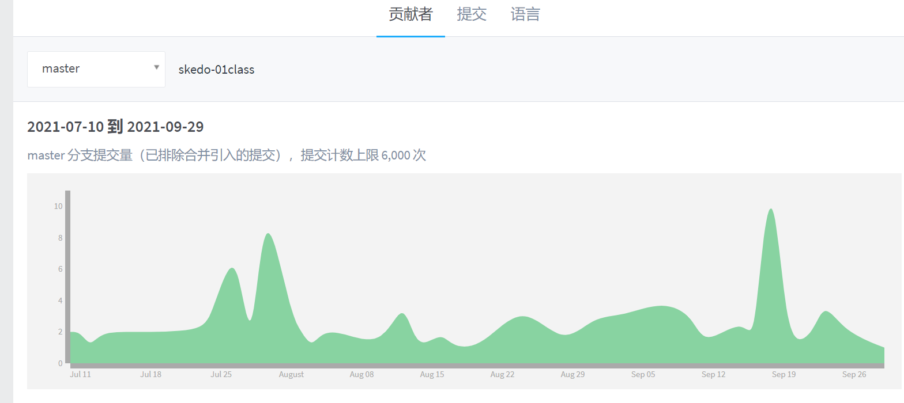
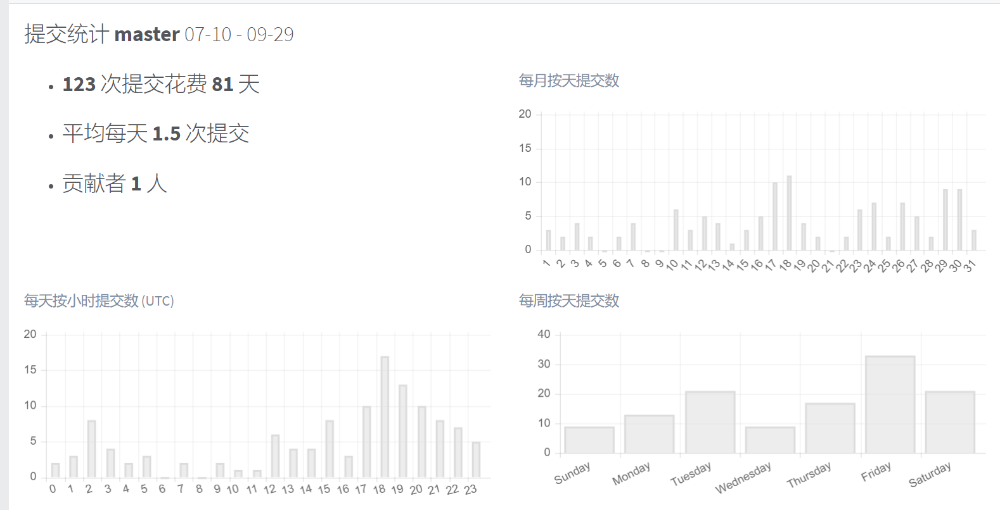
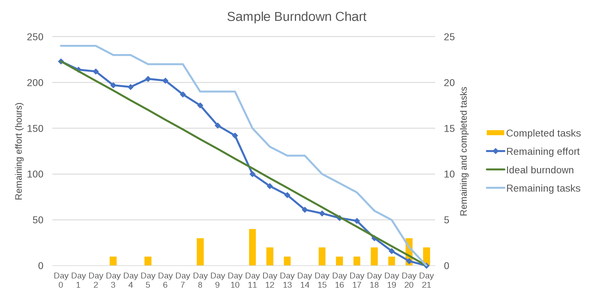
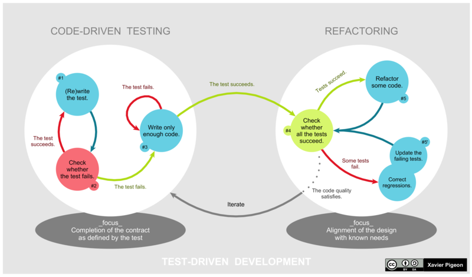

# 用数据说话

数据代表行为、代表工作成果。
向上级汇报成果，数据更有表现力。
对下级评估工作，数据更有说服力，便于沟通管理

**你发现工程师小张最近消极怠工， 你该怎么做？**

Z. 通过职级施压，质疑对方工作态度。-低效且有矛盾

A. 从考勤系统拉取他上下班打卡时间，和其他人比较。-弹性打卡，且加班违法

B. 从gitlab中观察小张近期提交代码情况。-有效数据

C. 从Jira（工程效率平台）中拉取小张的平均问题解决时间。-有效数据

D. 在Code Review中针对小张。 -因人而异

**所以：要用数据建立一套规则，用数据说话**

## Why Data？

- 分析数据是为了更好的决策（商业智能）
- 分析数据是为了提高研发团队的效率（项目管理）
- 分析数据是为了证明价值（研发团队）
- ……

我们需要数据：

- 说服别人
- 证明自己
- 帮助自己决策
- ……

数据不是万能的，但是**没有数据，就没有话语权！**

## 证明研发效率的提升

- Task拆分成1人日
- 对比几个月的燃尽图，观察蓝色线段的变化趋势。 

**使用燃尽图，是因为leader需要知道团队的开发周期中哪些点是需要提效的，且能够有效的提供开发评估时间是否提前**

其他衡量团队作战效率的指标

- 发布频次/频率
  - 体现交付效率，发布频次提高了，代表交付效率提高
  - 发布频次与产品任务数量对比，可得知发布后改bug频次
- 发布用时（回滚用时）
  - 团队效率的体现，代码测试通过至代码上线实现，同时代表了团队应急的时间
- 需求响应
  - 记录每个需求产出/评审/进入开发的用时
  - 记录每个需求从进入开发到结束（上线）的用时
  - 记录每周完成的Task数目
- 记录缺陷（由pmp完成） 
- 故障响应（由企业平台完成）
  - 次数
  - 响应速度

## 证明自己的专业技能

专业技能评定唯技术论是不对的，需要有技术且有产出（提议+上线）。
有好的提议代表有技术，能上线代表有推动力

具体可有以下几个维度来评定：

- 技术提议（提议次数/上线次数）
  - 重构
  - 重写
  - 引入新工具/新框架/库
  - 发现漏洞/解决漏洞
  - 工程效率提升
  - 内部库
  - 内部组件

- 技术共建
- 技术分享
- 技术文档沉淀
- 测试
  - 测试覆盖率
  - 补充测试用例（数量）

  

## 专注于提升业务价值

- 梳理体验问题（梳理次数/解决次数）
  * 处理用户体验问题
  
- 客户访问（次数）

- 业务梳理（次）
  - 充当讲师
  - 根据产品季度（年度）规划梳理技术架构
  - 用例梳理
  - **系统边界梳理**

## 论证前端体验的进步

- 技术类指标
  - 打开速度
  - 资源体积缩小
  - CPU占用下降

- 体验指标
  - 响应性
  - 跳出率
  - 白屏率

- 用户反馈类数据
  - **召开用户体验会议**
  - 提供对外的体验反馈系统

## 专注研发内容的价值

评审阶段

- 确定关键数据指标(完成公司怎样的指标)

开发阶段

- Coding埋点关键数据指标

上线后：

- 复盘关键指标的实现

思考：

- 需求是否符合预期？ 
  - 迭代价值：符合/全部 (过低可以找老板反馈)
  - 反思有没有自己的问题？
- 有没有更好的设计方案
- 对产品设计的信任程度
  - 信任关系：提升对需求的支持
  - 待观察： 降低需求的支持，多AB测试

**核心：完成公司业绩指标**

## 绑定商业目标/价值

- 技术优化的A/B 转化率 （A和B对比）

  - 订单
  - 关键页面跳转
  - 阅读完成率
  - ……

- 业务技术迭代分离&分别观察

- 简化用户的操作路径

  - 关键决策用时（例如下单平均时间，进入页面至下单的时间记录）
  - 收集、分析用户的操作路径

**growingio 就要用起来了**

## 切流量进行灰度发布

  基于**用户或者使用随机数**来使用户加载`组件A`或者`组件B`,逐渐上线减少旧组件的比例，来达到流量的切换

