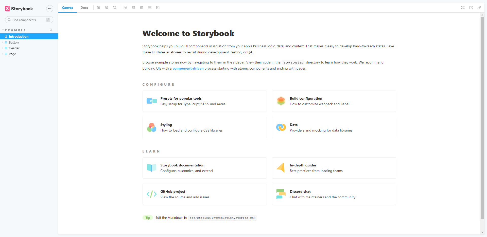

## storybook

Storybook 是一个 UI 开发工具。它通过隔离组件使开发更快、更容易。这允许您一次处理一个组件。您可以开发整个 UI，而无需启动复杂的开发堆栈、将某些数据强制输入数据库或在应用程序中导航。

> 简单说，Storybook可以让我们在项目启动一个组件文档，可以有效地防止多人开发重复造轮子的问题。当然还有其他的一些作用例如开发文档等，都可以实现

## 安装

  storybook 需要在**现有项目**中使用

  `yarn create vite` 先用vite创建一个react项目。

  `npx sb init` 初始化一下storybook - 项目中会添加`src/stories`文件夹，里面是story示例

  `yarn storybook` 启动

  然后storybook就会自动在浏览器打开一个地址，显示一个欢迎页面

  
 
## 编写组件story示例

tools.stories.js 
```js
  import React from 'react';

  import { Button } from './Button';

  export default {
    title: 'Example/Button',
    component: Button,
  };

  const Template = (args) => <Button {...args} />;

  export const Primary = Template.bind({});
  // More on args: https://storybook.js.org/docs/react/writing-stories/args
  Primary.args = {
    primary: true,
    label: 'Button',
  };

  export const Secondary = Template.bind({});
  Secondary.args = {
    label: 'Button',
  };

  export const Large = Template.bind({});
  Large.args = {
    size: 'large',
    label: 'Button',
  };

  export const Small = Template.bind({});
  Small.args = {
    size: 'small',
    label: 'Button',
  };

```
storybook 会显示一个`Example`栏目，下面有一个`Button`, 拥有两个story `Primary` \ `Secondary` \ `Large` \ `Small`。

## 编写纯文档示例

```js
  export default {
    title: 'doc/tools',
  };

  const Template = (args) => <div>
    {
      args.show ? "文案1" : "文案2"
    }
  </div>;

  export const str1 = Template.bind({});
  str1.args = {
    show: true,
  };

  export const str2 = Template.bind({});
  str2.args = {};
```
storybook 会显示一个`doc`栏目，下面有一个`tools`, 拥有两个story `str1` \ `str2`。

## PropTypes

storybook 会自动根据组件的PropTypes来生成`Controls` 和 `Actions`面板，所以我们需要编写组件的PropTypes。

Button.js
```js
import PropTypes from 'prop-types';

export const Button = ({ primary, backgroundColor, size, label, ...props }) => {
  const mode = primary ? 'storybook-button--primary' : 'storybook-button--secondary';
  return (
    <button
      type="button"
      className={['storybook-button', `storybook-button--${size}`, mode].join(' ')}
      style={backgroundColor && { backgroundColor }}
      {...props}
    >
      {label}
    </button>
  );
};

Button.propTypes = {
  /**
   * Is this the principal call to action on the page?
   */
  primary: PropTypes.bool,
  /**
   * What background color to use
   */
  backgroundColor: PropTypes.string,
  /**
   * How large should the button be?
   */
  size: PropTypes.oneOf(['small', 'medium', 'large']),
  /**
   * Button contents
   */
  label: PropTypes.string.isRequired,
  /**
   * Optional click handler
   */
  onClick: PropTypes.func,
};
```

## 常见操作

* 隐藏docs面板
```js
export default {
  title: 'example',
  parameters: {
    previewTabs: {
      'storybook/docs/panel': {
        hidden: true
      }
    },
  },
};
```

* 组件显示局中
```js
export default {
  title: 'example',
  parameters: {
    layout: 'centered',
  },
};
```

* ArgTypes的使用

argTypes用来指定props类型

```js
  export default {
    //....
    argTypes: {
      backgroundColor: { control: 'color' }, //可指定组件的backgroundColor属性 为颜色选择器面板
    },
    //....
  };
```
参数全部可选项如下：
```js
  {
    // 名称
    name: 'label',
    // 字段类型，以及是否必填
    type: { name: 'string', required: false },
    // 默认值
    defaultValue: 'Hello',
    // 描述信息
    description: 'demo description',
    // 描述信息
    table: {
      type: { summary: 'string' },
      defaultValue: { summary: 'Hello' },
    },
    // 控制器类型 - radio\color\text等，一般会默认推导
    control: {
      type: 'text'
    }
  }
```
 

## 更多

* [文档](https://storybook.js.org/)

