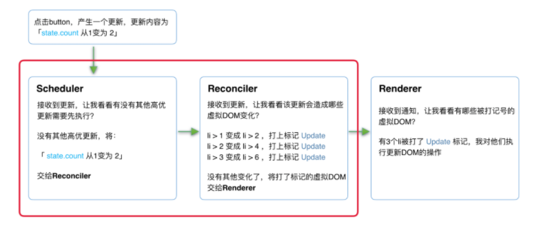

# REACT

## Component、JSX、Element、Fiber
  
  JSX只是调用 React.createElement(component, props, ...children) 的语法糖。所以，reactComponent并不是一定要用jsx编写，也可以直接返回element。如果使用了JSX, babel会把JSX转译成 React.createElement() 函数调用。
  ```js
    class Hello extends React.Component {
      render() {
        return React.createElement('div', null, `Hello ${this.props.toWhat}`);
      }
    }
  ```

  reactElement是一个js对象，用来描述DOM node(我们希望在屏幕上看到的内容)。由React.createElement创建。
  
  
  reactComponent 依照输入的props返回一个element, UI = Fn(state)。
  > A component is a function or a Class which optionally accepts input and returns a React element.
  
  ReactDOM.render 依照Component返回的Element对象去渲染真实dom。
  
  ***

  JSX（Element）只是一种**描述当前组件内容的数据结构**，而**组件在更新中的优先级**、**组件的state**、**组件被打上的用于Renderer的标记**这些信息，都存在Fiber中，
  
  
  在组件`mount`时，`Reconciler`根据JSX描述的组件内容生成组件对应的`Fiber节点`。
  
  在`update`时，`Reconciler`将JSX与Fiber节点保存的数据对比（`diff`），生成组件对应的Fiber节点，并根据对比结果为Fiber节点打上标记。


  为什么有了Element 还要弄一个 Fiber
  
  Element是描述了组件和层级的关系，而Fiber是描述了工作的过程（行为），这是一种架构思想，解耦了数据与行为，fiber是一个场景（行为），无论什么场景要用到的数据都是一样的，但是场景是有无数个的，所以要用分离的方式。老版本的架构是渲染element,而fiber版本变成了渲染的是Fiber树。

  fiber是同构了一个Element，也是一棵树，每一个节点都叫做一个fiber，diff在老版本的react上，是发生在Element上的，但是这样就不能中断渲染了，后来有了Fiber的架构，diff就发生在Fiber上，这样才能满足 Scheduler调度。


## react架构

React15架构可以分为两层：
  * Reconciler（协调器）—— 负责找出变化的组件
  * Renderer（渲染器）—— 负责将变化的组件渲染到页面上

React16架构可以分为三层：
  * Scheduler（调度器）—— 调度任务的优先级，高优任务优先进入Reconciler
  * Reconciler（协调器）—— 负责找出变化的组件
  * Renderer（渲染器）—— 负责将变化的组件渲染到页面上


在新的 React 架构中，一个组件的渲染被分为两个阶段：第一个阶段（`Reconciler阶段`）是可以被 React 打断的，一旦被打断，这阶段所做的所有事情都被废弃，当 React 处理完紧急的事情回来，依然会重新渲染这个组件，这时候第一阶段的工作会重做一遍。

第二个阶段（`Renderer阶段`），一旦开始就不能中断，也就是说第二个阶段的工作会直接做到这个组件的渲染结束。

两个阶段的分界点，就是 render 函数。render 函数之前的所有生命周期函数（包括 render)都属于第一阶段，之后的都属于第二阶段。开启 Concurrent Mode 之后， render 之前的所有生命周期都有可能会被打断，或者重复调用：
* componentWillMount
* componentWillReceiveProps
* componentWillUpdate


## Scheduler

  `requestIdleCallback`浏览器每帧执行完有剩余时间时执行这个API，但是由于浏览器兼容性、触发频率稳定性的原因，react团队自己实现了`requestIdleCallback`的`polyfill`，也就是`Scheduler`

  `Scheduler` 除了提供**空闲时间触发回调**功能之外，还提供了**调度优先级**功能

**何时Scheduler**
  Reconciler + Renderer 统称为 work, 每个work都需要Scheduler调度

**Scheduler做什么**

  Scheduler 会进行调度，将所有已经准备就绪，可以执行的任务，都存在了一个叫 taskQueue 的队列中，而这个队列使用了小顶堆这种数据结构
  
  在小顶堆中，所有的任务按照任务的过期时间，从小到大进行排列，这样 Scheduler 就可以只花费O(1)复杂度找到队列中最早过期，或者说最高优先级的那个任务，交给Reconciler

**Scheduler生命周期**

  一个Scheduler生命周期分为几个阶段
  * 调度前
    * 注册任务队列(环状链表，头接尾，尾接头)，按照过期时间从小到大排列，如果当前任务是最饥饿的任务，则排到最前面，并立即开始调度，如果并不是最饥饿的任务，则放到队列中间或者最后面，不做任何操作，等待被调度，此时任务都在`taskQueue`中
  * 调度准备
    * 通过requestAnimationFrame在下一次屏幕刚开始刷新的帧起点时计算当前帧的截止时间(33毫秒内)
    * 如果不超过当前帧的截止时间且当前任务没有过期，进入任务调度
    * 如果已经超过当前帧的截止时间，但没有过期，进入下一帧，并更新计算帧截止时间，重新判断时间(轮询判断)，直到没有任何过期超时或者超时才进入任务调度
    * 如果已经超过当前帧的截止时间，同时已经过期，进入过期调度
  * 正式调度
    * 执行调度
      * 在当前帧的截止时间前批量调用所有任务，不管是否过期
    * 过期调度
      * 批量调用饥饿任务或超时任务的回调，删除任务节点
  * 调度完成
    * 检查任务队列是否还有任务
    * 先执行最饥饿的任务
    * 如果存在任务，则进入下一帧，进入下一个Scheduler生命周期


## Reconciler

  Reconciler - 老版本叫Stack reconciler，16版本之后修改为Fiber reconciler

**何时Reconciler**
  每次 setState 或 ReactDOM.render时

**Reconciler做什么**

stack版本Reconciler - 递归执行

负责找出变化的组件

  * 调用函数组件、或class组件的render方法，将返回的JSX转化为虚拟DOM
  * 将虚拟DOM和上次更新时的虚拟DOM对比
  * 通过对比找出本次更新中变化的虚拟DOM
  * 通知Renderer将变化的虚拟DOM渲染到页面上

Fiber版本Reconciler:
  
  收到Scheduler交出的任务后，Reconciler会为变化的虚拟DOM打上代表增/删/更新的标记，标记类似：
  ```js
    export const Placement = /*             */ 0b0000000000010;
    export const Update = /*                */ 0b0000000000100;
    export const PlacementAndUpdate = /*    */ 0b0000000000110;
    export const Deletion = /*              */ 0b0000000001000;
  ```

  整个Scheduler与Reconciler的工作都在内存中进行。只有当所有组件都完成Reconciler的工作，才会统一交给Renderer。

## Renderer

  Renderer用于管理一棵 React 树，使其根据底层平台进行不同的调用。
  
  由于React支持跨平台，所以不同平台有不同的Renderer，web浏览器端的Renderer是`ReactDOM`

  * ReactNative (opens new window)渲染器，渲染App原生组件
  * ReactTest (opens new window)渲染器，渲染出纯Js对象用于测试
  * ReactArt (opens new window)渲染器，渲染到Canvas, SVG 或 VML (IE8)

**何时Renderer**
  Reconciler结束后-会通知Renderer进行工作

**Renderer做什么**

  在web浏览器宿主环境下，在每次更新发生时，Renderer（ReactDOM）接到Reconciler通知，将变化的 React 组件渲染成 DOM。

  Renderer根据Reconciler为虚拟DOM打的标记，同步执行对应的DOM操作。

  

其中红框中的步骤随时可能由于以下原因被中断：
  * 有其他更高优任务需要先更新
  * 当前帧没有剩余时间

由于红框中的工作都在内存中进行，不会更新页面上的DOM，所以即使反复中断，用户也不会看见更新不完全的DOM。

## diff
**何时diff**
  当组件update时，（Reconciler阶段）会将当前组件与该组件在上次更新时对应的Fiber节点比较（也就是俗称的Diff算法），将比较的结果生成新Fiber节点

## Fiber
  Fiber是React Element的数据的镜像、是一份Diff的工作
  
  * 作为架构，fiber 架构 - 协调器不采取原本的递归形式，而是使用fiber结构。
  * 作为静态的数据结构，虚拟dom - 每个fiber节点对应一个组件，保存了该组件的信息
  * 作为动态的工作单元，使用了双缓存技术

> React首屏渲染与更新的区别在于：创建fiber树的时候，是否有diff算法

### 双缓存 - Copy On Wirte
  fiber 使用双缓存机制，拥有两颗fiber树，current Fiber和workInProgress Fiber，当fiber被触发执行时， 会在内存中构建workInProgress Fiber树，进行，新节点与老节点的对比更新(diff)等操作，完成后FiberRootNode将current指针切换到workInProgress Fiber来实现渲染切换，切换后workInProgress Fiber变成current Fiber，workInProgress Fiber重新指向null。

  > 此处workInProgress Fiber的diff操作工作期间是随时可以暂停的。

### Fiber 执行
驱动Fiber执行的主要三种情况：
  * ReactDom.render()
  * setState()
  * props变更


## virtualDOM
  VDom 是一个虚拟概念，对应的是ReactElement和Fiber

## hooks解决了什么问题

  **对HOOK的理解**

  hoos是一种消息通知机制，React在某种特定状态发生变化的时候会通知 HOOK，然后HOOK再完成相应的特定行为，
  
  Hook重新定义了react的写法，更加符合react的函数式编程思想，解决了this的问题，不需要再去关注class Conmponents的各种生命周期。
  
  封装了程序的复杂性（副作用、状态、上下文、缓存等），用户只需要使用hooks就行，不需要知道hooks背后做了什么事，同时让用户以最小的代价实现了关注点分离。

 
**QA**
* 为什么要用链表结构？
  * 1.节省空间，只用指针指向其他节点即可。2. 对于插入删除这类前端DOM常见操作的性能非常好

* Fiber是个链表，它是怎么做到并发的呢？
  * Fiber在计算Work in progress的时候是严格按照递归顺序逐级进行的，但是current Fiber与WorkInProress Fiber之间的diff算法是并发计算的，而这一块计算才是真正耗时的地方。由于可以并发计算，所以就快了。

* Fiber是什么？
  * Fiber有几层含义，首先它是React新的架构方式，用来配合Scheduler来实现任务的异步渲染。
  * 然后它是一个数据结构，同构了Element，保存了对应的Element信息。
  * 最后它是一个动态的工作单元，使用了双缓存技术（copy on wirte），在触发Fiber执行的时候，会生成一个WorkInProress Fiber树，然后与原来的Fiber树进行diff对比，再把渲染树的指针直接指向WorkInProress Fiber树。