## Docker是什么？


大家都知道Docker是容器。那么既然是容器，就是用来装东西的，Docker内部装的是什么？——应用(Application)。

Docker是一种管理应用的现代手段，让应用管理变得可以预测和高效。

在我讲原理前，请你先尝试用Docker去跑一个`mysql`。

### 观察任务：用Docker跑一个Mysql


#### **Step 1： 去到官网下载**

https://docs.docker.com/get-docker/

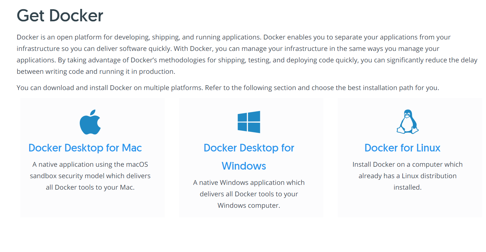

选择你要的版本。


#### **Step 2: 安装**

Mac安装相对简单，按照提示一步步操作就可以了，这里我们不讲。[MAC同学看这里](https://docs.docker.com/docker-for-mac/install/)

玩Linux的同学，多少有一些安装经验了吧？不过多说一句，Linux通常可以用包管理器直接安装，以`ubuntu` 为例：

```shell
 sudo apt-get update
 sudo apt-get install \
    apt-transport-https \
    ca-certificates \
    curl \
    gnupg \
    lsb-release
 curl -fsSL https://download.docker.com/linux/ubuntu/gpg | sudo gpg --dearmor -o /usr/share/keyrings/docker-archive-keyring.gpg    
 
 sudo apt-get update
 sudo apt-get install docker-ce docker-ce-cli containerd.io
 
```

具体不要看我的文档，看官网的文档，[Linux同学看这里](https://docs.docker.com/engine/install/)

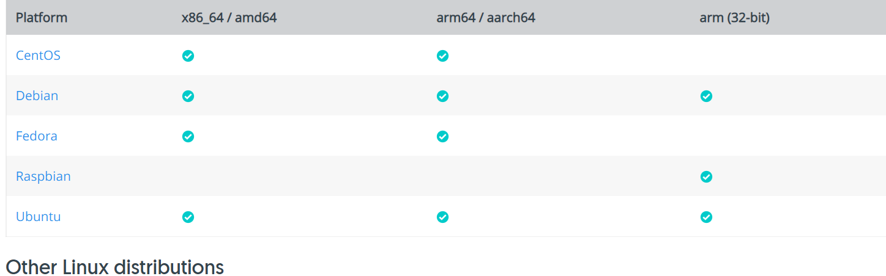

**Windows的同学**

官网直接提供了下载链接，直接安装就行，但是请注意：

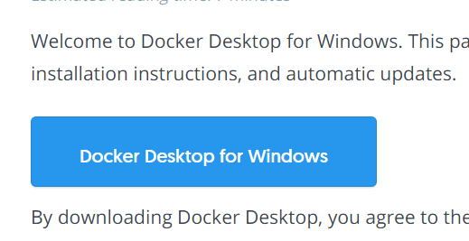


有两种装法，一种需要打开Hyper-V，虽然不一定能打开（毕竟很多同学盗版，而且windows版本也很多）。还有一种是用Windows提供的子系统WSL 2。

**安装Hyper-V具体方法**

以管理员身份打开 PowerShell 或 CMD 。

键入下列命令：

```powershell
DISM /Online /Enable-Feature /All /FeatureName:Microsoft-Hyper-V
```

进入“程序和功能”->"打开或关闭Windows功能"->选择Hyper-V，然后重启。

如果重启后提示Hyper-V需要Intel虚拟化技术(VT-X)等字样，就去操作BIOS打开Intel VT-X，具体要看你主板的型号了。如果是AMD CPU，就需要BIOS中打开SVM。

**用WSL2 (推荐)**

参考这篇官方文档https://docs.microsoft.com/en-us/windows/wsl/install-win10

#### Step 3： 拉取镜像

```shell
docker pull mysql
```

国内如果嫌慢，记得安装一个阿里云的加速器》[参考这里](https://developer.aliyun.com/article/29941)

[阿里云容器Hub服务在这里](https://cr.console.aliyun.com/cn-hangzhou/instances/mirrors)

[docker搜索镜像查看帮助](https://hub.docker.com/)

其实就是在docker的配置文件中增加一行：

```shell
{
    "registry-mirrors": ["<your accelerate address>"]
}

```

但是这个加速器地址阿里云每个用户有自己单独的（为啥这样——拉新！！！）


拉取完，就可以在本地看到镜像：

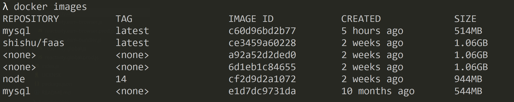

你可以看到有个两个mysql的镜像。没个都有一个ID。

镜像，就是程序。镜像被打开，才是一个容器。 好比记事本是应用，被打开是进程。

`IMAGE ID` 就是唯一标识，`REPOSITORY` 是仓库（用于区分不同的发布者）。

当然可以删除：

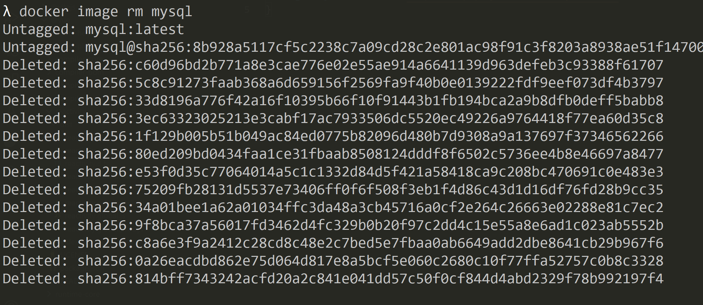

也可以用唯一标识操作，但是不用输全。

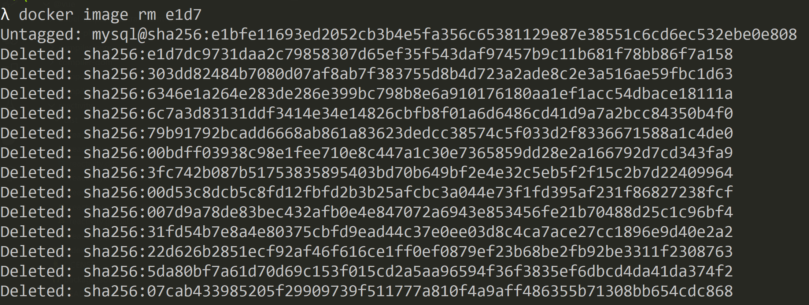


#### Step 4: 阅读镜像的使用文档


镜像的文档可以用下面这个网址得到：

https://hub.docker.com/_/mysql


镜像的制作者会告诉你怎么使用这个镜像：

```console
docker run --name some-mysql -e MYSQL_ROOT_PASSWORD=my-secret-pw -d mysql:tag
```


你可以看到`docker run`可以用来启动一个镜像？请问镜像启动后是什么——容器。

请问镜像启动多次之后是什么——多个不一样的容器。懂了吧？镜像是**应用**，容器是**进程**。

镜像的英文单词是image,容器的英文单词是`container` 。

上面这句指令究竟在说啥？

- --name 是容器的名字（懂了吗？一对多的关系，镜像是mysql，容器由用户自己定义）不加行么？ ——当然可以。
- -e 就是传入环境变量，这个是容器制作者需要的环境变量，我们要改成自己的。
- -d是一个独立参数，代表执行在`detach` （非接触模式），说白了就是启动在后台。

最后的mysql:tag是指镜像和镜像的版本。

略微修改下：

```shell
docker run --name mysqlinstance01 -e MYSQL_ROOT_PASSWORD=123456 -d mysql:latest

docker run -it --network mynet --rm mysql mysql -hmynet -uroot -p
```

然后一个mysql就启动了

#### Step 5 ：查看使用中的容器


```shell
docker container ls
```


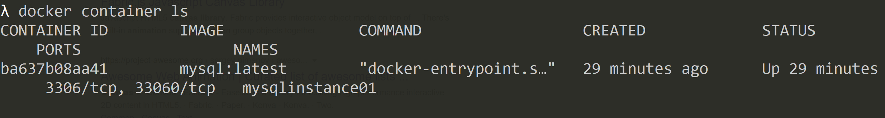

可以对使用中的容器做很多的操作，类似进程的管理，比如：

```shell
λ docker container --help

Usage:  docker container COMMAND

Manage containers

Commands:
  attach      Attach local standard input, output, and error streams to a running container
  commit      Create a new image from a container's changes
  cp          Copy files/folders between a container and the local filesystem
  create      Create a new container
  diff        Inspect changes to files or directories on a container's filesystem
  exec        Run a command in a running container
  export      Export a container's filesystem as a tar archive
  inspect     Display detailed information on one or more containers
  kill        Kill one or more running containers
  logs        Fetch the logs of a container
  ls          List containers
  pause       Pause all processes within one or more containers
  port        List port mappings or a specific mapping for the container
  prune       Remove all stopped containers
  rename      Rename a container
  restart     Restart one or more containers
  rm          Remove one or more containers
  run         Run a command in a new container
  start       Start one or more stopped containers
  stats       Display a live stream of container(s) resource usage statistics
  stop        Stop one or more running containers
  top         Display the running processes of a container
  unpause     Unpause all processes within one or more containers
  update      Update configuration of one or more containers
  wait        Block until one or more containers stop, then print their exit codes
```

然后二级命令还可以继续Help

```shell
λ docker container ls --help

Usage:  docker container ls [OPTIONS]

List containers

Aliases:
  ls, ps, list

Options:
  -a, --all             Show all containers (default shows just running)
  -f, --filter filter   Filter output based on conditions provided
      --format string   Pretty-print containers using a Go template
  -n, --last int        Show n last created containers (includes all
                        states) (default -1)
  -l, --latest          Show the latest created container (includes all
                        states)
      --no-trunc        Don't truncate output
  -q, --quiet           Only display numeric IDs
  -s, --size            Display total file sizes
```

**划重点：很多命令将不过来，也没有必要一个讲，你要学会查帮助的技巧。**学React记4~5和hooks，学vue记4~5个hooks，其他就靠查文档了。 要掌握工具，别称为工具的奴隶。

关闭的容器可以用`start` 指令再次开启。


#### Step 6：下载一个数据管理工具

小师叔选择了DBeaver

```shell
docker pull dbeaver/cloudbeaver:latest
docker run -d --name cloudbeaver --rm -ti -p 8081:8978 -v /var/cloudbeaver/workspace:/opt/cloudbeaver/workspace dbeaver/cloudbeaver:latest

```

- 8081是本机端口
- 8978是dbeaver 容器中使用的端口

 启动后查看下mysql容器占用的IP和端口：

```shell
docker inspect 6eaf
```

我的mysql容器ID是6eaf，你可以用`docker ps` 查看自己的。

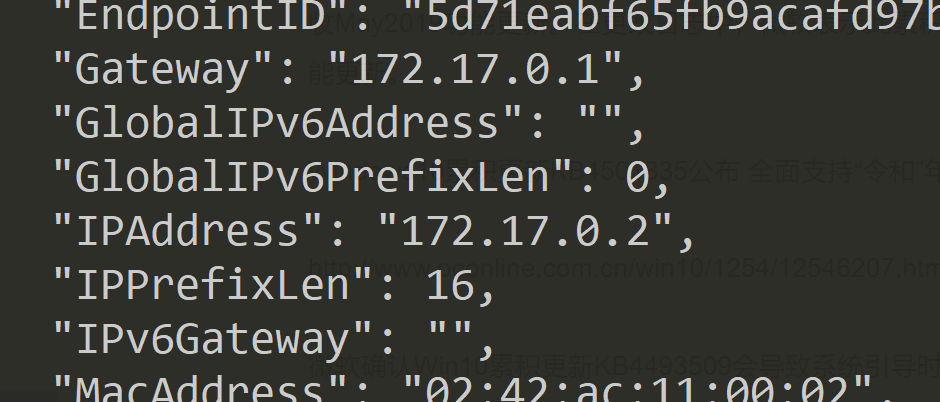

然后再DBeaver配置（不会就看视频吧，或者百度百科）。


## Docker的原理


简单讲，Docker不隔离计算， 只隔离环境。

### **什么是环境？什么是计算？**

环境，就包括文件系统、网络等。

比如Docker容器中的进程，只能看到Docker容器“框”住的资源。比如进程在Docker容器中看到的`/` 目录，实际上可能对应用户本机上的`/var/docker/fs/001` ——这里是个简化的例子。

进程看到的**网络**，也是隔离的网络。执行进程的用户也是Docker容器内部的用户，和外部完全隔离。

但是和虚拟机不同，Docker不隔离计算。Docker容器中的进程，也是真实的进程，不是虚拟的进程。 

当一个Docker容器中的进程写入文件的时候，并不是在一台虚拟机上写，而是在用户本地操作系统的文件系统中写入，只不过被隔离了。

###  Docker是一种隔离技术而非虚拟化

虚拟化技术最明显的特征是执行层面的虚拟化——虚拟CPU指令。比如你本机的Windows不管理vmware中运行的进程，因为vmware中的进程已经完全运行在虚拟化技术上。

Docker将自己直接嫁接在操作系统上，Docker中的进程也是真实的进程，Docker使用的文件系统也是真实的文件系统（只不过做了隔离）。

Docker使用的网络也是真实的网络，只不过做了隔离。（网络本身就是虚拟的概念）


虚拟机架构

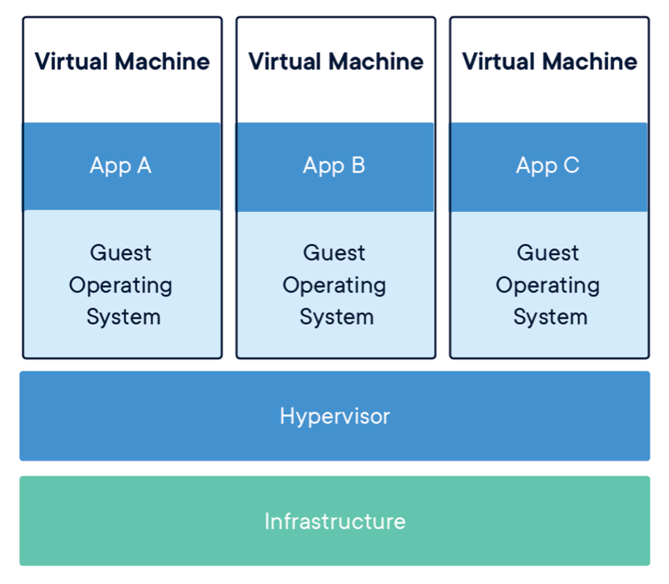

Docker的架构

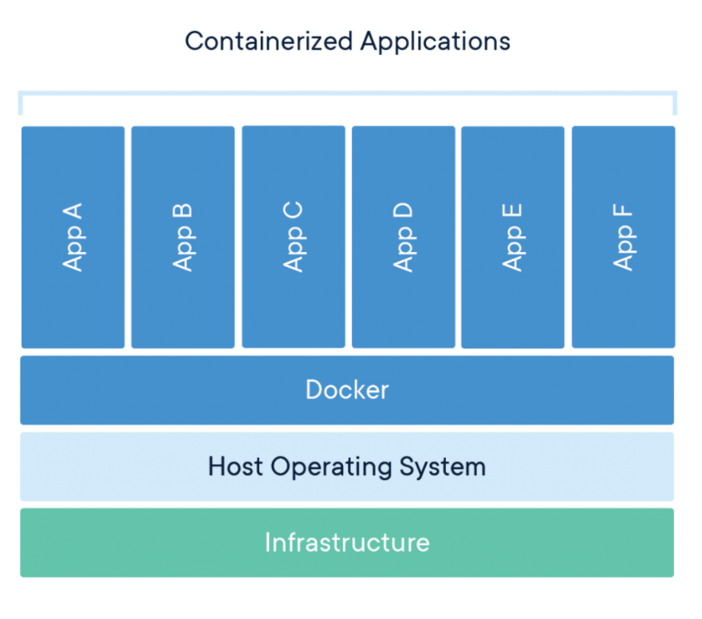

### Docker怎么做到的？

这个就要说到Linux的namespace技术。——有Docker你也可以用这个技术隔离你系统中的应用。


Namespace技术是多种技术的合集，如果感兴趣可以搜索这些关键字：

- cggroup
- mnt namespace
- user namespace
- pid namespace


### Docker的架构

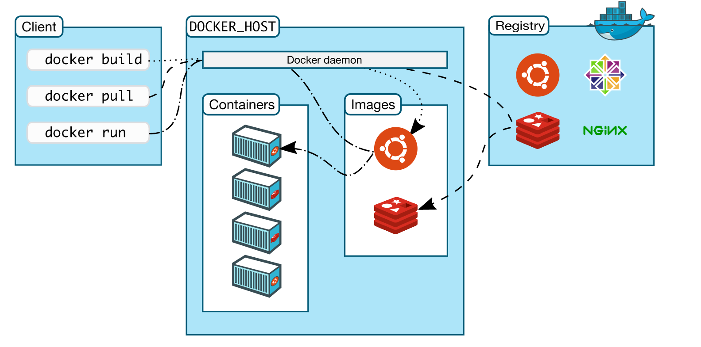


##  总结

- 思考Docker为什么可预测（predictable)？
  > 镜像都被放在container中，都是被约束的，所以行为可预测
- 思考Docker为什么高效？
  > 命令行工具带来的高效
  > docker中都是真实的进程，没有性能损耗，所以高效
- 一个docker镜像是可以有多个容器的

### 镜像和容器

  一个镜像可以启动多个容器，镜像是容器的基础

  docker 镜像是一个只读的 docker 容器模板，含有启动 docker 容器所需的文件系统结构及其内容
  
  docker 镜像是 docker 容器的静态视角，docker 容器是 docker 镜像的运行状态。
