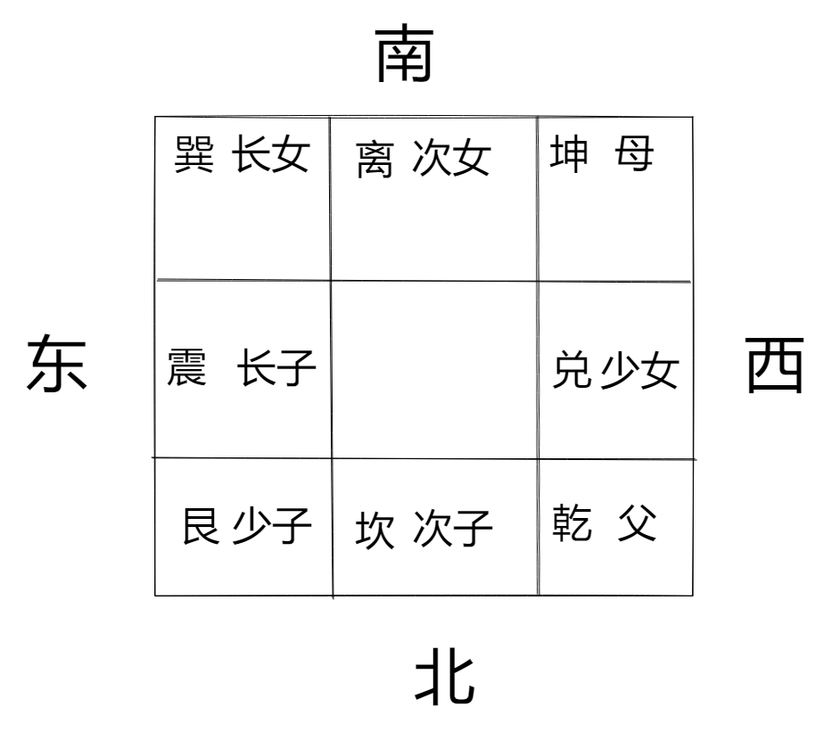
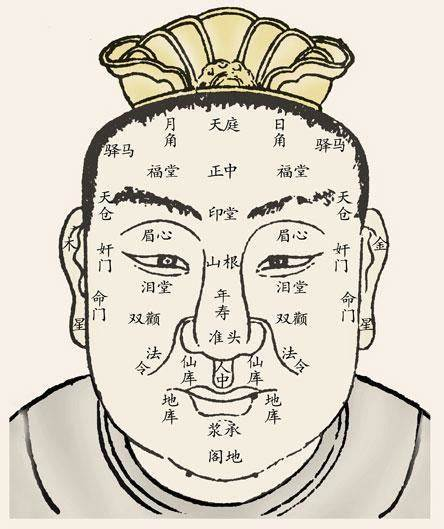

圣、智、勇、义、仁

先入为勇，后出为义，分均为仁

## 生活小常识
被鱼骨头卡住，用同一条鱼的骨头烧黑打碎，吃下去就好了，一阴一阳。

有毒的水果扔进水里会沉下去

## 中医

忧伤肺、思伤脾、恐伤肾、气伤肝

## 阳宅

厨房为刀象

厕所代表空气不好、会有相关疾病，厕所冲走的是黄金，会对应位置主破财

客厅通常要放到西南角

客厅的像就是客人，客厅在的位置代表其为的主回像客人。

所以西北方是客厅主生离，西北方是厨房主死别。

## 面相

印堂 - 命宫

正中 - 官禄宫

眉心 - 田宅宫

泪堂 - 子女宫

天仓 - 迁移宫

年寿 - 财帛宫

奸们 - 夫妻宫

地阁 - 仆役宫

命门 - 看生死

凶宅：

阳宅厕所在房子中间的死男主人，心脏病、中风、气喘。

西北角是厨房克男主人

### 眉毛
眉毛乱七八糟，主兄弟姐妹不和，左兄弟、右姐妹
断眉主夭折、很粗很大主独子
眉毛短短一点 命里只有科星没有权星

眼睛一上一下，代表是庶出，父母鼻上有竖长直纹代表有领养

印堂左右日角和月角代表父母，印堂全无，父母双亡
### 手

男性手软主富贵、女性手见筋见骨主福气

### 鼻子

男人鼻子为财帛宫主事业。狮鼻和悬胆鼻都主富贵
女人的鼻子主夫妻

### 气色

气色枯萎（青蓝色），为死色 - 时间通常为下一个节气，每个节气主半个月

黑暗为灾色

亮黄为喜色

