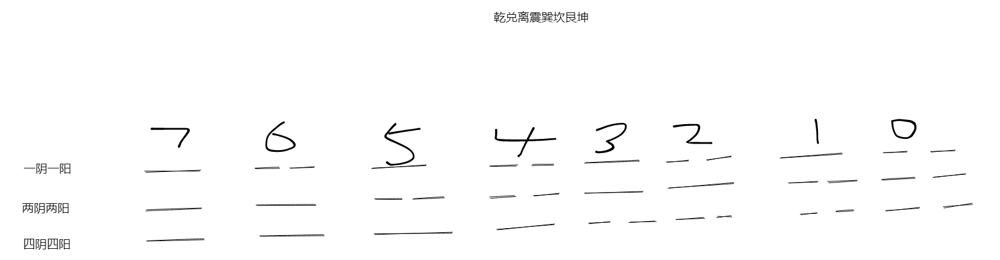

## 易经

## 卜卦方式

  一个容器+六个铜板，摇六次以上，自上向下顺序倒出，此为一挂

## 卦性

卦代表事、爻代表时间

外挂为位、内挂为本

* 乾卦的性为：向下看。刚健、实心、坚心
* 坤卦的性为：地也、顺也、柔也
* 兑卦的性：悦
* 离卦的性：中庸则明
* 震：不鸣则已一鸣惊人，主动
* 巽：风、顺、入
* 坎：水、险、陷，坚心至诚至刚则可以脱险，主险
* 艮：山、止、大，知进退

阳爻在上止像

阳爻在中陷像

阳爻在初动像

阴爻在上悦像

阴爻在中中虚像

阴爻在初巽像

## 六十四卦

### 乾为天

初爻至上爻分别为 下、将、相、宰、君、过

问事能成，但是需要坚心。

### 坤为地

履霜坚冰至

### 水雷屯

凶，物之始生

利建候，代表此时可以广结善缘，拉投资，找辅助

利居贞，盘桓的时候要直方大，要有你做事的原则

以贵下贱， 他离开省政府的时候，他跟每个人都握手，包括门口的工友，谢谢你我这几年都是靠你们帮忙照顾，有空来看我。这是什么，以贵下贱。

六三 即鹿无虞， 想打鹿却没有导游。

六五 不可大贞，此时不可大动手脚，需要小贞。政令不达代表权力被转移了，此时若大贞（大动手脚），必凶

上六 险极，此时用贤乃解，九五是阳刚的，是贤，也可求外援，只要是阳刚的象都行，法院、警察等等

### 山水蒙
