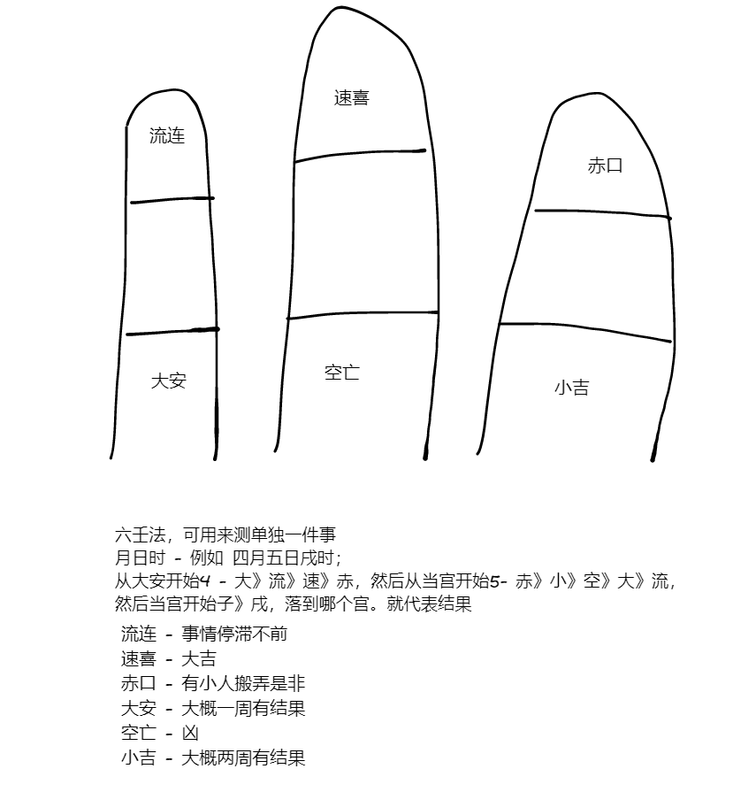
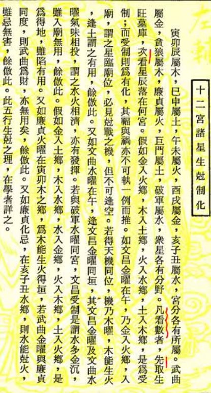
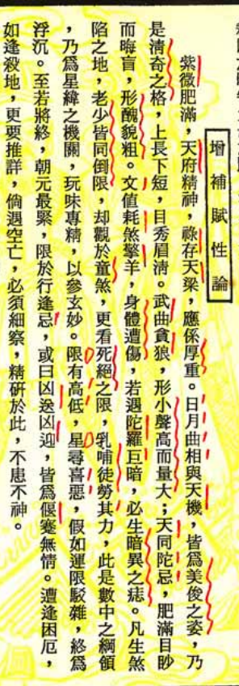

## 谨记

戒之初，戒之盛

## 紫微斗数

**闰月生人，做下一月论**

**子时生人，要换日，11-0点为当天晚子时。0-1为第二天早子时**

紫微斗数十二宫

命->兄弟->夫妻->子女->财帛->疾厄->迁移->仆役（朋友）->官禄->田宅->福德->父母

> 命宫看三方四正 -官禄、财帛、迁移

### 洛书

4 9 2
3 5 7
8 1 6

### 五行人

火： 瘦瘦干干

土： 宽宽厚厚

金：方方的

水：圆形的

### 四化星：科、权、禄、忌

科：考试、专业技能、科名、名气大 - 科代表有才，没有将领
权：官印、性刚 - 权代表有领导才能
禄: 财、性守
忌：截杀、想不开

### 南斗星系
* 天府星 - 南斗星君
  * 主文官带、主教星
  * 这种人眉毛特别粗
* 太阴星 - 月亮
  * 女性的话会很漂亮
  * 主文官带、正财
* 天梁星 - 食神
  * 主官带、文武双全
  * 长相英俊，蝶飞眉
* 天相星 - 佐才星
  * 天相星如入宫代表有位无权
  * 瘦瘦高高
* 七杀星 - 杀星 
  * 主武官 - 与贪狼一起居福地，主武贵人
  * 目大、多疑、性急
  * 主耗、劳
* 破军星 - 杀星
  * 主武官
  * 性格孤僻、不重利
  * 主耗、劳
* 贪狼星 - 杀星
  * 主武官、主酒色财气赌、在子亥主桃花（长得高高的）
  * 主财
  * 碰到火铃主武贵人

### 北斗星系
* 紫微星 - 属阳
  * 主官带
  * 帝星，没有左辅星、右弼星时代表孤星
  * 落在官禄宫最好 
  * 可解凶星
* 天机星 - 属阴
  * 主文官带
  * 个头矮、皮肤黑、体格精壮
* 太阳星 - 
  * 主武官带、主财路（横财）
  * 主武职
  * 主父、夫、子
  * 红光满面，双目圆大、圆脸、肤白、中等身材
  * 大贵星可解灾
* 武曲星
  * 主武官带、主财路（财路的王）
  * 长相五短
  * 大贵星可解灾
* 天同星
  * 主人和 
* 廉贞星 - 杀星
  * 主武官带
  * 次桃花
  * 长相清秀
* 巨门星 - 凶星
  * 主口舌、是非、官司、牢狱
  * 巨门星入庙，也能代表豪门宅邸
  * 巨门星落陷，就坐牢了....
  * 个子小，声音高
  * 身体毛发多，肥胖

* 禄存星 - 财星，同化禄
  * 主小气
  * 禄马交驰，代表能赚大钱，但是是辛苦钱

### 六杀

  * 擎羊星 -小人
  * 陀罗星 -小人
  * 火星 - 火光之灾、动手之争
  * 铃星 - 火光之灾 、动手之争
  * 天空星
  * 地劫星

羊驼火铃有一个冲对命宫或者大小限，都主不利

杀星越暗越凶，杀星入庙问题不大，杀星落陷就麻烦喽~

杀星入庙（很亮），代表凶处藏吉
杀星落陷（很暗），代表吉处藏凶

### 副星
  * 文曲星
    * 主博学 - 主功名
  * 文昌星 - 主功名
    * 主科甲
  * 天魁星
    * 主科甲 - 主读书
  * 天钺星
    * 主科甲 - 主读书
  * 红鸾星
    * 主喜
    * 男命红鸾必招美妻。女命红鸾必有贵夫
  * 天喜星
    * 主喜
  * 左辅星、右弼星 - 辅助紫微星
  * 三台星、八座星 - 辅助天府星（此时的天府星才有化凶的功能）

### 武杀会

###  权星
权星：化权、紫薇+七杀同宫

### 灾

  廉贞+七杀 同时落陷: 半路死亡

  廉贞+破军 同时落陷：水中做冢

  廉贞+贪狼 同时落陷： 夭折（横死） - 先天疾病、自杀

### 死离

1. 福德宫凶
   1. 廉贪
   2. 廉破
   3. 化忌
2. 阳宅
   1. 西北方厨房死先生、客厅主生离、厕所代表官司是非、牢狱之灾、破财
   2. 西南方厨房死妻子、客厅主生离、厕所代表官司是非、牢狱之灾、破财

> 需要命上有灾+运上有灾。才会出现。此时天地人三才已经占2/3.我们用人间道劝半天还是不行。

### 星辰亮度
  庙（吉）、旺（吉）、利（中）、陷（凶）

### 正财和偏财

正财就是领死工资，打工、公务员

偏财就是做老板，开店铺等

### 格 

* 日月夹财
  * 命格左右分别为太阳星和太阴星
* 紫府夹权
  * 命格左右分别为紫微星和天府星
* 魁钺夹贵
  * 命格左右分别为天魁星和天钺星
* 羊陀夹杀
  * 命格左右分别为擎羊星和陀罗星
* 半空折翅
  * 命宫在巳宫，或者亥宫并且廉贞贪狼落陷在命宫，或者命宫是空的，落陷在对宫。这种命大限在中年
  * 命宫对宫化忌，三方四正无吉星来会
* 日月夹命
  * 太阳和太阴反着出现在命宫左右
* 日月反背
  * 多主背井离乡、夫妻聚少散多

**武杀会：**
  
  1. 女子的话主孤单
  2. 离祖，到异乡发迹
  3. 男人的话主武职大利
  4. 商人主老多功少，武曲与七杀都是权星，不掌财

* 紫府成桓
  * 紫薇+天府落在四个角上，大贵。位列三台

* 七杀朝斗
  * 指命宫位于子、午、寅、申其中之一，由七杀星独自坐守，大贵。将军象

### 十年大运

命好不如限好 （限就是十年大运）

小儿善知人意，小儿有大人像，主夭折

### 小限的算法

小限只看对宫和本宫，不需要看三方四正和邻宫（但是全书上说也是要看的。），从戌宫起止

> 4-2；4分钟讲小限

假设1954年生人，甲午年。批1994年此人小限

1. 1994-1954+1=41
2. 从戌宫开始为`子`，一次计算戌宫->未宫->辰->丑宫->戌宫, 找到`午`对应的宫，此处为辰宫
3. 从找到的宫开始为1，男顺女逆找到41所在的宫，就是今年的小限

### 春夏秋冬

分别为寅、卯、辰、巳宫

### 斗君的算法

口诀：流年岁建起正月，逆逢生月顺回程，回程顺至生时止，便是流年正月春

月斗君：本流年斗君所主的宫位，即为本年正月所主之宫位，即为本年正月所主之宫位，依次顺行到本年之十二月，

日斗君：斗君所在宫起初一，顺行，就能看到逐日之凶吉

时斗君：今日之宫起子时，顺行，既能看到时辰之凶吉

例如此人生日五月午时

1. 从子宫开始逆时针数月数（5月），此例到到申宫。

2. 从申宫开始，顺时针一直数到时（午时），此例到寅宫。

3. 从寅宫开始，顺时针一直数到当前农历年（戌年），此例到子宫。子宫就是看流年的正月，然后顺时针就是看日正月初一就是丑宫。

### 离日、绝日

春木、夏火、秋金、冬水

春分、秋分、夏至、冬至前一天是离日

立春、立夏、立秋、立冬前一天是绝日

### 贵象

火形局 瘦瘦小小
木形局 瘦瘦小小红红的，脸上没肉，头发泛黄，男人主武将，女人发餐饮业
土形局 长相厚重，头圆脚方
金形局 长相方方的
水形局 圆圆的

北人南象、南人北象

### 身宫

代表后天、在迁移宫代表后天要去外地发展，在官禄宫代表要当官，身命同宫代表祖业很大且会继承祖业，在夫妻宫代表受婚姻影响很大
在财帛主劳累赚钱，不可做家庭主妇
> 七杀临身终不美，一辈子多败少成

### 大限的算法

未来十年无大运，大限在今年
未来一年无大运，大限在前一年

### 合八字
  八字合或者八字不合都可以结婚。有些人必须找八字不合的才可以结婚。慢慢研究

  假如某男子父母宫天同、天梁。那么给他合八字找一个女子命宫天同天梁的。就叫做母子合。

## 技巧

女命遇到武官星主孤单

男人巨日大富贵

女人巨日偏方

### 办公室风水

门的朝向是外挂

老板的办公室是内挂

### 口诀
当贪狼在子宫、亥宫的时候是正格桃花星。会长相高大

官禄宫，最喜欢有权星入宫
> 权星：化权、紫薇+七杀同宫

财星与权星相会，代表财权很大，但是财不是自己的。财权大的人悬胆鼻或者颧骨很大+手很软

七杀临身终不美，一辈子多败少成

男人逢9、女人逢8

遇险而止，招凶。遇险要行险，行险才能脱险

### 肺寅大卯胃辰宫
肺寅大卯胃辰宫，

脾巳心午小未中，

申膀酉肾心包戌，

亥焦子胆丑肝通。

* 胆肝肺大胃脾心小膀肾包焦

### 头上的穴代表出生时间

头上的穴：子午卯酉 偏左手、局中，,寅申巳亥 偏右手，辰戌丑未 双穴以上

### 紫薇斗数方位

卯时宫 正东
午时宫 正南
酉时宫 正西
子时宫 正北

## 看挂实例

### 1. 辛丑年3月5号 戌时生人
      

命宫是贪狼星，主武官，主桃花。女子得武官命，不好
> 当贪狼在子宫、亥宫的时候才是正格桃花星。会长相高大

命宫贪狼星在午宫，长相越瘦小越好。天魁星也在午宫，天魁星是文官，男生文武双全，女生就会很累

官禄宫，最喜欢有权星入宫，此人官禄宫七杀、擎羊, 当官不好。

身宫在财帛宫，主工作赚钱，化科主考试、技能，天钺星又主科甲，有技能傍身可以赚钱，破军星主耗、劳代表她要靠技能走天下吃饭

紫微星在迁移宫，独星、代表独身在外会碰到贵人

兄弟宫 太阴星在巳时出现代表不好，兄弟宫太阴星落陷此人没有兄弟或者兄弟夭折

太阳和太阴如果是反着的，大部分都是外地发展，还代表父母会对此人有些担忧的事情。

父母宫化禄，代表父母有财禄给她，天同+巨门，感情很好但是总吵架

田宅宫 酉宫化忌，代表肾不好，疾厄宫在丑宫有火星和地空代表右侧妇科不好

天马星在朋友宫，代表此人会为朋友奔波。杀星、凶星在朋友宫的话，代表朋友会变仇人

子女宫是空的。看对宫，化忌。没有儿子。如果先生有两个孩子，那么就会生两个孩子，比较像先生，如果像太太，就是不好的象，小心夭折

夫妻宫廉贞星、天府星，很温和，清秀漂亮，个子不高。看夫妻宫的三方四正，没有科权禄。夫妻感情很好，没有儿子

福德宫

**流年**

34-43 田宅宫太阳星 + 化忌 ，太阳星在女子的命中代表男性，这十年此人见不到父亲丈夫儿子

批流年的时候，所在的宫为值日发生之大事

### 2号-紫微星在丑宫

      

  命宫有天相星，天相星是非常好的辅佐的星。不会去想权位，长相瘦瘦高高。
  > 天相星如入宫代表有位无权

  迁移宫，紫微星+左辅右弼+化科，此人去外地发展更好。

  夫妻宫，廉贞星+贪狼星落陷，婚姻不好，对象会沾酒色财气。
  **解：**
    1. 结婚对象找一个二婚的。
    2. 结婚对象比此人大七岁以上

  子女宫化忌，没有儿子。太太的命里有就会有儿子，比较像太太，如果像这个人就主夭折

  子女宫和田宅宫 日月反对，太阴和太阳反了，代表工作晚上比白天忙，代表六亲不靠，代表性情刚燥，脾胃不好。

  福德宫有武曲和七杀，指此人主要靠自己。
  
  **武杀会：**
    
    1. 女子的话主孤单
    2. 离祖，到异乡发迹
    3. 男人的话主武职大利
    4. 商人主老多功少，武曲与七杀都是权星，不掌财

### 3号-紫微星在寅宫

      

**命格**
  
  命宫 紫薇星+天府

  子女宫 太阳落陷，对宫 化忌，大凶

**流年**

### 4号-紫微星在卯宫

      

  天梁星在午宫一定是入庙的。代表一品武官。一方之子可掌生杀大权。

## 六壬法
      

## 机锋、天机像

犬猪牛羊代表叱之即去

鸡鱼鹅鸭代表用则不生

## 六神占断法

19课

## 排八字

20课

# 顾向鸿飞星

先看命宫-> 身宫->三方四正->福德，要看星辰吉凶、权、禄、劫、空、庙、陷，化忌、化吉

命、身、迁移、财帛、官禄、福德六大宫里面吉星高照，主富贵高寿。六宫俱陷主孤寡夭寿。

**命宫主富、贫，喜福寿星；身宫主贵、贱，喜清贵星；对宫看吉凶**

父母、夫妻、子女，俱有劫、空、杀、忌，主僧道命，否则孤寡贫穷

命宫无主星，但是财帛、官禄吉星高照，主富贵全美或偏房所生

小孩的命盘三方有煞星冲，可过继给别家，或者去外地才可安全长大

女命先看身命。有贪狼、七杀、擎羊，则不美。若七杀单居福德，则为娼婢命。若七杀擎羊在夫妻宫，也不吉。再看夫妻、子女。

羊陀火铃空劫忌，为凶星

七杀、廉贞、破军、贪狼，是四颗煞星，但是被制则为吉

火星、铃星若被制，也可为吉

### 吉星部分 
紫薇、天府、天同、太阳、太阴、文昌、文曲、禄存、化禄、化科、化权，都是吉星

### 煞星部分

七杀、廉贞、天伤、天使、羊陀火铃空劫忌

## 大限

大限左右昌曲，主封官加候，生子发财，妇人喜事，商贾得利

大小二限和太岁怕行天伤天使之地。地空地劫之地，擎羊陀罗之地。

天伤在子，天使在寅，岁限在丑，是为大凶，能否逃过要看紫薇天同天梁贪狼座命

## 歌诀

大限主十年之福祸，小限推一岁之枯荣

羊驼迭并命难逃，七杀重逢祸必遭，太岁二限临此地，十生九死不坚牢

文曲文昌座命均眉清目秀，知书达理。座身宫主风度儒雅，器宇不凡。但是怕恶星落陷、冲会均为不吉

杀破廉贪俱作恶，庙而不陷掌三军。

杨陀火铃为四煞，冲命冲限不为荣。

北斗武贞贪巨破，羊陀左右曲存星。

南斗机同梁相府，火星魁钺杀昌铃。

廉贞贪狼落陷于巳亥座命宫，主凶。如果三方四正为凶星落陷化忌，活不过30。为吉星，随活过30但是容易不得善终

天机天梁擎羊会，早见刑而晚见孤。

贪狼武曲廉贞逢，少受贫而后受福。

天哭丧门，流年莫遇

## 命逢四正

指某人生辰年月日时恰好是寅申巳亥。

命逢四正遇吉星守照主财官双美。遇权禄科主大富大贵。但是遇到化忌主出家

## 阴阳二宫

子阳丑阴以此类推

阳年生命宫身宫均在阳宫，有吉增吉，无吉增凶。若均在阴宫，有凶增凶，无凶减吉

## 四马地

寅申巳亥

命身宫有长生、天马主敏捷，常于奔忙中获益。就是四处跑，但是可以获益

## 桃花地、四败地

命身宫在子午横成暴退之方

命身宫在卯酉桃花浪荡之位

## 四墓地

命身宫在辰戌丑未，主人刚直忠诚。宅

## 诸星生克制化

## 众星相

七杀：目大凶狠、心性急躁

火星：胆大、刚强

铃星：性毒、破相。

擎羊、陀螺：丑陋奸诈。

破军：不仁，背厚眉宽。

廉贞：目宽口阔而面横、为人性爆、好忿好争

武曲、贪狼：型小声高量大。

文昌、文曲：俊雅，眉清目秀。文曲磊落。

天魁、天钺：威仪

## 众星所属

紫薇：土

# 黄天福

## 天干 

东方甲乙木，南方丙丁火，西方庚辛金，北方壬癸水，中央戊己土

## 五行生克制化

生我者父母

生： 木->火->土->金->水

克： 木->土->水->火->金

制： 木克土金来制、土克水木来制、水克火土来制、火可金水来制、金克木火来制。 A克B，则用B生者来制，B的子一定克A

化： 木克土火来化、土克水金来化、水克火木来化、火可金土来化、金克木水来化。 A克B，则用生B者来化

数字：
* 木->1、2->肝
* 火->3、4->心
* 土->5、6->脾
* 金->7、8->肺
* 水->9、0->肾

## 六冲、六合

六合：子丑、寅亥、卯戌、辰酉、巳申、午未

六冲：寅申、巳亥、子午、卯酉、辰戌、丑未

六害：子未、丑午、寅巳、亥申、卯辰、酉戌

## 十四主星

紫薇天机逆流行，隔一阳武同，隔二是廉贞，天府顺流行，阴贪巨相梁杀，隔三是破军。

## 我宫

命财疾官田福

## 他宫

六亲+迁移

兄父夫朋子

### 三合

申子辰、巳酉丑、寅午戌、亥卯未

### 三才

天开于子、地闭于丑、人生于寅(每一年的一月都是寅月)

## 来因宫 

生年天干所在的宫位称为来因宫，比如庚午生人，天干庚所在的宫位被称为来因宫。

## 天罗地网

指的是辰、戌这两个宫位。辰为天罗，戌为地网。

## 记录

左辅在迁移，主外出。

# 总结

命好不如限好

1. 要注意**生克制化之理**，宫与星、星与星

> 看命尤须辩生克，武曲遇火功也轻，陷地遇水武乃生，纵陷不可作陷论。众吉冲合固全美，二邻夹煞成亦难。

> 地（宫）生星为福泽，但星生地分身乏术，固随生不以美。

吉星遇相克之凶星，为少吉。

凶星落相克之宫 凶性减弱。

吉星落入相生之宫（称为得地），随落陷也为吉。

1. 要看本命纳音，金命就要以金星为主
2. 男命以身、命、财帛、官禄、迁移为主，再看福德，看权禄空劫忌庙旺陷。
3. 女命以身、命、福德、夫、子为主、福德可以当做夫妻看，福德差其实也就代表夫妻必然差
4. 要注意命、身是否落在死沐病绝耗。外加四煞星的话，主孤寡贫贱福薄。
5. 长寿星落事业宫是没有用的。其他一样
6. 要看全局，而不是哪颗星落在哪个宫这样看是不准的。全局去看图才可

***

* 贪巨廉武破 + 曲 都象征会是有钱人

* 右弼星、文昌 象征重名
* 左辅星、文曲 象征重利

