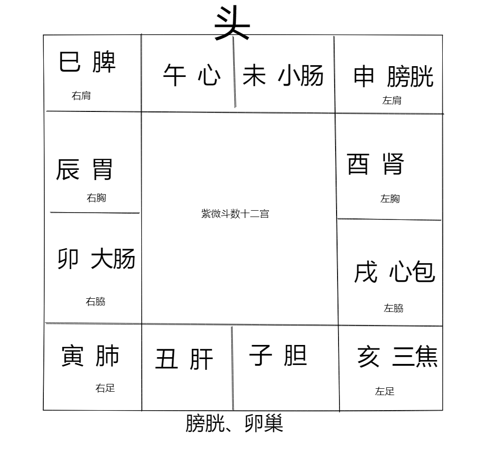
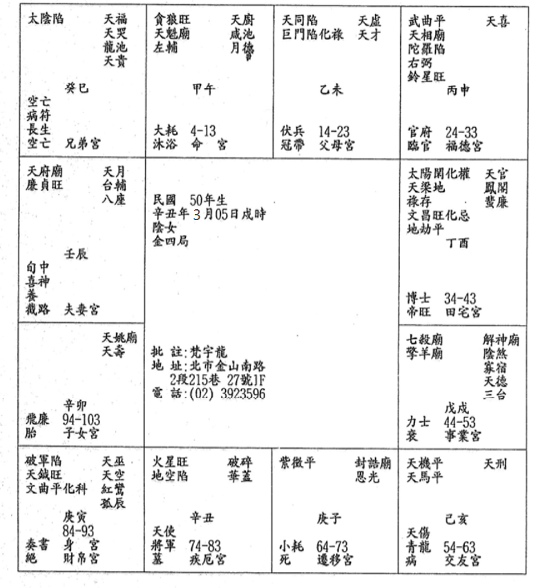
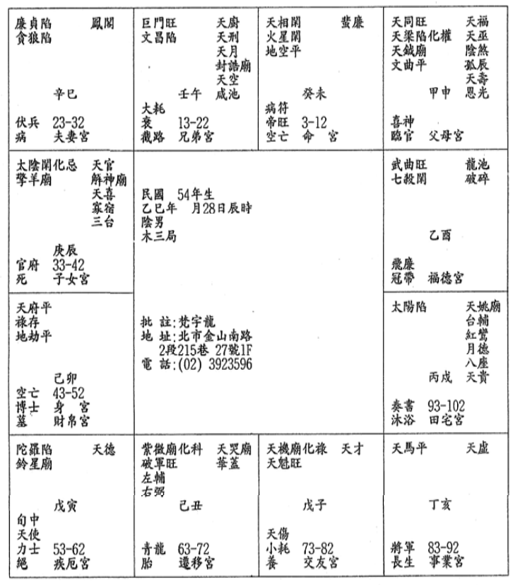
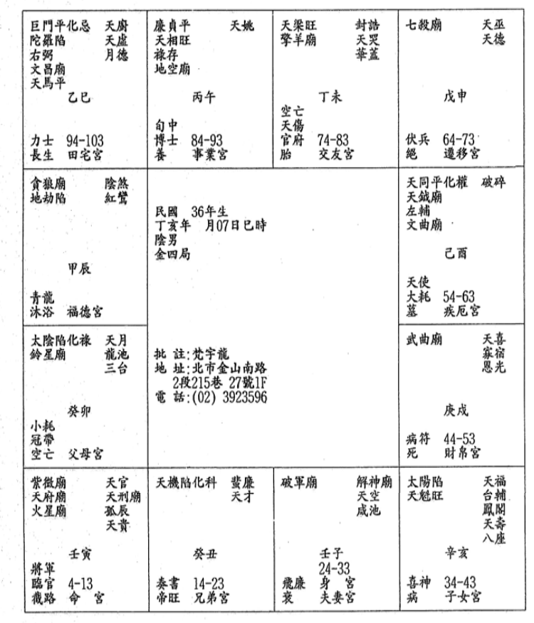
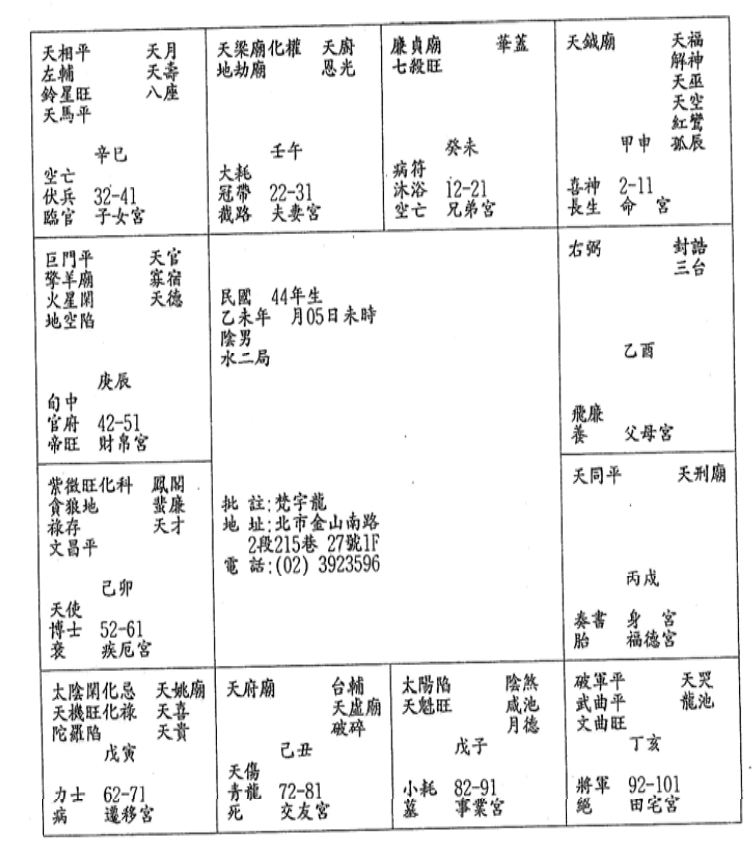

## 紫微斗数

紫微斗数十二宫

命->兄弟->夫妻->子女->财帛->疾厄->迁移->仆役（朋友）->官禄->田宅->福德->父母

> 命宫看三方四正 -官禄、财帛、迁移

### 四化星：科、权、禄、忌

科：考试、专业技能、科名、名气大 - 科代表有才，没有将领
权：官印、性刚 - 权代表有领导才能
禄: 财、性守
忌：截杀、想不开

### 南斗星系
* 天府星 - 南斗星君
  * 主文官带、主教星
  * 这种人眉毛特别粗
* 太阴星 - 月亮
  * 女性的话会很漂亮
  * 主文官带、正财
* 天梁星 - 食神
  * 主官带、文武双全
  * 长相英俊，蝶飞眉
* 天相星 - 佐才星
  * 天相星如入宫代表有位无权
  * 瘦瘦高高
* 七杀星 - 杀星 
  * 主武官
  * 目大、多疑
  * 主耗、劳
* 破军星 - 杀星
  * 主武官
  * 性格孤僻、不重利
  * 主耗、劳
* 贪狼星 - 杀星
  * 主武官、主桃花、酒色财气赌

### 北斗星系
* 紫微星 - 属阳
  * 主官带
  * 帝星，没有左辅星、右弼星时代表孤星
  * 落在官禄宫最好 
  * 可解凶星
* 天机星 - 属阴
  * 主文官带
  * 个头矮、皮肤黑、体格精壮
* 太阳星 - 
  * 主武官带、主财路（横财）
  * 主父、夫、子
  * 红光满面，双目圆大、圆脸、肤白、中等身材
  * 大贵星可解灾
* 武曲星
  * 主武官带、主财路（财路的王）
  * 长相五短
  * 大贵星可解灾
* 天同星
  * 主人和 
* 廉贞星 - 杀星
  * 主武官带
  * 次桃花
  * 长相清秀

* 巨门星 - 凶星
  * 主口舌、是非、官司、牢狱
  * 巨门星入庙，灾少一些甚至是好事。
  * 巨门星落陷，就坐牢了....
  * 个子小，声音高
  * 身体毛发多，肥胖
* 禄存星 - 财星，同化禄
  * 主小气

### 六杀

  * 擎羊星 -小人
  * 陀罗星 -小人
  * 火星 - 火光之灾
  * 铃星 - 火光之灾 
  * 天空星
  * 地劫星

杀星越暗越凶，杀星入庙问题不大，杀星落陷就麻烦喽~

杀星入庙（很亮），代表凶处藏吉
杀星落陷（很暗），代表吉处藏凶

### 副星
  * 文曲星
    * 主博学
  * 文昌星
    * 主科甲
  * 天魁星
    * 主科甲
  * 天钺星
    * 主科甲
  * 红鸾星
    * 主喜
    * 男命红鸾必招美妻。女命红鸾必有贵夫
  * 天喜星
    * 主喜
  * 左辅星、右弼星 - 辅助紫微星
  * 三台星、八座星 - 辅助天府星（此时的天府星才有化凶的功能）

###  权星
权星：化权、紫薇+七杀同宫

### 灾

  廉贞+七杀: 半路死亡

  廉贞+破军：水中做冢

  廉贞+贪狼： 夭折（横死） - 先天疾病、自杀

### 死离

1. 福德宫凶
   1. 廉贪
   2. 廉破
   3. 化忌
2. 阳宅
   1. 西北方厨房死先生、客厅主生离
   2. 西南方厨房死妻子、客厅主生离

> 需要命上有灾+运上有灾。才会出现。此时天地人三才已经占2/3.我们用人间道劝半天还是不行。

### 星辰亮度
  庙（吉）、旺（吉）、利（中）、陷（凶）

### 正财和偏财

正财就是领死工资，打工、公务员

偏财就是做老板，开店铺等

### 格 

* 日月夹财
  * 命格左右分别为太阳星和太阴星
* 紫府夹权
  * 命格左右分别为紫微星和天府星
* 魁钺夹贵
  * 命格左右分别为天魁星和天钺星
* 羊陀夹杀
  * 命格左右分别为擎羊星和陀罗星
* 半空折翅
  * 命宫在巳宫，或者亥宫并且廉贞贪狼落陷在命宫，或者命宫是空的，落陷在对宫。这种命大限在中年
  * 命宫对宫化忌，三方四正无吉星来会
* 日月夹命
  * 太阳和太阴反着出现在命宫左右

**武杀会：**
  
  1. 女子的话主孤单
  2. 离祖，到异乡发迹
  3. 男人的话主武职大利
  4. 商人主老多功少，武曲与七杀都是权星，不掌财

* 紫府成桓
  * 紫薇+天府落在四个角上，大贵。位列三台

* 七杀朝斗
  * 指命宫位于子、午、寅、申其中之一，由七杀星独自坐守，大贵。将军象

### 十年大运

**闰月生人，做下一月论**

**子时生人，要换日，11-0点为当天晚子时。0-为第二天早子时**

命好不如限好 （限就是十年大运）

小儿善知人意，小儿有大人像，主夭折

### 小流年的算法

小流年看对宫和本宫，从戌宫起止

> 4-2；4分钟讲小流年

假设1954年生人，甲午年。批1994年此人流年

1. 1994-1954+1=41
2. 从戌宫开始为`子`，一次计算戌宫->未宫->辰->丑宫->戌宫, 找到`午`对应的宫，此处为辰宫
3. 从找到的宫开始为1，男顺女逆找到41所在的宫，就是今年的流年

### 离日、绝日

春木、夏火、秋金、冬水

春分、秋分、夏至、冬至前一天是离日

立春、立夏、立秋、立冬前一天是绝日

### 贵象

火形局 瘦瘦小小
木形局 瘦瘦小小红红的
土形局 长相厚重，头圆脚方
金形局 长相方方的
水形局 圆圆的

北人南象、南人北象

### 身宫

代表后天、在迁移宫代表后天要去外地发展，在官禄宫代表要当官，身命同宫代表祖业很大且会继承祖业，在夫妻宫代表受婚姻影响很大
在财帛主劳累赚钱，不可做家庭主妇
> 七杀临身终不美，一辈子多败少成

### 大限的算法

未来十年无大运，大限在今年
未来一年无大运，大限在前一年

### 合八字
  八字合或者八字不合都可以结婚。有些人必须找八字不合的才可以结婚。慢慢研究

## 技巧

女命遇到武官星主孤单

## 办公室风水

门的朝向是外挂

老板的办公室是内挂

### 口诀
当贪狼在子宫、亥宫的时候是正格桃花星。会长相高大

官禄宫，最喜欢有权星入宫
> 权星：化权、紫薇+七杀同宫

财星与权星相会，代表财权很大，但是财不是自己的。财权大的人悬胆鼻或者颧骨很大+手很软

七杀临身终不美，一辈子多败少成

### 头上的穴代表出生时间

头上的穴：子午卯酉 偏左手、局中，,寅申巳亥 偏右手，辰戌丑未 双穴以上

### 紫薇斗数方位

卯时宫 正东
午时宫 正南
酉时宫 正西
子时宫 正北

## 看挂实例

### 1. 辛丑年3月5号 戌时生人
      

命宫是贪狼星，主武官，主桃花。女子得武官命，不好
> 当贪狼在子宫、亥宫的时候才是正格桃花星。会长相高大

命宫贪狼星在午宫，长相越瘦小越好。天魁星也在午宫，天魁星是文官，男生文武双全，女生就会很累

官禄宫，最喜欢有权星入宫，此人官禄宫七杀、擎羊, 当官不好。

身宫在财帛宫，主工作赚钱，化科主考试、技能，天钺星又主科甲，有技能傍身可以赚钱，破军星主耗、劳代表她要靠技能走天下吃饭

紫微星在迁移宫，独星、代表独身在外会碰到贵人

兄弟宫 太阴星在巳时出现代表不好，兄弟宫太阴星落陷此人没有兄弟或者兄弟夭折

太阳和太阴如果是反着的，大部分都是外地发展

父母宫化禄，代表父母有财禄给她

田宅宫 酉宫化忌，代表肾不好，疾厄宫在丑宫有火星旺代表右侧妇科不好

天马星在朋友宫，代表此人会为朋友奔波。杀星在朋友宫的话，代表朋友会变仇人

子女宫是空的。看对宫，化忌。没有儿子。如果先生有两个孩子，那么就会生两个孩子，比较像先生，如果像太太，就是不好的象，小心夭折

夫妻宫廉贞星、天府星，很温和，清秀漂亮，个子不高。看夫妻宫的三方四正，没有科权禄。夫妻感情很好，没有儿子

福德宫

**流年**

34-43 田宅宫太阳星 + 化忌 ，太阳星在女子的命中代表男性，这十年此人见不到父亲丈夫儿子

批流年的时候，所在的宫为值日发生之大事

### 2号-紫微星在丑宫

      

  命宫有天相星，天相星是非常好的辅佐的星。不会去想权位，长相瘦瘦高高。
  > 天相星如入宫代表有位无权

  迁移宫，紫微星+左辅右弼+化科，此人去外地发展更好。

  夫妻宫，廉贞星+贪狼星落陷，婚姻不好，对象会沾酒色财气。
  **解：**
    1. 结婚对象找一个二婚的。
    2. 结婚对象比此人大七岁以上

  子女宫化忌，没有儿子。太太的命里有就会有儿子，比较像太太，如果像这个人就主夭折

  子女宫和田宅宫 日月反对，太阴和太阳反了，代表工作晚上比白天忙，代表六亲不靠，代表性情刚燥，脾胃不好。

  福德宫有武曲和七杀，指此人主要靠自己。
  
  **武杀会：**
    
    1. 女子的话主孤单
    2. 离祖，到异乡发迹
    3. 男人的话主武职大利
    4. 商人主老多功少，武曲与七杀都是权星，不掌财

### 3号-紫微星在寅宫

      

**命格**
  
  命宫 紫薇星+天府

  子女宫 太阳落陷，对宫 化忌，大凶

**流年**

### 4号-紫微星在卯宫

      

  天梁星在午宫一定是入庙的。代表一品武官。一方之子可掌生杀大权。
