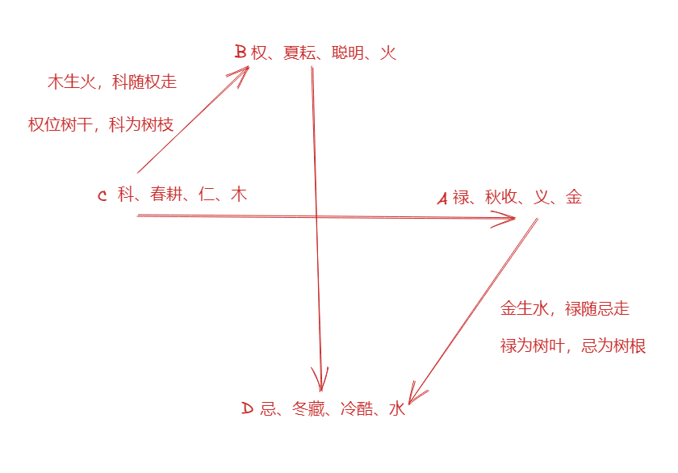

# 相

## 土相

喜欢帮助别人，能够去支撑别人。厚重、正直、喜欢融入社团

脾、胃

## 木相

聪明，喜欢吸收新的知识。

属木、主聪明、学习能力强、利化万物

肝、胆

## 金相

个性刚强，叛逆性比较强，带有萧杀之气，做事果断、冷酷

肺、呼吸系统

## 水

水利万物，流动性强 

肾脏、膀胱

## 火

不耐静、热情如火，来得快去得快、爱面子。

心脏、高血压、电器、眼睛、父、夫、子等

# 宫

## 命

* 命宫在天罗（辰），容易不得志。太阳在辰可以解

* 命宫有龙池养鱼、鳯阁养鸟、天刑养狗、天姚养鸟能解

* 命宫与迁移宫有铃星 + 文昌 + 陀螺 + 武曲，主大凶，限至投河。大破败格局

## 夫妻宫

* 有孤辰、寡宿、破碎、解神，主聚少离多、主离婚，要注意婚姻上的经营
  > 解，分房睡做一个聚少离多的像，可减轻
* 夫妻宫洗干净，不喜欢有很多星在里面

## 田宅宫

* 化禄代表整个家族都有钱

* 命宫有龙池养鱼、鳯阁养鸟、天刑养狗、天姚养鸟能解

# 星类

## 官禄星

紫薇、太阳、太阴、廉贞

## 福禄寿喜

福：天同
禄：天相
寿：天梁
喜：七杀

## 解恶制化星

* 紫薇： 因为气场强、帝王星
* 天同： 因为他是福星
* 天梁： 因为他是遇难成祥之星
* 禄存+天马： 禄马交驰，越动越有财，有钱就能解决问题。

## 阴暗星

太阴、陀螺、铃星、巨门、阴煞

> 任意两颗同宫，身体就有很难检查出来的毛病

陀螺 + 铃星 主折磨

## 孤尅之星

武曲、七杀、破军星

# 十四主星

## 紫薇

吉星，属土，属阴，主女，帝王星、官禄星、强势星

喜欢管理别人，不喜欢被管理。喜欢动口，不喜欢动手。

落官禄宫则当官走仕途较好

遇煞星，会受制于小人，则会多有孤独感。

## 天机

属木，属阴，主男，宗教星

聪明、机敏、善良、会有宗教信仰、善于策划谋略

是善变之星，有比较心、抗上心、不服输等特质，善变是指容易不能贯彻初心。

对于知识容易博而不精，容易想得多做得少。

天机星通常会有特殊的机遇和才华

* 有天机之处，必有六亲。不在本宫就在对宫
  > 例如天机星在巳宫，则六亲中必有属蛇或者属猪的。亥是巳的对宫
* 天机+文昌主健康不好，注意所在宫主的疾病即可
* 机巨同临格，主聪慧，易动口才生财

## 太阳

属阳火，属阳，主男、主官禄

热情如火，心地善良，喜欢帮助别人

落丑未宫，平淡不主吉凶

* 旭日东升格： 太阳+巨门在寅宫时，通常都会早发迹

* 日照雷门格： 太阳+天梁在卯宫时，富贵可期

* 阳梁昌禄格： 太阳+天梁+文昌+禄存。主读书好，官运好。 未来走仕途会很好

* 日出游龙格： 太阳在辰，可解命宫在辰的不得志，主逍遥自在

* 食客三千格： 太阳在巳，主企业做的大，或者去大企业会更好

* 日丽中天格： 太阳在午，富可敌国。容易招敌

* 披星戴月格： 太阳在子，主辛苦、劳碌

* 日月反背格： 眼目有伤。尅父、夫、子，早年一定会辛苦。
    > 解：移根换叶，去拜一个义父。
* 移根换叶格： 太阳在戌亥。需要拜干爹转运

* 日月丑未中，加科禄定位黄伯公。 日月同宫者容易性情多变。

## 武曲

属金，属阴，主女，权星、财星（紫薇座命时，武曲星一定在财帛宫），嫁娶之星

* 个性刚强、叛逆性强，男命利武职
* 不利女命，为孤尅之星
  > 解：让女性出去上班，不要做家庭主妇，便可以化掉武曲的一些能力，否则容易家庭不合

## 天同

属水，属阳，主男，福星，可解恶制化，孩童星，安定之星， 福禄寿喜中的福，姻缘之星

天同具有同情心，温和，不计较，对人谦虚谦和有礼貌

天同是福星，但是此福星得来不易，须经灾难考验。天同是安定之星，所以灾难通常是伴随着人生转变之时而来

* 天同座命，一生中必定会有一次大灾难（包含钱、物、命等）。
* 天同 + 吉星 要以安定为主，比如走仕途

## 廉贞

属阴火（火主心脏），可男（化禄为男）可女（化忌为女）, 主官禄，为祖山，主变化多端（配不同的星，有不同的效果），次桃花星

主变化多端的行业例如： 主司法、主交通、主电脑、主荒郊野外、主杂货店

* 命宫有廉贞+四化，必有祖荫
* 廉贞 + 文昌主好礼乐、知书达理
* 廉贞 + 火星主狼心狗肺、心术不正
* 廉贞 + 化忌 + 天刑，会有官司是非
    > 解：命宫是这三颗星的话，可以去司法行工作
* 路上埋尸格： 廉贞 + 化忌 + 擎羊 + 七杀落迁移宫。

## 天府

属土、属阳、不四化，不主男女、南斗帝王星，库星、财星

有权威、有才华、财星、安定之星。最喜落戌宫

* 适合女命，心正夫贤子贵
* 武曲+天府：代表财能入库
* 天府临戌有吉扶，腰金衣紫富万金。天府在戌宫一定与廉贞同宫。若再加其他吉星则更好
* 天府落官禄宫容易得不到上司的赏识
* 天府+煞星：主人伦亲情不好（不享天伦之乐）、主出生环境不好
* 大运、流年走到天府所在宫，必有阴暗面事情发生。（吉星来会稍微好点，若天府独星或天府+煞星则必有灾祸）

## 太阴

属水、属阴、主女、主田宅、不动产、财富，

浪漫、柔情似水、阴晴不定

* 男命命宫太阴独守个性柔弱。容易得女人庇荫
* 太阴在申宫到子宫都是好的
* 太阴 + 天机在申宫，个性比较深沉，诡计多端，聪明有才华
* 明珠出海格：太阴独守在酉宫或戌宫，主运势旺
* 月朗天门格：太阴独守在亥宫，加官进爵
* 机月同梁格：天机+太阴+天同+天梁在三方四正相会。正格为天机+太阴在申宫，天同+天梁在三方。主吏人，一生应以安定为主。
* 机月同梁+左右昌曲任一个，都应当尽量安定，切勿变化
  
## 贪狼

属木，属阳，主男，主桃花，祸福之星，欲望之星，善恶一线之间，教化之星

永远与天同六合

* 杀破狼格：主运势起伏会很大
  > 解：多运动，保持健康的身体，慢慢熬
* 贪狼 + 武曲： 滚滚来财。一定在丑、未宫才会同宫。
* 火贪横发格：贪狼 + 火星偏财运很旺。要注意见好就收，偏财运不长久
* 长寿命格：贪狼在长生位。

## 巨门

属水，属阴，主女，主口舌

祸从口出，心地善良但是疑心病重。讲话会比较尖锐，容易得罪人，但是本身有不介意得罪别人

* 突变格： 巨门 + 擎羊 + 火星，得忧郁症后自杀。通常都是突发性的。在午宫与酉宫为最凶
* 巨门在午：早年经磨练，晚年不一定有成

## 天相

属水，属阳，不四化，不主男女，食禄之神，佐才星。福禄寿喜中的禄

喜美食，喜打扮，外表斯文，不爱与人争，适合辅佐

适合服装、饭店，也适合律师、法官行当

* 座命适合女命。如果是男命则缺乏魄力，不适合做领导

## 天梁

属土，属阳、主男，荫星。福禄寿喜中的寿

长寿星、医药星、领导星、长者星、宗教星、热心善良星，遇难成祥星、教育星

## 七杀

属金，属阳，不四化，不主男女，福禄寿喜中的喜

权威、肃杀之气，运势波动特别大，个性刚强，不受指挥

喜紫微星（于巳、亥同宫），此时七杀星化为权星

* 七杀 + 火星 主身体灾难

## 破军

属水，属阴，主女，主朋友、夫妻、子女。

适合市场、物流等行业

* 忌与擎羊会，破军 + 擎羊主运势不好
* 水中做冢格：廉贞 + 破军 + 擎羊。位于卯酉宫。会有覆车兽伤之厄与水灾
* 武破昌曲格：主一生有一个才华。

# 六吉星

## 左辅

主动、主享受

辅佐、助力之星，依起主星是吉或凶，吉则更吉，凶则助纣为虐。

* 紫薇天府全依左辅右弼之功
* 落田宅主一天到晚出去跑
* 落福德主一天到晚喜欢应酬

## 右弼

主静、灵魂之所在

* 右弼做命宫容易自信自大

## 文昌

属金，主读书

* 一月生人文昌在财帛，其他月份依次由疾厄至子女
* 遇到文昌需要注意逆向思考，因为此星容易变化，逆向思考容易想到对的地方

## 文曲

属水，主琴棋书画、主口才、主财星，主女

* 文曲所在宫就是出生时辰的官禄宫
* 文曲所在的宫位，就一定会在此宫位得财
* 遇到文曲，应当顺应潮流，顺势而为

## 天魁天钺

天魁天钺不入辰戌宫。贵人不入天罗地网

天魁 男贵人，明显的贵人

天钺 女贵人、暗处的贵人

甲戊兼牛羊，乙巳鼠猴乡，丙丁猪鸡位，庚辛逢虎马，壬癸兔蛇藏

* 魁钺夹命格：主有贵人扶持
* 座贵向贵格：大富大贵
* 天魁天钺在哪个宫，哪个宫就是贵人

# 六凶星

羊、驼、火、铃、地空、地劫

## 擎羊

属金，为刀，为血光

* 马头带剑格：擎羊 独坐午宫，且为命宫。马头带剑威震边疆。

## 陀螺

属金，为小人，为暗灾

## 火星

属明火

脾气暴躁，不记仇，

* 遇贪狼则主横发。

## 铃星

属暗火

记仇，深沉

## 地空

通常由自己的原因造成损伤，空欢喜

> 解：宗教，读书，进德修业即可

## 地劫

通常由别人的原因造成损伤、破财

> 解：宗教，读书，进德修业即可

# 次级星

## 禄存

禄存不入四墓地，辰戌丑未。

禄存前羊后陀

禄存布星：甲禄在寅，以此顺行，巳、午两宫重复。

## 红鸾、天喜、咸池、天姚

与姻缘有关的正桃花

咸池、天姚也代表桃花，天姚主性格活泼，无媒自招

* 命带天姚 喜欢唠嗑、跳舞，人缘好
* 咸池主同居，流年座咸池主同居的意思
* 红鸾、天喜、咸池、天姚，有两颗桃花星同宫的话，会招桃花。贪婪、廉贞、文曲、右弼都是桃花
* 流年逢红鸾 + 擎羊，主开刀。尤其是落疾厄宫时。

天喜主增添人口，结婚、生子

* 遇到孤辰、空亡主人流
* 流年逢鸾喜，主喜事

## 龙池、鳯阁

龙池、鳯阁在丑未同宫，主才华出众，主烹饪、琴棋书画的才华

龙池主教化之星、鳯阁主靓丽，打扮

* 贪狼 + 龙池、化科 + 龙池、文昌 + 龙池，多主当老师、培训师。
* 龙池入六亲宫，主争执
* 龙池 + 煞星，主耳朵生病
* 鳯阁 + 煞星，主牙病，要注意少吃甜的、硬的食物
  
## 三台、八座

三台、八座在丑未同宫，主有司机、有佣人。主富有、有名声

三台主小车，八座主大车、高级车

* 三台 + 八座落命宫，表示出身大富大贵

## 台辅、封诰

封诰主外号，文书上的喜庆，例如通知书一类

台辅主负担

* 台辅落田宅，十有八九是贷款

## 恩光、天贵

恩光主有贵人恩惠，有好的机遇，有不劳而获只像

天贵也主贵人，会有贵人帮助

在丑未同宫主运势好，轻松快乐

* 恩光、天贵落命宫、财帛、官禄，主贵人多，左右逢源。知足常乐。

## 孤辰、寡宿

主个性自我，不合群，不利六亲，主夫妻聚少离多

## 天哭、天虚

子午同宫

天哭主外表严肃、不苟言笑

天虚主精神耗弱，落命宫主身体虚弱多病

* 流年落天哭、天虚，主有坏事发生，主本身有烦恼、没精神、懒散。万事不顺

* 东谋西不就，心事乱茫茫。
* 子午同宫与田宅，主破产破财卖资产
  > 解：自己卖点资产，做一个像即可
* 子午同宫与父母，主父母不好。

## 天刑

主刑克，主法律

天刑和天姚固定三合

* 做命宫或三合，主一生有官司是非
  > 解：入刑法行即可
* 某宫三方为天刑和天姚的时候叫做破体位，流年走到此宫主出大事情。
  > 此年需要稳扎稳打，切莫冲动
* 天刑 + 煞星 主开刀、主较大的冲突，再加火星的话主更凶

## 天马

定天马，由寅宫起子，逆数四马地数到生年地支。 卯年生人，寅->亥->申->巳循环，由子数到卯，所在宫落天马星（巳）。

主奔波

* 折足马格：天马 + 陀螺，主外出不利，主容易做出糊涂的决定
* 禄马交驰格：天马 + 禄存，可化解灾厄，主禄马交驰，越动越有钱
* 战马格： 天马 + 火星，个性很急，做事情很快，不易投机

## 天巫

主宗教、主入迷某种事物、主中间人资源整合

## 天才

主聪明才智

* 天机 + 天才，主聪明绝顶

## 天官

主升官发财，小天梁，喜欢花花草草，喜欢安静的田园生活

* 天梁 + 天官，主长寿

## 天福

主升官发财，小天同，喜欢收集古董，把件等

* 天同 + 天福，主福报

## 天寿

主长寿

* 天梁 + 天寿，主贼特么长寿

## 天月

落疾厄主病痛，其他宫位主专注所在宫之事

## 天德、月德

天德主年长之男性，月德主年长之女性

## 天厨

主有口福，可开饭店做厨子

## 阴煞

主犯小人，主疑心病，主脸黑

## 破碎

主墨迹，主事不成，功败垂成

## 解神

主分离，分解，适合做精密器件工作

* 解神 + 煞星，要小心开刀手术

## 华盖、空亡

华盖主宗教

* 华盖 + 空亡 + 天机，主潜心向佛

空亡指天空、地空、截空。主变化多端

# 流

## 流马

定流马，由申宫起月，逆数四马地数到生年地支。 2月生人，寅->亥->申->巳循环，由1数到2，所在宫落流马星（亥）。

# 博士十二星

禄存所在宫起博士，顺行。

博士、力士、青龙、小耗、将军、奏书、飞廉、喜神、病符、大耗、伏兵、官府

学识、规矩、运气、开销、刚硬、文书、小人背后指指点点、好事多磨、疾病、开销大、背后小人、官司罚单

# 岁前十二星

以生年地支宫起岁建，顺行。

岁建－－主一年祸福，逢吉喜事多，逢凶灾病来，忌与年命相冲，流年逢忌结婚。

晦气－－暗中不利，喜吉星化解，忌诸凶，加吉出外有财利，加煞是非失和、倒晦。

丧门－－主孝服，虚惊，灾病，破财，伤心事，不幸事，加煞更是。喜吉星化解，庙旺祸轻，宜静不宜动。三方会齐哭虚二星，主本年有丧事。流日逢亦主吊丧事。加白虎，主有孝服。

贯索－－象意被绳索捆绑，被困，如住院、困于家中等，亦主因争讼受到牵连，煞忌聚主牢狱之灾。寅申宫灾轻，忌合伙，小心朋友拖累、是非争讼。疾厄宫见煞忌主留医。

官符－－平民逢主官灾、诉讼，但若会龙德及奏书则不妨；宫吉，原作官者逢吉反可升官，亦利考试交易，须防小人暗算，入庙灾轻，逢吉可解。流年官符与生年官符贯索会齐，有牢灾。加劫煞，必有口舌是非。

小耗－－加吉诸事仍顺利，财来则有小破，忌合伙经营，还防传染病、遗失、浪费。喜吉星化解。较适用于流月流日。

大耗－－破祖又退财，败落，甚则破产，诸事多不顺。防小人暗算和口舌是非、暗疾。亦有桃花的性质。忌入命身财田宫。较“博士十二神”的大耗为轻。较适用于流月流日。

龙德－－能逢凶化吉，喜入命身。主喜庆添丁，受赏升职，事业顺遂，但须防小疾病。

白虎－－凶狠勇猛，主疾病血光丧服，凶祸，阴邪，破财，喜吉化解，忌会丧吊官符，主官司刑罚丧服。利考试交易，女命有喜则吉。入流年父母宫主孝服。

天德－－得祖荫，天赐之福，品德高尚，喜庆财喜，事业顺遂，喜入命身宫，能化凶为吉，得贵人助，对凶厄及桃花煞均可化解，须防小人是非。对喜事有增加光彩的作用。

吊客－－主吊销、阻碍、吊丧事、孝服、访妻、虚惊、破财、不良变化、不顺、伤悲事，加煞更凶，喜得诸吉化解。忌远行乘车，宜保健防病。亦主问病。流年逢主有吊丧事。入子女宫，主多生少养，再见凶煞主绝嗣。

病符－主小病伤、败坏、是非。喜诸吉化解，忌诸凶。防官灾诉讼、疾病、口舌是非、流行病、传染病。

# 十二长生宫

长生、沐浴、冠带、临官、帝旺、衰、病、死、墓、绝、胎、养

# 十天干四化

甲廉破武阳、乙机梁紫阴、丙同机昌廉、丁阴同机巨、戊贪阴右机、己武贪梁曲、庚阳武阴同、辛巨阳曲昌、壬梁紫左武、癸破巨阴贪

# 测字

水二局、土五局 申宫起长生

木三局 亥宫起长生

金四局 巳宫起长生

火六局 寅宫起长生

笔画 12, 34, 56, 78, 90 代表五行局

由五行局起长生顺数到当前时辰，所在宫就是结果

* 沐浴代表桃花，
* 长生、冠带、帝旺都不错，
* 病、死、墓、绝不好，
* 胎、养代表需要供养，但是最终是好的

# 天盘、地盘、人盘

天盘指先天命盘，地盘指大运盘，人盘指流年盘

## 流月、斗君的算法

口诀：流年岁建起正月，逆逢生月顺回程，回程顺至生时止，便是流年正月春

月斗君：本流年斗君所主的宫位，即为本年正月所主之宫位，即为本年正月所主之宫位，依次顺行到本年之十二月

例如此人生日五月午时

1. 从子宫开始逆时针数月数（5月），此例到到申宫。

2. 从申宫开始，顺时针一直数到时（午时），此例到寅宫。

3. 从寅宫开始，顺时针一直数到当前农历年（戌年），此例到子宫。子宫就是看流年的正月，然后顺时针就是看日正月初一就是丑宫。

### 更NB的斗君算法

天盘中寅宫所在的宫位，每年流年的对应宫位就是斗君。例如 寅宫位夫妻宫，则每个流年的夫妻宫就是流年斗君。

## 流日的算法

当月所在宫位的下一个宫位起初一。例如一月在子宫，一月初一在丑宫

## 流时

当日所在宫起子时即可。以此顺序

# 排盘

1973.8.29 巳时 男

1. 画命盘，写**十二地支**
2. 换算成阴历为：**癸丑年**
3. 癸为阴：**阴男**
4. 根据掌中决，起寅宫天干：**甲**
   > 甲己：起丙。 乙庚：起戊。 丙辛：起庚。 丁壬：起壬。 戊癸：起甲。
5. 起命宫，寅宫起一月顺行至生月【酉】，然后逆行至生时【辰】。**命宫为辰宫**
6. 以此逆行填入十二宫，**命兄夫子财疾迁仆官田福父**
7. 此时命宫天干地支为【丙辰】，根据六十甲子纳音得到【丙辰丁巳沙中土】，定五行为：**土五局**，由五岁起运
8. 从命宫开始按照，阳男阴女顺行，阴男阳女逆行，以此填入大运：【命宫为5-14】
9. 布紫微星, **29/5 -> (29+1)/5=6 -> 6-1=5**, 寅宫起1顺行数5，落紫微星
   > 生日/五行局数，把生日加某数字直到能够整除五行。如果加的是奇数，最后的结果减去对应奇数，如果加的是双数，最后结果加上双数，得到一个结果，由寅宫起1数到对应宫位即可落紫微星
10. 布天府星，紫薇星的对角线。在寅申为同宫，在巳亥为对宫
11. 根据口诀布十四刻主星
    > 紫薇天机逆流行，隔一阳武同，隔二是廉贞，天府顺流行，阴贪巨相梁杀，隔三是破军。
12. 布文昌
    > 在戌宫起子时，逆行至生时  
13. 布文曲
    > 在辰宫起子时，顺行至生时
14. 布右弼
    > 在戌宫起1月，逆行至生月 
15. 布左辅
    > 在辰宫起1月，顺行至生月 
15. 布天魁、天钺
    > 甲戊兼牛羊，乙巳鼠猴乡，丙丁猪鸡位，庚辛逢虎马，壬癸兔蛇藏
16. 布禄存
    > 禄存布星：甲禄在寅，以此顺行，巳、午两宫重复。
    > 甲寅、已卯、丙巳、丁午、戊巳、己午、庚申、辛酉、壬亥、癸子
17. 布羊驼
    > 禄存星前羊后陀
18. 布火铃，使用生年地支与生时，如歌诀，申年生人自寅宫起子顺行至生时，安火星。自戌宫起子，顺行至生时，安铃星
    > 申子辰人寅火戌铃、寅午戌人丑火卯铃、亥卯未人酉火戌铃、巳酉丑人卯火戌铃
19. 布四化
    > 甲廉破武阳、乙机梁紫阴、丙同机昌廉、丁阴同机巨、戊贪阴右机、己武贪梁曲、庚阳武阴同、辛巨阳曲昌、壬梁紫左武、癸破巨阴贪

# 剖腹产的要求

夺天地之造化

1. 命盘中不能有七杀 + 火星（战死边疆格）、七杀 + 铃星（思绪不停的劳碌命）、破军 + 擎羊（灾祸连年格）
2. 命盘中不能有擎羊 + 火星（突变格）、陀螺 + 铃星（折磨格）
3. 元神位不能被化忌冲，否则主一世辛苦
4. 来因宫不能有擎羊 + 火星、陀螺 + 铃星
5. 来因宫和元神位都要在我宫
   
# 婚姻八正位，四偏位

配偶的生肖在本人的父、子、兄、友，叫做偏位。座偏位主不会尽到婚姻的责任和义务，夫妻二人容易冤家路窄。但是问题不大

# 四化

化忌可座不可冲

化禄看化忌，以星辰阴阳合为最佳，化忌在我宫，方能守成

化权看化科，以星辰阴阳合为最佳

* 禄 + 忌 主一生财富

* 权 + 科 主一生名声

## 化权

**疾病主碰撞，肿瘤**

好：才华，能力等。坏：容易争，劳碌命

化权属火、主才华、能力、技术、领导地位。

可共患难，不可共享福

操劳是权之柄

性格会有优越性、压制性，容易与人起争执，招惹到小人

学习成绩会很好，容易学习中抓到重点

女命化权的话，婚姻通常就会给另一半带来压迫感

* 化权出的星辰要防备化忌的时候。权忌相冲的时候，很危险，例如先天巨门在迁移宫化禄，要防备丁宫时巨门化忌，化忌与化权冲突，冲命宫。

* 命宫化权主操劳，不甘平凡，容易求而不得

* 化权福德宫，就容易挥霍，不守财

## 化禄，缘起 

**疾病主 血光、开刀**

好：随和、聪明。坏：容易懒散

化禄主缘分、主财，不计较，随和，喜新厌旧、异想天开、领悟力很强、个性懒散、博而不精、喜助人，人缘好

小时候就是那种很聪明但是不好好学习的人

* 命宫化禄主享受，随和，一生比较不烦心
* 化禄官禄宫，与工作有缘，热爱工作，工作能赚钱，但是照夫妻宫。忙于工作对家庭不好
* 化禄田宅宫，家族有钱，家族的人都有禄
* 化禄福德宫，一生带财享受
* 化禄父母宫，当讲师行比较好

## 化科

**疾病主 湿寒、慢性病**

化科主桃花、科甲、健康、贵人、主规划、重形象、文书、有慈悲心、完美主义者、理想主义、重感情情绪化比较重、杞人忧天、念旧、多愁善感、善解人意、多情体贴、粘人

做事喜凭感觉。因烦恼而生智慧

学习温故而知新。常读书

* 命宫化科，仁慈，温文尔雅，完美主义，
* 迁移宫，外出有贵人、招桃花
* 财帛宫，主对钱财有规划，能守住财
* 官禄宫，主追求完美
* 田宅、父母，主书香门第

## 化忌，缘灭

万物归藏

**疾病主 心理疾病**

化忌在我宫为福，化忌在何宫，何处有心结

化忌主财富，主在此宫位欠的前世债。 主固执、猜疑、想不开、主观、多疑、患得患失、不得要领、钻牛角尖

主命运坎坷，山穷水尽疑无路，柳暗花明又一村

不喜读书，哪里化忌就以哪里为中心。

化忌容易心里想不开，着相，执着

化禄的钱财能不能留下来，主要看化忌，需要化忌在我宫，于化禄阴阳相合，如果化忌在他宫，主留不住财

* 化忌落四马地为拆马忌，主夫妻聚少离多
* 化忌冲命宫、福德、疾厄，主此人心理疾病 ，**福德、疾厄的化忌入迁移宫冲命宫，容易自杀**
* 化忌不易冲人位。主伤、散、聚少离多
* 子女宫化忌，容易冲到田宅宫

# 宫位转换
## 兄弟宫

兄弟宫为财库位

* 父母的夫妻宫，妈妈宫
* 田宅的财帛宫
* 财帛的田宅宫

## 财帛宫

* 夫妻的夫妻宫，是夫妻的对待位。
* 父母的疾厄宫

# 来因宫

生年天干所在的宫位称为来因宫，比如庚午生人，天干庚所在的宫位被称为来因宫。

来因宫是人生第一因。
* 来因宫为迁移，其三合宫同论，只要化忌，其他两干宫都不好。

* 来因宫在迁移，容易第六感强烈，通灵

# 业障忌

丑宫的天干化忌的星流转到成疾厄宫时，就是业障忌
> 丑宫天干辛，辛巨阳曲昌，文昌星所在的宫位，当大运或流年流转到此宫为疾厄时。就犯业障忌

# 示例

看夫妻

* 先看先天命盘夫妻宫有无四化
* 再看夫妻宫有无离心力自化
* 看十年夫妻、流年夫妻有无离心力自化