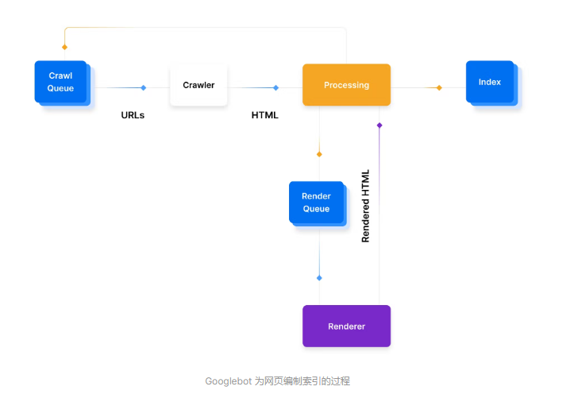

* [截止至2022年第一季度。已经有3.5亿+的域名被注册](https://www.businesswire.com/news/home/20220629006013/en/Verisign-Reports-Internet-Has-350.5-Million-Domain-Name-Registrations-at-the-End-of-the-First-Quarter-of-2022)

* [中国爬虫占比报告](https://gs.statcounter.com/search-engine-market-share/all/china/#monthly-202107-202207)

* [谷歌SEO指南](https://developers.google.com/search/docs/beginner/seo-starter-guide)

## 爬虫流程一般概述如下：

1. 查找 URL：Google 从许多地方获取 URL，包括Google Search Console、网站之间的链接或XML 站点地图。

2. 添加到抓取队列：这些 URL 被添加到抓取队列中，供 Googlebot 处理。Crawl Queue 中的 URL 通常会在那里持续几秒钟，但根据具体情况可能长达几天，特别是如果页面需要呈现、索引，或者 - 如果 URL 已经编入索引 - 刷新。然后页面将进入渲染队列。

3. HTTP 请求：爬虫发出 HTTP 请求以获取标头并根据返回的状态码进行操作：
   * 200- 它抓取并解析 HTML。
  * 30X- 它遵循重定向。
  * 40X- 它会记录错误并且不加载 HTML
  * 50X- 它可能稍后会回来检查状态代码是否已更改。

4. 渲染队列：搜索系统的不同服务和组件处理 HTML 并解析内容。如果页面有一些基于 JavaScript 客户端的内容，则这些 URL 可能会被添加到呈现队列中。渲染队列对 Google 来说成本更高，因为它需要使用更多资源来渲染 JavaScript，因此渲染的 URL 占 Internet 上总页面的百分比较小。其他一些搜索引擎的渲染能力可能与 Google 不同，这就是 Next.js 可以帮助您制定渲染策略的地方。

5. 准备被索引：如果满足所有条件，页面可能有资格被索引并显示在搜索结果中。

## 状态码对SEO的影响

### 3x

`301` \ `308`为永久重定向

`302` \ `307`为临时重定向

`308\307`比`301\302`更强大的地方在于：指定 308\307 重定向代码时，客户端必须在目标位置重复完全相同的请求（POST 或 GET）

> 对于SEO来说：谷歌的John Mueller表示如果您不确定网站收到哪种请求（GET、POST 等），308 在技术上更干净。在实践中，大多数网站的请求将主要是 GET，所以两者都是一样的

### 4x

`404`状态码表示服务器找不到请求的资源，不利于SEO，通常解决方案为使用404页面，不对爬虫返回404状态。

`410`状态码表明在源服务器上不再可以访问目标资源，并且这种情况很可能是永久性的，爬虫将会删除此条url，永远不会返回爬取内容

### 5x

`500`状态码表明服务器遇到了阻止它完成请求的意外情况，不利于SEO，通常解决方案为使用500页面，不对爬虫返回500状态。

`503`表明服务器尚未准备好处理请求，当你的网站宕机并且你预测网站将宕机一段时间后，建议返回此状态码。这可以防止长期排名下降（因为 503 状态通常是临时条件）。

## robots.txt

`robots.txt` 文件告诉搜索引擎爬虫：
  * 可以访问某个文件、文件夹
  * 不要访问某个文件、文件夹
  * 禁止某些爬虫的访问
  * 限制爬虫访问网站的频率
  * 加入网站地图的路径-因为robots协议文件是蜘蛛访问网站第一个访问的文件。这样做也会加快搜索引擎对网站的抓取周期

## sitemap

站点地图是一个文件，您可以在其中提供有关您站点上的页面、视频和其他文件以及它们之间的关系的信息，通常为根目录下的`sitemap.xml`、`sitemap.html`, 该文件应当为动态生成的，否则网站新增内容后，爬虫根据站点地图并不能得知新的内容。

关于何时需要站点地图，谷歌这么说：

1. 您的网站真的很大，此时爬虫工具可能会忽略抓取您的一些新网页或最近更新的网页
2. 您的站点有大量内容页面存档，这些内容页面相互隔离或链接不佳。 如果您的网站页面不能自然地相互引用，您就需要在站点地图中列出它们
3. 您的站点是新站点，并且指向它的外部链接很少，网络爬虫通过跟踪从一个页面到另一个页面的链接来导航网络。因此，如果没有其他网站链接到您的网页
4. 您的网站包含大量富媒体内容（视频、图片），如果提供这些，爬虫可以在适当的情况下将站点地图中的其他信息考虑在内进行搜索

## meta标签

