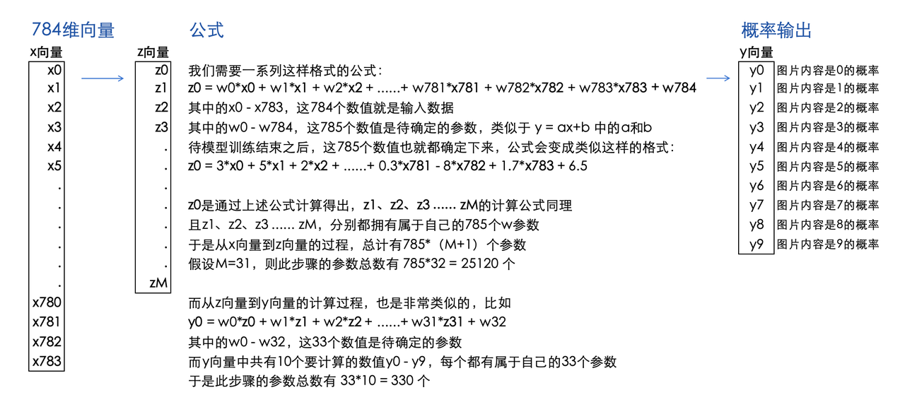
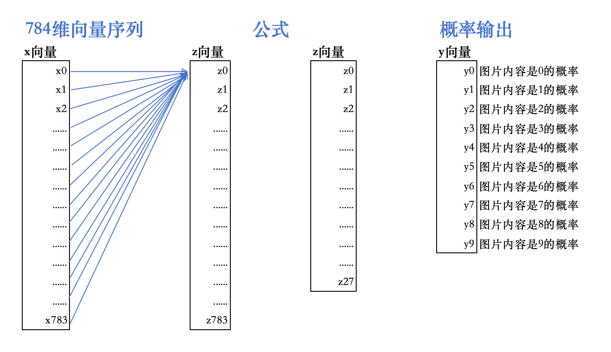
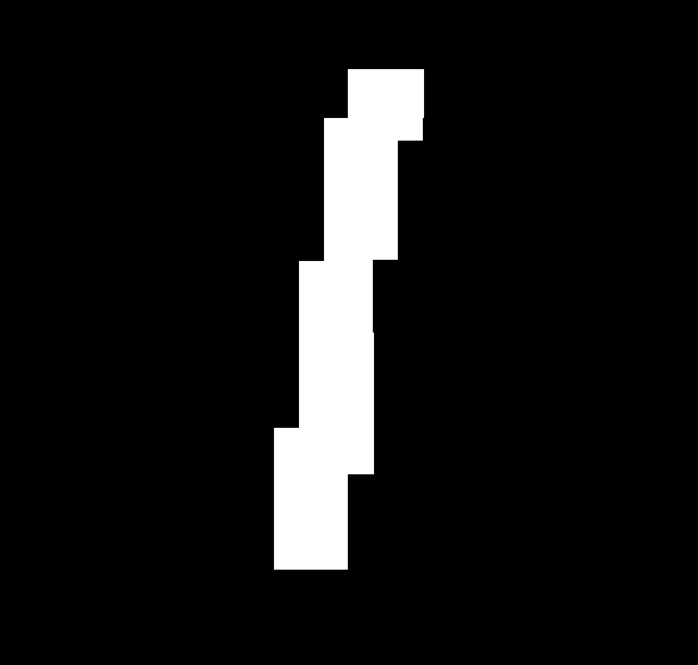
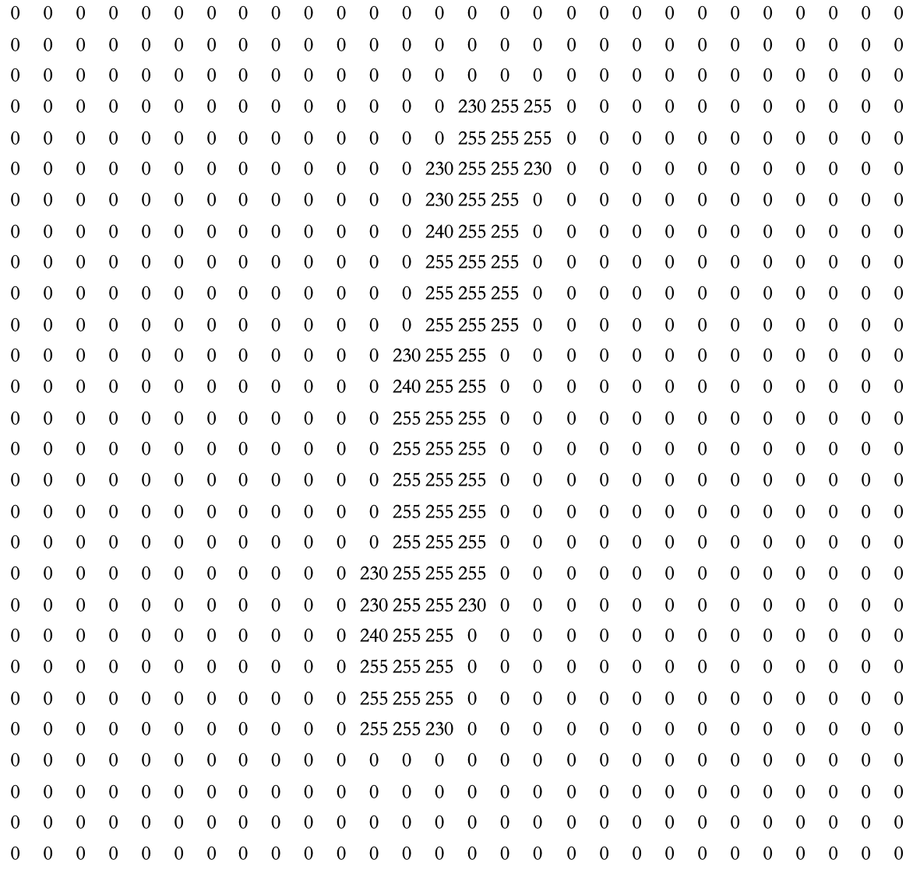
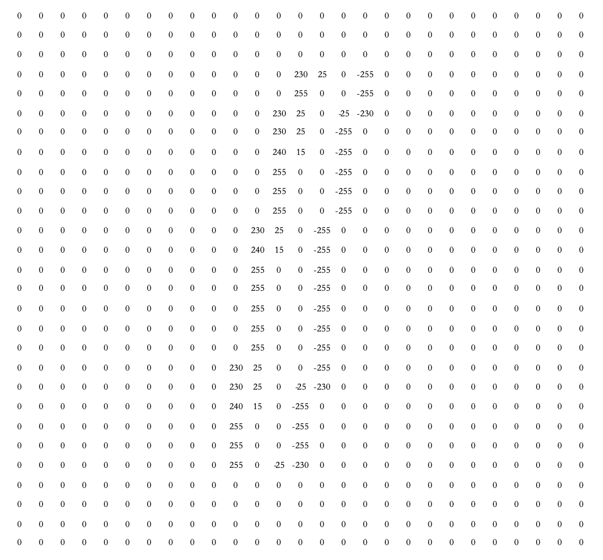
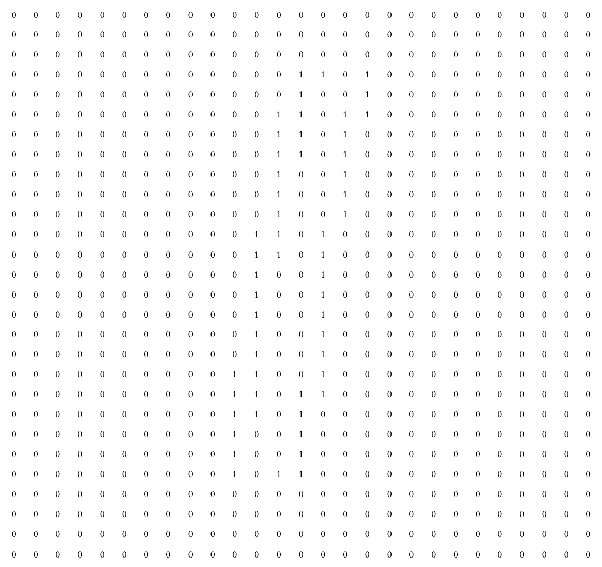
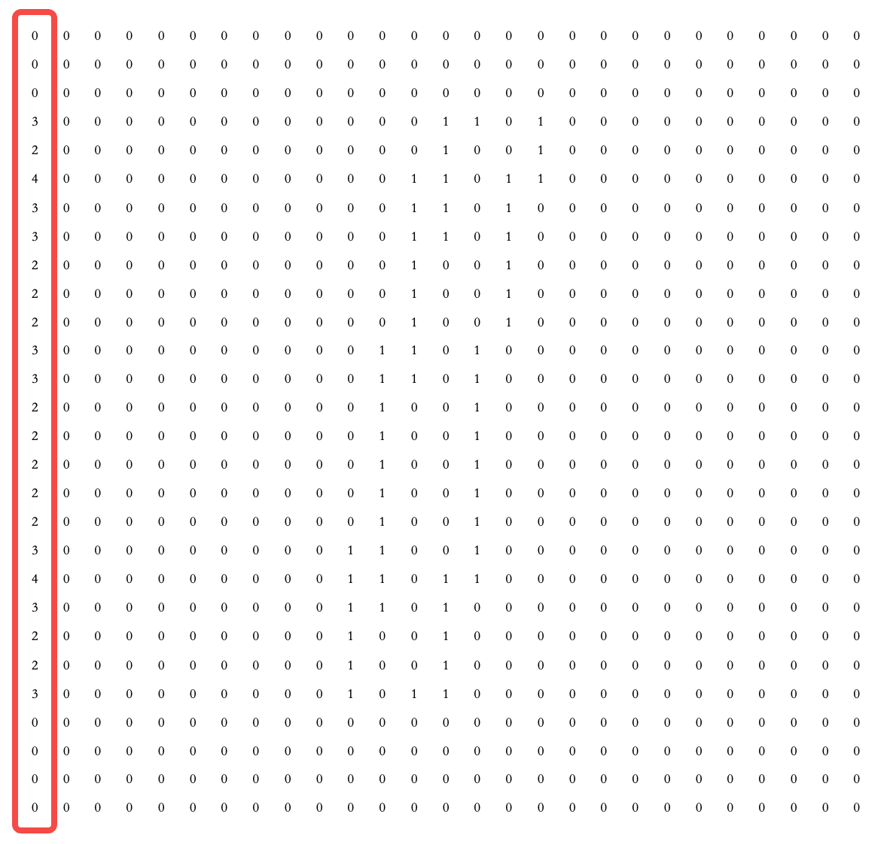

# AI

深度学习和强化学习的区别：

强化学习更关注决策和策略的优化，通过试错和奖励机制学习

深度学习更关注数据特征的表示，通过大量标注数据训练模型。

## 机器学习综述及示例

- 人工智能是人们渴望设计出一种「能够执行人类智能特征任务的机器」。机器学习是实现人工智能的手段，而深度学习只是机器学习中的一种特定方法。

- 我们通常所说的「机器学习」大致包含四大类：监督学习，英文为 Supervised Learning；无监督学习，英文为 Unsupervised Learning；半监督学习，英文为 Semi-supervised Learning；强化学习，英文为 Reinforcement Learning。

### 监督学习

- 监督学习通常解决分类和回归问题，监督学习中的「监督」就体现在训练集具有「标签」
- 股票价格预测，房价预测，洪水水位线预测，这都是机器学习**回归问题**。回归问题旨在实现对连续值的预测
- 辨识花朵类型、辨识猫狗动物，是**分类问题**

### 无监督学习

- 无监督学习主要解决**聚类问题**，例如一堆猫是一类，一堆狗是一类。
- 无监督学习 是面对无标签数据常常使用的一类机器学习方法，而通常我们用得较多的就是数据聚类。
- 它不仅可以用于数据的聚类，同时还能帮助我们给数据集添加标签。于是，很多机器学习的流程其实就变成了：原始数据没标签 => 非监督学习打标签 => 监督学习利用标签分类预测

## 线性回归实现与应用

- 线性回归是监督学习回归部分的基石
- 通过找到一条直线去拟合数据点的分布趋势的过程，就是线性回归的过程。而线性回归中的「线性」代指线性关系
- **拟合**是一个过程，这个过程是不断地计算最优线条的每个点在什么位置。最优线条找到后，就完成了数据的拟合
- 线性回归需要解决的问题，就是找到拟合数据点的分布趋势的这跟线，找到这条直线后，这条直线与每一个数据点的误差，被称作**损失**
- **损失**就是真实值和预测值之间的偏离程度，损失最小的线就是拟合度最高的线。

> 一个机器学习过程往往包含训练和预测两部分，训练好的模型可用于对未知数据的预测。而训练模型的过程，实际上是应用机器学习算法解决问题的过程。
> 定义一个损失函数（平方损失函数），并使用一种数学优化方法（最小二乘法）去求解该损失函数的最优解

## 多项式回归实现与应用

- 真实世界的数据往往没有简单的线性那么简单，对于非线性回归问题，最简单最常见的方法就是多项式回归，多项式回归能更好的拟合到非线性的数据

- 直观上讲，和线性回归的区别是拟合的直线变成了「曲线」。

## 梯度下降法

梯度下降法是一种十分常用且经典的最优化算法，通过这种方法我们就能快速找到函数的最小值。

Learning Rate 就是梯度下降算法中的**步长**

## 部署和推理

训练集构建的神经网络对新输入数据进行预测，就是推理。

推理又分为静态推理与动态推理。动态推理的过程是实时计算的，而静态推理是提前批量处理好的。

静态推理：我们通过集中对批量数据进行推理，并将结果存放在数据表或数据库中。当有需要的时候，再直接通过查询来获得推理结果。

动态推理：一般表示我们将模型部署到服务器中。当有需要时，通过向服务器发送请求来获得模型返回的预测结果。

# 神经网络与Transformer

- 模型是一个数学公式（y=ax+b），神经网络模型也是。神经网络公式是设计用来解决复杂问题所需的一些复杂的数学公式的。人类无法设计这类公式，于是写了神经网络，让其模拟人脑自己计算出公式所需参数。
- 这个公式在不断的计算参数调整权重的过程，就是训练过程。训练完成后，就得到了一个确认了参数的公式，只需要传入输入，即可得到一组输出。
- `y = f(x,w)`, `w`就是需要找到的参数，`x`就是输入。

包含了70,000张手写数字的图像，其中60,000张用于训练，10,000张用于测试，每张图像的内容只包含一个手写数字，从0到9的其中一个数字。

任务：给定一张28x28像素的灰度图像，经过一系列数学公式计算后，输出10个概率，分别代表该图像中的内容是0-9某个数字的概率

**整体流程概览**

这种在输入向量x和输出向量y之间，增加了一层z向量，并且用上述格式的计算公式去计算z向量和y向量中的每一个数值的结构，就叫做神经网络。

**数字1的手写体**

**转换成784维**

**第一层进行边缘提取操作**

**进行边缘提取操作**

**边缘转换成图片示例**

**第二层784维转换成28维**

## Embedding

Encoder一般用来做分析，Decoder一般用来做生成

图片、文字都可以通过向量化来分析和生成。

**RNN循环神经网络的Encoder Decoder，存在信息丢失、无法处理较长句子、不能并行计算的缺点，Transformer 带有注意力机制，可以用来解决这个问题。**

带有Attention机制的Transformer Encoder：

注意力机制：QKV

自注意力机制: 更好的提高了语义相关性

**过于复杂了，写不动**

- 目前大模型基本都是Decoder only的，把问题和回答直接结合到一起，使用解码器做续写任务即可。
- transformer 的时间计算复杂度是O(n^2), RWKV、Mamba等都在解决这个问题。
- MoE混合专家模型
  - 门控网络：类似判别器，动态决定由哪个专家模型执行逻辑
  - 专家网络：一组独立模型，每个模型独立负责某个特定子任务

