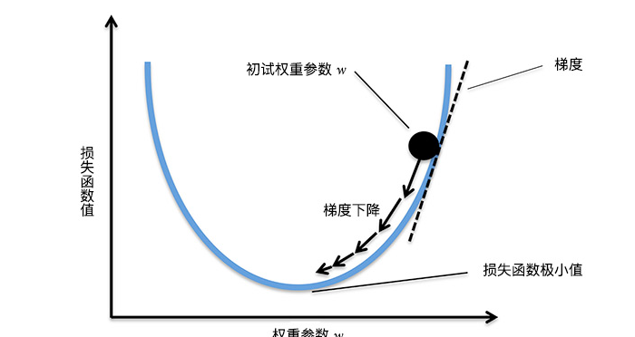

# AI

## 机器学习综述及示例

- 人工智能是人们渴望设计出一种「能够执行人类智能特征任务的机器」。机器学习是实现人工智能的手段，而深度学习只是机器学习中的一种特定方法。

- 我们通常所说的「机器学习」大致包含四大类：监督学习，英文为 Supervised Learning；无监督学习，英文为 Unsupervised Learning；半监督学习，英文为 Semi-supervised Learning；强化学习，英文为 Reinforcement Learning。

### 监督学习

- 监督学习通常解决分类和回归问题，监督学习中的「监督」就体现在训练集具有「标签」
- 股票价格预测，房价预测，洪水水位线预测，这都是机器学习**回归问题**。回归问题旨在实现对连续值的预测
- 辨识花朵类型、辨识猫狗动物，是**分类问题**

### 无监督学习

- 无监督学习主要解决**聚类问题**，例如一堆猫是一类，一堆狗是一类。
- 无监督学习 是面对无标签数据常常使用的一类机器学习方法，而通常我们用得较多的就是数据聚类。
- 它不仅可以用于数据的聚类，同时还能帮助我们给数据集添加标签。于是，很多机器学习的流程其实就变成了：原始数据没标签 => 非监督学习打标签 => 监督学习利用标签分类预测

## 线性回归实现与应用

- 线性回归是监督学习回归部分的基石
- 通过找到一条直线去拟合数据点的分布趋势的过程，就是线性回归的过程。而线性回归中的「线性」代指线性关系
- **拟合**是一个过程，这个过程是不断地计算最优线条的每个点在什么位置。最优线条找到后，就完成了数据的拟合
- 线性回归需要解决的问题，就是找到拟合数据点的分布趋势的这跟线，找到这条直线后，这条直线与每一个数据点的误差，被称作**损失**
- **损失**就是真实值和预测值之间的偏离程度，损失最小的线就是拟合度最高的线。

> 一个机器学习过程往往包含训练和预测两部分，训练好的模型可用于对未知数据的预测。而训练模型的过程，实际上是应用机器学习算法解决问题的过程。
> 定义一个损失函数（平方损失函数），并使用一种数学优化方法（最小二乘法）去求解该损失函数的最优解

## 多项式回归实现与应用

- 真实世界的数据往往没有简单的线性那么简单，对于非线性回归问题，最简单最常见的方法就是多项式回归，多项式回归能更好的拟合到非线性的数据

- 直观上讲，和线性回归的区别是拟合的直线变成了「曲线」。

## 梯度下降法

梯度下降法是一种十分常用且经典的最优化算法，通过这种方法我们就能快速找到函数的最小值。

Learning Rate 就是梯度下降算法中的**步长**

## 部署和推理

训练集构建的神经网络对新输入数据进行预测，就是推理。

