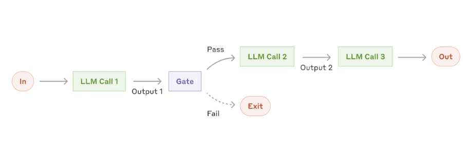
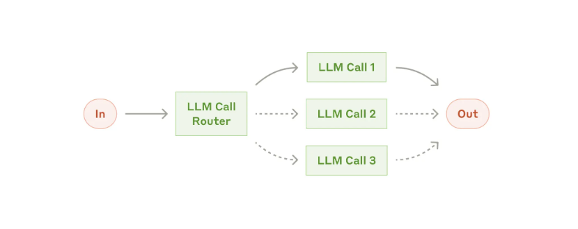
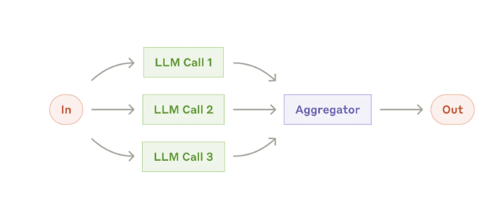
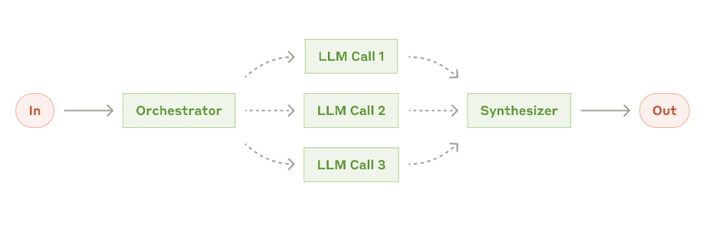
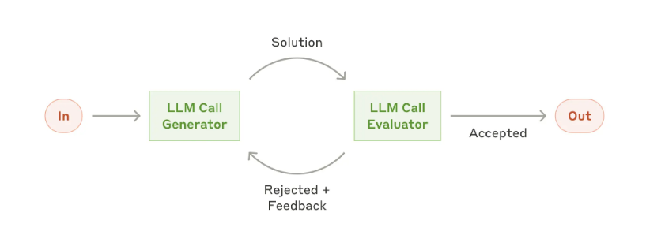
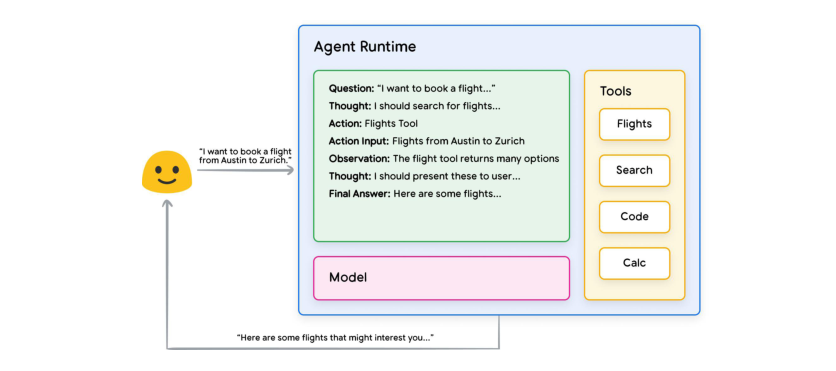
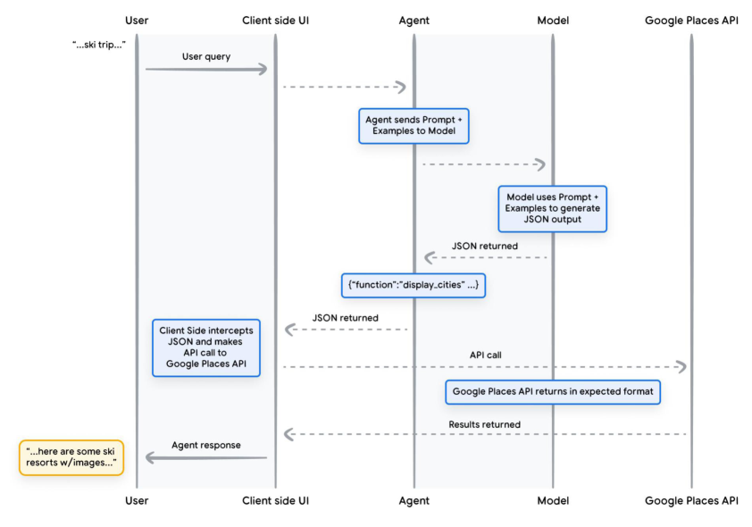

# agent方向

未来，Agent的发展方向是：长期的记忆、自我的反思、过去踩过的坑、总结过的经验、自我进行升级

不再由人类提供反馈，而是大模型自我收集环境信息的反馈，自我升级。

未来AI相信数据而不是相信人类。

**The Hedgehog and the Fox：狐狸知道很多事情，但刺猬知道一件大事**，目前我们的Agent做**垂直领域**应该是更好的。
**吃掉小市场、吃掉小市场的全部！**

Agent做的不是工具，而是人力替代。**核心是代理**

**真正能让 AI 落地的，是那些没人愿意做的工作。（例如：BPO 电话客服，没人想干一辈子，最多做半年就跳槽了，流动性极大）**这句话也侧面印证了代理的重要性

# agent笔记

[构建智能体原文](https://www.anthropic.com/engineering/building-effective-agents)

agent和workflow的区别是：
- workflow是通过预定义的代码路径协调 LLM 和工具的系统。人类可以在其中的某些节点进行人为的干预。
- agent是 LLM 动态指导其自身流程和工具使用情况的系统，从而保持对其完成任务的方式的控制。完全有LLM主导，人类无法干预。
 
- 智能体必须从每个步骤（例如工具调用结果或代码执行）的环境中获得“基本事实”以评估其进度。然后，Agent可以在检查点或遇到阻碍时暂停以等待人类的反馈。任务通常在完成后终止，但通常也会包含停止条件（例如最大迭代次数）以保持控制。

- 真正有用的agent,不一定是非常复杂的agent。重点在于构建适合我们需求的系统。

- 智能体，还是存在需要人工确认的场景。 执行权在AI，决策权在人类。

- agent能力L1-L5：有基本的对话能力、达到人类水准解决问题【有能力的】、可系统性的执行动作【专家级】、AI可以自己发明创新【大师级】、AI可融入组织或者自成组织【超越人类】。

- 没有两个Agent是相同的，就像没有两个应用是相同的一样

- 微调：对于agent来说，针对性的微调还是很重要的。manus 和 阿里合作，就是阿里为其提供微调模型

- 多智能体合作（multi-agent）：未来的场景巨大。

- 小模型做特定任务：未来将会较为主流。

- TPF 技术和产品的适配程度
- PMF 产品和市场的适配程度

OpenAi：智能体 = 大预言模型 + 记忆 + 规划能力 + 工具使用


Anthropic: 智能体 = 基于大语言模型，能够通过与人类交互明确任务后，独立规划和执行，利用环境反馈进行自我评估和调整，处理复杂任务的程序


- agent也需要PDAC


- llms.txt 跟robots.txt的爬虫协议一样。llms.txt是大模型协议【AI友好型协议，用MD描述自己的网页，方便AI爬取】 这对未来的agent有利，例如我编写了订机票的agent，我的agent去了网站后，需要知道怎么操作。【例如，东航没有对LLMs友好，出现验证码登弹窗导致AI不能买票。但是AI去了南航发现南航有llms.txt，很方便的就购买了机票，东航就因此损失了所有的agent客户。】未来买票的卖票的，可能都是Agent，h互联网上人越来越少，AI越来越多【可以参考现在的百度，很大一部分人都使用大模型进行搜索了】。 所以，我们就需要考虑怎么让我们的网站，我们的服务怎么更加对AI友好。 【产品未来会面向AI和面向用户，面向用户的产品依然就保证用户体验】
【https://derivatex.agency/seo/llms-txt-seo-ai-search/】

## workflow的方式

1. workflow：提示词链，提示链将任务分解为一系列步骤，其中每个 LLM 调用都会处理前一个调用的输出。



可以在任意节点对程序进行检查。

何时使用此工作流程：此工作流程非常适合可以轻松、干净地将任务分解为固定子任务的情况。主要目标是通过使每次 LLM 调用都成为更简单的任务，以牺牲延迟换取更高的准确度。

提示链有用的示例：

生成营销文案，然后将其翻译成不同的语言。
撰写文档大纲，检查大纲是否符合某些标准，然后根据大纲撰写文档。

2. workflow：路由，路由将输入分类并将其定向到专门的后续任务。此工作流程允许分离关注点并构建更专业的提示。



如果没有此工作流程，针对一种输入进行优化可能会损害其他输入的性能。

何时使用此工作流程：路由适用于复杂任务，其中存在不同的类别，最好分别处理，并且可以通过 LLM 或更传统的分类模型/算法准确处理分类。

路由有用的示例：

将不同类型的客户服务查询（一般问题、退款请求、技术支持）引导到不同的下游流程、提示和工具中。
将简单/常见问题路由到较小的模型（如 Claude 3.5 Haiku），将困难/不寻常的问题路由到功能更强大的模型（如 Claude 3.5 Sonnet），以优化成本和速度。

3. workflow：并行化，有时可以同时执行一项任务，并以编程方式汇总其输出。



并行化体现在两个关键变化中：

- 分段：将任务分解为并行运行的独立子任务。
- 投票：多次运行相同的任务以获得不同的输出。

何时使用此工作流程：当划分的子任务可以并行化以提高速度，或者当需要多个视角或尝试以获得更高置信度的结果时，并行化是有效的。对于具有多个考虑因素的复杂任务，当每个考虑因素由单独的 LLM 调用处理时，LLM 通常会表现得更好，从而可以集中注意力于每个特定方面。

并行化有用的示例：

切片：
实施护栏，其中一个模型实例处理用户查询，而另一个模型实例则筛选不适当的内容或请求。这往往比让同一个 LLM 调用处理护栏和核心响应效果更好。
自动评估 LLM 性能，其中每个 LLM 调用都会根据给定提示评估模型性能的不同方面。
投票：
审查一段代码是否存在漏洞，其中几个不同的提示会审查该代码，如果发现问题则标记该代码。
评估给定的内容是否不适当，使用多个提示评估不同的方面或需要不同的投票阈值来平衡误报和误报。


4. workflow：Orchestrator-workers，中央 LLM 动态地分解任务，将其委托给 worker LLM，并综合其结果。



何时使用此工作流程：此工作流程非常适合无法预测所需子任务的复杂任务（例如，在编码中，需要更改的文件数量以及每个文件中更改的性质可能取决于任务）。
与并行化的主要区别在于其灵活性 - 子任务不是预先定义的，而是由编排器根据特定输入确定。

orchestrator-workers 有用的示例：
- 每次对多个文件进行复杂更改的编码产品。
- 搜索任务涉及收集和分析来自多个来源的信息以获取可能相关的信息。

5. workflow：评估器-优化器，一个 LLM 调用生成一个响应，而另一个调用在循环中提供评估和反馈。



何时使用此工作流程：当我们有明确的评估标准，并且迭代改进提供可衡量的价值时，此工作流程特别有效。良好契合的两个标志是，首先，当人类表达他们的反馈时，LLM 的响应可以明显改善；其次，LLM 可以提供这样的反馈。这类似于人类作家在制作精美文档时可能经历的迭代写作过程。

评估器-优化器有用的示例：
- 文学翻译中存在译者 LLM 最初可能无法捕捉到的细微差别，但评估者 LLM 可以提供有用的批评。
- 复杂的搜索任务需要多轮搜索和分析才能收集全面的信息，然后评估人员决定是否有必要进行进一步搜索。


## agent系统概述

在由 LLM 驱动的自主Agent系统中，LLM 充当agent的大脑，并由几个关键组件补充：

**规划**
子目标和分解：Agent将大任务分解为更小的、可管理的子目标，从而有效地处理复杂任务。
反思与改进：Agent可以对过去的行为进行自我批评和自我反思，从错误中吸取教训，并为未来的步骤进行改进，从而提高最终结果的质量。

1. Agent的自我纠错机制，验证系统（如 eval framework）

运行过程中时刻对过去的运行结果进行验算。
例如：在代码生成后运行测试。微软推出的rStar-Math算法，在大模型在生成每个推理步骤时，会同时生成对应的 Python 代码。Python 代码能够成功执行的生成内容才会被保留，从而确保中间步骤的正确性。
这其实是一种内置的自我纠错机制。
纠错机制的实现：

- 平行的纠错机制，每经过一个节点，都执行一次纠错验证逻辑。纠错的耗时会出现多次。每个需要的节点都会进行纠错。
- 护栏验证机制，最终执行一次纠错。失败了就全盘重新开始。
- 并行验证的纠错机制，在更高的一个层级，始终并发追着内容进行验证。纠错的耗时只会出现一次，但是一旦出现错误就要退多步重新执行。

纠错方案：
- 多Agent协作纠错，辩论。 - 耗时长
- 多Agent协作纠错，投票。 - 耗时短
- 单Agent纠错逻辑添加专门的验证模块检查逻辑一致性、事实准确性等.  根据验证结果、事实准确度来确认结果
- 单Agent思维链，通过分步推理来纠错

纠错注意事项：

- 纠错机制本身可能引入新的错误
- 计算开销与响应延迟的平衡
- 注意纠错节点的数量，太多容易影响效率增加错误

2. Agent的升级改进机制

大模型自我收集环境信息的反馈，自我升级。错误中吸取教训，并为未来的步骤进行改进。

概念比较抽象，可以用人类的思维进行考虑：人类是如何把一件事情越做越好的？

1. 熟练度提升：更新优化了执行流程 - 越做越快
2. 知识体系提示：更新了头脑中的知识 - 越做越好
3. 认知提升：更新了相关的方法论 - 越做越好

升级方案：
- 失败案例自动分析
- 知识盲区探测

升级触发机制:
1. 条件触发
性能低于阈值时触发升级、遇到未知情境时触发学习需求、资源利用率过高时触发优化、得到反馈需要修正时。

1. 周期性触发
定时检查更新、定期知识刷新


**记忆**
短期记忆：我认为所有的情境学习（参见提示工程）都是利用模型的短期记忆来学习。
长期记忆：这为Agent提供了在较长时间内保留和回忆（无限）信息的能力，通常是通过利用外部向量存储和快速检索来实现的。

**工具使用**
agent学习调用外部 API 来获取模型权重中缺少的额外信息（预训练后通常很难改变），包括当前信息、代码执行能力、专有信息源的访问等。
工具弥合了Agent人的内部能力和外部世界之间的差距

## Agent智能体白皮书-谷歌

[白皮书原文](https://drive.google.com/file/d/1oEjiRCTbd54aSdB_eEe3UShxLBWK9xkt/view?pli=1)

### 摘要

介绍生成式AI Agent的基本构建模块的组成以及认知架构形式，和实现它们的有效方法。本白皮书的一些主要内容包括:

1. **模型**，Agent通过利用工具来访问实时信息，建立现实世界的操作以及自主计划和执行复杂任务，从而扩展了语言模型的功能。Agent可以利用一个或多个语言模型来决定何时以及如何转换状态，并使用外部工具来完成任何数量的复杂任务，这些任务对于模型来说很难或不可能独自完成。

2. **Agent的核心是业务流程层**，这是一种认知架构，用于构建推理，计划，决策并指导其行动。各种推理技术，如ReAct、思想链和思想树，为编排层提供了一个框架，用于接收信息，执行内部推理，并生成明智的决策或响应。
  
3. **工具**，如`扩展`、`函数`、`数据存储`，作为Agent的外部世界的密钥，允许他们与外部系统交互，并访问超出其训练数据的知识。
   1. 扩展提供了Agent和外部API之间的桥梁，支持API调用的执行和实时信息的检索，例如天气API、搜索API等。
   2. 函数通过分工为开发人员提供了更细致的控制，允许Agent生成可以在客户端执行的函数参数。
   3. 数据存储为Agent提供对结构化或非结构化数据的访问，从而支持数据驱动的应用程序。

### ReAct（Reasoning and Acting） 提示词框架

先分析问题，再采取行动（如搜索、计算等），最后整合信息给出答案。

**ReAct框架核心步骤**

- 思考（Think）

分析问题，明确当前需要解决的关键点。

提出假设或分解子问题。

- 行动（Act）

调用工具或外部信息（如搜索、API、计算器等）。

格式示例：Action: 工具类型[输入]（如 Action: Search[全球人口排名]）。

- 观察（Observe）

获取行动的结果（如搜索结果、数据反馈）。

格式示例：Observation: 结果内容。

- 循环迭代

根据观察结果重复“思考-行动-观察”，直到解决问题。

- 最终答案（Answer）

整合所有信息，给出明确结论。


- ReAct示例：

```md
**问题：**
“截至2023年，中国和印度哪个国家的GDP更高？请解释原因。”

**ReAct流程示例：**
- Thought: 我需要比较中国和印度的GDP数据。首先，我需要找到两国2023年的GDP数值。  
- Action: Search[中国2023年GDP]  
- Observation: 中国2023年GDP约为17.9万亿美元。  

- Thought: 现在我需要印度的GDP数据。  
- Action: Search[印度2023年GDP]  
- Observation: 印度2023年GDP约为3.4万亿美元。  

- Thought: 比较两国GDP，中国明显更高。可能原因包括经济规模、产业结构和出口能力。  
- Action: Search[中国vs印度GDP差异原因]  
- Observation: 中国制造业和出口占主导，印度服务业增长快但规模较小。  

- Answer: 截至2023年，中国的GDP（17.9万亿美元）高于印度（3.4万亿美元），主要因为中国拥有更大的制造业基础和全球出口份额。
```




### 工具

模型走向外部世界的钥匙

#### 扩展

例如：天气预报API、航班API等

使用示例指导模型如何使用扩展，Agent在运行时模型学习示例来决定哪个扩展适合解决用户的问题。

通常扩展需要编写好自己的示例。

#### 函数

函数和扩展的区别是：

- 模型仅输出函数及其参数，并不进行API调用。
- 函数在客户端执行，扩展在Agent端执行。


**函数调用生命周期**



#### 数据储存

参见RAG。

## agent场景

1. 客户支持通过工具集成将熟悉的聊天机器人界面与增强的功能相结合。这对于更开放的Agent来说是自然而然的选择，因为：

- 支持交互自然遵循对话流，同时需要访问外部信息和操作；
- 可以集成工具来提取客户数据、订单历史记录和知识库文章；
- 退款或更新机票等操作可以通过编程方式处理；
- 可以通过用户定义的分辨率明确地衡量成功。


2. 软件开发领域已显示出 LLM 功能的巨大潜力，其功能从代码完成发展到自主解决问题。Agent特别有效，因为：

- 代码解决方案可通过自动化测试进行验证；
- Agent可以使用测试结果作为反馈来迭代解决方案；
- 问题空间定义明确、结构清晰；
- 输出质量可以客观衡量。


## 落地方案

**模型选择**
- 可以根据场景来进行适配，执行简单自动化任务时，可以选择延迟、成本低的模型；
- 执行跨平台复杂任务时可以选择性能更强的大模型，尤其是在金融、医疗这样对数据识别率要求极高的行业。
- 豆包Pro32k的角色扮演模型在采用流式的情况下它是很快的，同时TOPP调整到0，可以提高输出速度
- 推理模型的场景选择
- 多模型模型选择
  - 文生图
  - 图片识别


**模型优化、提示词优化**
使用模型蒸馏、微调和提示词优化，进一步降低智能体大模型的成本。例如，将GPT-4o的决策逻辑蒸馏至GPT-3.5-turbo，可使模型体积缩小80%，同时通过提示词优化，例如，增加请分步骤思考等引导语，在代码生成任务中使小模型的准确率仅比原模型低5%。

**建立闭环反馈机制**
此外，在选择合适的大模型时还需要建立闭环反馈机制。智能体在生产环境中持续收集模型调用数据，例如，响应时间、错误类型、用户满意度，通过A/B测试对比不同模型组合的表现。


**限制回复技巧**

 Prefill Response 模式，我们可以编造一下助手回复的信息，传递到message中，这样可以控制助手的回复。


## 大模型让工具变成了工具人

**兵在精而不在多**，或许目前的时代是**在多而不在精**。Agent目前依然很难做到精。


- 拆解任务
- 自我反省
- 多次回答
- RAG
- 模型合作
  - 通过路由模型来控制不同的任务分给不同的模型去做
- 多模型讨论
  - 需要有裁判，来判断讨论是否达到了一致，为了防止大模型立刻同意其他模型的说法，需要有提示词限制：
  - 提示词一：你并不需要完全同意对方的想法，可以提出自己的意见
  - 提示词二：另一个模型的答案作为参考就好
- 角色扮演
  - CEO、程序员、产品经理、测试、用户
- 


## 下一步模型迭代进化的能力（25-06-11）

语音模型：语音表现更自然，拥有更细腻的语调、真实的节奏包括停顿和重音，并能更精准地表达共情、讽刺等特定情感。

文生图模型：文字、手指、光影、真实性（图片中的力学合理性、图像中人物的行为合理性）

文生视频：视频帧切换流畅程度、物理真实感

文字模型：指令遵循能力、数学、程序、理解能力。


## 吴恩达：关于Agent的现状（25-06-11）

**没有哪一个工具能包打天下，关键在于是否熟练掌握并高效组合整套工具链。**

### 当下Agent落地遇到的问题
当下企业在把已有流程转变为“Agentic workflow”时，仍面临很大挑战：比如，你应该把流程拆分到什么样的粒度？任务要分成哪些微步骤？当你构建了一个原型，但效果不够好时，你要改进哪一个步骤才能提升整体效果？这种“从复杂任务中拆解出可执行的微步骤”、设计工作流结构、评估机制等能力，其实现在还比较稀缺。

更复杂的 Agentic 工作流也非常有价值，尤其是包含大量循环的那些。但就“数量”来说，现在的机会，还是主要集中在这些更简单的线性流程里，大家正在一步步把它们系统化、自动化。

### 搭建正确的记忆系统、评估系统（Eval）、护栏系统（ Guardrails）

**构建记忆系统、评估系统（Eval）、护栏系统（ Guardrails）**

要搭建一个正确的 Eval（评估）体系，不只是评估整个系统的效果，还要能追踪每一步骤，这样你才能快速定位“是哪一步坏了”，“是哪个 Prompt 没有发挥作用”。很多团队在这个过程中可能进展比应有的慢——他们一直靠人手评估，每次改完 Prompt，就一个个看输出，人工判断，这会极大影响效率。


## Agent 十问

**AI Agent 就是自动化+智能，原来的自动化能力 + AI的理解能力，这里我们还可以让AI Agent根据环境信息进行学习进化！**

AI Agent自动完成任务、自主决策、接受目标或者环境状态，自己规划步骤并执行，具有环境感知、推理和行动能力，可以调用工具可以拥有长时记忆。

OpenAI 对Agent的定义下沉到了模型层，由模型来内化，利用tools字段直接决定工具的使用。Anthropic 则越来越往外，生态成就一切。

Agent 工作由感知、认知&推理&决策、行动、反馈和学习四个层面组成

性能质量是构建可靠智能体系统的最大限制。性能质量表现不佳常因模型不够好或传递了错误（或不完整）的上下文，后者更加常见，包括不完整或简短的系统消息、模糊的用户输入、无法访问正确的工具、工具描述不佳、未传递正确的上下文、工具响应格式不佳等。


智能体应用也需要做容灾和可靠性处理。多智能体存在的必然性：不同的任务需要交给不同的模型去处理，例如：有些单一的小模型就是处理某种任务更精准，并且性能也更优秀。

## AI问题与解决方案

1. **agent中专家和意图的区别:**
专家知道需要用什么数据去解决什么问题。
复杂点的意图可以单纯的回答一类问题。【意图接口中返回能查到的许多类型数据】
最简单的意图只能回答某些明确的问题。【意图接口中返回接口数据】

2. **知识库工程解决方案：**
使用上下文分析来解决上下文匹配问题。
保留原文匹配逻辑，来解决上下文分析出错的问题。但是需要和上下文分析匹配的问题进行分数、相关性验证的逻辑筛选。
使用相关性验证来解决知识库匹配错误的逻辑。


1. Q：写作产品：写作的内容是线性的，不够丰富
A：将网状的思想，通过树状的句法，用线性的文字展开

2. Q：问答产品：无法让用户的问题很好的匹配文档信息
A：把文档信息提取成QA，优化之后放到知识库中。优化方案有：完善答案、新增相似问

3. Q：问答产品：用户的query和知识库存在匹配错误的情况
A：增加一个**相关性验证**的大模型程序，通过验证的才返回用户

4. Q：问答产品：意图的匹配会需要大量参数，参数的提取不准确
A：把参数合并，每次返回大量信息作为答案提供给大模型，由大模型来根据答案回答问题

5. Q：问答产品：响应时间过长
A：多用知识库、最终回复使用流式响应、减少大模型首包延迟时间

6. Q：解决询问多个问题的场景
A：把知识库中多个匹配到的问题，都作为提示词让大模型回复

7. Q:  Agent的使用注意事项
A:  大模型的输出要做好适配、agent的稳定性要保证、上线后对应用的监控要有

8. Q: RAG意图过多的时候，需要分专家进行匹配。此时需要有两个大模型的请求耗时。
A：可以尝试在进行专家判断的时候，用RAG提前放好一些内容来匹配专家，这样可以减少耗时


9. 分意图定制提示词
  **意图，用户的意图真的可以被全部枚举么？**，为了解决这个问题：
  1. 意图模糊化，把清晰的意图模糊化，让一个意图可以包含其大量的子意图。
     1). 初步模糊化，把80个意图缩减为30
     2). 第二步模糊化，保留30个意图，但是多个意图采取同样的回复逻辑。 保留意图是为了保证用户的query能正常被意图匹配。如果模糊化太多，大模型对意图的匹配就会出问题，因为我们很难用自然语言描述清楚太过于模糊的意图之间的区别
  2. Agent, 根据工具来自己进行查询。
    
10. RAG，当我们不想让大模型输出某些内容时，例如：某些黑料问题。此时可以把黑料问句放到RAG中，用来筛选到之后做过滤。

11. RAG，权限问题要注意，使用RAG的标签来进行权限控制。

12. 可以在历史对话中传入一部分role为助手的内容，这样助手就会顺着往下说。

13. 用知识库代替意图（提效）、意图之后进行知识匹配（确定知识库的内容）

14. 问题拆分、agent轮询、上下文自动识别，三种场景用来解决单个问题中多意图的场景。

15. 主动引导的问题，需要先确保引导出来的问题我们能否解决

16. 上下文的处理，知识库可以利用知识库的特性天然的处理，意图需要使用上下文分析的能力

17. 豆包的1.5pro下的角色扮演模型，可以用在一些角色扮演的场景【售前、志愿填报专家、恋爱等】

18. TOPP调整到0，可以提高输出速度

19. **用户洞察** 利用历史对话形成用户的画像或用户人设，保留用户信息，添加置信度、沟通时间等关键信息

20. Agent可以合作做决策。问题进来之后，让B和C模型考虑和生成答案，最后再让D模型总结答案后回复。
  - 解决的问题是：如果用A模型做判断，让B和C模型分别处理不同的任务，会出现两个问题：
    - 1. A模型判断错误，分不清应该谁解决问题。
    - 2. 问题可能需要B和C的解决方案加一起来解决。单独一个模型无法解决问题的。

21. Agent的核心是代理。代理用户执行用户耗时又低价值的事情，直接呈现最终的结果给用户。
  - 必须让用户知道结论是如何而来的结论，数据来源。
  - **代理不怕慢，怕的是让用户等的没有价值**。所以要设计足够的用户体验，让用户等的有价值。
  - 必须有反思，没有反思，用户认为产品不够好，就会放弃。

22. Agent 需要在更底层的维度去解决。知识要比用户所在的维度低。

  用户维度，用户发起的query，例如：中国最好的医学院在哪？
  低一层的维度，给用户query分类，例如：：院校排名查询、院校信息查询、专业信息查询
  低两层的维度，query分类的来源，例如：sql语句

  示例：
  用户发起问题：中国最好的医学院在哪？
  我们的提示词可以是让AI调用工具：你拥有的工具有：院校排名查询、院校信息查询、专业信息查询
    - 但是会有问题：工具太多，工具无法满足所有场景
  所以我们可以使用更低一个维度的方案：直接生产SQL，由AI来决定需要查询什么数据来解决这个问题。
    - 比如AI可能会 查询医学院排名，再查询第一名的医学院位置。
    - 这个方案也可以解决上面第九条意图无法枚举的问题。

## 收费逻辑

按行动计费、按工作流计费、按结果计费、按Agent计费。

- 按行动 (Activity) 计费最简单，比如信用积分制的模式，很容易向客户展示他们的使用情况。

- 按工作流计费是把一系列行动串成一个完整流程，比如“文档审阅”，然后对整个流程定价。可以区分处理不同文档的复杂度：短的、简单的 vs 长的、复杂的，每种都有不同的资源消耗。

- 按结果计费是将定价从“按工作流计费”转向“对客户有价值的事情计费”，这是关键。但我现在给客户的建议是：不要直接按结果收费，而是设置“结果奖金”机制。 比如说，如果某个成果达到了高质量标准，那你就可以收取一笔额外费用。这样可以开启一个“价值对齐”的对话。一旦你和客户进入这样的深度对话，就会开始签署一些更定制化的合同，而这种合同是非常难被替换掉的。

- 按Agent计费，Agent能完成任务，而且如果Agent达成了KPI（预约量、成交量等），可以再额外给“奖金”。


# Agent产品

## Sedai
智能体核心能力包括智能扩展、自我修复和持续优化
- 智能扩展利用深度强化学习动态分配资源，客户在Kubernetes集群上实现了高达65%的成本降低，在虚拟机工作负载上实现了28%的成本降低。
- 自我修复功能可以在问题影响用户之前检测并解决诸如性能下降和停机等问题，而大多数工具仍然依赖警报或人工响应。
- 持续优化则在后台持续优化基础设施，客户报告操作生产力提高了6倍，性能提高了30%。

## Quandri
Quandri 是做保险保单续签的公司。另外还有一家公司 Owl，也在保险领域做理赔数据审核。这类问题看起来很小众，但实际处理量巨大，且很多人工流程没有被很好地接手。


## Happy Robot
Happy Robot 是替货运经纪人联系卡车司机的公司。比如从密尔沃基运啤酒到波士顿，你需要找经纪人帮你联系卡车司机，而 Happy Robot 会用 2,000 个 AI Agent 去给卡车司机打电话，包括只有“一个人和一条狗”的小型公司。他们之间会协商运价，安排好运输任务，一直到最终送货完成。


## Expo
Expo 是做是渗透测试。他们不提供完整的网络安全服务，但会不断对客户的应用程序和后端系统进行攻击测试，看看有没有安全漏洞。他们取代了传统的渗透测试机构，自动执行测试，质量高、频率高，而这样的服务目前基本是缺失的。


## 亚马逊（Alexa+）

在越来越多的购物功能中，你同样能看到生成式AI的应用。比如“镜头”功能（拍摄一件物品的照片，它就能给出购物结果，这非常酷）、“代我购买”功能（我可以让我们的购物智能体在其他商家的网站上帮我购买商品），还有“推荐尺码”功能（我们可以根据你之前的购买记录，以及不同服装品牌在尺码方面的差异，预测出适合你的尺码）。


# AI工程师的技术栈

仅仅知道如何调用大语言模型（LLM）的API是一个很好的开始，但这远远不够。如果掌握了更广泛的构建模块——例如提示词工程（Prompting）、Agent框架、评估（Evals）、安全护栏（Guardrails）、RAG（检索增强生成）、语音技术栈、异步编程、数据提取、嵌入式/向量数据库、模型微调、图数据库与LLM的结合、基于Agent的浏览器/计算机自动化、MCP（模型、控制器、提示）、推理模型等等——就能创造出远比单一模块更丰富、更强大的组合。


A2A 解决智能体之间的协作通信。MCP是解决大模型调用工具的方案，定义统一的输入输出格式和工具调用标准。