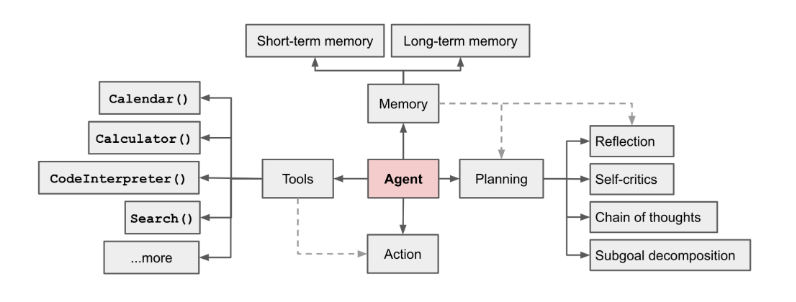
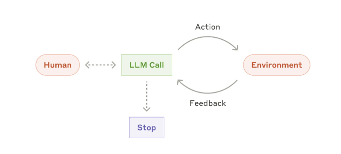

# agent方向

未来，Agent的发展方向是：长期的记忆、自我的反思、过去踩过的坑、总结过的经验、自我进行升级

不再由人类提供反馈，而是大模型自我收集环境信息的反馈，自我升级。

未来AI相信数据而不是相信人类。

# agent笔记

[构建智能体原文](https://www.anthropic.com/engineering/building-effective-agents)

agent和workflow的区别是：
- workflow是通过预定义的代码路径协调 LLM 和工具的系统。人类可以在其中的某些节点进行人为的干预。
- agent是 LLM 动态指导其自身流程和工具使用情况的系统，从而保持对其完成任务的方式的控制。完全有LLM主导，人类无法干预。
 
- 智能体必须从每个步骤（例如工具调用结果或代码执行）的环境中获得“基本事实”以评估其进度。然后，Agent可以在检查点或遇到阻碍时暂停以等待人类的反馈。任务通常在完成后终止，但通常也会包含停止条件（例如最大迭代次数）以保持控制。

- 真正有用的agent,不一定是非常复杂的agent。重点在于构建适合我们需求的系统。

- 智能体，还是存在需要人工确认的场景。 执行权在AI，决策权在人类。

- agent能力L1-L5：有基本的对话能力、达到人类水准解决问题【有能力的】、可系统性的执行动作【专家级】、AI可以自己发明创新【大师级】、AI可融入组织或者自成组织【超越人类】。

- 没有两个Agent是相同的，就像没有两个应用是相同的一样

- 微调：对于agent来说，针对性的微调还是很重要的。manus 和 阿里合作，就是阿里为其提供微调模型

- 多智能体合作（multi-agent）：未来的场景巨大。

- 小模型做特定任务：未来将会较为主流。

- TPF 技术和产品的适配程度
- PMF 产品和市场的适配程度

OpenAi：智能体 = 大预言模型 + 记忆 + 规划能力 + 工具使用




Anthropic: 智能体 = 基于大语言模型，能够通过与人类交互明确任务后，独立规划和执行，利用环境反馈进行自我评估和调整，处理复杂任务的程序




- agent也需要PDAC


- llms.txt 跟robots.txt的爬虫协议一样。llms.txt是大模型协议【AI友好型协议，用MD描述自己的网页，方便AI爬取】 这对未来的agent有利，例如我编写了订机票的agent，我的agent去了网站后，需要知道怎么操作。【例如，东航没有对LLMs友好，出现验证码登弹窗导致AI不能买票。但是AI去了南航发现南航有llms.txt，很方便的就购买了机票，东航就因此损失了所有的agent客户。】未来买票的卖票的，可能都是Agent，h互联网上人越来越少，AI越来越多【可以参考现在的百度，很大一部分人都使用大模型进行搜索了】。 所以，我们就需要考虑怎么让我们的网站，我们的服务怎么更加对AI友好。 【产品未来会面向AI和面向用户，面向用户的产品依然就保证用户体验】
【https://derivatex.agency/seo/llms-txt-seo-ai-search/】

## workflow的方式

1. workflow：提示词链，提示链将任务分解为一系列步骤，其中每个 LLM 调用都会处理前一个调用的输出。


可以在任意节点对程序进行检查。

何时使用此工作流程：此工作流程非常适合可以轻松、干净地将任务分解为固定子任务的情况。主要目标是通过使每次 LLM 调用都成为更简单的任务，以牺牲延迟换取更高的准确度。

提示链有用的示例：

生成营销文案，然后将其翻译成不同的语言。
撰写文档大纲，检查大纲是否符合某些标准，然后根据大纲撰写文档。

2. workflow：路由，路由将输入分类并将其定向到专门的后续任务。此工作流程允许分离关注点并构建更专业的提示。


如果没有此工作流程，针对一种输入进行优化可能会损害其他输入的性能。

何时使用此工作流程：路由适用于复杂任务，其中存在不同的类别，最好分别处理，并且可以通过 LLM 或更传统的分类模型/算法准确处理分类。

路由有用的示例：

将不同类型的客户服务查询（一般问题、退款请求、技术支持）引导到不同的下游流程、提示和工具中。
将简单/常见问题路由到较小的模型（如 Claude 3.5 Haiku），将困难/不寻常的问题路由到功能更强大的模型（如 Claude 3.5 Sonnet），以优化成本和速度。

3. workflow：并行化，有时可以同时执行一项任务，并以编程方式汇总其输出。


并行化体现在两个关键变化中：

- 分段：将任务分解为并行运行的独立子任务。
- 投票：多次运行相同的任务以获得不同的输出。

何时使用此工作流程：当划分的子任务可以并行化以提高速度，或者当需要多个视角或尝试以获得更高置信度的结果时，并行化是有效的。对于具有多个考虑因素的复杂任务，当每个考虑因素由单独的 LLM 调用处理时，LLM 通常会表现得更好，从而可以集中注意力于每个特定方面。

并行化有用的示例：

切片：
实施护栏，其中一个模型实例处理用户查询，而另一个模型实例则筛选不适当的内容或请求。这往往比让同一个 LLM 调用处理护栏和核心响应效果更好。
自动评估 LLM 性能，其中每个 LLM 调用都会根据给定提示评估模型性能的不同方面。
投票：
审查一段代码是否存在漏洞，其中几个不同的提示会审查该代码，如果发现问题则标记该代码。
评估给定的内容是否不适当，使用多个提示评估不同的方面或需要不同的投票阈值来平衡误报和误报。


4. workflow：Orchestrator-workers，中央 LLM 动态地分解任务，将其委托给 worker LLM，并综合其结果。


何时使用此工作流程：此工作流程非常适合无法预测所需子任务的复杂任务（例如，在编码中，需要更改的文件数量以及每个文件中更改的性质可能取决于任务）。
与并行化的主要区别在于其灵活性 - 子任务不是预先定义的，而是由编排器根据特定输入确定。

orchestrator-workers 有用的示例：
- 每次对多个文件进行复杂更改的编码产品。
- 搜索任务涉及收集和分析来自多个来源的信息以获取可能相关的信息。

5. workflow：评估器-优化器，一个 LLM 调用生成一个响应，而另一个调用在循环中提供评估和反馈。


何时使用此工作流程：当我们有明确的评估标准，并且迭代改进提供可衡量的价值时，此工作流程特别有效。良好契合的两个标志是，首先，当人类表达他们的反馈时，LLM 的响应可以明显改善；其次，LLM 可以提供这样的反馈。这类似于人类作家在制作精美文档时可能经历的迭代写作过程。

评估器-优化器有用的示例：
- 文学翻译中存在译者 LLM 最初可能无法捕捉到的细微差别，但评估者 LLM 可以提供有用的批评。
- 复杂的搜索任务需要多轮搜索和分析才能收集全面的信息，然后评估人员决定是否有必要进行进一步搜索。


## agent系统概述

在由 LLM 驱动的自主Agent系统中，LLM 充当agent的大脑，并由几个关键组件补充：

**规划**
子目标和分解：Agent将大任务分解为更小的、可管理的子目标，从而有效地处理复杂任务。
反思与改进：Agent可以对过去的行为进行自我批评和自我反思，从错误中吸取教训，并为未来的步骤进行改进，从而提高最终结果的质量。

**记忆**
短期记忆：我认为所有的情境学习（参见提示工程）都是利用模型的短期记忆来学习。
长期记忆：这为Agent提供了在较长时间内保留和回忆（无限）信息的能力，通常是通过利用外部向量存储和快速检索来实现的。

**工具使用**
agent学习调用外部 API 来获取模型权重中缺少的额外信息（预训练后通常很难改变），包括当前信息、代码执行能力、专有信息源的访问等。
工具弥合了Agent人的内部能力和外部世界之间的差距

## Agent智能体白皮书-谷歌

[白皮书原文](https://drive.google.com/file/d/1oEjiRCTbd54aSdB_eEe3UShxLBWK9xkt/view?pli=1)

### 摘要

介绍生成式AI Agent的基本构建模块的组成以及认知架构形式，和实现它们的有效方法。本白皮书的一些主要内容包括:

1. **模型**，Agent通过利用工具来访问实时信息，建立现实世界的操作以及自主计划和执行复杂任务，从而扩展了语言模型的功能。Agent可以利用一个或多个语言模型来决定何时以及如何转换状态，并使用外部工具来完成任何数量的复杂任务，这些任务对于模型来说很难或不可能独自完成。

2. **Agent的核心是业务流程层**，这是一种认知架构，用于构建推理，计划，决策并指导其行动。各种推理技术，如ReAct、思想链和思想树，为编排层提供了一个框架，用于接收信息，执行内部推理，并生成明智的决策或响应。
  
3. **工具**，如`扩展`、`函数`、`数据存储`，作为Agent的外部世界的密钥，允许他们与外部系统交互，并访问超出其训练数据的知识。
   1. 扩展提供了Agent和外部API之间的桥梁，支持API调用的执行和实时信息的检索，例如天气API、搜索API等。
   2. 函数通过分工为开发人员提供了更细致的控制，允许Agent生成可以在客户端执行的函数参数。
   3. 数据存储为Agent提供对结构化或非结构化数据的访问，从而支持数据驱动的应用程序。

### ReAct（Reasoning and Acting） 提示词框架

先分析问题，再采取行动（如搜索、计算等），最后整合信息给出答案。

**ReAct框架核心步骤**

- 思考（Think）

分析问题，明确当前需要解决的关键点。

提出假设或分解子问题。

- 行动（Act）

调用工具或外部信息（如搜索、API、计算器等）。

格式示例：Action: 工具类型[输入]（如 Action: Search[全球人口排名]）。

- 观察（Observe）

获取行动的结果（如搜索结果、数据反馈）。

格式示例：Observation: 结果内容。

- 循环迭代

根据观察结果重复“思考-行动-观察”，直到解决问题。

- 最终答案（Answer）

整合所有信息，给出明确结论。


- ReAct示例：

```md
**问题：**
“截至2023年，中国和印度哪个国家的GDP更高？请解释原因。”

**ReAct流程示例：**
- Thought: 我需要比较中国和印度的GDP数据。首先，我需要找到两国2023年的GDP数值。  
- Action: Search[中国2023年GDP]  
- Observation: 中国2023年GDP约为17.9万亿美元。  

- Thought: 现在我需要印度的GDP数据。  
- Action: Search[印度2023年GDP]  
- Observation: 印度2023年GDP约为3.4万亿美元。  

- Thought: 比较两国GDP，中国明显更高。可能原因包括经济规模、产业结构和出口能力。  
- Action: Search[中国vs印度GDP差异原因]  
- Observation: 中国制造业和出口占主导，印度服务业增长快但规模较小。  

- Answer: 截至2023年，中国的GDP（17.9万亿美元）高于印度（3.4万亿美元），主要因为中国拥有更大的制造业基础和全球出口份额。
```


### 工具

模型走向外部世界的钥匙

#### 扩展

例如：天气预报API、航班API等

使用示例指导模型如何使用扩展，Agent在运行时模型学习示例来决定哪个扩展适合解决用户的问题。

通常扩展需要编写好自己的示例。

#### 函数

函数和扩展的区别是：

- 模型仅输出函数及其参数，并不进行API调用。
- 函数在客户端执行，扩展在Agent端执行。


**函数调用生命周期**


#### 数据储存

参见RAG。

## agent场景

1. 客户支持通过工具集成将熟悉的聊天机器人界面与增强的功能相结合。这对于更开放的Agent来说是自然而然的选择，因为：

- 支持交互自然遵循对话流，同时需要访问外部信息和操作；
- 可以集成工具来提取客户数据、订单历史记录和知识库文章；
- 退款或更新机票等操作可以通过编程方式处理；
- 可以通过用户定义的分辨率明确地衡量成功。


2. 软件开发领域已显示出 LLM 功能的巨大潜力，其功能从代码完成发展到自主解决问题。Agent特别有效，因为：

- 代码解决方案可通过自动化测试进行验证；
- Agent可以使用测试结果作为反馈来迭代解决方案；
- 问题空间定义明确、结构清晰；
- 输出质量可以客观衡量。

