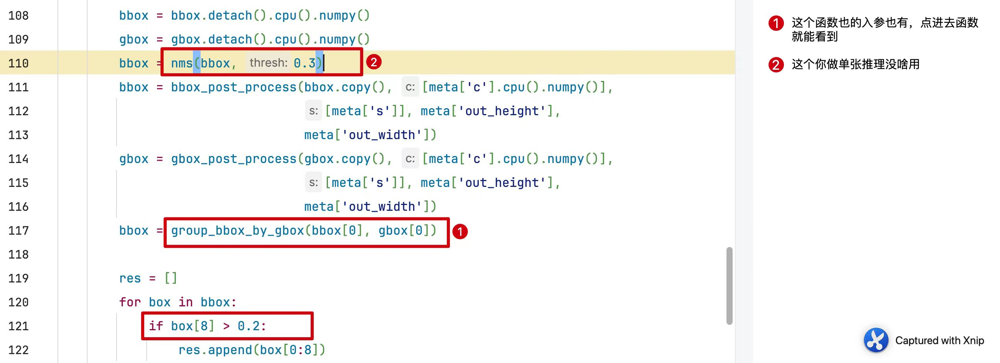

## ocr 部署测试

python依赖都装到D盘的python里，`D:\Anaconda3`

### modelscope

**魔塔社区**

[通义实验室的OCR](https://modelscope.cn/studios/iic/cv_ocr-text-spotting/summary)

使用到两个模型：
● 文本检测（ocr_detection）
● 文本识别（ocr_recognition）

-  cv2的依赖需要安装 `pip install opencv-python`
-  `detection.py` 文本检测模型，√ 使用DBNet版本
   -  `iic/cv_resnet18_ocr-detection-line-level_damo` 这个版本需要tensorflow1.15+，放弃。
   -  `damo/cv_resnet18_ocr-detection-line-level_damo`这个版本需要的keras版本过低，放弃。
-  `recognition.py` 文本识别模型 ，√ 
-  `img_ocr.py` 完整版文字识别

**重要参数调整方式** 
暂时不支持传参，但是可以修改源码

D:\Anaconda3\Lib\site-packages\modelscope\pipelines\cv\table_recognition_pipeline.py 
重要的阈值有写在代码里 

### ms_server

**python服务**

-  `static/index.html` 静态文件
-  `ocr_server.py` 集合了paddle和魔塔社区的OCR服务
-  `paddle_server.py` paddle的OCR服务
-  `ms_server.py`  魔塔社区的OCR服务
-  `ocr_tools.py`  OCR服务用到的工具
-  `requirements.txt` python服务所需的依赖

运行`python ocr_server.py`即可

### paddle

**百度paddleOCR**

安装 paddleocr

`pip install paddleocr -i https://pypi.tuna.tsinghua.edu.cn/simple`

安装 paddlepaddle

`pip install paddlepaddle -i https://mirror.baidu.com/pypi/simple`

命令行调用，检测图片11.jpg

`paddleocr --image_dir 11.jpg --use_angle_cls true`

  
使用PaddleOCR参数的OCR:
 
- img: img用于OCR，支持narray, img_path和list或narray
- det:是否使用文本检测。 如果为False，则只执行rec。 默认为True
- rec:是否使用文本识别。 如果为False，则只执行det。 默认为True
- cls:是否使用角度分类器。 默认为True。 如果为True，则可以识别旋转180度的文本。 如果没有文本旋转180度，则使用cls=False以获得更好的性能。 即使cls=False，旋转为90度或270度的文本也可以被识别。
- bin:将图像二值化为黑白。 默认为False。
- inv:反图像颜色。 默认为False。
- 1alpha_color:设置透明部件更换的RGB颜色元组。 默认为纯白色。 

## TODO

- 部署OCR模型 √
- 发开服务，需注意效率问题 √  服务器1.8秒
- 看一下OCR有没有参数控制  √  直接修改源码 
- 看一下支不支持base64    √   本地存成图片，处理完再删除
- 切换百度OCR看看效果，√ 效果不错
  - 查看一下百度OCR的各类参数是怎么用的 √ 都是控制图像的属性，但是没有超惨. 可以开启是否检测和是否识别