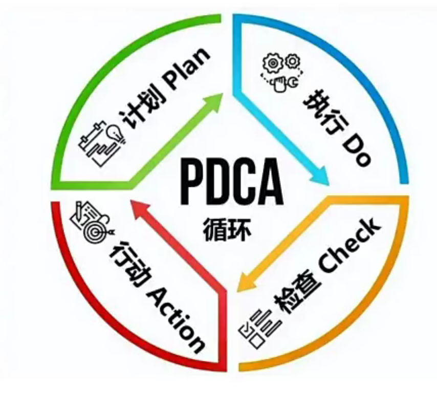

# agent笔记

- TPF 技术和产品的适配程度
- PMF 产品和市场的适配程度

OpenAi：智能体 = 大预言模型 + 记忆 + 规划能力 + 工具使用


Anthropic: 智能体 = 基于大预言模型，能够通过与人类交互明确任务后，独立规划和执行，利用环境反馈进行自我评估和调整，处理复杂任务的程序


agent能力L1-L5：有基本的对话能力、达到人类水准解决问题【有能力的】、可系统性的执行动作【专家级】、AI可以自己发明创新【大师级】、AI可融入组织或者自成组织【超越人类】。


agent也需要PDAC



- 智能体，还是存在需要人工确认的场景。 执行权在AI，决策权在人类。


- llms.txt 跟robots.txt的爬虫协议一样。llms.txt是大模型协议【AI友好型协议，用MD描述自己的网页，方便AI爬取】 这对未来的agent有利，例如我编写了订机票的agent，我的agent去了网站后，需要知道怎么操作。【例如，东航没有对LLMs友好，出现验证码登弹窗导致AI不能买票。但是AI去了南航发现南航有llms.txt，很方便的就购买了机票，东航就因此损失了所有的agent客户。】未来买票的卖票的，可能都是Agent，h互联网上人越来越少，AI越来越多【可以参考现在的百度，很大一部分人都使用大模型进行搜索了】。 所以，我们就需要考虑怎么让我们的网站，我们的服务怎么更加对AI友好。 【产品未来会面向AI和面向用户，面向用户的产品依然就保证用户体验】
【https://derivatex.agency/seo/llms-txt-seo-ai-search/】


- 微调：对于agent来说，针对性的微调还是很重要的。manus 和 阿里合作，就是阿里为其提供微调模型

- 多智能体合作（multi-agent）：未来的场景巨大。


# MCP

Anthropic 提出的，包含客户端、工具、服务器

MCP = Model Context Protocol（模型上下文协议）

免费的一个MCP客户端：cherrystudio

**使用MCPdemo进行开发MCP server就可以，工具在server中**

TODO：看一下MCP的例子,重点看一下提示词

**JavaScript 关键步骤:**

```
npm init -y
touch src/index.ts
npm run build
npm publish--access public
```


# agent白皮书
 

# 备注

https://www.anthropic.com/news/model-context-protocol

https://hai.stanford.edu/news/computational-agents-exhibit-believable-humanlike-behavior

https://drive.google.com/file/d/1oEjiRCTbd54aSdB_eEe3UShxLBWK9xkt/view?pli=1

https://www.doc88.com/p-99320506907255.html

https://lilianweng.github.io/posts/2023-06-23-agent/

https://www.anthropic.com/engineering/building-effective-agents

https://github.com/modelcontextprotocol/python-sdk/blob/main/examples/clients/simple-chatbot/mcp simple_chatbot/main.py

https://mp.weixin.qq.com/s/xbWDFydh1LC2xiPa6d-w_A