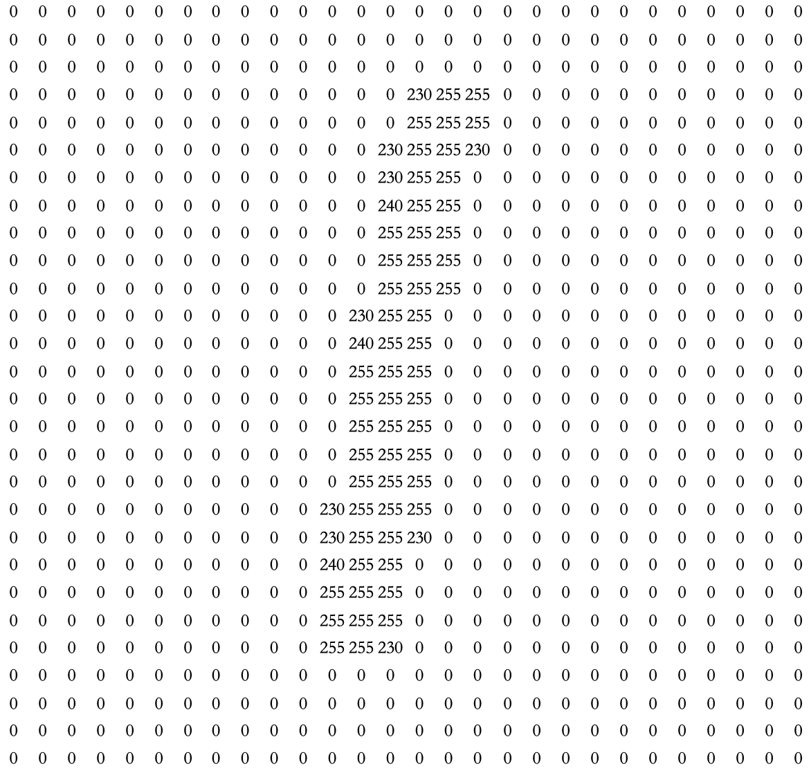
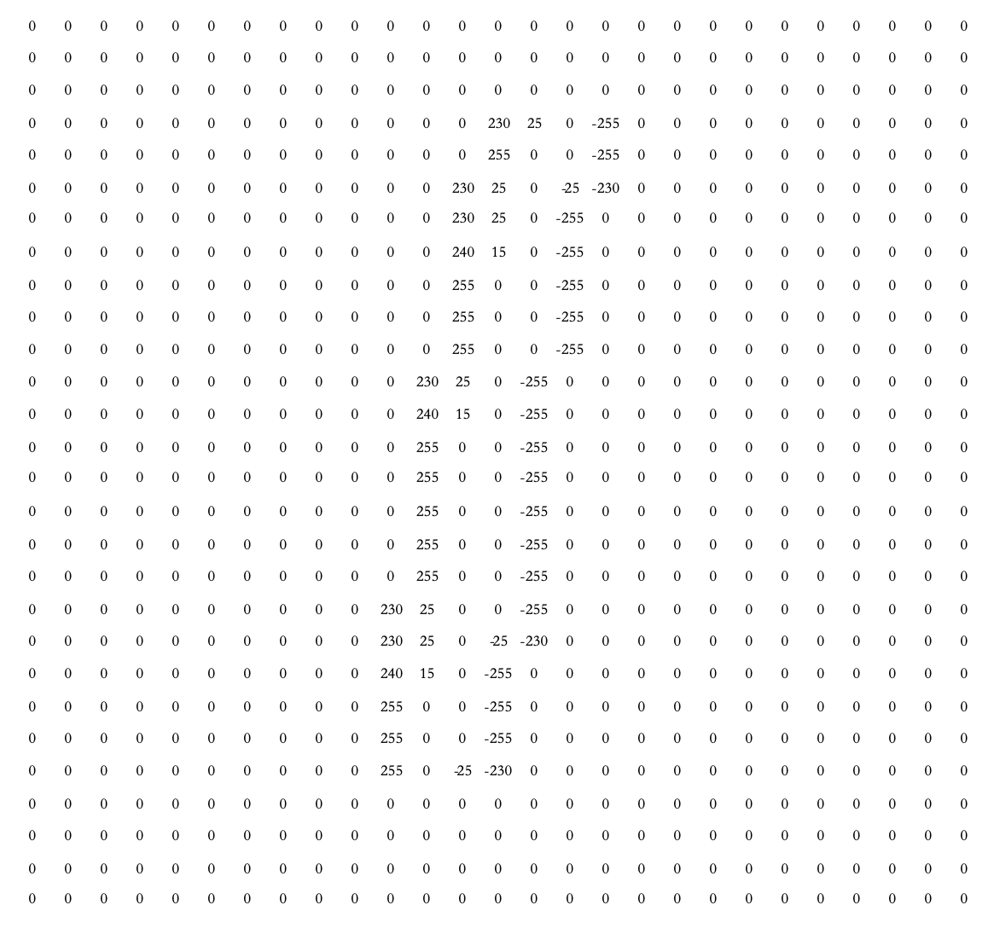
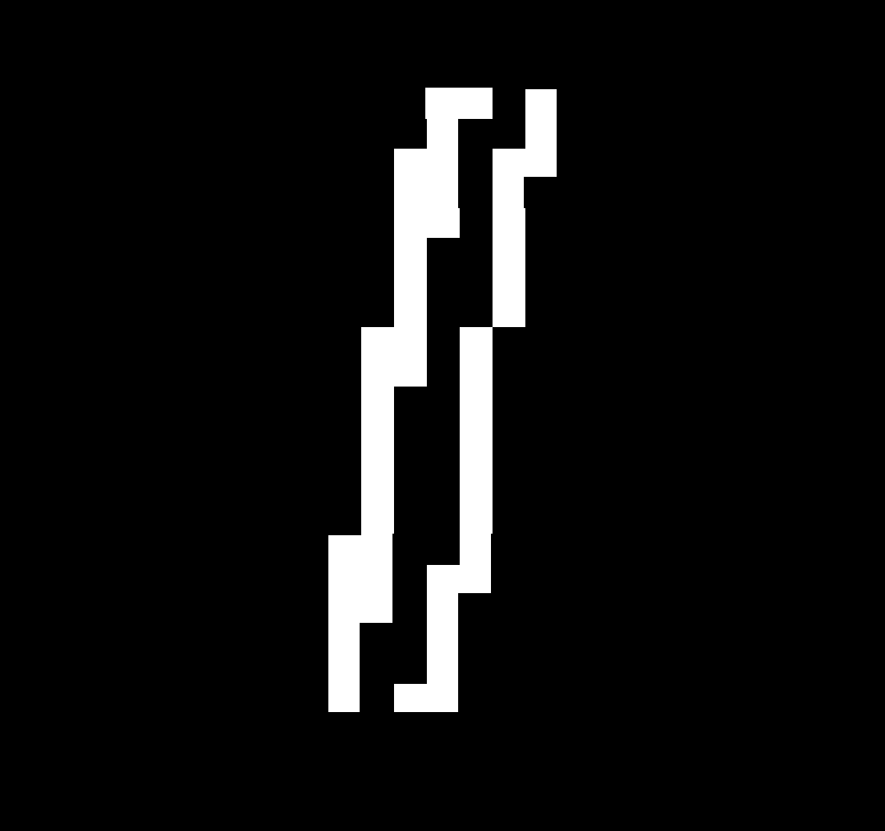

# 微调PPT

## 前置知识

**什么是模型/神经网络/transformer/训练/预训练/微调/轻量化微调**

模型和模型训练（Training）

- 模型是一个算法，在现有的数据上使用这个算法就是训练。
- 训练的过程就是找到一组模型的参数，使模型在数据集上能够拟合的更好
- 训练的结果会得到一些模型文件

- **拟合**是一个过程，这个过程是不断地计算最优线条的每个点在什么位置。最优线条找到后，就完成了数据的拟合
- 线性回归需要解决的问题，就是找到拟合数据点的分布趋势的这跟线，找到这条直线后，这条直线与每一个数据点的误差，被称作**损失**
- **损失**就是真实值和预测值之间的偏离程度，损失最小的线就是拟合度最高的线。

（神经网络的计算图片介绍）

实战一个识别图像的模型：

通俗一些： `y = f(x,w)`, `w`就是需要找到的参数，`x`就是输入。

包含了70,000张手写数字的图像，其中60,000张用于训练，10,000张用于测试，每张图像的内容只包含一个手写数字，从0到9的其中一个数字。

任务：给定一张28x28像素的灰度图像，经过一系列数学公式计算后，输出10个概率，分别代表该图像中的内容是0-9某个数字的概率

**整体流程概览**

这种在输入向量x和输出向量y之间，增加了一层z向量，并且用上述格式的计算公式去计算z向量和y向量中的每一个数值的结构，就叫做神经网络。

**数字1的手写体**

**转换成784维**

**第一层进行边缘提取操作**

**进行边缘提取操作**

**边缘转换成图片示例**

**第二层784维转换成28维**

transformer，2017年谷歌发布的论文，

- transformer 解决了神经网络算法中的一些问题， 目前的大模型，绝大多数都是采用 transformer 架构。transformer 架构就是规定了一个特定的算法和预训练过程，大家使用这个算法和过程最终生成了一系列模型文件

预训练（Pre-Training）

- 模型预训练（Pre-training）是在正式训练模型之前，使用大量数据对模型进行初步训练的过程。预训练的目的是让模型能够学习到一些通用的特征和知识，这样在后续针对特定任务的训练中，模型可以更快地收敛，并且往往能够获得更好的性能。
- GPT-3 预训练数据集上万亿单词，753.4GB
- 大模型的预训练成本是百万美元起步

微调（Fine-Tuning）

- 微调（Fine-Tuning）是在模型预训练之后，使用特定任务的数据对模型进行进一步训练的过程

- 相较于未进行预训练的模型，在垂直领域训练所需的数据，大大减少

- 但是全量参数的微调。会需要巨大的算力

- 使用特定任务的数据集对预训练模型进行训练

轻量化微调（Parameter Efficient Fine-Tuning, PEFT）

- 节约算力，在对预训练模型进行微调时，采用一些策略来减少模型的计算负担和存储需求，使其更适合在资源受限的环境中运行

- lora
- Qlora

方法:

- prefix-tuning(Ptv2)

在原本的transformer的前面，加上一个N层的隐层，训练时，只训练N层的参数。

- LoRA

目前最为常用的一个微调方法

在 Transformer 的参数矩阵上加一个低秩矩阵（A × B），只训练 A，B

- QLoRA

通常，权重参数以 32 位格式（FP32）存储，这意味着矩阵中的每个元素占用 32 位空间。 我们可以将相同的信息压缩为 8 位甚至 4 位。

它是指将模型权重从高精度数据类型转换为低精度数据类型的过程。

## 什么时候需要微调

微调更适合的是一些任务类的训练。

- 大模型本身能力不足，通过微调来增强对某种任务处理的能力。（例如：生成指定字数的标题、角色扮演、剥离指定数据）

知识类问题，尤其是垂直知识尽量选择RAG。微调在这里是一件投入产出比非常小的事情。

## 怎么微调

用代码流程：

- 定义微调数据集加载器
- 定义数据处理函数
- 加载预训练模型：AutoModel.from_pretrained(MODEL_NAME_OR_PATH)
- 在预训练模型上增加任务相关输出层 （如果需要）
- 加载预训练 Tokenizer：AutoTokenizer.from_pretrained(MODEL_NAME_OR_PATH)
- **定义注入参数的方法（见下文）**
- 定义各种超参
- 定义 Trainer
- 定义 Evaluation Metric
- 开始训练

平台微调：

- 准备数据集：
  收集和准备与您任务相关的数据集。数据集应该被划分为训练集、验证集和测试集。
  数据需要被预处理，包括清洗、分词、编码等步骤，以匹配GLM输入格式。
- 加载预训练模型：
  使用Hugging Face的Transformers库或其他相关工具，加载预训练的GLM模型以及相应的分词器（tokenizer）。
- 定义模型：
  在加载的GLM模型上添加必要的层，以适应您的特定任务。例如，对于分类任务，您可能需要在模型末尾添加一个全连接层。
  定义损失函数和优化器。对于分类任务通常使用交叉熵损失，对于回归任务可能使用均方误差等。
- 微调模型：
  使用训练集对模型进行训练。在训练过程中，您可能需要调整学习率、批量大小、训练轮数等超参数。
  在训练过程中，定期使用验证集来监控模型性能，并调整模型参数以避免过拟合。
- 评估模型：
  在微调完成后，使用测试集来评估模型的性能。
  根据评估结果，可能需要进行进一步的调整或数据增强。

## 平台微调现状与效果

全量更新于lora

只能微调开源小模型和不知道多大参数的大模型某版本，下模型基础能力不行，大模型无法本地部署+基础能力未知。

效果取决于数据的质量，（例如微调大学信息到大模型，没有倒装句数据，那么用户使用倒装句提问，就无法得到答案）

微调仅用在特定的一些任务上，微调完成之后 我们用微调后的模型处理特定任务（例如：写作的扩写、缩写）

## 微调QA

* 训练完成之后，换一种问法问不到怎么办？

训练数据中，没有构造这种问法，就没有训练到，模型就不会，就会出现幻觉。

* 为什么需要用多卡训练？

当模型太大的时候，一张卡装不下，就需要拆到多张卡上去训练。 如果一张卡能装下的话，一张卡比多张卡训练更快。

* RLHF的应用场景？

如果任务是封闭任务，就不需要RLHF，如果是比较开放的任务，就可以考虑用RLHF对模型再次训练。

例如：为了能够让大模型更加可控，包括价值观，输出结构等。 而高质量和人类价值观对齐的数据是非常庞大的，无法完全在fine-tuning中穷举，所以这部分可以让人类对输出的答案做一个选择，再次对模型进行fine-tuning。自然也就输出了符合人类价值观的数据。

* 利用模型大小判断所需GPU

模型参数 *4 是推理所需的显存。

目前模型的参数绝大多数都是float32类型, 占用4个字节。所以一个粗略的计算方法就是，每10亿个参数，占用4G显存(实际应该是10^9*4/1024/1024/1024=3.725G，为了方便可以记为4G)。

## agent、workflow

写提示词的时候，经常回遇到的一类问题。

- 在提示词中明确要求不能使用【隆重】。 但是大模型在输出时，依然会使用。 
- 询问大模型是否使用了【隆重】时，大模型会承认，但是屡教不改

在纯提示词场景下，毫无办法。

而agent就可以做到不让这类事情发生。

agent做得到，而微调做不到的事情：
* 处理实时信息
* 具备决策能力
* 有记忆、有计划、有工具、有行动能力

workflow 就是一个把agent各种能力串联起来的名词。

纯prompt能否实现agent，是可以的。

## 补充

《2024 大模型典型示范应用案例集》 中，23%的agent应用

## 扩展

- 更详细的Transformer网络拆解（Encoder-Decoder）：https://jalammar.github.io/illustrated-transformer/

- transformer详解：https://www.vectorexplore.com/tech/transformer-explain/

- 更详细的GPT模型拆解：https://jalammar.github.io/illustrated-gpt2/

