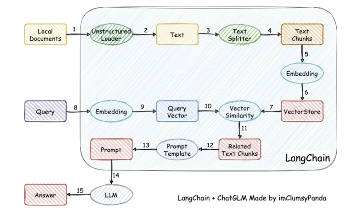

# RAG实战记录

**壁垒在于数据，而不是技术**

- 检索（Retrieve）：拿用户 query 调搜索引擎 API，拿到搜素结果；
- 增强（Augmented）：设置提示词，把检索结果作为挂载上下文；
- 生成（Generation）：大模型回答问题，标注引用来源；

## RAG工程方案

**主要分为上线前、运行时、上线后三个时间节点**

- 上线前（数据处理阶段）：重点在于怎么让知识库更准确，回复的答案更丰富，针对性的微调小模型
- 运行时（检索阶段）：重点在于怎么确保运行时筛选出答案，并且把更有价值答案返回给用户
- 上线后（生成阶段）：重点在于防止知识库随着时间而腐败，确保知识库的准确性和对场景的覆盖性

1. **意图识别 Intent Detection**

主要实现方案有两种：
 - 第一种是内置问题库，把常见问题缓存起来，再跟用户提问做相似度匹配，如果用户提问命中关键词库，就直接大模型回复
 - 第二种是设置提示词，让大模型判断意图，【对搜索意图进行分类】

第一种方案会有枚举无法穷尽的问题，第二种方案主要问题在于大模型的识别准确度不够高。

- 示例1：意图过多时，**配合知识库使用专家分组**
Q：RAG意图过多的时候，需要先分意图专家，在用转进进行意图匹配。此时就会有两个大模型的请求耗时。
A：可以尝试在进行专家判断的逻辑改成使用RAG提前放好一些内容来匹配专家，这样可以减少耗时

- 示例2：当我们**不想让大模型输出某些内容时**，例如：某些黑料问题。此时可以把黑料问句放到RAG中，用来筛选到之后做过滤。

2. **问题改写、拆分 query rewrite**

主要包括三个维度的改写：
  - 让提问有更精准 / 更专业的表达
  - 补全上下文，做指代消解
  - 名词提取

3. **多信息源聚合 Multi Source**

为了增加AI回复的可信度，对用户提问进行多信息检索，然后交给AI回复

4. **结果重排 Reranking**

  - 过滤与query不符的结果
  - 上下文长度限制，利用重排截取最有价值的结果

5. **读取内容并构建上下文内容池**
  
上下文内容池（Context Pool） = 历史搜索结果（Search Results）+ 历史对话消息（Chat Messages）

每次搜索后追问，都带上这个 Context Pool 做意图识别 / 问题改写，拿到新的检索结果后更新这个 Context Pool，并带上最新的 Context Pool 内容作为上下文请求大模型回答。

需要保证 Context Pool 的内容有较高的信息密度，同时要控制 Context Pool 的内容长度，不要超过大模型的 context 极限。

6. 提示词工程

需要大量精力用在提示词上，参考提示词工程博客

7. **权限问题**要注意，使用RAG的标签来进行权限控制。

8. **数据的更新**问题。知识库一定要做健康度检查

### RAG召回方案

**RAG的本质的筛选内容**，所以优化方案就是让他更多的查询到有效的内容

知识图谱、重排、混合检索、问题库尽可能覆盖场景、扩写问题库、改写query、短query改长句、索引扩展【关键词抽取等】、samll-to-big【元数据】

### RAG上下文方案

使用大模型根据上下文，整理内容。不过出错概率还挺多的

不使用上下文分析的情况：
- 把最近三条query都扔到知识库中去做匹配，然后拿三条query匹配出来的内容去做大模型回复
- 北京大学的计算机专业怎么样？土木工程怎么样？这类二义性的问题，无论哪个方向的回答都脱离用户本意，可以两个方向一起回复，即回答土木工程，也回答北京大学的土木工程。

## RAG产品

制作RAG产品的时候，我们需要考虑下面这些：数据选择、聚合、过滤、检索、润色文本处理、文档排名、少样本生成、提示设计

## RAG层级

1. Level-1 Explicit Facts（显性事实）
定义：这是知识库中最基础、最直接的信息，通常是明确、具体且易于理解的事实。

例子：如“水的沸点是100°C”或“地球绕太阳公转”。

特点：这些信息无需进一步解释或推理，通常以结构化数据（如数据库中的条目）或明确的陈述形式存在。

2. Level-2 Implicit Facts（隐性事实）
定义：这类信息不直接呈现，而是通过显性事实推导或关联得出，需要一定的逻辑推理或背景知识。

例子：如“如果一个人每天跑步，他可能会更健康”，这需要基于“跑步有益健康”的显性事实进行推理。

特点：隐性事实通常依赖于上下文或领域知识，可能隐藏在数据背后，需要通过分析或推理才能发现。

3. Level-3 Interpretable Rationales（可解释理由）
定义：这是对显性或隐性事实背后的逻辑、原因或机制的解释，通常与特定领域相关。

例子：如“跑步能提高心肺功能，因此有助于健康”，这解释了为什么跑步对健康有益。

特点：这些理由通常是领域专家或系统提供的，能够帮助用户理解事实背后的“为什么”。

4. Level-4 Hidden Rationales（隐形理由）
定义：这是最深层的知识，通常隐藏在系统或数据背后，可能是复杂的模型、算法或领域专家未明确表达的推理过程。

例子：如机器学习模型中的权重分配，或专家系统中未明确说明的决策规则。

特点：这些理由通常难以直接观察或解释，可能需要高级分析工具或领域专家的深入解读才能理解。

**总结：**
Level-1 和 Level-2 是知识的表现形式，前者是直接的，后者是间接的。

Level-3 和 Level-4 是知识的解释层次，前者是可解释的，后者是隐藏的。

这四个层次共同构成了知识库的完整体系，从表面事实到深层逻辑，逐步揭示知识的全貌。

### 常见问题

**文件分割的粒度**

- 粒度太大可能导致检索不精准，检索到的片段中信息太多
- 粒度太小可能导致信息不全面，问题的答案可能跨越两个片段

解决方案： 按照一定粒度（粒度根据具体文章内容来确定），部分重叠式的切割文本，使每一段的上下文更全面

**正确答案不在top_n**

- 检索时，正确答案不在前top_n中。例如top_n设置三条，但是正确结果在第四条。

解决方案：我们可以设置一个数量N，确保正确答案一定在前N个答案中，然后把前N个答案用一个新的专门用于排序的模型（不是普通大模型，有专门的重排序模型【CrossEncoder】）进行重新排序。这样可以让答案更靠前。

**语义检索失效**

- 大量专业术语、相近名词的出现，导致向量检索不好使

解决方案：混合检索(Hybrid Search)，利用RRF算法来结合各种检索方式。综合得到一个分数，这样相对会更加精准

**RAG效果不满意**

- 做完RAG之后，效果达不到预期。

解决方案：按照下述三个步骤进行检查，然后处理问题。
1. 检查预处理效果： 文档加载是否正确，切割是否合理。
2. 测试检索效果：问题检索回来的文本片段是否包含答案。 
3. 测试大模型基础能力：给定问题和包含答案的文本，大模型本身不能正确回答问题

## 2024RAG方案概览

1. **GraphReader【图解专家】**：通过将长文本构建成图并利用智能体探索，帮助 AI 处理长文本，克服迷路问题，提升信息获取效率。
2. **MM - RAG【多面手】**：介绍多模态机器学习发展及应用，能综合处理多种信息，在多领域提供智能服务，推动多模态 AI 发展。
3. **CRAG【自我校正】**：借助检索评估器和网络搜索改进检索文档质量，分解重组信息，增强生成文本准确性与可靠性。
4. **RAPTOR【分层归纳】**：采用递归方式构建文本树结构，在推理时整合不同层级信息，有效处理长文档检索与信息提取。
5. **T - RAG【私人顾问】**：结合 RAG 与微调 LLM，利用树结构组织信息，保护隐私同时解决数据与推理相关问题，提供本地化服务。
6. **RAT【思考者】**：生成初始思维链后，依据检索信息修订思维步骤，显著提升长时生成任务性能，增强推理逻辑性。
7. **RAFT【开卷高手】**：训练模型在特定领域准确引用相关文档回答问题，结合思维链提升推理能力，优化问答效果。
8. **Adaptive - RAG【因材施教】**：依查询复杂程度动态选检索策略，通过小模型分类器平衡不同检索增强方式，适应多样查询。
9. **HippoRAG【海马体】**：受人类记忆理论启发，协同多种技术实现知识整合，类似海马体功能，提升知识处理深度。
10. **RAE【智能编辑】**：先检索编辑事实，再利用模型优化，通过特殊检索和修剪策略提高编辑准确性，减少幻觉。
11. **RAGCache【仓储员】**：构建多级动态缓存系统，组织知识树并缓存，提出高效替换策略，优化 RAG 推理延迟。
12. **GraphRAG【社区摘要】**：分阶段构建图索引和社区摘要，依问题整合摘要生成答案，有效总结文本信息。
13. **R4【编排大师】**：学习文档排序增强大语言模型生成能力，含顺序调整和表示增强步骤，提升响应质量。
14. **IM - RAG【自言自语】**：整合信息检索与 LLM，通过学习内心独白支持多轮检索生成，强化学习优化过程。
15. **AntGroup - GraphRAG【百家之长】**：兼容多知识库索引底座，提供多样检索能力，解决问答问题，汇聚多种技术优势。
16. **Kotaemon【乐高】**：开源可定制 RAG UI，兼顾用户与开发者需求，方便构建文档问答系统，提高开发灵活性。
17. **FlashRAG【百宝箱】**：模块化工具包，实现多种 RAG 方法并整理数据集，助力研究人员开展 RAG 研究。
18. **GRAG【侦探】**：强调子图结构提升 RAG 处理图数据性能，降低幻觉，深入挖掘文本关联信息。
19. **Camel - GraphRAG【左右开弓】**：依托 Mistral 模型提取知识构建图谱，结合多种检索方式，全面精准搜索信息。
20. **G - RAG【串门神器】**：基于图神经网络重排 RAG 检索结果，结合连接和语义信息，优化文档排序。
21. **LLM - Graph - Builder【搬运工】**：利用 LLM 将非结构化数据转为 Neo4j 知识图谱，提取节点等信息，构建知识体系。
22. **MRAG【八爪鱼】**：利用多头注意力层激活获取多方面文档，提高复杂查询检索准确性，解决多文档检索难题。
23. **PlanRAG【战略家】**：定义决策问答任务，先规划再检索生成答案，助力解决复杂数据分析决策问题。
24. **FoRAG【作家】**：生成大纲并扩展构建答案，基于精细 RLHF 框架优化事实性，提升长文问答质量。
25. **Multi - Meta - RAG【元筛选器】**：用数据库过滤和元数据改进 RAG 文档筛选，精准定位多跳查询相关文档。
26. **RankRAG【全能选手】**：指令微调 LLM 兼具排名和生成功能，简化系统复杂性，提升上下文相关性判断。
27. **GraphRAG - Local - UI【改装师】**：基于 GraphRAG 适配本地模型，提供丰富交互界面，方便用户操作。
28. **ThinkRAG【小秘书】**：可部署于笔记本的检索增强系统，实现本地知识库智能问答，便捷实用。
29. **Nano - GraphRAG【轻装上阵】**：简化版 GraphRAG，保留核心功能，提高运行效率，适用于资源受限场景。
30. **RAGFlow - GraphRAG【导航员】**：借鉴 GraphRAG 改进问答流程，优化文档预处理，提升检索效率。
31. **Medical - Graph - RAG【数字医生】**：用图谱方法提升医学诊断准确性和透明度，解决医疗数据应用难题。
32. **HybridRAG【中医合方】**：结合知识图谱和向量检索，优势互补，提升金融文档信息提取问答效果。
33. **W - RAG【进化搜索】**：利用大模型排序创建弱标注数据训练检索器，提升开放域问答检索能力。
34. **RAGChecker【质检员】**：为 RAG 系统提供细粒度诊断报告，分析核心模块性能，指导优化方向。
35. **Meta - Knowledge - RAG【学者】**：创新工作流程，引入元知识概念，提升知识库理解和检索深度广度。
36. **CommunityKG - RAG【社群探索】**：结合知识图谱社区结构与 RAG 增强事实核查，提高检索准确性相关性。
37. **TC - RAG【记忆术士】**：引入图灵完备系统管理状态变量，高效准确检索知识，避免错误积累。
38. **RAGLAB【竞技场】**：模块化开源库，公平对比 RAG 算法，构建研究生态，推动算法评估创新。
39. **MemoRAG【过目不忘】**：基于超长记忆模型的 RAG 框架，全局理解数据库，增强证据检索与响应生成。
40. **OP - RAG【注意力管理】**：优化长上下文 RAG 机制，提高性能，帮助模型聚焦关键信息。
41. **AgentRE【智能抽取】**：整合模型能力应对复杂关系抽取挑战，提升关系抽取准确性和效率。
42. **iText2KG【建筑师】**：利用 LLM 增量构建知识图谱，无需复杂准备，灵活扩充知识网络。
43. **GraphInsight【图谱解读】**：提升 LLM 图形理解能力，采用关键策略整合知识库，应对复杂图任务。
44. **LA - RAG【方言通】**：基于 LLM 的 ASR 检索增强范例，利用语音数据和检索机制提高识别准确性。
45. **SFR - RAG【精简检索】**：指令微调小型模型，注重上下文生成与减少幻觉，可与外部工具交互检索信息。
46. **FlexRAG【压缩专家】**：压缩检索上下文嵌入优化 RAG 性能，灵活支持不同压缩比，节省成本。
47. **CoTKR【图谱翻译】**：交替生成推理路径和知识，优化知识改写，提升复杂知识图谱问答效果。
48. **Open - RAG【智囊团】**：用开源模型提升 RAG 推理能力，训练应对干扰项，处理复杂查询。
49. **TableRAG【Excel 专家】**：为表格理解设计的 RAG 框架，精准定位表格数据，提升编码和检索效率。
50. **LightRAG【蜘蛛侠】**：融入图结构的检索增强框架，双层检索结合向量和图，提高响应速度与相关性。
51. **AstuteRAG【明智判官】**：综合内部知识和检索结果确定答案，提高系统鲁棒性和可信度。
52. **TurboRAG【速记高手】**：预计算文档 KV 缓存优化 RAG 推理，减少计算开销，加快响应时间。
53. **StructRAG【收纳师】**：引入混合信息结构化机制，模仿人类思维提高 LLM 知识密集型推理表现。
54. **VisRAG【火眼金睛】**：基于视觉 - 语言模型的 RAG 流程，避免文本信息损失，提升多模态文档处理能力。
55. **AGENTiGraph【知识管家】**：自然语言交互知识管理平台，集成多功能，适应动态需求和数据变化。
56. **RuleRAG【循规蹈矩】**：基于规则引导的检索增强生成方法，提升规则遵循和答案生成能力。
57. **Class - RAG【法官】**：动态更新检索库实现内容审核分类，比传统微调更灵活有效。
58. **Self - RAG【反思者】**：通过检索和反思提升模型质量，利用反思标记控制推理行为。
59. **SimRAG【自学成才】**：自训练使 LLM 适应特定领域，问答与问题生成协同提升专业知识理解。
60. **ChunkRAG【摘抄达人】**：LLM 驱动块过滤增强 RAG 系统，减少幻觉，提高事实准确性。
61. **FastGraphRAG【雷达】**：应用 PageRank 算法快速定位知识图谱关键信息，提高 GraphRAG 检索效率。
62. **AutoRAG【调音师】**：自动识别优化 RAG 模块组合，类似 AutoML 实践，提升系统效率和扩展性。
63. **Plan×RAG【项目经理】**：扩充 RAG 范式为计划 - 检索，分解查询并行处理，利用冻结模型生成答案。
64. **SubgraphRAG【定位仪】**：检索子图并利用 LLM 推理预测，平衡模型复杂度和推理能力，实现高效检索。
65. **RuAG【炼金术士】**：蒸馏数据为逻辑规则注入 LLM，提升推理能力，促进知识与模型融合。
66. **RAGViz【透视眼】**：可视化检索文档和模型注意力，辅助诊断和理解 RAG 系统运行。
67. **AgenticRAG【智能助手】**：将 AI 智能体融入 RAG 流程，协调组件执行额外行动，克服局限。
68. **HtmlRAG【排版师】**：在 RAG 中用 HTML 建模知识，提出处理策略，优化知识呈现与利用。
69. **M3DocRAG【感官达人】**：多模态 RAG 框架适应多种文档场景，利用多模态检索器处理多文档和视觉信息。
70. **KAG【逻辑大师】**：结合知识图谱和向量检索优势，多方面增强 LLM 推理和生成性能，注重逻辑关系。
71. **FILCO【筛选师】**：基于多种方法识别过滤检索上下文，提升提供给生成器的上下文质量。
72. **LazyGraphRAG【精算师】**：延迟 LLM 使用降低索引成本，提高查询效率和答案质量，优化资源利用。

## GraphRAG场景

GraphRAG有其自己的应用场景，更结构化的信息场景，例如小说【问跟XX有关的人物都有谁？】，优点是更全面，缺点是更慢，更贵。

## RAG

RAG 检索增强生成， 就是字面意思：用检索来增强（LLM的）生成

RAG经典流程如图：

self-RAG流程如图：

离线步骤：
* 文档加载
* 文档切分
* 向量化
* 灌入向量数据库

在线步骤：
* 获得用户问题
* 用户问题向量化
* 检索向量数据库
* 将检索结果和用户问题填入 Prompt 模版
* 用最终获得的 Prompt 调用 LLM
* 由 LLM 生成回复

> 流程简述为：向量化用户输入=》去向量数据库中检索=》拿到检索结果=》交给大模型=》大模型阅读并输出答案给用户

重点在检索这一步，只有检索的准确，RAG才有意义。

检索通常分两种：1. 关键词检索；2. 语义检索

> 语义检索一定比关键词检索好么？ 不一定，看场景。相近词多的场景关键词检索更好

### 向量检索

使用向量化模型做向量化： 把一句话转换成一个多维几何空间中的一个点。 语义越相近，在这个几何空间中的距离就越相近

1. 将文本转成一组浮点数：每个下标`i`，对应一个维度
2. 整个数组对应一个`n`维空间的一个点，即文本向量又叫Embeddings
3. 向量之间可以计算距离，距离远近对应语义相似度大小

向量间的相似度计算方法：

* 欧氏距离，计算两个点再几何空间中的距离， 越小越相似；当两个向量相同时，欧几里得距离为 0，并且随着任一向量的角度（方向）或幅度（长度）的增加而增加。

* 余弦距离，计算原点分别到两个点的几何空间的距离， 越大越相似；通过找到两个向量之间角度的余弦来实现的（这意味着余弦相似度不考虑大小，只考虑方向）。

> bge_large_en 国内还不错的向量化模型

### 向量数据库

向量数据库并不产生向量模型，解决向量快速检索的能力。

**向量数据库的应用场景**

1. **知识库/问答系统**：通过大模型对大量的文本数据进行编码，将结果存储在向量数据库中。当有新的查询进来时，可以迅速找到与查询最相似的文档或文本段落，从而快速返回答案。
2. **图像识别与搜索**：图片经过 Embedding 技术后，可以转化为一个向量。当用户上传一张图片进行搜索时，向量数据库可以快速找到与其最相似的图片。
3. **内容推荐系统**：根据用户的浏览、购买或其他行为，可以使用模型为用户生成一个向量表示，然后查询向量数据库中最相似的内容向量，从而为用户推荐相关内容。

- FAISS: Meta 开源的向量检索引擎 https://github.com/facebookresearch/faiss
- Pinecone: 商用向量数据库，只有云服务 https://www.pinecone.io/
- Milvus: 开源向量数据库，同时有云服务 https://milvus.io/
- Weaviate: 开源向量数据库，同时有云服务 https://weaviate.io/
- Qdrant: 开源向量数据库，同时有云服务 https://qdrant.tech/
- PGVector: Postgres 的开源向量检索引擎 https://github.com/pgvector/pgvector
- RediSearch: Redis 的开源向量检索引擎 https://github.com/RediSearch/RediSearch
- ElasticSearch 也支持向量检索 https://www.elastic.co/enterprise-search/vector-search

**选择向量数据库：**

| 数据库   | 适用场景                                | 集成与生态系统                                                             | 性能                                 | 本地使用                               | 近期筹资                 | 特异性                              |
| -------- | --------------------------------------- | -------------------------------------------------------------------------- | ------------------------------------ | -------------------------------------- | ------------------------ | ----------------------------------- |
| Pinecone | 适合那些寻找即插即用解决方案的企业      | 与 TensorFlow、PyTorch 和 Scikit-learn 等主要机器学习框架有良好的集成      | 与其他矢量数据库相似                 | 不可能（非开源）                       | 1 亿 B 轮于 27/04/23     | 是唯一一个非开源的，不能本地迭代    |
| Qdrant   | 适用于要求高性能和灵活性的应用          | 主要与 DVC 集成，同时支持常见的数据版本控制工具                            | 优越（Rust 编码）；基准测试对比      | 可以（docker-compose, 磁盘文件, 内存） | 7.5m 种子轮于 24/04/23   | 高性能，本地灵活，与 DVC 集成       |
| Weaviate | 适用于需要 GraphQL 查询和本地存储的应用 | 提供开放 API 以供开发，支持 Python、JavaScript 和 Go 等多种客户端库        | 与其他矢量数据库相似                 | 可以（docker-compose, 磁盘文件）       | 5000 万 B 轮于 21/04/23  | 支持 GraphQL 查询，本地磁盘文件使用 |
| Milvus   | 适合大型组织和需求复杂的应用            | 提供丰富的插件，如数据导入工具、数据标注工具和与其他数据库的连接器         | 与其他矢量数据库相似                 | 可以（docker-compose）                 | 60M B 轮于 24/08/22      | 经过时间验证，但微服务架构复杂      |
| ChromaDB | 适用于简单的应用和 Python 环境          | 主要集成 Python 生态，如 NumPy、Pandas 和 Scikit-learn，方便数据分析和处理 | 可能较差（完全 Python 编码，无基准） | 可以（docker-compose, 磁盘文件, 内存） | 1800 万种子轮于 06/04/23 | 简单，完全用 Python 编码，易于定制  |

- 通用数据库最初不是为矢量搜索而设计的，因此不如专用矢量数据库效率高。
- 当成本和/或延迟成为问题时，请考虑使用专用的矢量数据库（如 Pinecone、Qdrant、Weaviate、Milvus）可以实现更高性能和更好的查询结果。
- 如果您使用少量向量（例如<10万）并且已经使用了其中一个数据库（根据stackoverflow 2023调查，49%的专业开发人员使用PostgreSQL），务实的选择肯定是坚持下去，以保持您的技术堆栈简单。

参考资料：
[How to choose your vector database?](https://www.sicara.fr/blog-technique/how-to-choose-your-vector-database-in-2023)

### rag存在的问题

传统RAG的7个问题：

- 知识库内容缺失：现有的文档其实回答不了用户的问题，系统有时被误导，给出的回应其实是“胡说八道”，理想情况系统应该回应类似“抱歉，我不知道”。
- TopK截断有用文档：和用户查询相关的文档因为相似度不足被TopK截断，本质上是相似度不能精确度量文档相关性。
- 上下文整合丢失：从数据库中检索到包含答案的文档，因为重排序/过滤规则等策略，导致有用的文档没有被整合到上下文中。
- 有用信息未识别：受到LLM能力限制，有价值的文档内容没有被正确识别，这通常发生在上下文中存在过多的噪音或矛盾信息时。
- 提示词格式问题：提示词给定的指令格式出现问题，导致大模型/微调模型不能识别用户的真正意图。
- 准确性不足：LLM没能充分利用或者过度利用了上下文的信息，比如给学生找老师首要考虑的是教育资源的信息，而不是具体确定是哪个老师。另外，当用户的提问过于笼统时，也会出现准确性不足的问题。
- 答案不完整：仅基于上下文提供的内容生成答案，会导致回答的内容不够完整。比如问“文档 A、B和C的主流观点是什么？”，更好的方法是分别提问并总结。

总的来看：

- 问题1-3：属于知识库工程层面的问题，可以通过完善知识库、增强知识确定性、优化上下文整合策略解决。
- 问题4-6：属于大模型自身能力的问题，依赖大模型的训练和迭代。
- 问题7：属于RAG架构问题，更有前景的思路是使用Agent引入规划能力。

**提出了Graph RAG来解决上述问题**
