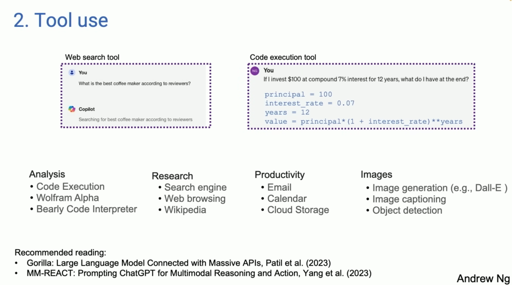

## agent workflow

代理工作流(Agentic Workflow)是与大型语言模型(LLM)交互和完成任务的一种新方法。传统上,我们与LLM交互时，会直接输入一个提示(prompt),LLM然后会基于这个提示直接生成一个输出结果。这种做法有点像让一个人一次性从头到尾写出一篇文章,没有反复修改和迭代的机会。

代理工作流则更像是将写作过程分解为多个步骤：首先是根据主题大纲写一个草稿，然后是对草稿进行分析、修改和补充，之后是进一步完善和润色,如此反复迭代,直到最终生成期望的结果。

在这个过程中,我们不是直接向LLM提出”写一篇文章”这样的指令,而是将任务分解为多个子任务，引导LLM按步骤完成每个子任务。每个子任务的输出将作为下一步的输入，以此循环往复。

## agent设计模式

四种常见的agent 设计模式。分别是Reflection（反思）、Tool use（使用工具）、Planning（规划）和Multiagent collaboration（多智能体协作）。

### Reflection - 利用大模型的思考能力

使用生成agent和评价agent，两个agent配合使用。由生成agent生成多个结果，然后由评价agent来进行评判最优结果。

这种模式涉及AI系统通过自我反馈和迭代完善来提高自身能力。通过这种方式，**AI系统能够在生成初始解决方案后，通过进一步的反思和分析，提高其输出的质量和准确性**。这种方法不仅可以用于编程任务，还可以扩展到其他领域，如写作、设计或任何需要迭代改进的任务。

“Self-Refine: Iterative Refinement with Self-Feedback” by Madaan et al. (2023)
该论文介绍了SELF-REFINE方法，这是一种基于反馈和迭代的方法，用于提高大型语言模型(LLM)的输出质量。通过反馈使用和迭代，SELF-REFINE确保输出达到所需的质量，并且不需要人工协助。实验表明，SELF-REFINE在多种任务中表现出显著的性能提升，特别是在自我反馈和迭代完善的方面。

“Reflexion: Language Agents with Verbal Reinforcement Learning” by Shinn et al. (2023)
该论文介绍了Reflexion方法，这是一种基于语言反馈的方法，用于强化语言代理。Reflexion代理通过维护自己的反思文本在事件记忆缓冲区中来提供更好的决策。Reflexion可以接受各种类型和来源的反馈信号，并在多种任务中表现出显著的改进。

通过这些方法，语言模型可以变得更加自适应和灵活，更好地满足用户的需求。实际上，这也是人们在实际应用中常用的方式，通过多轮对话和部分矫正，使得AI的返回答案能够达到更加满意的结果。

### tool use - 利用外部API

“Gorilla: Large Language Model Connected with Massive APIs” by Patil et al. (2023)
该论文提出了Gorilla,一种大型语言模型,能够有效地利用API调用。Gorilla通过解决输入参数生成和幻觉问题,在生成准确的API调用方面超过了GPT-4。当与文档检索器相结合时,Gorilla可以适应测试时的文档变化，并缓解幻觉问题。模型与检索系统的集成提高了可靠性。Gorilla将于2023年7月4日开源。

“MM-REACT: Prompting ChatGPT for Multimodal Reasoning and Action” by Yang et al. (2023)
该论文提出了MM-REACT,一种基于提示的方法,使ChatGPT能够进行多模态推理和行动。作者设计了一种提示模板,将自然语言指令与图像、网页等多模态输入相结合,从而使ChatGPT能够理解和执行涉及多个模态的复杂任务。他们在多个基准测试中评估了MM-REACT,结果显示其在多模态推理和行动方面表现出色。该工作
扩展了大型语言模型在多模态领域的应用。

通过工具使用,语言模型可以执行诸如网页搜索、代码生成、个人效率等多种任务,大大超越了其原有的自然语言处理能力。未来，工具使用或许将成为语言模型发展的重要方向,赋予它们更强的计划、推理和行动能力。

### Planning - 利用MOE多专家模式

规划是指训练语言模型进行推理、策划和分解复杂任务的能力。这使得语言模型不仅能回答问题,还能主动制定并执行行动计划。
通过规划能力,语言模型可以自主分解任务,确定所需的子步骤和工具,并协调不同模型的调用。在Andrew提到的一个场景中，语言模型需要先检测图像中人物的姿势,再调用图像生成模型合成新图像,最后结合语音合成输出结果。

“Chain-of-Thought Prompting Elicits Reasoning in Large Language Models” by Wei et al. (2022)
该论文提出了”思维链提示”(Chain-of-Thought Prompting)的新方法，旨在促进大型语言模型进行逐步推理。通过特定的提示形式,可以引导语言模型分解复杂问题,逐步推导出解决方案。实验结果表明,思维链提示可显著提高语言模型在算术推理、常识推理和符号推理等任务上的表现。

“HuggingGPT: Solving AI Tasks with ChatGPT and its Friends in Hugging Face” by Shen et al. (2023)
该工作将ChatGPT与Hugging Face生态系统中的多个专家模型相结合，构建了一个名为HuggingGPT的多模态AI系统。HuggingGPT能够利用ChatGPT的自然语言理解和生成能力,协调调用计算机视觉、语音识别等专家模型,完成复杂的多模态任务。作者设计了一种提示工程方法,使ChatGPT能够根据任务需求自主决策调用哪些专家模型。

规划赋予了语言模型一种”工具使用”的元能力,使其不再被限制在特定领域,而是能够灵活地**组合不同专家模型**完成各种复杂任务。

**huggingGPT  设计细节**

1. 概览：

- 任务规划：使用 ChatGPT 解析用户的请求，并将任务分解成可能可解决的子任务。
- 模型选择：为解决计划的任务，ChatGPT 基于模型描述从 Hugging Face 中选择对应的专家模型。
- 任务执行：调用并执行每个专家模型，并将结果返回给 ChatGPT。
- 响应生成：利用 ChatGPT 集成所有模型的预测结果，并为用户生成响应。

由于这样的设计，HuggingGPT 可以自动从用户请求生成计划，并使用外部模型，使其能够集成多模态感知能力并解决各种复杂的 AI任务。更重要的是，**这个流程允许 HuggingGPT 不断吸收来自特定任务专家的力量，促进了AI能力的增长和可扩展性**。

2. 任务规划：

**基于规范的指令**：为了更好地表示用户请求的预期任务并在随后的阶段中使用它们，LLM 通过遵循特定的规范（例如，JSON格式）来解析任务。因此，本文作者设计了一个标准化的任务模板，并指示 LLM 通过槽填充来进行任务解析。如表1所示，任务解析模板包括四个槽（"task"、"id"、"dep"和"args"）来表示 任务名称、唯一标识符、依赖关系 和 参数。通过遵循这些任务规范，HuggingGPT 可以自动利用 LLM 分析用户请求并相应地解析任务。

**基于演示的解析**：为了更好地理解任务规划的意图和标准，HuggingGPT在提示中结合了多个演示。每个演示包括一个用户请求及其相应的输出，代表了解析任务的预期顺序。通过整合任务之间的依赖关系，这些演示帮助HuggingGPT理解任务之间的逻辑连接，有助于准确确定执行顺序和识别资源依赖关系。我们的演示细节如表1所示。

此外，为了支持更复杂的场景（例如，多轮对话），我们通过追加以下指令在提示中包含了聊天记录：“为了帮助任务规划，聊天记录可用作 {{ Chat Logs }}，您可以追踪用户提到的资源并将它们纳入任务规划。”。这里的{{ Chat Logs }}表示以前的聊天记录。这种设计使得HuggingGPT能够更好地管理上下文并在多轮对话中回应用户请求。

3. 选择模型：

**上下文任务-模型分配**：将任务模型分配视为一个单选问题，在给定上下文中，可用的模型被呈现为选项。通常，基于提示中提供的用户指令和任务信息，HuggingGPT 能够为每个解析的任务选择最合适的模型。然而，由于最大上下文长度的限制，不可能在一个提示中包含所有相关模型的信息。为了缓解这个问题，首先根据它们的任务类型过滤模型，选择与当前任务匹配的模型。在这些选定的模型中，根据在 Hugging Face 上的下载次数对它们进行排名，然后选择前K个模型作为候选模型。这种策略可以大大减少提示中的令牌使用，并有效地为每个任务选择合适的模型。

4. 任务执行

一旦为解析的任务分配了特定的模型，下一步就是执行任务（即进行模型推理）。在这个阶段，HuggingGPT 将自动将这些任务参数传递给模型，执行这些模型以获得推理结果，然后将它们发送回 LLM。

> 资源依赖问题：先决条件任务的输出是动态生成的，因此在启动任务之前，HuggingGPT 还需要动态指定任务的依赖资源。随后再由先决任务替换，细节如下:

对于有资源依赖的任务使用一个独特的符号`<resource>`来维护资源依赖关系。具体地，HuggingGPT 将由先决条件任务生成的资源标识为`<resource>-task_id`，其中 task_id 是先决条件任务的 id。在任务规划阶段，如果某些任务依赖于先前执行任务的输出（例如，task_id），HuggingGPT 将在参数中设置此符号（即`<resource>-task_id`）。然后，在任务执行阶段，HuggingGPT 动态地用由先决条件任务生成的资源替换此符号。因此，这种策略使 HuggingGPT 能够在任务执行期间高效处理资源依赖关系。

此外，对于没有任何资源依赖关系的剩余任务将直接并行执行，以进一步提高推理效率。这意味着如果这些任务满足先决条件的依赖关系，那么可以同时执行多个任务。此外，通过提供一个混合推理端点，部署这些模型以实现加速和计算稳定性。

5. 响应生成

在完成所有任务执行后，HuggingGPT 需要生成最终的响应。HuggingGPT 在这个阶段将前三个阶段（任务规划、模型选择 和 任务执行）的所有信息整合成一个简明的摘要，包括计划的任务列表、为任务选择的模型以及模型的推理结果。其中最重要的是推理结果，这些结果是 HuggingGPT 做出最终决策的关键点。这些推理结果以结构化格式呈现，例如对象检测模型中的边界框和检测概率、问答模型中的答案分布等。HuggingGPT 允许 LLM 接收这些结构化推理结果作为输入，并以友好的人类语言形式生成响应。此外，LLM 生成的响应不仅仅是简单地汇总结果，而是主动响应用户请求，提供具有信心水平的可靠决策。

6. 问题总结

- 严重依赖于LLM的能力，无法保证生成的计划总是可行且是最优的
- 存在效率问题
- 存在tokens过大的限制问题和成本问题
- 存在不可控的不稳定性

### Multiagent collaboration - 多智能体协作

多智能体协作是指让多个语言模型或智能体通过交互协作来完成复杂任务。例如,可以模拟不同角色的专家(如医生、护士等)共同完成诊断和治疗方案的制定。该模式的关键在于训练智能体之间进行高效协作,明确分工,避免冲突和矛盾。

“Communicative Agents for Software Development” by Qian et al. (2023)
该论文提出了ChatDev系统,这是一种基于大型语言模型的多智能体协作框架,用于软件开发任务。ChatDev通过提示语言模型扮演不同角色(如CEO、设计师、开发人员等),模拟一个软件开发团队的协作过程。这些虚拟智能体可以就产品需求、设计、编码等展开持续对话，并最终生成相对完整的程序。实验表明,ChatDev在多个编程任务上表现出色,展现了多智能体协作的潜力。

“AutoGen: Enabling Next-Gen LLM Applications via Multi-Agent Conversation” by Wu et al. (2023)
该工作提出了AutoGen,一种通过多智能体内部对话实现复杂任务的框架。AutoGen将多个语言模型组合成一个多智能体系统,通过分工协作完成从需求分析到代码生成的全流程。不同的智能体负责不同的子任务,如需求理解、架构设计、代码实现等,并通过自然语言对话进行协调。实验结果显示,AutoGen在代码生成等任务上表现优于单一语言模型，证明了多智能体方法的有效性。

未来,多智能体系统或许将成为解决复杂问题的有力工具,展现出超越单一智能体的协同能力。

## 结论

**我们创造了工具，工具反过来塑造了我们。**

当我们在创建智能体时，我们也在某种程度上创造了自己。

人们对AI生产工具的准确性提出质疑，但有时也可能忽略一个事实：作为人类，我们也会犯下许多错误。生成式的内容本质上是基于无数训练语料的概率，但人们是否曾想过，电子云也是由概率波函数描述的？换句话说，我们的现实世界本身就是由概率构成的。

设计和创造都是基于对自然规律的理解和尊重，而不是超越自然规律的能力。

这个世界是被创造的还是从来就有的？