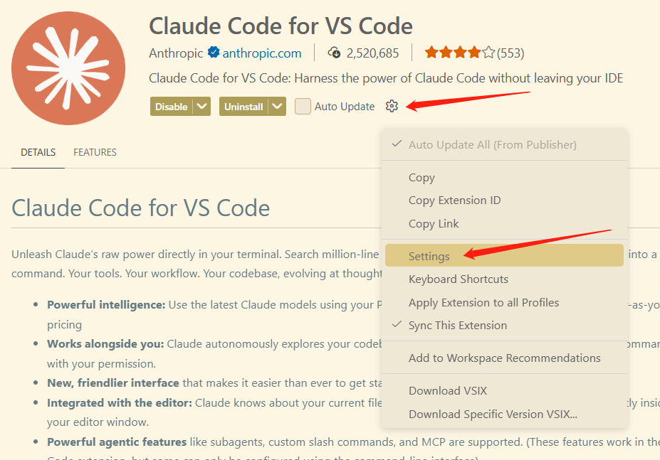
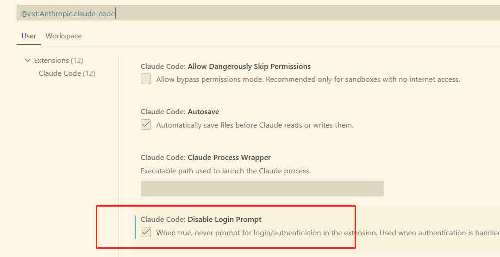
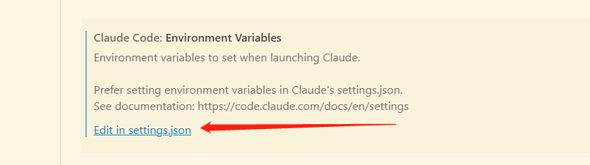
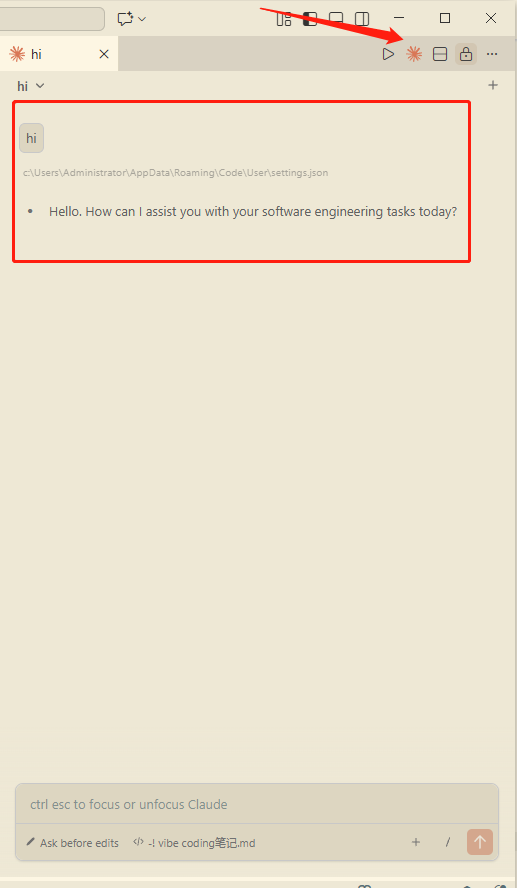

# Claude Code 使用指南

**需要`node22+`、`git`**

## 最新安装方法

[完整的设置说明请参见此处](https://code.claude.com/docs/en/quickstart)

简而言之，你需要执行以下操作：

- MacOS (Homebrew): brew install --cask claude-code
- MacOS、Linux、WSL： curl -fsSL https://claude.ai/install.sh | bash
- Windows 命令提示符： curl -fsSL https://claude.ai/install.cmd -o install.cmd && install.cmd && del install.cmd

安装完成后，要先在`~\.claude\settings.json`文件中，配置好国内的环境变量。

注意：`hasCompletedOnboarding`必须配置为true, 否则无法使用claude命令。

```json
{
  "hasCompletedOnboarding": true,
  "env": {
    "ANTHROPIC_BASE_URL": "https://ark.cn-beijing.volces.com/api/compatible",
    "ANTHROPIC_AUTH_TOKEN": "your key",
    "API_TIMEOUT_MS": "3000000",
    "CLAUDE_CODE_DISABLE_NONESSENTIAL_TRAFFIC": "1",
    "ANTHROPIC_MODEL": "doubao-seed-code-preview-251028",
    "ANTHROPIC_DEFAULT_SONNET_MODEL": "doubao-seed-code-preview-251028",
    "ANTHROPIC_DEFAULT_OPUS_MODEL": "doubao-seed-code-preview-251028",
    "ANTHROPIC_DEFAULT_HAIKU_MODEL": "doubao-seed-code-preview-251028"
  }
}
```

在终端运行`claude`命令。

## node版本的安装claude code

以下提供的是使用node的安装方式。目前除了node还提供了直接下载的方式，看底部【Claude Code 安装文档】

1. 安装claude

`npm install -g @anthropic-ai/claude-code`

安装后中国地区不允许使用claude. 需要修改模型配置

2. 设置`settings.json`

在用户/.claude目录下，新建settings.json文件，添加内容如下：

> 示例目录`C:\Users\Administrator\.claude\settings.json`

```json
{
  "env": {
    "ANTHROPIC_BASE_URL": "https://ark.cn-beijing.volces.com/api/compatible",
    "ANTHROPIC_AUTH_TOKEN": "your key",
    "API_TIMEOUT_MS": "3000000",
    "CLAUDE_CODE_DISABLE_NONESSENTIAL_TRAFFIC": "1",
    "ANTHROPIC_MODEL": "doubao-seed-code-preview-251028",
    "ANTHROPIC_DEFAULT_SONNET_MODEL": "doubao-seed-code-preview-251028",
    "ANTHROPIC_DEFAULT_OPUS_MODEL": "doubao-seed-code-preview-251028",
    "ANTHROPIC_DEFAULT_HAIKU_MODEL": "doubao-seed-code-preview-251028"
  }
}
```

解释一下配置：

`CLAUDE_CODE_DISABLE_NONESSENTIAL_TRAFFIC`：禁止上传数据

`ANTHROPIC_MODEL`: 主模型，用于处理复杂任务（如代码编写、深度推理、复杂问题解决），建议使用性能更强的模型。

`ANTHROPIC_DEFAULT_SONNET_MODEL`: 默认的中等规模模型，在性能与速度间取得平衡，适用于日常对话、内容总结等通用场景。

`ANTHROPIC_DEFAULT_OPUS_MODEL`: 旗舰模型，性能最强，适用于复杂推理、代码生成、深度研究等高端任务。

`ANTHROPIC_DEFAULT_HAIKU_MODEL`: 轻量级模型，响应速度最快，适用于实时交互、客服聊天、快速响应等对延迟敏感的场景。

3. 配置完成后就可以在终端输入`claude`来使用`claude code`。

> 注意当前系统中不要有`ANTHROPIC_AUTH_TOKEN`和`ANTHROPIC_BASE_URL`几个环境变量

## 设置自己的claude命令

**需要火山方舟开通`Doubao-Seed-Code`模型**

1. 创建项目并进入项目目录
`mkdir claude-model && cd claude-model`

2. 初始化npm
`npm init -y`

3. 安装`claude-code`
`yarn add @anthropic-ai/claude-code`

4. 新建子目录 `.claude-doubao`放配置文件
`mkdir .claude-doubao` 

5. 新建子目录 `bin`做环境变量目录，复制`bin`目录的完整路径，添加到系统环境变量中。

6. `bin`目录下，创建`claude-doubao.bat`，内容如下：

```bat
@echo off

:: Wrapper for Claude Code CLI using Doubao API
set CLAUDE_BIN=%~dp0\..\node_modules\.bin\claude

:: Keep a separate config dir (optional)
set CLAUDE_CONFIG_DIR=%~dp0\..\.claude-doubao

:: 配置成功之后这四行需要删掉，后续使用.claude.json来控制
set ANTHROPIC_AUTH_TOKEN="your key"
set ANTHROPIC_BASE_URL="https://ark.cn-beijing.volces.com/api/compatible"
set ANTHROPIC_MODEL="doubao-seed-code-preview-latest"
set API_TIMEOUT_MS=3000000

:: Execute the claude command with all arguments
%CLAUDE_BIN% %*

```

7. 测试效果：`claude-doubao --version`, 输出版本号即可。

8. 测试成功之后使用 `claude-doubao` 命令开始设置

9. 添加修改配置文件`.claude-doubao/.claude.json`

删除bat文件中相关的环境变量，在配置文件添加相关环境变量。

当`ANTHROPIC_BASE_URL="https://ark.cn-beijing.volces.com/api/coding" `时，需要在火山方舟订阅 Coding plan

当`ANTHROPIC_BASE_URL="https://ark.cn-beijing.volces.com/api/compatible"`时，是按量付费

```json
{
  "env": {
    "ANTHROPIC_API_KEY": "your key",
    "ANTHROPIC_BASE_URL": "https://ark.cn-beijing.volces.com/api/compatible",
    "ANTHROPIC_MODEL": "doubao-1-5-pro-32k-250115",
    "API_TIMEOUT_MS": 3000000
  }
}
```

9. 使用`claude-doubao`命令就可以开始vibe coding了。

10. 更换其他的模型1：直接修改配置文件中的`env`即可。

11. 更换其他的模型2：直接创建`xxx.bat`和`.xxx`文件即可。

## 备注

- 如果出现claude不支持当前地区的问题，是因为在初始化之前没有在bat文件里配置环境变量。

- 一般厂商都有`coding plan`，开启`coding plan`会便宜很多，使用次数也不错。

## claude code + vscode

1. 安装claude code
首先要安装cc, 并在`~\.claude\settings.json`文件中，配置好国内的环境变量。

1. 安装扩展
安装 `claude code for vscode`扩展

2. 打开设置，禁用登录界面

点击扩展的设置



勾选禁用登录界面



3. 修改扩展的 Selected Model

设置模型信息如下：`"claudeCode.selectedModel": "doubao-seed-code-preview-251028"`


4. 编辑settings.json 修改环境变量



设置环境变量如下：
```json
"claudeCode.environmentVariables": [
        {
            "name": "ANTHROPIC_AUTH_TOKEN",
            "value": "your key"
        },
        {
            "name": "ANTHROPIC_BASE_URL",
            "value": "https://ark.cn-beijing.volces.com/api/compatible"
        },
        {
            "name": "ANTHROPIC_MODEL",
            "value": "doubao-seed-code-preview-251028"
        },
        {
            "name": "API_TIMEOUT_MS",
            "value": "3000000"
        },
        {
            "name": "CLAUDE_CODE_DISABLE_NONESSENTIAL_TRAFFIC",
            "value": "1"
        },
        {
            "name": "ANTHROPIC_DEFAULT_SONNET_MODEL",
            "value": "doubao-seed-code-preview-251028"
        },
        {
            "name": "ANTHROPIC_DEFAULT_OPUS_MODEL",
            "value": "doubao-seed-code-preview-251028"
        },
        {
            "name": "ANTHROPIC_DEFAULT_HAIKU_MODEL",
            "value": "doubao-seed-code-preview-251028"
        }
    ]
```

5. 点击右上角claude code图标，即可使用。



## 模型调用逻辑

**默认模型行为**

- 模型选择器中的”默认”选项不受 availableModels 影响。它始终保持可用，并代表系统的运行时默认值基于用户的订阅层级。

- 即使使用 availableModels: []，用户仍然可以使用其层级的默认模型来使用 Claude Code。
​
**控制用户运行的模型**

要完全控制模型体验，请将 availableModels 与 model 设置一起使用：
  - availableModels：限制用户可以切换到的内容
  - model：设置显式模型覆盖，优先于默认值

此示例确保所有用户运行 Sonnet 4.6，并且只能在 Sonnet 和 Haiku 之间选择：
```js
{
  "model": "sonnet",
  "availableModels": ["sonnet", "haiku"]
}
```

## claude code的三个模式

- Ask Before Edits（询问后编辑模式）
最保守的模式，每次修改前都会向用户展示建议的代码变更，并询问是否确认执行。用户需要明确同意后才会应用修改。

- Plan Mode（计划模式）
AI会先分析代码问题，生成一个完整的修改计划（包含多个步骤的变更建议），一次性展示给用户预览，用户确认后才会批量执行所有修改。

- Edit Auto（自动编辑模式）
最激进的模式，AI会直接应用它认为必要的修改，无需用户逐条确认。通常用于快速修复明显的语法错误、格式问题等。


## 相关资料

[国产大模型接入 Claude Code 教程](https://mp.weixin.qq.com/s?__biz=MzI4NjAxNjY4Nw==&mid=2650242330&idx=1&sn=24f19e9a16ab76e80ce2e5a16ca13c4a&scene=21&poc_token=HI1GS2mj75Hk4xGOzBBGZmxXZX0PC0i1NgX8kekg)

[豆包接入 Claude Code 文档](https://www.volcengine.com/docs/82379/1928262?lang=zh)

[doubao-seed-code使用文档](https://console.volcengine.com/ark/region:ark+cn-beijing/model/detail?Id=doubao-seed-code)

[Claude Code 安装文档](https://code.claude.com/docs/en/setup)

[七牛云兼容Anthropic配置](https://developer.qiniu.com/aitokenapi/13085/claude-code-configuration-instructions)

[minimax文档](https://platform.minimaxi.com/docs/coding-plan/claude-code)

[技巧claude code](https://zhuanlan.zhihu.com/p/1994201298950698247)

[cc技巧](https://github.com/affaan-m/everything-claude-code)

[claude skills技巧](https://mp.weixin.qq.com/s/5hFHlItI3XQUWekejC_kiw?poc_token=HEJ5cWmjDrVH3jS1LmuCFIkXhfVe8O1szku9HoPu)

[everything-claude-code仓库，可以抄一些技能、提示词之类的](https://github.com/affaan-m/everything-claude-code)

[claude code 命令列表](https://code.claude.com/docs/en/commands)

[官方skill项目](https://github.com/anthropics/skills)

[火山的coding plan](https://www.volcengine.com/activity/codingplan)

[GLM的coding plan](https://bigmodel.cn/glm-coding?utm_source=bigmodel&utm_medium=link&utm_term=%E5%A5%97%E9%A4%90%E6%A6%82%E8%A7%88%E9%A1%B5&utm_campaign=Platform_Ops&_channel_track_key=RYqdAnEv)

[siklls实践-trae文档](https://docs.trae.cn/ide/top-10-recommended-skills-for-development-scenarios)
