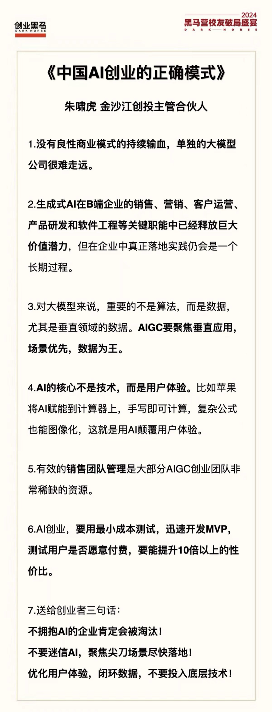

**出路在TOB，TOC必须有足够的付费率才可以，很难**

----------------------------------------------------------------

1. 政府、国企、央企已[接到大搞人工智能的「任务」](http://www.sasac.gov.cn/n2588025/n2588139/c30132964/content.html)，[基础模型采购如火如荼](https://mp.weixin.qq.com/s/EZ-FXqH7t5hbtSayf2jjtw)，都在努力找标杆项目
2. 有研发能力的民企，多数已经动起来，内部升级/招兵买马
3. 没研发能力的民企，用 AI 工具提效已经比较普遍，意识先进者开始用大模型赚钱了，和外包合作实现更好的自动化，甚至产品化

----------------------------------------------------------------

《中国AI创业的正确模式》
1.没有良性商业模式的持续输血，单独的大模型公司很难走远。
2.生成式AI在B端企业的销售、营销、客户运营、产品研发和软件工程等关键职能中已经释放巨大价值潜力，但在企业中真正落地实践仍会是一个长期过程。
3.对大模型来说，重要的不是算法，而是数据，尤其是垂直领域的数据。AIGC要聚焦垂直应用场景优先，数据为王。
4.**AI的核心不是技术，而是用户体验**。比如苹果将AI赋能到计算器上，手写即可计算，复杂公式也能图像化，这就是用AI颠覆Q户体验。
5.有效的销售团队管理是大部分AIGC创业团队非常稀缺的资源。
6.AI创业，要用最小成本测试，迅速开发MVP,测试用户是否愿意付费，要能提升10倍以上的性价比。
7.送给创业者三句话:
- 不拥抱AI的企业肯定会被淘汰!
- 不要迷信AI，聚焦尖刀场景尽快落地!
- 优化用户体验，闭环数据，不要投入底层技术!

----------------------------------------------------------------

深入到垂直领域的具体细分场景。做窄，做细，做深入 
**（讲座课[《AI 落地实战应用——EDGE 过程总结和复盘》](https://www.zhihu.com/xen/market/training/training-video/1720187095111565312/1770874015751532546)可以证明）**

----------------------------------------------------------------

个体的典型机会：只为 5000 人写一个软件，体验足够好，每月收 10 元钱。（toB按人头收费）

1. 这种机会大厂不爱做
2. AI 提升用户体验，创造收费价值
3. 产品复杂度不高，一人+AI 足以完成
4. 每月收入 50000 元，足够体面生活
5. 维护阶段可以再做新产品，找新的增长点

----------------------------------------------------------------

宏观看，执行永远比思考更重要。建议思考占用的精力别超过 10%。

----------------------------------------------------------------

兼职最大的成本不是薪资，而是沟通成本。

**薪资**
如果与结果正相关，就按效果付费，分担你的风险
如果与结果不正相关，就按件付费，尽量压低价格。千万别大方，因为风险都在你自己身上
如果工作量不好估计，就按月付费，虽然这样的管理成本比较高

**沟通**
降低沟通成本的方法：
提升沟通频率。把问题尽早暴露，避免返工
提升沟通带宽
能面聊就面聊。如果不具备条件，至少第一次沟通要面聊/视频
尽量写好文档、画好图表，别只用 IM 沟通（和 prompt 原则一样：具体、丰富、少歧义）
文档和图表都用协作型的。产出物也尽量实时共享

----------------------------------------------------------------

参考阅读：

- [《AI 大模型全栈工程师》校友的故事](https://www.bilibili.com/video/BV1afepehEhm/)
- [《AI 大模型全栈工程师》老师+助教+学员一起创立「AI 师傅」的故事](https://mp.weixin.qq.com/s/A1rAbXYVkCpiWnyZIhSCyA)

其他：

- [flomo 的经营理念](https://help.flomoapp.com/about-us/about-us/company-concept.html)
- [这家公司只有创始人一名员工，年营收千万！他是如何做到的？](https://mp.weixin.qq.com/s/pznEq8JHRMtaSlO_OvzjYQ)
- [9 人小公司，细分领域 SaaS 工具从 0 到 1 做到 100 万美金 ARR 的过程](https://mp.weixin.qq.com/s/Xvj7Y7NyTILmyS287ymQOg)
- [一个独立创造者的五年](https://mp.weixin.qq.com/s/x6PLSIMn_1qcKnXWPT-J-Q)
- [中国的独立开发者都在开发些什么？](https://mp.weixin.qq.com/s/izJdOMP0LY1VeBmzpnXScQ)
- [想做“独立开发者”，第一步应该怎么做？](https://mp.weixin.qq.com/s/5q6WYfr6G2zKru0LcvvPUw)
- [#独立开发变现周刊](https://mp.weixin.qq.com/mp/appmsgalbum?__biz=MjM5OTM3NzAwNg==&action=getalbum&album_id=1857680644290478080&scene=173&from_msgid=2649285309&from_itemidx=1&count=3&nolastread=1#wechat_redirect)
- [一年的独立开发者生活](https://www.maliquankai.com/2018/08/08/2018-08-08-oneyear-developer/)

----------------------------------------------------------------

在立项阶段，要对这三个要素有初步的答案：

- 真实需求是什么？
- 商业模式是什么？
- 推广渠道在哪里？

初步答案可能不靠谱，没关系，后面都有修正机会。

但起点和要特别关注的是，寻找真实需求。然而，建议把思考顺序反过来。

划重点：先看自己有什么渠道，再面向渠道带来的用户定商业模式、找真需求
- 推广渠道决定用户群体，这确实应该最先定义
- 不掌握渠道的人做出产品，很容易被掌握渠道的抄走，或分走最大利润
- 推广渠道和商业模式不是程序员的舒适区，所以要先想清楚
- 需求想太多，容易陷入兴奋，后两者不多想就动手

------------------------------------------------------------------

| 模式       | 说明                        | 2C 产品                                          | 2B 产品                             |
| ---------- | --------------------------- | ------------------------------------------------ | ----------------------------------- |
| 免费模式   | 免费使用，广告/增值服务变现 | 微信、抖音、王者荣耀、ChatGPT、Bing Chat         | GitHub、钉钉、飞书                  |
| 计费模式   | 按次/按量/按时长收费        | 滴滴打车、共享单车、共享充电宝                   | 云服务器、云数据库、云存储          |
| 订阅模式   | 包月、包季、包年            | 网易云音乐、爱奇艺、ChatGPT Plus、GitHub Copilot | GitHub Copilot                      |
| 一次性付费 | 购买一次，终身使用          | Alfred、塞尔达传说                               | Confluence、JIRA、Windows、外包项目 |

------------------------------------------------------------------

适合独立开发者/AI 的模式

1. 不要烧钱。如果用户/客户不肯为你的产品掏钱，说明需求选错了
2. 2B 外包项目，尽量一次性付费，且做好只收到首付款的准备
3. 订阅制最香
   - 每月有固定收入，增长压力不大（很多好产品死于增长）
   - 连续包月，很多人忘记退订……（但在中国较难获得权限）
   - 订阅更匹配按 token 算成本的 AI 产品，参考手机按量付费 vs. 套餐制

------------------------------------------------------------------

支付宝周期扣款的准入条件：

1. 在开通时，商家需要在线提交营业执照，注册资本大于等于 100 万人民币。
2. 企业无经营风险，包含但不限于工商信息可查询到的风险信息：行政处罚、股权冻结、股权质押、动产抵押、动产抵押物等。

微信支付的门槛更高，参考「微信支付——扣款服务（委托代扣）最全资料整理」。基础条件：

1. 商户需要提供服务电话（要求通过微信支付认证，并展示在账单详情页中）
2. 接入商户一个月内整体客诉已经妥善处理并反馈平台，近一个月客诉小于万分之一（含主体）
3. 商户主体无违规
4. 接入代扣业务需要有一定的交易量要求，3 个月以上，主动支付的日交易笔数超过 1000 笔

------------------------------------------------------------------

找到真实需求，超过半数的产品经理，都找不到真实需求。

人的语言、行为表达出的需求，往往不是真实需求。比如：

「酱香拿铁」卖爆了，买的人是为了喝咖啡吗？现在是不是不爆了？
妈妈要你给她买生日蛋糕，她是没钱买还是想吃蛋糕？
女朋友要你接她下班，你说：我给你出打车费……
真实需求往往猜不出来。有效途径只有实地考察。

**5 why 法**
丰田公司创始人，丰田佐吉，提出的一种「找根本原因」的方法：

接到一个需求，问为什么有这需求。得到答案后，再问为什么会有这样的答案，以此类推，直至找到根本性的核心需求。

实战中，通常问到 2-3 个 why，就已经找到真需求了。

5 个 why，找到了真需求「她需要我对她用心」，解决方案是「更多关注她的感受，把过程表达出来」。

但是，5 why 法有两个致命缺点：

- 如果你对业务理解不够，对方会不耐烦
- 有时，显得不太礼貌

**躬身入局法**

非常简单：自己去把业务做一遍。一遍不够就再来一遍。

真实案例：

高途要求所有新入职的产研，必须先做一个月的销售
美团骑手线的产品经理，都送过外卖
这是比「吃自己的狗粮」更彻底的做法。

缺点：

成本高，时间和资源成本都高。但很值得
有些业务，咱们真插不上手。那就像个学徒一样，全程跟随观察吧
行动：约付费能力强的群体中，你最熟悉的三个人吃饭。你给 ta 讲 AI，ta 跟你聊业务。找到 AI 能解决的真需求。

## 产品定价

1. 我们的产品，用户愿意拿多少钱来换。
2. 我们提供的价值，是否有溢价的空间。
3. 市场价值的参考
4. 我们的成本