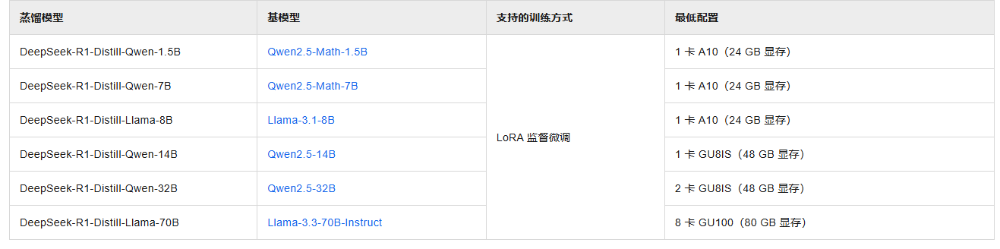

# 微调

微调是指在已经训练好的大型预训练模型的基础上，进一步训练该模型以适应特定任务或特定领域的数据。

相比从零开始训练一个模型，微调所需的数据和计算资源显著减少；可以在特定任务上取得更好的性能，因为模型在微调过程中会重点学习与任务相关的特性；

可以在多种领域（如情感分析、问答系统等）上进行微调，从而快速适应不同应用场景。

与 RAG（Retrieval-Augmented Generation）或 Agent 技术依靠构建复杂的工作流以优化模型性能不同，微调通过直接调整模型的参数来提升模型的能力。

这种能力的增强是通过更精细地调整模型内部的权重和偏差，使其在理解和生成信息时更加精准，因此被广泛用于需要高精度和领域适应性的任务中。

目标：通过少量的标注数据对预训练模型进行优化，适应具体任务。

特点：微调的计算量相对较小，能够在有限的数据和计算资源下提升模型在特定任务上的性能。

应用：常用于下游任务如情感分析、机器翻译、推荐系统等。

## 数据


### 明确业务场景和微调需求

- **找到准备微调的任务：**根据自己的目标或业务需求来决定要进行的微调任务。

- **测试大模型能力：**使用主流的大模型，对自己的准备微调的业务问题进行批量测试，评估该任务场景是否现有大模型已经做得足够好了，根据评估结果选择使用原生大模型，或者准备一批更高质量的数据集进行微调。

- **确定微调任务场景：**针对某一种特定的任务场景，准备约几千条高质量精调数据即可让大模型学会这项能力，发挥出良好的效果。通常使用具有强烈业务属性的数据集在开源基座模型上进行精调，就能比较显著地提升模型在业务上的能力；

### 明确高质量训练数据的标准

1. 数据集的问答需要尽可能完美的满足业务的期望（例如回答逻辑性、风格、语气等），并且答案是绝对正确的。
  
  因为数据集是用来解决实际问题，并且这些数据是大模型学习过程中的重要依据。微调过程中大模型会去理解数据集的回答以及表达风格，如果数据存在瑕疵，大模型也会把这些瑕疵学到，从而影响最终的效果。

2. 数据集的指令需要多样化，以避免大模型产生对某些短语的过拟合，而忽略了自然语言的实际含义。
   
  例如对于一个阅读理解数据集，只包含了一种指令“根据以下已知内容，请回答问题并说明原因。已知内容：xxxxx。问题：xxxx”。大模型经过这个数据的精调后很有可能会出现这样的情况：大模型一旦看到“根据以下已知内容”这个短语作为输入，他就自然而然地在回答问题的同时说明原因。
  因为大模型通过这批数据的学习，很有可能错误地认为“根据以下已知内容”与“回答时要说明原因”是等价的。这样如果用户输入“根据以下已知内容，请回答问题，要求只回复答案，不要做其他解释。已知内容：xxxxx。问题：xxxx”，大模型还是会回复原因。这种针对指令的过拟合现象是需要去避免的，解决办法就是扩充数据集的指令集，做到问题与回答的类型多样、场景多样、避免重复

3. 数据集的格式


SFT：通过有监督的方式精调模型，从而提升模型在特定任务上的指令遵循能力
```json
[
   {
    "instruction": "你是一个聊天机器人，能理解并回答问题",
    "input": "你知道会当凌绝顶,一览众山小，这句诗词描述的是哪座山么？",
    "output": "黄山，我上周刚去爬了黄山，风景很优美。"
  },
]
```

DPO：基于成对的正负反馈数据，直接训练大模型，使其更符合人类偏好。SimPO的数据格式和DPO差不多。

```json
[
  {
    "question": "地球为什么会自转？",
    "positive_answer": "地球自转是由于形成初期的角动量守恒，原始星云坍缩时的旋转运动转化为地球的自转，周期约为24小时。",
    "negative_answer": "因为地球围绕太阳公转产生了引力作用，所以导致自转。（错误：公转与自转成因不同）"
  },
  {
    "question": "相对论的提出者是谁？",
    "positive_answer": "相对论由阿尔伯特·爱因斯坦在20世纪初提出，包括狭义相对论和广义相对论。",
    "negative_answer": "牛顿提出了相对论。（错误：牛顿的主要贡献是经典力学）"
  }
]
```

KTO：单条回答 + 人类反馈标签，根据人类正向或负向反馈进行模型训练，高效对齐人类行为偏好

```json
[
  {"instruction": "如何学英语？", "output": "每天坚持阅读英文文章。", "kto_tag": true}
]
```


### 技巧

- **由少到多：**数据集的准备可以由少到多，先从少量数据开始微调，然后逐步增加数据量，直到达到预期的效果。
- **数据集比例：**训练数据集：验证数据集：测试数据集（7: 1.5: 1.5）


## 资源与环境

autodl.com 租算力，建议4090即可，性价比比较高

- 普通GPU与CPU，训练时效差距约20倍。

- 高端GPU（H100,A100等）与普通GPU，训练时效差距约20倍

阿里微调便宜，是按照GPU*小时计算的。但是部署贵，部署也是按照小时收费

火山微调贵，是按照tokens、资源等计算的，但是调用便宜，是按照tokens收费的


[阿里PAI](https://pai.console.aliyun.com/?regionId=cn-shanghai&spm=a2c4g.11186623.0.0.24425a39620doL&workspaceId=452329#/quick-start/models)

[火山微调](https://console.volcengine.com/ark/region:ark+cn-beijing/finetune)

[智谱清言微调](https://open.bigmodel.cn/console/modelft/finetuning)

[讯飞星火](https://maas.xfyun.cn/)


**微调资源**


**部署资源**


**ds部署**


**ds部署2**


### GPU的选择

- 3060、3090、3080Ti、4090、4090D、A4000、A5000、A40、A100、A800、L20、H20、H800等安培架构的卡需要cuda11.1及以上才能使用


## 训练

### 参数


- epoch：迭代轮次，选择适合的轮次，太高会过拟合，过拟合会导致通用能力下降。通常数据量越多，训练轮次就越少（数据量不够就需要更多次的训练）。例如2千条数据5轮，2万条数据2轮。训练结果不好时，更推荐增加数据的多样性，提升数据量，而不是简单的多训几个 epoch。

- 批处理大小：越大就越越能加速训练。在计算资源（主要是显存）允许的条件下，尽可能提升批量大小。该批量大小和模型参数大小以及序列长度高度相关，也将很大程度上影响训练时间。同时建议在训练中要保证有足够的迭代次数（1000步以上），迭代次数由数据量、迭代轮数、批量大小来决定。在数据量较小，又不适合过多地增加迭代轮数，则可以适当减少批量大小。

- 学习率：它决定了每次更新时权重的调整程度，初始学习率建议选择5e-6（0.000005）至1e-5（0.00001）之间。通常问题越复杂学习率越小，数据集越大学习率越大。通常，较大的学习率可能导致模型在训练过程中波动较大，收敛困难；较小的学习率可能导致收敛速度慢。

- 序列长度：在训练代码中，会根据设置的序列长度，对训练数据进行截断。需要根据自己的训练数据的最长序列长度进行设置，以保证某些重要的数据不会被错误截断。为了提高训练效率，可以将不同长度的数据进行分批次训练（例如先训4k再训8k）。在设置序列长度时，需要对基座模型进行核对，看是否支持相应的序列长度。

- 迭代次数 = epochs × (样本数 / batch_size)。 max_steps作为迭代步数的上限，会覆盖epochs

**其他参数：**

1. 学习率调整策略
作用： 控制学习率如何随着训练过程而变化。模型在初期和后期对学习率的敏感度不同，一个好的策略可以加速收敛并提高最终性能。

常见策略：

线性衰减： 从初始学习率开始，线性下降到0。简单有效，是很多情况下的默认选择。

余弦衰减： 学习率变化曲线像余弦函数的一半，从初始值缓慢下降到0。通常在末期下降得更平缓，可能找到更优的解。

常数： 学习率始终保持不变。简单，但可能在学习后期因学习率过大而无法收敛到最佳点。

如何选： 余弦衰减或线性衰减是微调中最常用且稳定的选择。可以从它们开始尝试。

2. 验证步数
作用： 定义每隔多少训练步数，就在验证集上评估一次模型性能。目的是监控模型是否过拟合，以及何时应该提前停止训练。

如何选：

不宜过频（如每步都验证），会极大拖慢训练速度。

不宜过疏（如一个epoch才验证一次），可能无法及时捕捉模型性能变化。

建议： 根据训练总步数来定。例如，如果总步数预计为1000步，可以设置为100或200步验证一次。通常确保一个训练周期内能验证10-20次。

3. 序列长度
作用： 定义输入模型的最大令牌数量。它决定了模型一次能处理多长的文本，直接影响计算量和内存消耗。

如何选：

越长越好，但受限于GPU内存。更长的序列可以处理更长的上下文，但训练速度和内存占用呈平方级增长。

如果您的任务（如长文总结、代码生成）需要长上下文，应尽可能设大。

如果任务主要是短文本（如分类、短问答），可以设置为任务中文本长度的最大值或稍大一些的值，以节省内存。

注意： 需要与模型预训练时的长度保持一致或接近，突然使用远大于预训练长度的序列可能导致性能下降。

4. 学习率预热比例
作用： 在训练开始时，用一个较小的学习率，然后线性增加到设定的初始学习率的这段时间，占整个训练步数的比例。预热让模型在初期稳定地“热身”，避免因初始权重随机且学习率过大而导致训练不稳定。

如何选：

通常设置在 0.05 到 0.1 （即5%到10%的训练步数用于预热）之间。

如果数据集很小，训练总步数不多，可以适当提高比例（如10%-20%）。

如果数据集很大，训练步数很长，比例可以低一些（如2%-5%）。

5. 权重衰减
作用： 一种正则化技术，通过在损失函数中添加L2正则项，惩罚过大的权重值，从而防止模型过拟合训练数据。

如何选：

典型值在 0.01 到 0.1 之间。

它是一个强度系数：值越大，正则化力度越强，模型越简单，但可能欠拟合。

建议从0.01或0.05开始。如果发现训练集损失远低于验证集损失（明显过拟合），可以适当增大（如0.1）。

6. LoRA 秩值
作用： LoRA技术中最重要的超参数之一。它定义了低秩矩阵的维度，直接决定了可训练参数的数量和模型的表达能力。

秩值(r) 越小，参数量越少，训练越快，但能力可能不足。

秩值(r) 越大，参数量越多，拟合能力越强，但可能过拟合且训练更慢。

如何选：

这是一个需要权衡的参数。常用值在 4, 8, 16, 32, 64 之间。

通用建议： 对于大多数任务，从 r=8 或 r=16 开始尝试。这是一个很好的起点，在效果和效率之间取得了平衡。

如果任务非常简单或数据量很少，可以尝试 r=4 或 r=8。

如果任务非常复杂或与预训练领域差异极大，可以尝试 r=32 或 r=64。

7. LoRA 阿尔法
作用： 控制LoRA适配器输出的缩放程度。可以理解为学习率的一个缩放因子。

alpha 值越大，LoRA适配器对原始模型的影响就越大。

如何选：

通常与秩值(r)一起调整。

一个非常稳定且有效的经验法则是：将 alpha 设置为 r 的两倍。

例如：r=8 时，设置 alpha=16；r=16 时，设置 alpha=32。

这个比例（alpha/r）在很多实验中被证明是有效的，可以作为默认设置。

8. LoRA 丢弃率
作用： 一种给LoRA层使用的Dropout。它在训练时随机“关闭”一部分LoRA的神经元，也是一种防止过拟合的正则化手段。

如何选：

如果您的数据集很大，或者没有观察到过拟合现象，可以设置为 0（即不使用）。

如果数据集较小，任务简单，容易过拟合，可以设置一个较小的值，如 0.05 到 0.2。

通常不是核心参数，可以从 0 或 0.1 开始。

9. LoRA 目标模块
作用： 指定将LoRA适配器添加到原始模型的哪些部分。这决定了我们微调模型的哪些组件。

如何选：

对于Transformer模型（如LLaMA, GPT, BERT），最关键的是注意力机制中的矩阵。

通用且有效的默认设置是添加到所有注意力层的查询（q_proj）和键值（v_proj）矩阵。有时也会加上键（k_proj）和输出（o_proj）矩阵。

对于全参数微调效果不佳或想进一步节省资源，可以只加 q_proj 和 v_proj。

对于代码类模型，有时也会考虑微调线性层（linera）。

建议： 对于大多数NLP任务，使用 ["q_proj", "v_proj"] 或 ["q_proj", "k_proj", "v_proj", "o_proj"] 作为起点。

- [更多参数参考阿里云](https://help.aliyun.com/zh/pai/user-guide/llm-fine-tuning-experience?spm=a2c4g.11186623.help-menu-search-30347.d_0#7b06950d131r6)

### 全量参数精调与LoRA

全量参数精调与 LoRA 的方式。这两种方式的主要区别为：

- 全量参数精调指利用所有可用数据来重新训练模型，以全面优化其参数。上限比较高，能够取得更好的业务指标，但是对训练数据质量、数量的要求以及计算资源的需求较高。如果训练数据质量、数量不够，全量参数精调会大幅破坏模型的原有基础任务能力。

- LoRA 微调是一种参数高效的微调方法，旨在通过引入低秩矩阵来减少微 调时需要调整的参数数量，从而显著降低显存和计算资源的消耗。 能够较好保持原有模型的能力，需要的计算资源也较少（根据 LoRA 的 rank 超参，训练时间大约为全量参数精调的1/2-1/10）。但是模型能力的上限较低，受限于训练时选用的基座模型。

因此，当数据量比较少（低于1万），且任务类型比较单一，推荐使用 LoRA 的方式进行精调。对于在大模型领域有经验的同学，同时拥有丰富的高质量训练数据，建议使用全量参数精调的方式。


### 技巧

在增量训练的过程中需要注意：

1. 因为模型训练会存在遗忘的问题，因此在第二阶段训练中，需要搭配一部分与第一阶段训练同分布的数据。具体方式可以是从第一阶段训练数据中采样部分，也可以是在第一阶段训练中有分离出来一部分同分布数据没有加入训练。这样模型在第二阶段训练的学习过程中，不仅能学习新数据，同时也能维持住第一阶段模型A的能力。

2. 第二阶段的初始学习率要比第一阶段的学习率要低，例如第一阶段为1e-5，第二阶段可以选用5e-6。

3. 多阶段增量训练的这种方式可以用于先训练短文本、再训练长文本；先训练较难的任务，再训练全量的数据。例如数学计算，实验证明较难的任务建议多训练几个 epoch，可以通过这种两阶段的方式达到目的。


## 微调成本

- PAI微调结果不支持后付费部署，只能进行租用算力部署，昂贵。
- 百炼训练费用 8B是0.006 元/千Token、32B是 0.04 元/千Token；`训练费用 =（训练数据tokens + 混合训练数据tokens）x 循环次数 x 训练单价`。
- 火山训练费用 0.03 元/千Token；`训练费用 = 数据集总 tokens x 精调单价 x 迭代轮次`；若 tokens 数小于 1000，将会上取整为 1000 tokens 计算
- 部署费用，都支持后付费部署，但阿里百炼仅支持基于Qwen的模型lora微调进行部署。
- 部署后使用成本都是按照基础模型定价进行后付费。RPM百炼现在是180，但是答应可以免费提升。


## 测评


### 模型评估

1. 模型只能回答训练过的内容，可能是过拟合，需要调整数据或超参数
2. 查看评估报告：loss 和 perplexity 的收敛曲线，成功的训练会有明显的收敛的过程以及收敛后趋于平稳的走势。**收敛出现在训练的后半部分**
  * loss 上升，是未收敛，需要增加数据或者训练轮次
  * loss 持续下降，是收敛未完成，需要增加数据或者训练轮次
  * perplexity 在训练1/3处接近1，同时loss接近0，是过拟合。需要把训练轮次减少到1/3重新训练
  * perplexity（困惑度）。衡量了模型对自己预估结果的不确定性，困惑度越低说明模型对自己越自信，但不代表更准确，进作为测量模型可信度使用，不测量准确度

3. ROUGE 和 BLEU 评分。默认的基础模型大概只有不到20的评分。
  * 在确切答案的问题上，评分可达到100。例如：判断一道题是数学题还是语文题
  * 在开放式答案的问题上，评分达到50-60分已经很高了。例如：根据关键词写一个故事
  * 如果最终的评分还不如未训练的评分，则需要调整训练数据、超参配置等
  * BLEU-4得分29.56%：BLEU-4并不是只看4-gram的情况，而是计算从1-gram到4-gram的累积分数，加权策略为 1-gram, 2-gram, 3-gram和4-gram 的权重各占25%。
  * ROUGE-1得分49.20%：表示在1-gram层面上，机器生成的摘要与参考摘要之间有49.20%的匹配，这反映了生成摘要在词级别上与参考摘要的相似性。
  * ROUGE-2得分26.93%：在2-gram层面上，机器生成的摘要与参考摘要的重叠度为26.93%，这反映了生成摘要在短语级别上与参考摘要的相似性。
  * ROUGE-4得分29.56%：意味着在4-gram层面上，机器生成的文本与参考文本之间有29.56%的重叠，这反映了生成文本与参考文本在较短语序列上的匹配程度。
  * ROUGE-L得分33.24%：是ROUGE-L综合考虑所有长度的重复后的得分，反映了机器生成的摘要与参考摘要的整体相似度。
  * 4-gram 连续的四个词分布概率
4. 使用验证数据集来测试 评估模型
  * 打分模式：
    * 人工：需要设置评估维度，让人工来打分。
    * 自动规则：设置指标，自动打分
    * 自动裁判员：使用一个大模型根据提示词来给小模型打分

