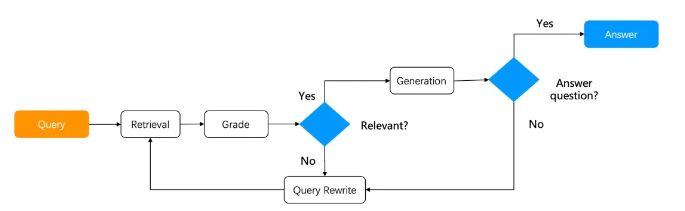

# RAG

2024.9，截止目前，各类大模型产品拥有的能力

- 对话
- 主动发起对话
- 视觉和听觉
- 思考
- 联网

目前，生成式大模型的局限性：

- 幻觉问题，模型的底层原理都是基于数学概率，概率来源于训练数据集
- 大模型的知识严重依赖于训练数据集的广度和时间节点，具有局限性、滞后性
- 企业私有数据不想提供给三方进行训练。

RAG（Retrieval-Augmented Generation） 检索增强生成

检索 - 分词检索、关键词检索、模糊检索、向量检索

生成 - 大模型生成文案

> 示例1: E答 每个学校的问答库，每年更新的政策、文档
> 示例2：高考小智、考研小智的问答库
> 示例3：官网中各产品操作手册问答
> 示例4：推荐系统、搜索系统、数据挖掘等

**基于这个逻辑展开解释**

## 知识库

RAG、知识库、向量数据库、Embedding模型（向量化模型）、数据集的关系：

RAG：是指检索增强生成概念。

知识库：RAG中的R（检索）所需的一整套方案，包括：知识预处理、Embedding、向量存储、向量检索

数据集：我们所准备的知识集合，可以是任意形式的，web、Excel、word等

Embedding模型：提取数据里的内容和语义，转变成特征向量，这个过程叫做Embedding

向量数据库：向量存储、向量检索（多种向量距离计算的算法）

## 数据集预处理

我们所准备的知识集合，可以是任意形式的，web、Excel、word等
对数据集做预处理，是为了提高召回率和准确率

**召回率**

召回率 = 检索到的信息 / 所有相关信息
假设用户想要找到所有提到“人工智能”的新闻文章，而向量数据库中实际有100篇相关的文章。如果模型检索到了80篇，那么召回率就是80%。

**准确率**

准确率 = 正确预测的样本数量 / 测试集总样本数量
假设测试集中有100张图片，其中猫和狗各50张。如果模型正确识别了80张图片，那么准确率就是80%。

**测试集跑批准确率：**

答案完全符合预期的计2分，半符合预期（部分答案正确）的计1分，完全错误的计0分；
准确率公式：
准确率=测试集得分总和/(测试集数量*2)*100%；

**word切片经验**

原则：每个切片中不可以信息不全。会导致部分答案不全，就是分段不全/分段错误的原因

文件基础处理
- word基础处理，删除复杂公式、无效的空格、空白符等
- 处理表格，把表格信息处理成文案
- 相同内容合并、去重，删除无含义内容

切片片段处理
- 根据内容的不同来设计切片，需要保证切片上下文信息的完整性。
- 例如：小标题【报名条件】, 补充为【成人高等学校报名时间】、【广东省2024年成人高等学校报名时间】
- 例如：小标题【时间】, 补充为【新生报到时间】
- by case解决：其他问题需要by case具体分析，短期方案可用FAQ方式进行兜底，长期方案需将问题记录在知识问答badcase表中，统一和PM/RD对齐后续长期策略；

**问答对经验**

原则：问答对要尽可能覆盖场景中的问题。使用方法是：只把问题做向量化，与用户的问题进行匹配。

- 问题设置要全面，尽可能覆盖更全面的场景。
  1. 在山东省的招生计划
  2. 招生计划什么意思
  3. 招生计划什么时候公布？

- 问题设置要尽可能匹配真实用户的提问习惯，来提高用户问题的匹配度
  1. 在山东省的招生计划
  2. 山东有没有招生计划

- 对问题进行降噪，突出核心关键词，删除无用的停用词，例如：【请问一下，你们学校】
 > 请问一下，你们学校的在山东省的招生计划
 > 请问一下，你们学校的在山东省的录取分

- 把问题和答案都放到问题列中，一起进行embedding。

### 经验

- 操作用户query
  - 改写用户query，更好的匹配
  - 生成多个query的相似问，去进行匹配
  - 抽取关键信息进行匹配
  > 匹配多个结果之后要对结果进行处理，例如：重排、结果关键词搜索（需要对结果设计好）、结果中带有一些其他字段可以帮助我们判断
- 数据集处理成更精准、更核心的信息
- 补充插入扩充数据来提高用户问题的匹配度
- 使用混合检索
- 重排
- 确认检索结果和query的信息相关度
- 创建知识库的多级匹配机制。对知识库进行分类，匹配大类之后再开始小类的匹配

上线前：拆分数据集，拆分的时候，搞全点、搞精准点
使用时：query 和拆分匹配一点，多搞几个问一问
召回逻辑：多做点测试，语义、关键词、分词
召回结果：rerank、分析正确性、不行重来

优化逻辑与任务场景相关。

> 召回：根据用户的问题，从文档集合中检索出与问题语义最相关的文档，这一过程就是数据召回
> 语义搜索的准确率也无法有100%的保证。所以一般大家都使用多路召回，
> 多路召回的概念，就是使用向量索引、分词索引、关键词索引等多种方式索引结果，这块我们使用的是火山提供的，按照人家给的选就行，没有自己操作的余地。

### 常见问题

**文件分割的粒度**

- 粒度太大可能导致检索不精准，检索到的片段中信息太多
- 粒度太小可能导致信息不全面，问题的答案可能跨越两个片段

解决方案： 按照一定粒度（粒度根据具体文章内容来确定），部分重叠式的切割文本，使每一段的上下文更全面

**正确答案不在top_n**

- 检索时，正确答案不在前top_n中。例如top_n设置三条，但是正确结果在第四条。

解决方案：我们可以设置一个数量N，确保正确答案一定在前N个答案中，然后把前N个答案用一个新的专门用于排序的模型（不是普通大模型，有专门的重排序模型【CrossEncoder】）进行重新排序。这样可以让答案更靠前。

**语义检索失效**

- 大量专业术语、相近名词的出现，导致向量检索不好使

解决方案：混合检索(Hybrid Search)，利用RRF算法来结合各种检索方式。综合得到一个分数，这样相对会更加精准

**RAG效果不满意**

- 做完RAG之后，效果达不到预期。

解决方案：按照下述三个步骤进行检查，然后处理问题。
1. 检查预处理效果： 文档加载是否正确，切割是否合理。
2. 测试检索效果：问题检索回来的文本片段是否包含答案。 
3. 测试大模型基础能力：给定问题和包含答案的文本，大模型本身不能正确回答问题

## Embedding模型 

> Embedding，把数据从高维向低维映射的方式，所以这其中必然会存在信息的丢失

> 文本数据的复杂性和多样性很难用有限的向量来完全表达。因此，数据Embedding可能会忽略一些文本数据的细节和特征，从而影响文档检索的准确性。

向量

  

二维空间中的一些向量：

a是一个从 (100, 50) 到 (-50, -50) 的向量

b是一个从 (0, 0) 到 (100, -50) 的向量

文本是根据特征来转换成向量的，例如：

  
1 代表是、0 代表否，转换成向量之后，汽车是 **[4，1，1，5]**，“有机翼”、“使用柴油”、“最高速度”、“平均重量”、“价格”等等，也可以是特征

向量的相似度是怎么计算的？

  

每个向量都具有大小和方向，例如，在这张图中，
p和a指向同一方向，但长度不同。
p和b方向完全相反，但大小相同。
然后是c和p，虽然没有指向准确的方向，但是很接近。

> 此处最相近的两个向量是谁？

向量间的相似度计算方法：

欧氏距离（L2），计算两个点再几何空间中的距离， 越小越相似；当两个向量相同时，欧几里得距离为 0，并且随着任一向量的角度（方向）或幅度（长度）的增加而增加。更适合维度更低的数据

余弦距离（cosine），计算原点分别到两个点的几何空间的距离， 越大越相似；通过找到两个向量之间角度的余弦来实现的（这意味着余弦相似度不考虑大小，只考虑方向）。通常向量的方向更能代表语义。

内积(ip)，全称是 Inner Product，内积，该算法基于向量的内积，即两个元素的对应元素相乘并求和的结果计算相似度，内积值越大相似度越高。

## 向量数据库

此处仅解释火山引擎的向量数据库使用。

索引算法：HNSW-Hybrid 就是混合检索，多数情况下都用这个。 对语义要求不高的场景可以用FLAT。

**标量过滤检索** 可以用来实现数据隔离

**Dense Weight** 仅混合索引会出现，[0.2,1] 越大越注重语义检索

## RAG仍然存在幻觉问题

使用RAG技术，仍然可能出现幻觉
- 检索阶段得到相关信息是错误的
- 检索出的信息要素过多，问题的真实答案只是其中一部分
- 上下文理解不正确，RAG是单条数据，问答产品只能自己处理上下文

### self-RAG流程设计

减少检索阶段的错误

检查回答阶段的错误

### ali处理流程

## 相关文档

[火山引擎RAG](https://www.volcengine.com/docs/82379/1263276)

[百度千帆RAG](https://cloud.baidu.com/qianfandev/topic/268384)

[阿里云RAG](https://mp.weixin.qq.com/s?__biz=MzIzOTU0NTQ0MA==&mid=2247538935&idx=1&sn=c61995829543a0873b8390eeb92f3291&chksm=e92a65f8de5decee944041518ae9e4dacdbc3510637d5e9ec5b9e3d9f862f73b8beb2eec2a7e&scene=21#wechat_redirect)

[多轮对话最佳实践](https://bytedance.larkoffice.com/docx/PVCpdxUzzoS5QfxGlA3cbfN9nBL)

[余弦相似度是如何工作的](https://tomhazledine.com/cosine-similarity/)

## 实战演示一个不同数据组成的知识库

QA：
- 里面放默认的问题
- 放扩充后的问题
- 放精简降噪的问题

做个测试集、计算一下准确度

对比一下对问题的匹配程度。

- 你欠我钱
- 我欠你钱

- 请问一下，你们学校的在山东省的招生计划
- 请问一下，你们学校的在山东省的录取分

向量数据库怎么使用向量化模型

标量知识库怎么处理？

## 多轮对话实践

