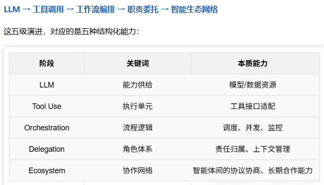

《红杉AI的闭门会，再一次证明了我三年前的选择是对的》
《AI时代，我们不再控制一切》

摘要：https://news.qq.com/rain/a/20250510A01QK800

- 当机器人能通过物理图灵测试时，收益 = 自动化的现金流。
- 我们正在经历一次从工具逻辑到成果逻辑的根本转变。
- 成果驱动，不再讲“能力”，只讲“干了啥”
**不再讲能干什么，而是讲干了什么？**
- 我们从第一天起就选择基于成果定价（outcome-based pricing）。客户不再为功能买单，而是为结果买单。
**卖成果，曾经是卖工具给你，你拿去用。接下来我有了替你分析的能力，我的AI可以直接使用工具帮你完成成功，而你，只需要付费购买成功即可。**
**卖成果，曾经买的工具还得自己用，现在买的工具可以自动化给成功成果**
- 不是谁模型参数更多、推理速度更快，而是谁能把结果交付闭环，谁就拥有了客户预算。
- 未来AI应用的核心问题，不是模型能力，而是‘是否能跑起来干活’。
- 智能体收件箱（Agent Inbox）——是触发万千智能体协同工作的入口，不是聊天框，而是系统总线。
- 用户不再“操作工具”，而是发出一句话：“安排一个东京出差”，AI 就自动完成航班预定、会议安排、天气查询和报销流程。
**你看到的，不是产品，而是一套可配置的行动系统。**
- 从使用界面，到委托接口。
**曾经用户使用工具，现在用户委托任务**
- 成果型产品的结构：不是能用，而是能干完
- 成果型产品”的三大判断标准：
  1. 是否能跑完一个完整任务流程：不是帮你做一部分，而是从头到尾，交付闭环；
  2. 是否能让结果被归因：是否能度量它带来了什么明确价值（节省了什么、提升了什么）；
  3. 是否能在过程中持续学习和优化：是不是越用越好、越跑越稳、越交付越准。
- 智能体，不是插件，而是角色
  1. 持久身份：它能记住你是谁，也记得自己是谁；
  2. 行动能力：能调用工具，发起任务，调度资源；
  3. 信任协同：它和你之间，不是指令关系，而是信任契约。
- 真正的 AI 产品，不是“有没有能力”，而是“有没有结果”；不是“你点它做了什么”，而是“它替你完成了什么”。
- 从“想法”到“产品”，从“交付结果”到“建立信任”，最终进入“成果飞轮”。
  1. 成果不是演示效果，而是被组织预算认可的业务闭环；
  2. 信任不是界面友好，而是一次次被任务委托、被组织采纳；
  3. 飞轮不是用户增长，而是每一次交付都带来更多任务指派和数据积累。
- **AI 结果的累积速度，将决定你公司价值增长的上限。**
- 不是模型不行，是你的组织、流程、工具链——没有配上这类智能的运作结构。
- 我们不是在让模型变聪明，而是在让系统变得可控、可用、可调度。
**可调度！调用模型才是真正NB的地方**
- 你可以说，这是把 AI 当作“数字员工”来用；但红杉的判断更明确——这是工程组织能力的分水岭。
**工程组织能力！，这个能力才是未来企业的核心能力**
**我们见过太多模型很强的团队，最后输在流程崩塌！**
- LangChain 提出了 Agent Graph 框架：
  1. 它不是一个新模型，而是一个事件驱动的调度机制；
  2. 支持多个智能体像微服务一样协作，并发运行、失败恢复、状态追踪；
  3. 所有行为都有“可观察性”，方便调试、记录与迭代
- AI 应用不再是 prompt 的艺术，而是架构工程的胜负。
- “如果你还在调 prompt，而没有调结构，你的胜率已经落后。”

AI应用的能力演进：你不是在训练一个更大的模型，而是在训练一个更有组织感的协作网络。



```md
“未来可能出现第一家‘一人独角兽公司’（First Oneperson Unicorn）。”

这不是说这个人多强，而是因为他掌握了高密度的智能代理协作逻辑， 能用一套 AI 联合工作组完成产品研发、销售交付、客户服务与内容运营。

红杉称之为：

“不是你多会干，而是你能不能用 AI 构建出一个‘不靠你亲自动手也能推进的系统生物体’。”
```

```md
你不需要等一个“完美的 AI”降临，而是该问自己：你是否接受偏差、接纳协同？你能否放下“每一步都掌控”的冲动，而转向“给方向、留空间、抓反馈”的协作心法？

而AI，不再是你的工具，它正在变成你的“好伙伴”，甚至是你认知系统的一部分。
```

```md
过去的组织在追求稳定产出、精细分工和可控边界。
但未来的团队要面对的，是全然不同的问题：

- 我能不能描述一个模糊目标，让智能体去尝试、偏航、再迭代？
- 我是否接受结果不是100%达成，而是70%、80%的进度并持续改进？
- 我是否能设计出“人类+AI混合代理”共同推进任务的策略空间？
这不是自动化加深的问题，而是组织感知方式的深层转向。

**我们不再控制一切！**

```

```md
当你以为这场 AI 峰会只是关于模型、系统和入口时，红杉的第三位主持人 Konstantine 抛出了一个意想不到的关键词：

“随机思维（Randomized Thinking）。”

这是一次对现有组织认知模式的正面撞击。

过去几十年，我们依赖的是工程式的因果推理：

你输入 1，就得 1；
你部署一个任务，它会按预期运行；
你设计的操作链，必须精准收口、结果可控。
但 AI 智能体不是这样运作的。“你告诉一个模型记住数字 73，它可能记住了，也可能变成了 72、37，甚至根本什么都不记得。”

这不是 bug，而是特征。
```


```md
不是问“AI 能不能做”，而是问：

谁来管它？
它交给谁？
它怎么协同？
出错怎么办？
数据怎么归因？
能不能复利？

**这些问题，不再是工程师单独能解决的，而是属于AI 架构负责人、组织设计师与任务运营者的工作范畴。**
```


```md
不再是“用户增长经理”，而是“成果增长经理”；你的产品，也不是“用得多不多”，而是“跑没跑完流程”。
因为未来 AI 的分发，不靠推荐算法，而靠“交付记录”。
你不是卖工具的人，而是交成果的人。系统能不能接住你的委托，才是下一轮定价权的起点。
```


```md
“分发物理学(physics of distribution)，变了。”
在旧时代，一个产品要获得用户，依赖三个变量：
- 用户是否知道你（Attention）
- 用户是否理解你（Understanding）
- 用户是否愿意用你（Adoption）
这三者构成了移动互联网时代流量分发的核心逻辑。
但现在，一切正在被重写。
随着 AI 从工具变成代理，用户行为也随之转变。红杉观察到，使用的起点，不再是界面点击，而是任务委托；真正的价值，不是产品被打开了多少次，而是它交付了多少结果。
```


<!-- 过一遍PPT -->
<!-- 红杉AI -->
直播AI
<!-- 支付宝伙伴计划， 闹钟晚上七点 -->
<!-- 知乎推广，改下周了 -->
<!-- 火山工单 -->
<!-- 影刀，等再研究 -->
<!-- viggle，放书签里 -->
带电脑
